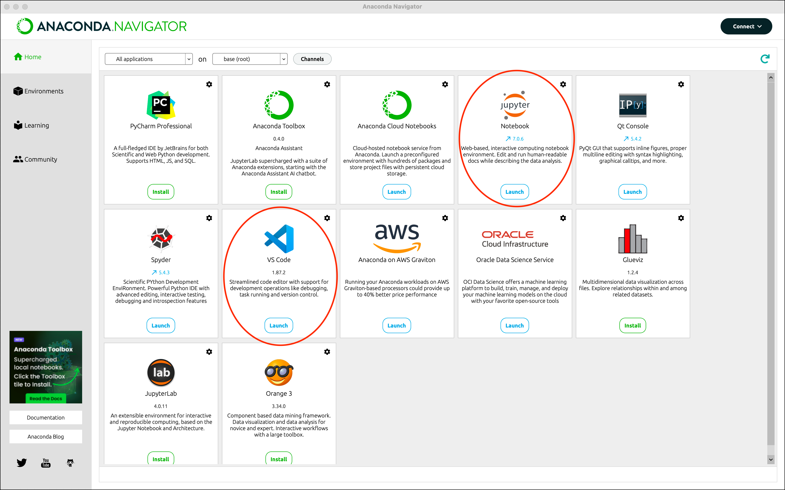

# Getting Started with Anaconda

Anaconda is a popular distribution of Python and R for data science and machine learning. It comes with many pre-installed packages and tools that are essential for data analysis and scientific computing.

## Why Anaconda?

- Simplifies package management and deployment
- Includes 1,500+ open source packages
- Includes the most popular data science tools like Jupyter Notebook
- Suitable for both beginners and advanced users

## Download and Installation

### Windows

1. Visit the [Anaconda Download Page](https://www.anaconda.com/download)
2. Download the Windows installer (64-Bit)
3. Run the installer (.exe file)
4. Important installation options:
   - Install for "Just Me" (recommended)
   - Choose destination folder (default is fine)
   - Select "Add Anaconda to my PATH environment variable"
   - Register Anaconda as my default Python

### macOS

1. Visit the [Anaconda Download Page](https://www.anaconda.com/download)
2. Download the macOS installer (64-Bit)
3. Run the installer (.pkg file)
4. Follow the prompts in the installer
5. Open Terminal and verify installation by typing `conda --version`

## Launching Tools

### Anaconda Navigator

1. **Windows**: Start menu → Anaconda Navigator
2. **macOS**: Launchpad → Anaconda Navigator

### Jupyter Notebook

Method 1 (via Navigator):

1. Open Anaconda Navigator
2. Click 'Launch' under Jupyter Notebook

Method 2 (via Terminal/Command Prompt):

1. Open Terminal (macOS) or Command Prompt (Windows)
2. Type `jupyter notebook` and press Enter
3. Your default browser will open with Jupyter Notebook

### VS Code

1. Open Anaconda Navigator
2. Click 'Launch' under VS Code

## Troubleshooting

If you encounter PATH issues:

- Windows: Restart your computer
- macOS: Run `source ~/.bash_profile` or restart Terminal
