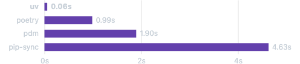

# Anaconda Setup

This guide covers setting up your Python environment using either Anaconda (recommended for beginners) or `uv` (recommended for advanced users). Both tools help manage Python environments and packages, but they serve different purposes:

* **Anaconda**: A comprehensive distribution that includes Python and many pre-installed data science packages
* **`uv`**: A fast, reliable Python package installer and environment manager (alternative to `pip`/`venv`)

Choose the one that best fits your needs:

* Use Anaconda if you want a GUI and pre-installed packages
* Use `uv` if you prefer a lightweight, fast command-line tool

## Option 1: Anaconda

### Why Anaconda?

* Simplifies package management and deployment
* Includes 1,500+ open source packages
* Includes the most popular data science tools like Jupyter Notebook
* Suitable for both beginners and advanced users
* Provides Anaconda Navigator GUI for easy management

### Download and Installation

<figure><figcaption></figcaption></figure>



* Visit the [Anaconda Download Page](https://www.anaconda.com/download)
* Download the Windows installer (64-Bit)
* Run the installer (.exe file)
* Important installation options:
  * Install for "Just Me" (recommended)
  * Choose destination folder (default is fine)
  * Select "Add Anaconda to my PATH environment variable"
  * Register Anaconda as my default Python



* Visit the [Anaconda Download Page](https://www.anaconda.com/download)
* Download the macOS installer (64-Bit)
* Run the installer (`.pkg` file)
* Follow the prompts in the installer
* Open Terminal and verify installation by typing `conda --version`



### Package Installation

After installing Anaconda, open Terminal (macOS) or Anaconda Prompt (Windows) and run:

```bash
# Create a new environment for the course
conda create -n dsai python=3.10

# Activate the environment
conda activate dsai

# Install required packages
conda install numpy pandas matplotlib seaborn scikit-learn statsmodels jupyter

# Install additional packages
conda install -c conda-forge apache-airflow
```

### Environment Management

```bash
# List all environments
conda env list

# Export environment
conda env export > environment.yml

# Create environment from file
conda env create -f environment.yml

# Remove environment
conda env remove -n environment_name
```

## Launching Tools

### Anaconda Navigator (Anaconda only)

1. **Windows**: Start menu → Anaconda Navigator
2. **macOS**: Launchpad → Anaconda Navigator


### Jupyter Notebook

Method 1 (via Navigator):

1. Open Anaconda Navigator
2. Click 'Launch' under Jupyter Notebook

Method 2 (via Terminal/Command Prompt):

1. Open Terminal (macOS) or Command Prompt (Windows)
2. Type `jupyter notebook` and press Enter
3. Your default browser will open with Jupyter Notebook

### VS Code

1. Open Anaconda Navigator
2. Click 'Launch' under VS Code

## Common Issues & Troubleshooting

### Anaconda Issues

1. **PATH Issues**:
   * Windows: Restart your computer
   * macOS: Run `source ~/.bash_profile` or restart Terminal
2.  **Package Conflicts**:

    ```bash
    # Remove conflicting package
    conda remove package_name

    # Reinstall with specific version
    conda install package_name=version
    ```
3. **Environment Activation Fails**:
   * Windows: Run as Administrator
   * macOS: Check `conda init` was run
4.  **Jupyter Notebook Kernel Missing**:

    ```bash
    python -m ipykernel install --user --name=dsai
    ```

## Option 2: `uv`

### Why `uv`?

<figure><figcaption><p><em>Installing</em> <a href="https://trio.readthedocs.io/"><em>Trio</em></a><em>'s dependencies with a warm cache.</em></p></figcaption></figure>

[`uv`](https://github.com/astral-sh/uv) is a powerful, all-in-one Python development tool created by Astral (the team behind Ruff) that aims to consolidate multiple existing tools like `pip`, `pip-tools`, `pipx`, `poetry`, `pyenv`, and others into a single efficient solution. Boasting speeds 10-100 times faster than pip, it offers comprehensive functionality including Python version management, package installation, project management, and script execution capabilities.&#x20;

The tool features a universal lockfile system, pip-compatible interface, support for multi-project workspaces, and efficient disk space usage through global caching. uv can be easily installed via curl or pip and runs seamlessly across macOS, Linux, and Windows platforms, making it a versatile choice for Python developers seeking to streamline their development workflow.

* Faster package installation than pip
* Better dependency resolution
* Lightweight and efficient
* Compatible with `requirements.txt` and `pyproject.toml`

### Installation

```bash
# macOS/Linux
curl -LsSf https://astral.sh/uv/install.sh | sh

# Windows (PowerShell)
irm https://astral.sh/uv/install.ps1 | iex
```

### Usage


```bash
# Create new environment
uv venv

# Activate environment
source .venv/bin/activate  # macOS/Linux
.venv\Scripts\activate     # Windows

# e.g. Install packages
uv pip install numpy pandas matplotlib seaborn scikit-learn statsmodels jupyter apache-airflow
```


### `uv` Issues

1. **Installation Fails**:
   * Check Python version compatibility
   * Ensure build tools are installed
2.  **Package Conflicts**:

    ```bash
    # Clean install
    uv pip install --clean package_name
    ```
3. **Environment Issues**:
   * Delete `.venv` and recreate
   * Check `PATH` settings

### General Tips

1. **Slow Package Installation**:
   * Use faster package mirrors
   * For Anaconda: `conda config --add channels conda-forge`
   * For uv: Use `uv pip install --cache-dir=.cache`
2. **Memory Issues**:
   * Close unnecessary applications
   * For large packages, try installing one at a time
3. **Version Conflicts**:
   * Create a new environment for different projects
   * Use `conda list` or `pip list` to check installed versions
4. **Jupyter Integration**:
   * Ensure kernels are properly registered
   * Check kernel paths match environment paths
