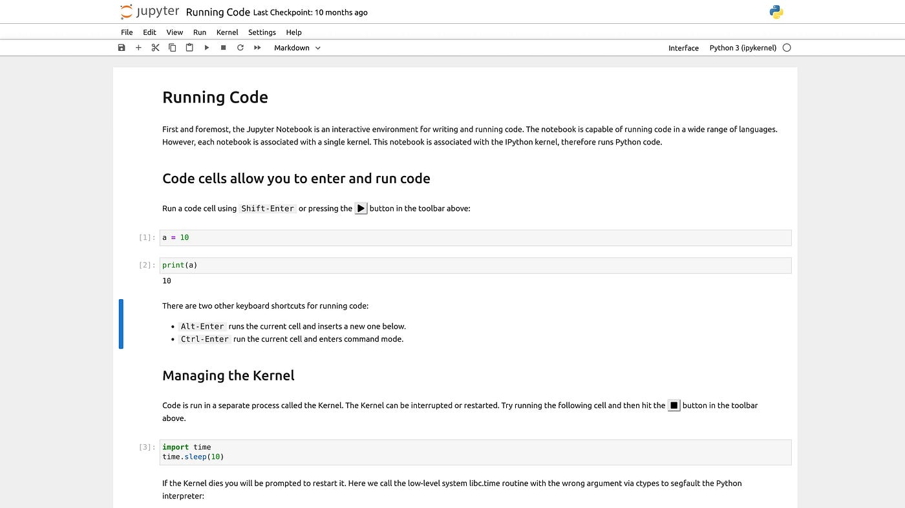

# Introduction to Jupyter Notebook

Jupyter Notebook is an open-source web application that allows you to create and share documents containing live code, equations, visualizations, and narrative text. It's widely used in data science for data cleaning, transformation, numerical simulation, statistical modeling, and more.

## Cell Types

Jupyter Notebooks contain cells that can be of different types:

1. **Code Cells**: For writing and executing code

   - The code will be executed by the notebook's kernel
   - Output appears below the cell

2. **Markdown Cells**: For documentation
   - Supports formatting, links, images, and equations
   - Use for explanations and notes

## Cell Execution

- Execute current cell: Click "Run" button or press `Shift + Enter`
- Execute and move to next cell: `Alt + Enter`
- Execute and create new cell below: `Ctrl + Enter`

## Important Hotkeys

Command Mode (press `Esc` to activate):

- `a`: Insert cell above
- `b`: Insert cell below
- `d,d`: Delete selected cell
- `z`: Undo cell deletion
- `m`: Change to Markdown cell
- `y`: Change to Code cell

Edit Mode (press `Enter` to activate):

- `Shift + Enter`: Run cell and select below
- `Ctrl + Enter`: Run cell
- `Alt + Enter`: Run cell and insert below

## Useful Resources

- [Official Jupyter Documentation](https://jupyter.org/)
- [Jupyter Notebook Tutorial](https://www.dataquest.io/blog/jupyter-notebook-tutorial/)
- [Markdown Guide](https://www.markdownguide.org/)
- [Jupyter Notebook Shortcuts](https://towardsdatascience.com/jypyter-notebook-shortcuts-bf0101a98330)
