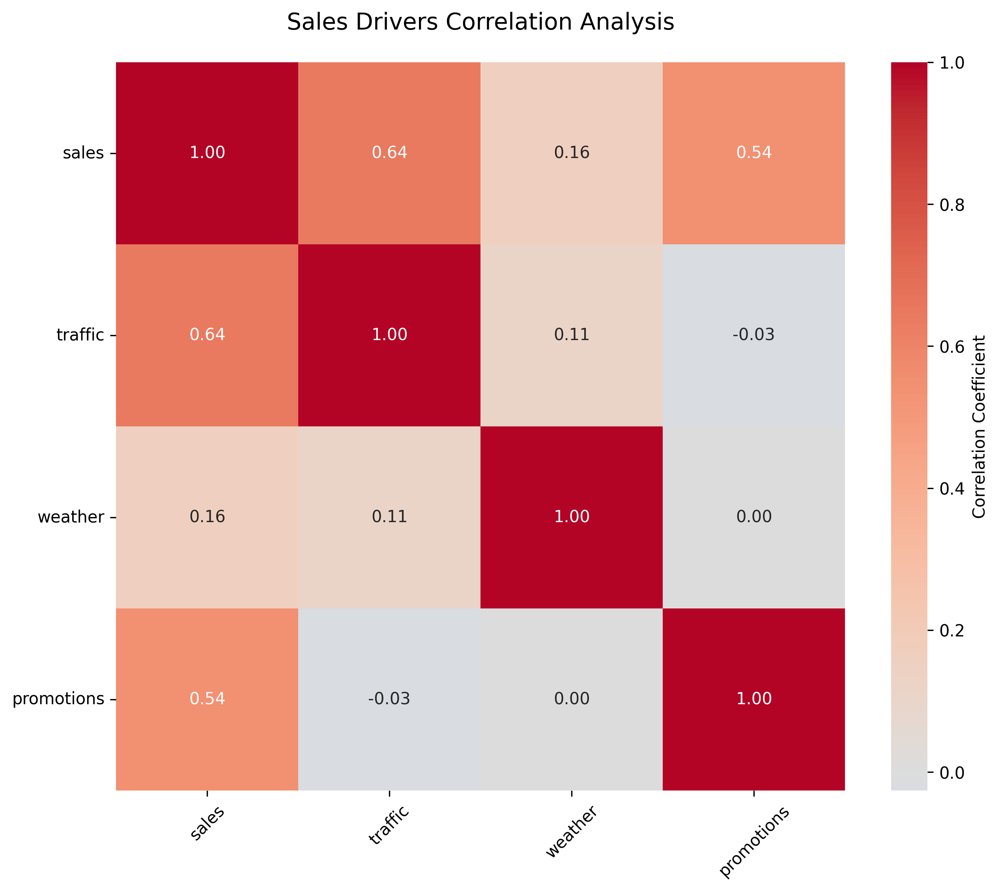

# Introduction to Data Analytics and Data Science

In today’s data-driven world, understanding data analytics and data science is crucial for making informed decisions. This lesson will provide a comprehensive introduction to both fields, their methodologies, and their applications.

## What is Data Analytics?

Data analytics is like being a detective with numbers. It's the process of examining data sets to draw conclusions about the information they contain. Data analysts help organizations make better decisions by collecting, cleaning, and interpreting data to find meaningful patterns and trends.

### Types of Data Analytics

* **Descriptive Analytics** : Summarizes past data to understand what has happened.
* **Diagnostic Analytics** : Examines data to understand why something happened.
* **Predictive Analytics** : Uses statistical models to forecast future outcomes.
* **Prescriptive Analytics** : Recommends actions based on data analysis.

### Key Components of Data Analytics

1. **Data Sources** : Databases, APIs, and spreadsheets.
2. **Data Processing** : ETL (Extract, Transform, Load) processes.
3. **Data Analysis** : Employing statistical techniques to extract insights and identify trends within datasets.
4. **Data Visualization** : Tools like Tableau and Power BI to present data.
5. **Reporting** : Creating dashboards and reports for stakeholders.

### The Data Analytics Process

> Don't worry if you don't understand the code, this is meant to warm you up on what to expect in the course, and to give you some insights on how things are done in the industry.




### 1. Business Understanding

**Example**: Let's just construct a very simple example. A retail store wants to:

- Increase sales revenue
- Reduce inventory costs
- Improve customer satisfaction
- Optimize store layouts
- Enhance marketing ROI
- Predict seasonal demands
- Reduce checkout wait times
- Track employee performance

How can a store do all of that? Obviously, there needs to be a way to collect these data points, and more importantly, to parse, analyse and understand the data that is collected.

**Implementation Example**:

In order to construct a representative data structure for these business requirements, we can start with simple `JSON` (JavaScript Object Notation), so that it is organized in such a way that computers can understand. This is otherwise known as an `object` in some programming languages; in Python, this data structure is called a `dict` (short for dictionary).

```python
# Define key performance indicators (KPIs)
retail_kpis = {
    'sales': {
        'metric': 'revenue',
        'target': 1000000,
        'frequency': 'monthly'
    },
    'inventory': {
        'metric': 'turnover_rate',
        'target': 12,  # times per year
        'frequency': 'quarterly'
    },
    'customer': {
        'metric': 'satisfaction_score',
        'target': 4.5,  # out of 5
        'frequency': 'daily'
    }
}
```

We can see a very structured method of organising information; firstly, the retail stores wants to track metrics across the `sales`, `inventory` and `customer` category, and we have simple attributes that we would like to configure in this setup.





### 2. Data Collection & Preparation

**Example**:

Say we've decided on the data structure that we would want to work with. The next (often tedious part) is gathering (retail) data. This can be gleaned from:

- Point of sale (POS) systems
- Customer loyalty programs
- Inventory management systems
- Employee scheduling software
- Security cameras (foot traffic)
- Online reviews and feedback
- Website analytics
- Social media mentions etc.

**Data Processing:

These raw (and often big) data comes in various formats, e.g. for dates, people have spent countless of hours arguing whether `dates` are represented in `MMDDYYYY` or `DDMMYYYY`. Programmes have other ways of recognizing them as `datetime` or `timestamp`.

We might also want to organize information by grouping (categorizing information) and aggregating (arithmetic operations to reduce many numbers into one). Sometimes, we might create new "features" and derived metrics by combing different metrics into one.

These operations form a "chain" or a pipeline of transformations, in order to clean, sort, organize data into a coherent state. This is otherwise known as data processing.

```python
def prepare_sales_data(df):
    # Convert dates to datetime
    df['sale_date'] = pd.to_datetime(df['sale_date'])
  
    # Calculate daily totals
    daily_sales = df.groupby('sale_date').agg({
        'revenue': 'sum',
        'transactions': 'count',
        'items_sold': 'sum'
    })
  
    # Add derived metrics
    daily_sales['avg_transaction'] = (
        daily_sales['revenue'] / 
        daily_sales['transactions']
    )
  
    return daily_sales
```





### 3. Analysis

Once we've cleaned and parsed the data, we then want to make sense of this information. We want to make intelligent choices on our business based on the information presented to us. We might consider analyzing retail performance through:

- Sales trend analysis
- Customer segmentation
- Basket analysis
- Inventory optimization
- Staff productivity metrics
- Peak hour identification
- Promotion effectiveness
- Customer lifetime value

We can visualize these information (y'know, who wants to look at just numbers) to see if we can identify any patterns or trends, and to make generalizations on the performance of the retail store. In Python, we do these visualizations by importing data handling libraries like `pandas` and plotting / visualization libraries like `matplotlib`.

The code below illustrates a way to analyze peak hours by plotting a bar graph of average revenue against hour of the day. As long as the information is available, we get to visualize it with code.

```python
import pandas as pd
import matplotlib.pyplot as plt

# Sales analysis by hour
def analyze_peak_hours(sales_data):
    hourly_sales = sales_data.groupby('hour').agg({
        'revenue': 'mean',
        'transactions': 'mean'
    })
  
    # Visualize peak hours
    plt.figure(figsize=(12, 6))
    hourly_sales['revenue'].plot(kind='bar')
    plt.title('Average Revenue by Hour')
    plt.xlabel('Hour of Day')
    plt.ylabel('Revenue')
  
    return hourly_sales
```





### 4. Insights Generation

Visualizations are informative in elucidating trends and patterns in data. In scenarios where there's a need for deeper thinking and present the findings thereafter in a report, a good data analyst must be able to discover insights like:

- "70% of sales occur between 4-7 PM"
- "Customers who buy product A often buy product B"
- "Store layout change increased sales by 15%"
- "Employee scheduling gaps during peak hours"
- "Inventory stockouts causing lost sales"
- "Weather impacts on shopping patterns"
- "Loyalty program members spend 3x more"
- "Social media mentions predict sales spikes"

**Visualization**:

```python
# Create insightful visualizations
def plot_sales_drivers(df):
    """
    Create correlation heatmap for sales drivers
  
    Parameters:
    df (pandas.DataFrame): DataFrame containing 'sales', 'traffic', 
                         'weather', and 'promotions' columns
    """
    # Calculate correlation matrix
    correlation_matrix = df[['sales', 'traffic', 
                           'weather', 'promotions']].corr()
  
    # Create figure
    plt.figure(figsize=(10, 8))
  
    # Create heatmap
    sns.heatmap(correlation_matrix, 
                annot=True,  # Show correlation values
                cmap='coolwarm',  # Blue-red diverging colormap
                center=0,  # Center the colormap at 0
                fmt='.2f',  # Format annotations to 2 decimal places
                square=True,  # Make cells square
                cbar_kws={'label': 'Correlation Coefficient'})
  
    # Customize the plot
    plt.title('Sales Drivers Correlation Analysis', pad=20, size=14)
    plt.xticks(rotation=45)
    plt.yticks(rotation=0)
  
    return plt.gcf()
```



From this, we can easily see that traffic and promotions affect sales more than the weather. We know this sounds very simplistic (purely for illustrative purposes), but if we have more than the current feature set, you can see how powerful this tool could be to plan out and inform a retail strategy.





### 5. Communication

Of course, in a larger company with multiple retail stores, the volume of data would make it much more necessary for processing and visualization. As comfortable as you (a data analyst) are with working with code and these tools to generate visualizations, the other folks in your company might not have the same skillsets

**Example**: Presenting findings through:

- Interactive dashboards
- Regular performance reports
- Executive summaries
- Team presentations
- Email newsletters
- Automated alerts
- Strategy recommendations
- Action item tracking

**Dashboard Example**:

```python
import plotly.express as px

def create_sales_dashboard(data):
    # Sales trend
    fig1 = px.line(data, 
                   x='date', 
                   y='revenue',
                   title='Daily Sales Trend')
  
    # Category breakdown
    fig2 = px.pie(data,
                  values='sales',
                  names='category',
                  title='Sales by Category')
  
    # Combine into dashboard
    dashboard = html.Div([
        dcc.Graph(figure=fig1),
        dcc.Graph(figure=fig2)
    ])
  
    return dashboard
```





## Key Analytics Concepts

### 1. Descriptive Analytics

- **What happened?**
- Historical data analysis
- Performance metrics
- Trend identification
- Basic statistical measures

### 2. Diagnostic Analytics

- **Why did it happen?**
- Root cause analysis
- Correlation studies
- Pattern recognition
- Factor analysis

### 3. Predictive Analytics

- **What might happen?**
- Forecasting models
- Trend projections
- Risk assessment
- Opportunity identification

### 4. Prescriptive Analytics

- **What should we do?**
- Action recommendations
- Optimization strategies
- Decision support
- Impact analysis

## Tools of the Trade

### Data Analysis Tools


| Tool   | Use Case                           | Skill Level  |
| -------- | ------------------------------------ | -------------- |
| Excel  | Basic data analysis, pivot tables  | Beginner     |
| SQL    | Database querying, data extraction | Intermediate |
| Python | Advanced analysis, automation      | Intermediate |
| R      | Statistical analysis, modeling     | Advanced     |

### Visualization Tools


| Tool       | Best For               | Key Features            |
| ------------ | ------------------------ | ------------------------- |
| Tableau    | Interactive dashboards | Drag-and-drop interface |
| Power BI   | Business reporting     | Microsoft integration   |
| Matplotlib | Custom visualizations  | Python integration      |
| D3.js      | Web visualizations     | Interactive graphics    |

### Statistical Tools


| Tool    | Application          | Common Uses            |
| --------- | ---------------------- | ------------------------ |
| SPSS    | Academic research    | Statistical testing    |
| SAS     | Enterprise analytics | Large dataset analysis |
| Stata   | Economic analysis    | Time series analysis   |
| Minitab | Quality control      | Process improvement    |

## Best Practices

### 1. Data Quality

- Verify data accuracy
- Handle missing values
- Remove duplicates
- Standardize formats
- Document assumptions
- Validate sources
- Check for outliers
- Maintain consistency

### 2. Analysis

- Start with questions
- Use appropriate methods
- Document procedures
- Test assumptions
- Validate results
- Consider context
- Look for patterns
- Challenge findings

### 3. Visualization

- Choose appropriate charts
- Maintain simplicity
- Use consistent colors
- Label clearly
- Provide context
- Highlight insights
- Enable interactivity
- Tell a story

### 4. Reporting

- Know your audience
- Focus on insights
- Use clear language
- Include methodology
- Provide evidence
- Make recommendations
- Follow up
- Gather feedback

## What is Data Science?

Data science is like being both a detective and an inventor. While data analytics focuses on understanding what's happening now and what happened in the past, data science creates new ways to solve future problems using advanced techniques like machine learning, statistical modeling, and algorithmic approaches.

### The Data Science Process




### 1. Data Collection

**Example**: A streaming service like Netflix collecting:

- User viewing history (watch time, completion rates)
- Search queries and results clicked
- Pause/rewind/fast-forward patterns
- Device information and quality settings
- Time spent browsing vs watching
- Rating and review data
- Account sharing patterns
- Network performance metrics

**Technical Implementation**:

```python
# Example data collection schema
viewing_data = {
    'user_id': 'string',
    'content_id': 'string',
    'timestamp': 'datetime',
    'watch_duration': 'integer',
    'device_type': 'string',
    'quality_setting': 'string',
    'network_speed': 'float'
}
```





### 2. Data Cleaning

**Example**: Preparing streaming data by:

- Removing incomplete viewing sessions (<10 seconds)
- Fixing timestamp errors across time zones
- Standardizing show categories and genres
- Handling missing ratings and reviews
- Normalizing device names and types
- Filtering out bot/test accounts
- Correcting metadata inconsistencies
- Dealing with VPN-related location issues

**Code Example**:

```python
def clean_viewing_data(df):
    # Remove short sessions
    df = df[df['watch_duration'] >= 10]
  
    # Standardize timestamps to UTC
    df['timestamp'] = pd.to_datetime(df['timestamp']).dt.tz_convert('UTC')
  
    # Normalize device types
    df['device_type'] = df['device_type'].str.lower().replace({
        'iphone': 'mobile',
        'android_phone': 'mobile',
        'smart_tv': 'tv',
        'roku': 'tv'
    })
  
    return df
```





### 3. Data Exploration

**Example**: Discovering patterns like:

- Popular genres by time of day and region
- Viewing duration patterns by content type
- Content that keeps viewers engaged longest
- Seasonal viewing trends and preferences
- Correlation between rating and completion
- Impact of auto-play on session length
- Device preferences by demographic
- Binge-watching behavior analysis

**Analysis Example**:

```python
# Analyze viewing patterns
import seaborn as sns

# Genre popularity by hour
sns.heatmap(genre_hour_matrix, 
           cmap='YlOrRd',
           xticklabels=hours,
           yticklabels=genres)

# Completion rate analysis
completion_rate = watched_duration / content_duration
engagement_score = completion_rate * rating
```





### 4. Modeling

**Example**: Creating algorithms to:

- Predict what shows a user might like (recommendation system)
- Determine optimal video quality settings based on network
- Forecast server capacity needs by region
- Identify potential churning customers
- Optimize content delivery networks
- Personalize thumbnail images
- Predict show success probability
- Optimize auto-play timing

**Model Example**:

```python
from sklearn.ensemble import RandomForestClassifier

# Train recommendation model
def train_recommendation_model(user_data, content_data):
    model = RandomForestClassifier(n_estimators=100)
    features = ['genre_score', 'duration_preference', 
                'similar_content_rating', 'time_of_day_score']
  
    model.fit(X_train[features], y_train['watched'])
    return model
```





### 5. Deployment

**Example**: Implementing solutions like:

- Personalized recommendation system
- Automated content categorization
- Dynamic quality adjustment
- Proactive retention campaigns
- A/B testing framework
- Real-time analytics pipeline
- Automated reporting system
- Performance monitoring dashboard

**Deployment Example**:

```python
# API endpoint for recommendations
@app.route('/api/recommendations/<user_id>')
def get_recommendations(user_id):
    user_profile = load_user_profile(user_id)
    recommendations = model.predict_top_n(user_profile, n=10)
    return jsonify(recommendations)
```




## Differences Between Data Analytics and Data Science

Let's understand the differences through real-world examples from various industries:

### Streaming Service (Netflix)


| Aspect     | Data Analytics                                         | Data Science                                                    |
| ------------ | -------------------------------------------------------- | ----------------------------------------------------------------- |
| Focus      | "Our most-watched show last month was Stranger Things" | "Here's an algorithm to predict what each user will watch next" |
| Techniques | Creating reports on viewing patterns and engagement    | Building a recommendation engine using collaborative filtering  |
| Outcome    | "Weekend viewership is 50% higher than weekdays"       | "This model predicts viewing preferences with 85% accuracy"     |
| Tools      | Excel, Tableau, SQL                                    | Python, TensorFlow, Apache Spark                                |

### E-commerce (Amazon)


| Aspect     | Data Analytics                           | Data Science                                |
| ------------ | ------------------------------------------ | --------------------------------------------- |
| Focus      | "Best-selling products in each category" | "Predictive model for inventory management" |
| Techniques | Sales reporting and trend analysis       | Machine learning for demand forecasting     |
| Outcome    | "Electronics sales peak during holidays" | "Automated inventory optimization system"   |
| Tools      | PowerBI, SQL, Excel                      | Python, scikit-learn, AWS SageMaker         |

### Healthcare


| Aspect     | Data Analytics                            | Data Science                                     |
| ------------ | ------------------------------------------- | -------------------------------------------------- |
| Focus      | "Average patient wait time is 45 minutes" | "Algorithm to predict patient readmission risk"  |
| Techniques | Statistical analysis of hospital metrics  | Machine learning on patient health records       |
| Outcome    | "Peak admission times are 2-4 PM"         | "Early warning system for patient complications" |
| Tools      | Tableau, SQL, R                           | Python, TensorFlow, SPSS                         |

## Real-World Applications

### Healthcare

- **Analytics**:
  - Tracking patient wait times and doctor availability
  - Analyzing treatment costs and insurance claims
  - Monitoring hospital resource utilization
  - Reporting on patient satisfaction scores
- **Data Science**:
  - Predicting patient readmission risks
  - Analyzing medical images for diagnosis
  - Optimizing emergency response systems
  - Developing personalized treatment plans

### Finance

- **Analytics**:
  - Monthly reports on credit card spending
  - Analysis of transaction patterns
  - Customer segment profitability
  - Branch performance metrics
- **Data Science**:
  - AI-powered fraud detection
  - Algorithmic trading systems
  - Credit risk assessment models
  - Customer churn prediction

### Marketing

- **Analytics**:
  - Campaign performance reports
  - Customer segmentation analysis
  - ROI calculations
  - Website traffic analysis
- **Data Science**:
  - Predictive models for customer lifetime value
  - Recommendation systems
  - Natural language processing for social media
  - Attribution modeling

### Education

- **Analytics**:
  - Student attendance tracking
  - Grade distribution analysis
  - Course popularity metrics
  - Resource utilization reports
- **Data Science**:
  - Personalized learning path recommendations
  - Early warning systems for at-risk students
  - Automated grading systems
  - Student success prediction models

## Learning Path Recommendation

For beginners, we recommend this comprehensive learning sequence:

1. **Foundation (1-2 months)**

   - Basic data analytics concepts
   - Introduction to statistics
   - Excel/spreadsheet proficiency
   - SQL fundamentals
2. **Technical Skills (2-3 months)**

   - Python programming basics
   - Data manipulation with Pandas
   - Data visualization with Matplotlib/Seaborn
   - Database management
3. **Advanced Analytics (2-3 months)**

   - Statistical analysis techniques
   - Hypothesis testing
   - A/B testing methodology
   - Time series analysis
4. **Data Science Fundamentals (3-4 months)**

   - Machine learning basics
   - Supervised/unsupervised learning
   - Model evaluation techniques
   - Feature engineering
5. **Specialization (2-3 months)**

   - Deep learning
   - Natural language processing
   - Computer vision
   - Big data technologies
6. **Professional Skills**

   - Business acumen
   - Data storytelling
   - Project management
   - Ethics in data science

## Chapter Outline

This chapter will cover:

1. **Lifecycle of Data Analytics and Data Science**

   - Data collection methods
   - Processing techniques
   - Analysis approaches
   - Implementation strategies
2. **Data Collection**

   - Primary vs secondary data
   - Data quality assessment
   - Collection methods
   - Best practices
3. **Data Privacy**

   - Legal requirements
   - Privacy frameworks
   - Data protection
   - Ethical considerations
4. **Data Security**

   - Security protocols
   - Access control
   - Data encryption
   - Risk management

Each section includes practical examples, hands-on exercises, and real-world case studies to help you understand these concepts better. The focus is on building both theoretical knowledge and practical skills that are directly applicable in the industry.
