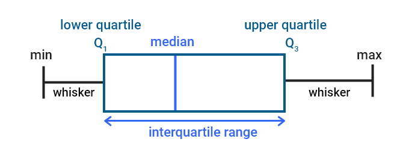

# One-Variable Statistics

## Introduction to Descriptive Statistics

Descriptive statistics is a method to quickly summarize data within a set using just a few numbers. This lesson covers various measures and techniques used in one-variable statistics.

## Measures of Central Tendency

### Mean

- Definition: The average of a set calculated by adding all the values in the set and dividing by the number of values in the set.
- Formula:

  $$
  \text{Mean} = \frac{\sum_{i=1}^{n} x_i}{n}
  $$

  Where:

  - $ x_i $ represents each value in the dataset.
  - $ n $ is the total number of values.

- Note: The mean is very sensitive to outliers.

### Median

- Definition: The middle value in a data set when it's arranged in order.
- Note: The median is not sensitive to outliers, making it useful for skewed distributions.

### Mode

- Definition: The value that appears most often in the set.
- Types:
  - Bimodal: When a set has two modes.
  - Multimodal: When a set has more than two modes.

## Measures of Variability

### Standard Deviation

- Definition: A measurement of the amount of variation from the mean in a data set.
- Interpretation: For example, if a data set has a mean of 50 units and a standard deviation of 20 units, we can conclude that most of the data will fall between 30 and 70 units.
- Formula:

  $$
  \sigma = \sqrt{\frac{\sum_{i=1}^{n} (x_i - \mu)^2}{n}}
  $$

  Where:

  - $ \sigma $ is the standard deviation.
  - $ x_i $ represents each value in the dataset.
  - $ \mu $ is the mean of the dataset.
  - $ n $ is the total number of values.

### Range

- Definition: The distance between the maximum and minimum values in a dataset.

### Interquartile Range (IQR)

- Definition: The distance between the third and first quartiles.

## Five Number Summary

The five number summary consists of:

1. Minimum
2. First Quartile (Q1)
3. Median (Q2)
4. Third Quartile (Q3)
5. Maximum

- Each quartile represents 25% of the data within a set.
- The first and third quartiles can be found by identifying the medians of the lower and upper halves of the data.

## Graphical Representations

### Boxplot

- A graph representing the five number summary.
- The boxed area represents the IQR with the median at the center.
- Whiskers extend to the minimum and maximum values.

### Histogram

- A frequency distribution shown in graph form.
- Useful for visualizing the shape of the data distribution.

### Skewness

- Positive skew (right skew): When values pull a chart to the right.
- Negative skew (left skew): When values pull a chart to the left.
- In a histogram with a positive skew, the mean is usually greater than the median.
- In a histogram with a negative skew, the mean is usually less than the median.

## Frequency Distributions

### Frequency Distribution Table

- A table that sorts data into equally-sized classes.
- Components:
  1. Class: The range of values for each group.
  2. Frequency: The amount of data points that fall into each class.
  3. Cumulative Frequency: The running total of the frequencies.
  4. Relative Frequency: The frequency divided by the total number of data points.
  5. Cumulative Relative Frequency: The running total of the relative frequencies.

