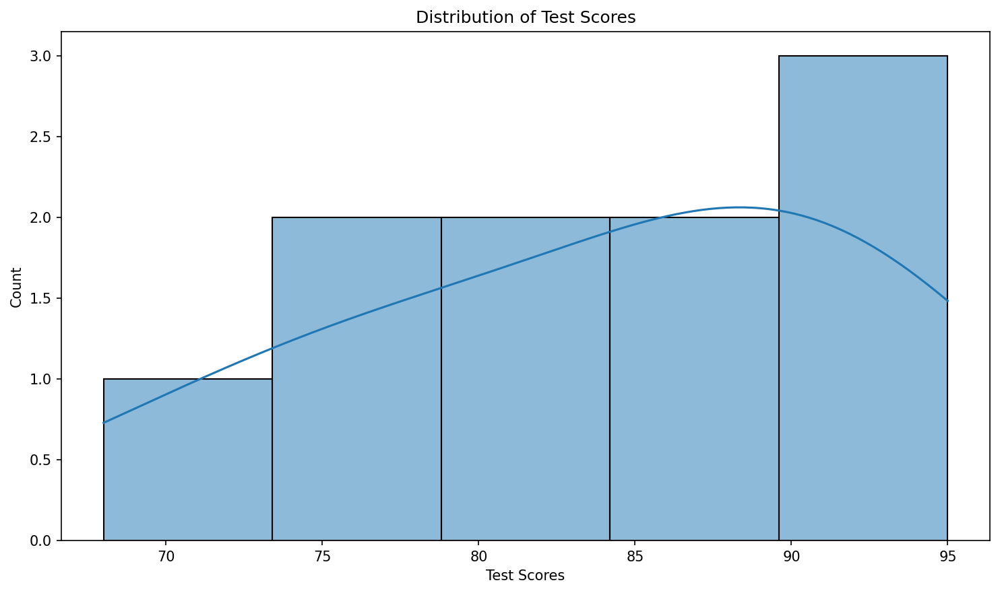
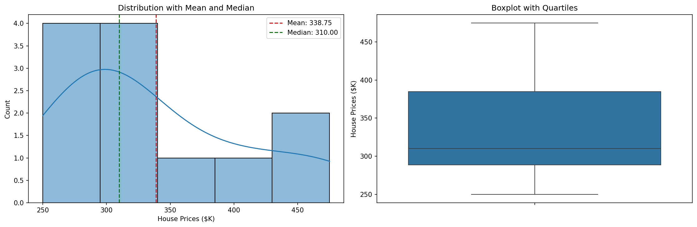

# One-Variable Statistics with Python

**After this lesson:** you can explain One-Variable Statistics with Python and try the examples in your own notebook.

### Video

_StatQuest with Josh Starmer, Quantiles and percentiles, clearly explained_

## Overview

**Prerequisites:** Python basics and [Introduction to Statistics](./) context; optional NumPy for the examples.

**Why this lesson:** Before comparing groups or fitting models, you must **summarize one column** well: center, spread, shape, and outliers. Those numbers (`describe`, mean/median, quartiles, histograms) are the vocabulary for every later statistics and ML lesson.

## Understanding One-Variable Statistics

### What is One-Variable Statistics?

**Univariate** (one-variable) statistics describes a **single** column or measurement: where it sits, how wide it is, and whether it is skewed. we will look at with Python:

```python
import numpy as np
import pandas as pd
import matplotlib.pyplot as plt
import seaborn as sns

# Sample dataset: Student test scores
scores = np.array([75, 82, 95, 68, 90, 88, 76, 89, 94, 83])

# Create a pandas Series for better analysis
scores_series = pd.Series(scores, name='Test Scores')

# Basic summary
print("Summary Statistics:")
print(scores_series.describe())

# Visualize distribution
plt.figure(figsize=(10, 6))
sns.histplot(scores_series, kde=True)
plt.title('Distribution of Test Scores')
plt.show()
```

```
Summary Statistics:
count    10.000000
mean     84.000000
std       8.844333
min      68.000000
25%      77.500000
50%      85.500000
75%      89.750000
max      95.000000
Name: Test Scores, dtype: float64
```

This gives us a quick overview of:

* Central tendency (mean, median)
* Spread (std, quartiles)
* Distribution shape

***

### Real-World Applications

Analyze real estate data:

<figure><figcaption><p>Figure 1: Distribution with Mean and Median</p></figcaption></figure>

```

Distribution Analysis:
Mean: 338.75
Median: 310.00
Std: 73.21
Skewness: 0.92
Kurtosis: -0.35
```

Sample Data

Creates a pandas Series of house prices in thousands, small enough to inspect but realistic enough to show skew.

Five-Number Summary

Computes mean, median, std, skewness, and kurtosis into a dict then prints each, covering center, spread, and shape in one pass.

Dual-Panel Plot

Plots a histogram+KDE with mean and median reference lines on the left, and a boxplot showing quartiles and outliers on the right.

```

Distribution Analysis:
Mean: 338.75
Median: 310.00
Std: 73.21
Skewness: 0.92
Kurtosis: -0.35
```

## Measures of Central Tendency

***

### Mean, Median, and Mode in Python

Implement all three measures:

<figure><figcaption><p>Figure 2: Distribution with Central Tendency Measures</p></figcaption></figure>

```

Central Tendency Measures:
Mean: 63000.00
Median: 54500.00
Mode: 45000.00
Trimmed_Mean: 54375.00
```

Four Measures

Computes mean, median, mode, and a 10%-trimmed mean at construction time so all visualisation and print methods share the same pre-calculated dict.

Visual Comparison

Overlays four coloured vertical lines on the histogram so you can see how far the mean is pulled from the median by the outlier salary of 150,000.

Print and Demo

Prints each measure and runs the visualization on a salary series that includes one outlier at 150,000 to show mean distortion.

```

Central Tendency Measures:
Mean: 63000.00
Median: 54500.00
Mode: 45000.00
Trimmed_Mean: 54375.00
```

**Pro Tip**: Use `trimmed_mean` when your data has outliers but you still want to use a mean-like measure!

***

### When to Use Each Measure

Create a function to help choose the appropriate measure:

```python
def recommend_central_measure(data: pd.Series) -> str:
    """Recommend appropriate central tendency measure"""
    # Calculate key statistics
    skewness = data.skew()
    has_outliers = (
        np.abs(stats.zscore(data)) > 3
    ).any()
    is_symmetric = abs(skewness) < 0.5

    # Create recommendation
    if is_symmetric and not has_outliers:
        return (
            "Recommend: Mean\n"
            "Reason: Data is symmetric without outliers"
        )
    elif has_outliers:
        return (
            "Recommend: Median\n"
            "Reason: Data contains outliers"
        )
    else:
        return (
            "Recommend: Both Mean and Median\n"
            "Reason: Data is moderately skewed"
        )

# Example usage
datasets = {
    'Symmetric': pd.Series(np.random.normal(100, 10, 1000)),
    'With Outliers': pd.Series([*np.random.normal(100, 10, 99), 500]),
    'Skewed': pd.Series(np.random.exponential(5, 1000))
}

for name, data in datasets.items():
    print(f"\n{name} Dataset:")
    print(recommend_central_measure(data))
```

```

Symmetric Dataset:
Recommend: Median
Reason: Data contains outliers

With Outliers Dataset:
Recommend: Median
Reason: Data contains outliers

Skewed Dataset:
Recommend: Median
Reason: Data contains outliers
```

## Measures of Variability

***

### Calculating Spread Measures

Create a comprehensive spread analyzer:

Spread Statistics

Computes range, std, variance, MAD, IQR, and Q1/Q3 at init, five spread measures for comprehensive spread characterisation.

IQR Outlier Detection

Uses the 1.5×IQR fence rule, the same logic behind boxplot whiskers, to return a filtered Series of extreme values.

Plot and Summary

Stacks a boxplot and a histogram with ±1 std dev lines, then prints all spread metrics and flags any outliers found by the IQR method.

***

### Understanding Variability in Context

Analyze variability in different scenarios:

<figure><figcaption><p>Figure 3: Stock Prices - Boxplot</p></figcaption></figure>

```

Variability Comparison:

STD:
Stock Prices: 1.923
Temperature: 0.103
Website Traffic: 542.525

IQR:
Stock Prices: 2.250
Temperature: 0.175
Website Traffic: 700.000

CV:
Stock Prices: 0.019
Temperature: 0.005
Website Traffic: 0.385
```

Per-Dataset Stats

For each dataset computes std, IQR, and coefficient of variation (CV), CV normalises spread by the mean so datasets on different scales can be compared.

Side-by-Side Plots

Places a boxplot and histogram with ±1 std dev lines for each dataset in its own row so shapes and spreads are visually comparable.

Print Comparison

Prints std, IQR, and CV grouped by measure so you can read down each column to see which dataset is most variable.

```

Variability Comparison:

STD:
Stock Prices: 1.923
Temperature: 0.103
Website Traffic: 542.525

IQR:
Stock Prices: 2.250
Temperature: 0.175
Website Traffic: 700.000

CV:
Stock Prices: 0.019
Temperature: 0.005
Website Traffic: 0.385
```

## Frequency Distributions and Visualization

***

### Creating Frequency Distributions

Create a comprehensive frequency analyzer:

<figure><figcaption><p>Figure 4: Frequency Distribution</p></figcaption></figure>

```

Frequency Distribution Summary:
   bin_start  bin_end  ...  cumulative_freq  cumulative_relative
0     49.569   55.873  ...                5                0.025
1     55.873   62.177  ...               16                0.080
2     62.177   68.480  ...               50                0.250
3     68.480   74.784  ...               97                0.485
4     74.784   81.088  ...              153                0.765
5     81.088   87.392  ...              180                0.900
6     87.392   93.696  ...              195                0.975
7     93.696  100.000  ...              200                1.000

[8 rows x 6 columns]

Distribution Statistics:
Number of bins: 8
Most common bin frequency: 56
Median frequency: 21.0
```

Init with Auto-Bins

Uses Sturge's rule (`1 + 3.322·log₁₀(n)`) to suggest the bin count if none is given, then pre-computes the full frequency table at construction.

Frequency Table

Builds a DataFrame with bin edges, counts, relative frequencies, and cumulative frequencies, the four columns needed for standard frequency distribution tables.

Four-Panel View

Creates a 2×2 grid: histogram, relative frequency bar chart, cumulative frequency line, and KDE, covering every standard distribution visualisation in one call.

```

Frequency Distribution Summary:
   bin_start  bin_end  ...  cumulative_freq  cumulative_relative
0     50.809   56.763  ...                2                0.010
1     56.763   62.718  ...               19                0.095
2     62.718   68.672  ...               48                0.240
3     68.672   74.626  ...               90                0.450
4     74.626   80.581  ...              136                0.680
5     80.581   86.535  ...              173                0.865
6     86.535   92.490  ...              193                0.965
7     92.490   98.444  ...              200                1.000

[8 rows x 6 columns]

Distribution Statistics:
Number of bins: 8
Most common bin frequency: 46
Median frequency: 24.5
```

***

### Advanced Visualization Techniques

Create publication-quality visualizations:

<figure><figcaption><p>Figure 5: Real Estate Size Analysis</p></figcaption></figure>

```

Summary Statistics:
count     200.00
mean     1132.98
std       313.56
min       395.29
25%       931.21
50%      1090.36
75%      1355.10
max      2035.50
Name: House Sizes, dtype: float64

Normality Tests:
Shapiro-Wilk p-value: 0.2564
Kolmogorov-Smirnov p-value: 0.4943
```

Five-Panel Layout

Uses `GridSpec` to arrange histogram+KDE, boxplot, Q-Q plot, cumulative distribution, and violin plot in a single figure for a complete distributional view.

Normality Tests

Runs Shapiro-Wilk (best for small samples) and Kolmogorov-Smirnov against a normal reference and prints both p-values for formal normality assessment.

Demo: Log-Normal

Generates right-skewed house sizes from a log-normal distribution so the dashboard's Q-Q and histogram show a non-normal shape for contrast.

```

Summary Statistics:
count     200.00
mean     1104.03
std       327.64
min       530.00
25%       863.68
50%      1040.83
75%      1306.60
max      2367.40
Name: House Sizes, dtype: float64

Normality Tests:
Shapiro-Wilk p-value: 0.0000
Kolmogorov-Smirnov p-value: 0.0924
```

## Practice Exercises

Try these data analysis exercises:

1.  **Analyze Customer Data**

    ```python
    # Create functions to:
    # - Load and clean customer data
    # - Calculate key statistics
    # - Identify customer segments
    # - Visualize distributions
    ```
2.  **Financial Analysis**

    ```python
    # Build analysis tools for:
    # - Stock price distributions
    # - Return calculations
    # - Risk metrics
    # - Performance visualization
    ```
3.  **Environmental Data**

    ```python
    # Analyze temperature data:
    # - Identify seasonal patterns
    # - Detect anomalies
    # - Calculate climate metrics
    # - Create time-based visualizations
    ```

Remember:

* Use appropriate statistical measures
* Create clear visualizations
* Handle outliers appropriately
* Document your analysis
* Consider the context of your data

## Common pitfalls

* **Mean with outliers**: A few extreme values can pull the mean; pair it with the median or a plot.
* **Mixing population and sample notation**: Be clear whether you report a population parameter or a sample statistic.
* **Reporting spread without scale**: A standard deviation is easier to interpret next to the mean and **n**.

## Next steps

Continue to [Probability fundamentals](probability-fundamentals.md), then follow the submodule order in [Introduction to Statistics](./).

Happy analyzing!
