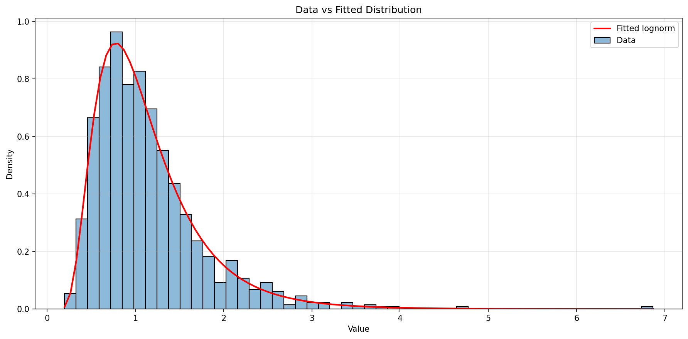
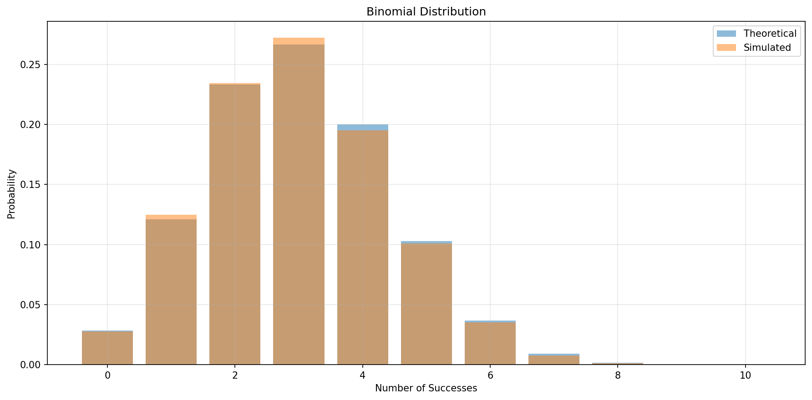
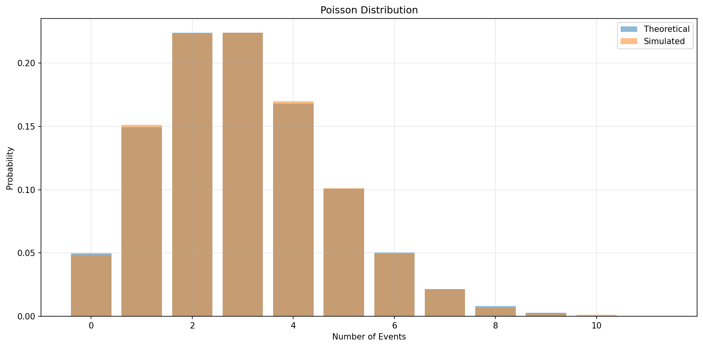
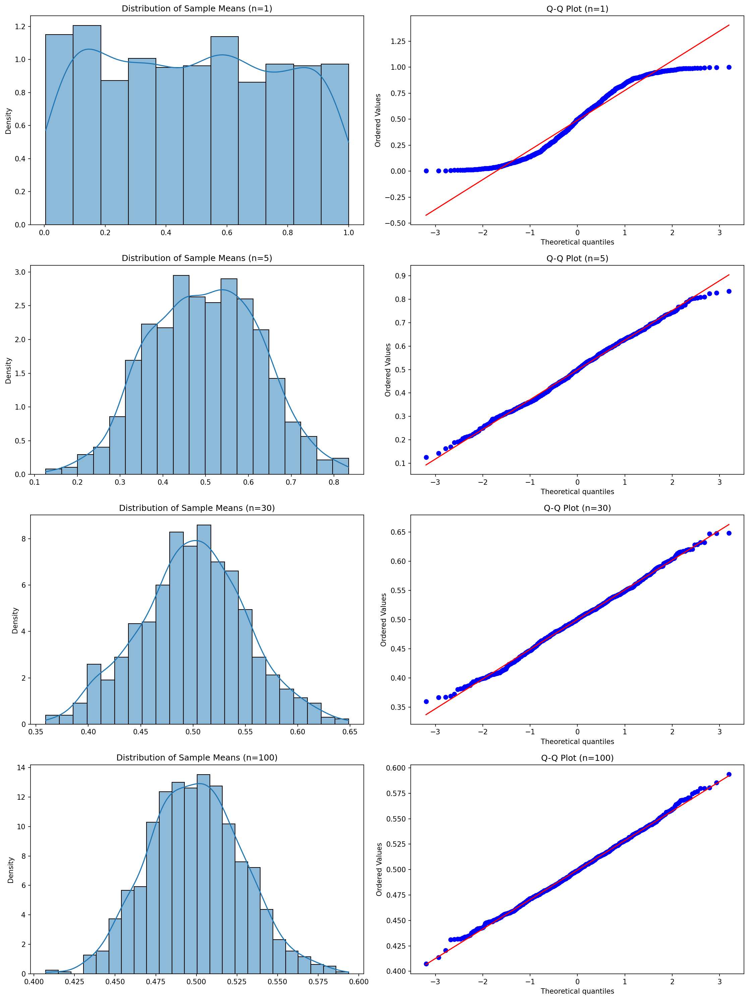
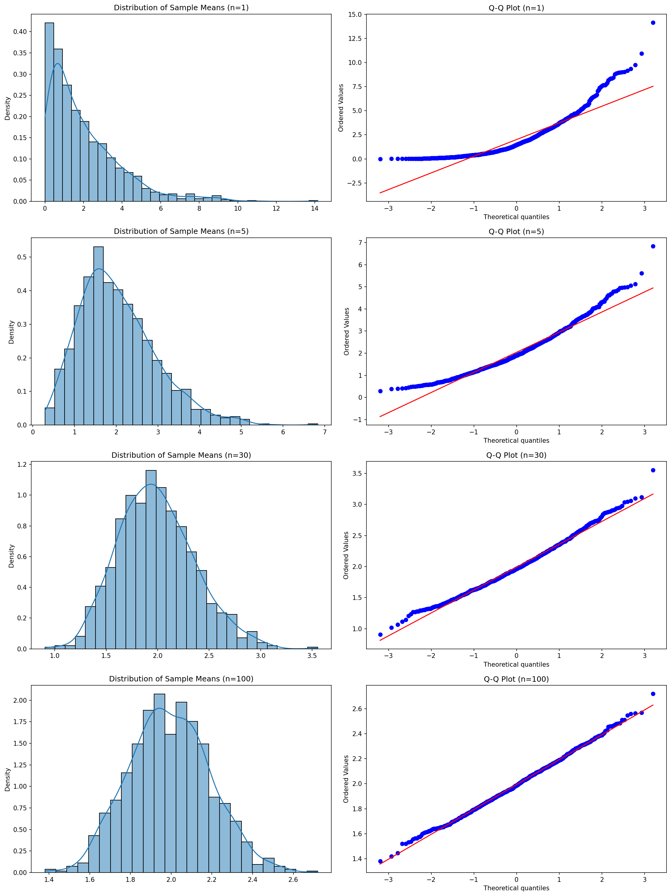

# Probability Distribution Families with Python

**After this lesson:** you can explain Probability Distribution Families with Python and try the examples in your own notebook.

### Video

_StatQuest with Josh Starmer, The binomial distribution_

## Understanding distribution families

A **family** is a shape of randomness described by a formula and **parameters** (for example Normal: mean and standard deviation; Binomial: number of trials and success probability). Changing parameters changes the curve or the histogram, but the **same family** still answers the same kind of real-world question.

**Discrete** families (Binomial, Poisson) describe counts and frequencies. **Continuous** families (Normal, Exponential) describe measurements and waiting times. The code below lets you **sample** and **plot** several parameter settings side by side so you build intuition for "what happens when we change _n_, _p_, _lambda_, _sigma_?"

### Exploring families in Python

we will look at different distribution families using Python:

Imports

Brings in NumPy for sampling, Matplotlib/Seaborn for plotting, and SciPy's `stats` module for distribution functions.

Explorer Init

Seeds NumPy's random state for reproducibility and applies the seaborn style globally so all plots share consistent aesthetics.

Sample Generation

Branches on `family` to draw samples with the correct NumPy function, building a human-readable label from the parameter values for the legend.

Discrete vs Continuous

Binomial data is discrete so it's plotted as a bar chart of observed proportions; continuous families (Normal, Poisson) use KDE for a smooth density curve.

Usage Examples

Calls the explorer three times with different parameter sets to compare how changing μ/σ, n/p, or λ shifts and reshapes each distribution family.

***

### Distribution Fitting and Testing

Create tools for fitting distributions to data:

<figure><figcaption><p>Figure 1: Data vs Fitted Distribution</p></figcaption></figure>

```

Fit Statistics:
Best fit distribution: lognorm
P-value: 0.9511

Parameters:
Parameter 1: 0.5209
Parameter 2: 0.0546
Parameter 3: 0.9478
```

Candidate Distributions

The constructor stores five SciPy continuous distribution objects to try when fitting. Adding more families is as simple as appending to this list.

Single Fit + KS Test

`fit_distribution` uses MLE to estimate parameters, then runs a Kolmogorov-Smirnov test, the p-value measures how well the data matches the fitted distribution.

Best Fit Selection

Tries every candidate distribution, collects p-values, sorts them descending, and returns the best-fitting one, failures for a specific family are silently skipped.

Visualization

Overlays the fitted PDF (red line) on a histogram of the data, then prints the winning distribution name, KS p-value, and fitted parameters for review.

Usage Example

Generates 1,000 log-normal samples and runs the full fit pipeline, the fitter should correctly identify `lognorm` as the best fit.

```

Fit Statistics:
Best fit distribution: lognorm
P-value: 0.9511

Parameters:
Parameter 1: 0.5209
Parameter 2: 0.0546
Parameter 3: 0.9478
```

## Common Distribution Families

***

### Binomial Distribution

Implement tools for working with binomial distributions:

<figure><figcaption><p>Figure 2: Binomial Distribution</p></figcaption></figure>

```

Distribution Statistics:
Mean: 3.00
Variance: 2.10

Simulated Statistics:
count    10000.00
mean         2.97
std          1.43
min          0.00
25%          2.00
50%          3.00
75%          4.00
max          8.00
Name: Successes, dtype: float64

Probability of exactly 5 successes: 0.1029
```

Analyzer Init

Stores `n` (trials) and `p` (success probability) as instance attributes. The optional seed makes all downstream sampling reproducible.

Simulate Trials

Runs `n_simulations` independent binomial experiments using the stored parameters and returns the counts as a named Series.

Exact Probability

Uses the closed-form PMF to compute P(X = k) exactly, faster and more precise than counting from simulations.

Plot & Stats

Overlays the theoretical PMF bars with simulated proportions (when provided), then prints analytical mean/variance alongside the simulation's descriptive stats for comparison.

Usage Example

Models 10 trials with 30% success probability, simulates 10,000 experiments, and checks the exact probability of getting exactly 5 successes.

```

Distribution Statistics:
Mean: 3.00
Variance: 2.10

Simulated Statistics:
count    10000.00
mean         2.97
std          1.43
min          0.00
25%          2.00
50%          3.00
75%          4.00
max          8.00
Name: Successes, dtype: float64

Probability of exactly 5 successes: 0.1029
```

***

### Poisson Distribution

Implementation for Poisson distributions:

<figure><figcaption><p>Figure 3: Poisson Distribution</p></figcaption></figure>

```

Distribution Statistics:
Mean: 3.00
Variance: 3.00

Simulated Statistics:
count    10000.00
mean         2.99
std          1.72
min          0.00
25%          2.00
50%          3.00
75%          4.00
max         11.00
Name: Events, dtype: float64

Probability of exactly 5 events: 0.1008
```

Analyzer Init

Stores `lambda_` (the average event rate). For a Poisson distribution, mean and variance are both equal to λ, a key property highlighted in the print output.

Simulate Events

Generates independent event counts using NumPy's Poisson sampler and wraps them in a named Series for easy downstream analysis.

Exact PMF

Computes P(X = k) from the closed-form Poisson PMF, use this when you need a precise probability, not a simulation estimate.

Plot & Stats

Auto-scales the x-axis to 3λ, then overlays theoretical and simulated bars. Prints both the true mean/variance (equal for Poisson) and simulation descriptive stats.

Usage Example

Models a rate of 3 events per interval, simulates 10,000 observations, and checks the probability of exactly 5 events in one interval.

```

Distribution Statistics:
Mean: 3.00
Variance: 3.00

Simulated Statistics:
count    10000.00
mean         2.99
std          1.72
min          0.00
25%          2.00
50%          3.00
75%          4.00
max         11.00
Name: Events, dtype: float64

Probability of exactly 5 events: 0.1008
```

***

### Normal Distribution and Central Limit Theorem

Demonstrate the Central Limit Theorem:

<figure><figcaption><p>Figure 4: Distribution of Sample Means (n=1)</p></figcaption></figure>

<figure><figcaption><p>Figure 5: Distribution of Sample Means (n=1)</p></figcaption></figure>

```

CLT Demonstration (Uniform Distribution):

Sample Statistics:

Sample Size: 1
Mean: 0.4996
Std Dev: 0.2745
Normality Test p-value: 0.0000

Sample Size: 5
Mean: 0.5071
Std Dev: 0.1311
Normality Test p-value: 0.0926

Sample Size: 30
Mean: 0.5025
Std Dev: 0.0536
Normality Test p-value: 0.4245

Sample Size: 100
Mean: 0.5010
Std Dev: 0.0296
Normality Test p-value: 0.9482

CLT Demonstration (Exponential Distribution):

Sample Statistics:

Sample Size: 1
Mean: 2.0838
Std Dev: 2.1226
Normality Test p-value: 0.0000

Sample Size: 5
Mean: 2.0069
Std Dev: 0.9192
Normality Test p-value: 0.0000

Sample Size: 30
Mean: 1.9851
Std Dev: 0.3591
Normality Test p-value: 0.0000

Sample Size: 100
Mean: 2.0066
Std Dev: 0.2044
Normality Test p-value: 0.0019
```

Init

Seeds the random state so the CLT demonstration produces the same plots each run, important for reproducible teaching examples.

Sample Mean Generation

Draws an `(n_samples × sample_size)` matrix from the chosen distribution, then collapses each row to its mean, each row is one simulated sample of size `sample_size`.

Histogram + Q-Q Plots

For each sample size, creates a row of two subplots: a KDE histogram showing the shape of the sampling distribution, and a Q-Q plot to test for normality visually.

Normality Tests

Prints mean, std dev, and D'Agostino-Pearson normality test p-value for each sample size, as _n_ grows the p-value should rise, confirming the CLT.

Two Base Distributions

Runs the demonstration on a Uniform and an Exponential base distribution to show the CLT holds regardless of the original distribution's shape.

```

CLT Demonstration (Uniform Distribution):

Sample Statistics:

Sample Size: 1
Mean: 0.4996
Std Dev: 0.2745
Normality Test p-value: 0.0000

Sample Size: 5
Mean: 0.5071
Std Dev: 0.1311
Normality Test p-value: 0.0926

Sample Size: 30
Mean: 0.5025
Std Dev: 0.0536
Normality Test p-value: 0.4245

Sample Size: 100
Mean: 0.5010
Std Dev: 0.0296
Normality Test p-value: 0.9482

CLT Demonstration (Exponential Distribution):

Sample Statistics:

Sample Size: 1
Mean: 2.0838
Std Dev: 2.1226
Normality Test p-value: 0.0000

Sample Size: 5
Mean: 2.0069
Std Dev: 0.9192
Normality Test p-value: 0.0000

Sample Size: 30
Mean: 1.9851
Std Dev: 0.3591
Normality Test p-value: 0.0000

Sample Size: 100
Mean: 2.0066
Std Dev: 0.2044
Normality Test p-value: 0.0019
```

## Practice Exercises

Try these distribution analysis exercises:

1.  **Customer Service Analysis**

    ```python
    # Create functions to:
    # - Analyze call arrival patterns
    # - Fit appropriate distribution
    # - Calculate staffing requirements
    ```
2.  **Manufacturing Quality Control**

    ```python
    # Build tools to:
    # - Model defect rates
    # - Calculate control limits
    # - Predict batch quality
    ```
3.  **Financial Risk Analysis**

    ```python
    # Implement system to:
    # - Analyze return distributions
    # - Calculate Value at Risk
    # - Model portfolio risk
    ```

Remember:

* Choose appropriate distribution family
* Validate distribution assumptions
* Consider sample size effects
* Use visualization for insights
* Document your analysis

## Common pitfalls

* **Using a famous name without checking fit**: "It's Normal because we always use Normal" is wrong; use plots and domain knowledge.
* **Ignoring parameter constraints**: Rate parameters must be positive; probabilities must stay in **\[0, 1]**.
* **Mixing discrete and continuous**: PMF vs PDF: different rules for summing vs integrating.

## Next steps

Continue to [Two-variable statistics](two-variable-statistics.md), then [Data foundation with NumPy](../1.4-data-foundation-linear-algebra/) starting with [Introduction to NumPy](../1.4-data-foundation-linear-algebra/intro-numpy.md).

Happy analyzing!
