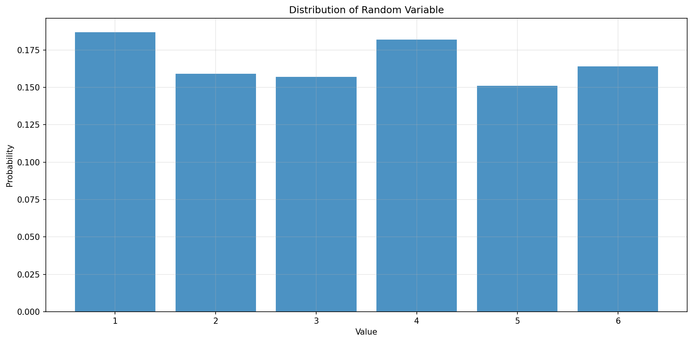
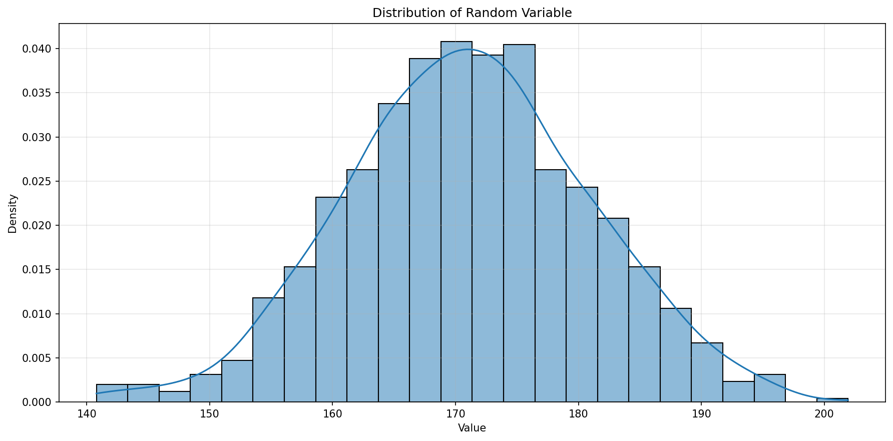
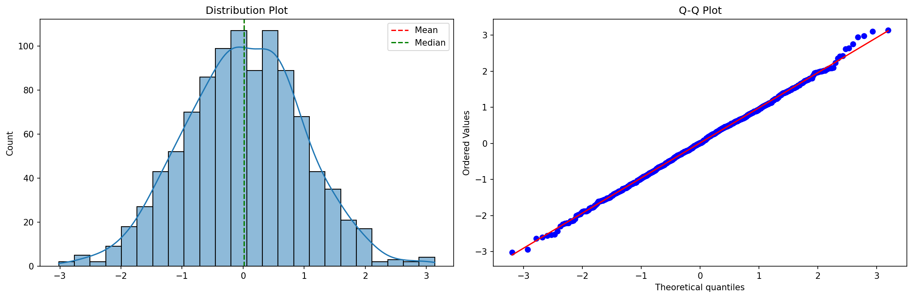
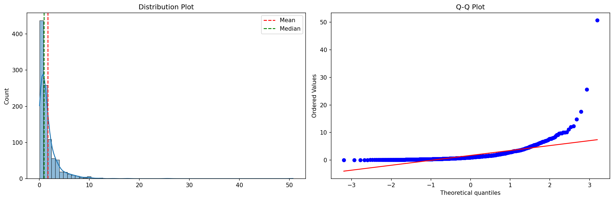
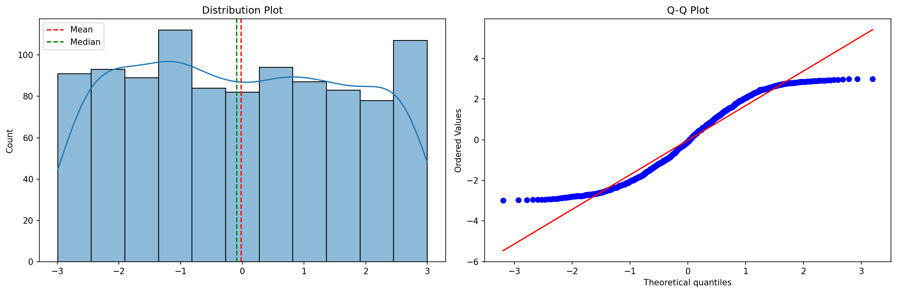
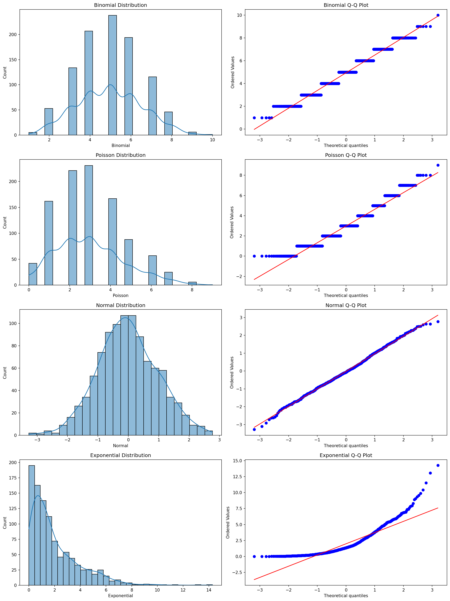
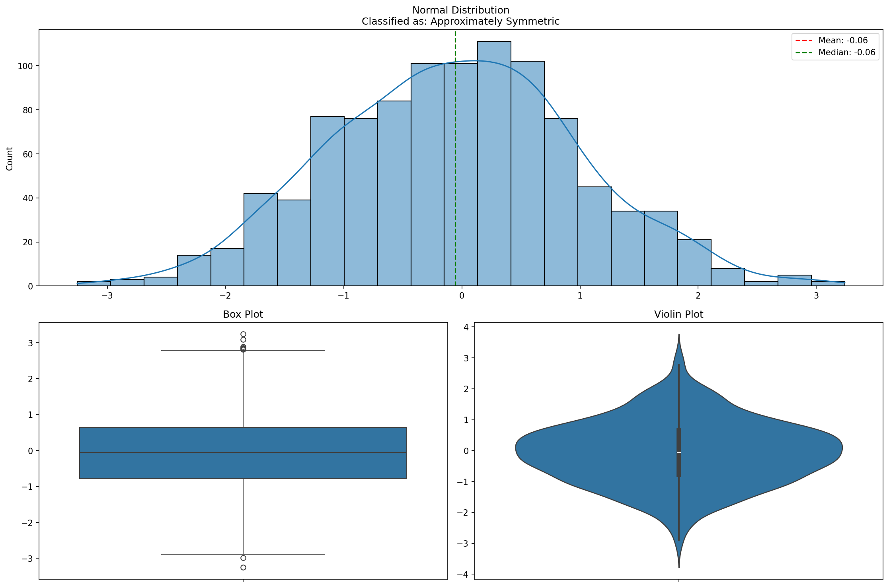
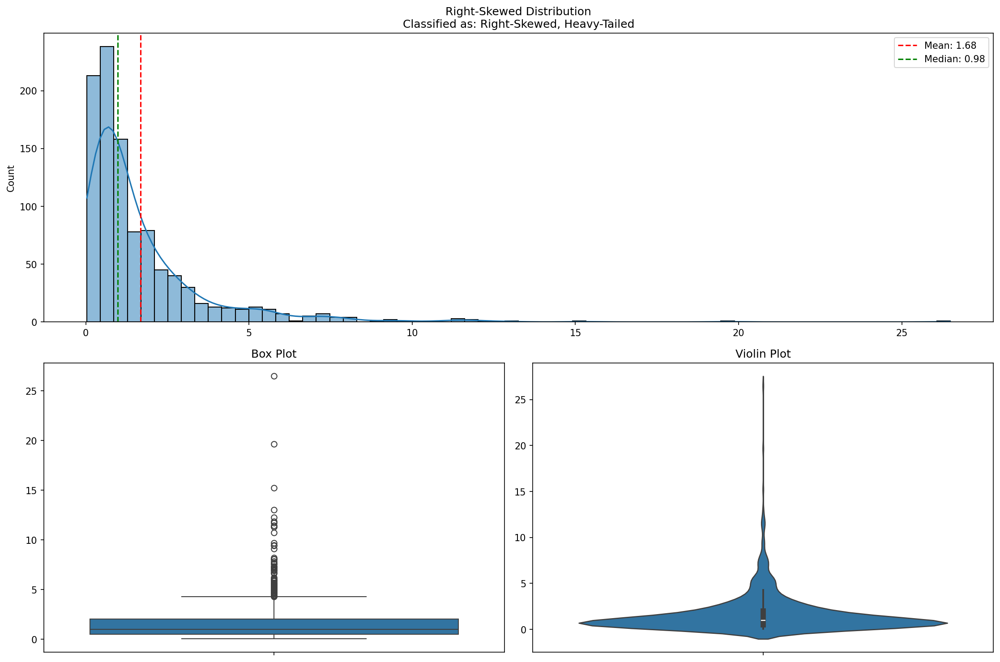
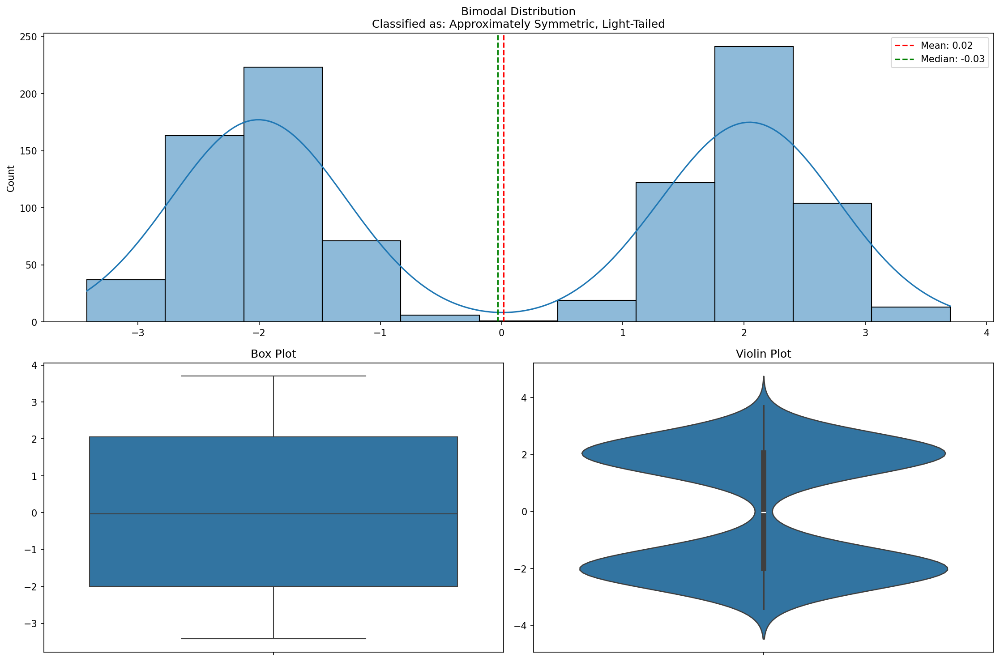

# Probability Distributions with Python

**After this lesson:** you can explain Probability Distributions with Python and try the examples in your own notebook.

### Video

_StatQuest with Josh Starmer, The normal distribution, clearly explained_

## Understanding random variables through code

A **random variable** is a quantity whose value is uncertain until you observe it (or simulate it). You describe it with a **distribution**: either a list of outcomes with probabilities (**discrete**) or a density over a continuum (**continuous**). The same code pattern appears everywhere: **specify law**, **draw samples**, **plot** to see shape.

### Implementing random variables

we will look at random variables using Python:

**`RandomVariableExplorer`: discrete vs continuous draws**

* **Purpose:** Tie code to the idea of a random variable: **simulate** draws from a discrete law (`np.random.choice` with probabilities) and from continuous families (`normal`, `uniform`), then **plot** with bar vs histogram/KDE.
* **Walkthrough:** `simulate_discrete` uses `p=`; `simulate_continuous` branches on `distribution`; `plot_distribution` picks `discrete` vs `continuous` from `n_unique`.

<figure><figcaption><p>Figure 1: Distribution of Random Variable</p></figcaption></figure>

<figure><figcaption><p>Figure 2: Distribution of Random Variable</p></figcaption></figure>

```

Die Rolls:

Summary Statistics:
count    1000.000
mean        3.443
std         1.725
min         1.000
25%         2.000
50%         3.000
75%         5.000
max         6.000
Name: Value, dtype: float64

Height Distribution:

Summary Statistics:
count    1000.000
mean      170.989
std         9.889
min       140.786
25%       164.359
50%       170.842
75%       177.396
max       201.931
Name: Value, dtype: float64
```

Imports

Imports NumPy, pandas, Matplotlib, Seaborn, SciPy stats, and typing, the full stack needed for simulation, analysis, and plotting.

Discrete Simulation

Seeds the RNG if requested, then draws samples from a discrete law using `np.random.choice` with explicit probabilities.

Continuous Simulation

Branches on the distribution name to call the matching NumPy generator, normal or uniform, and raises if the name is unknown.

Plot and Demo

Auto-detects discrete vs continuous from unique-value count, then plots bar chart or histogram+KDE; the bottom lines demo both die rolls and heights.

```

Die Rolls:

Summary Statistics:
count    1000.000
mean        3.443
std         1.725
min         1.000
25%         2.000
50%         3.000
75%         5.000
max         6.000
Name: Value, dtype: float64

Height Distribution:

Summary Statistics:
count    1000.000
mean      170.989
std         9.889
min       140.786
25%       164.359
50%       170.842
75%       177.396
max       201.931
Name: Value, dtype: float64
```

***

### Expected Value and Variance

Implement tools for calculating distribution properties:

**Moments and skew/kurtosis on samples**

* **Purpose:** Connect **E\[X]** and **Var(X)** for both tabulated `(values, probabilities)` and raw samples; visualize with histogram + mean/median and a normal Q-Q plot.
* **Walkthrough:** `calculate_expected_value` / `calculate_variance` use `np.mean`/`np.var` when `probabilities` is `None`; `analyze_distribution` builds the summary dict and `stats.probplot` for Q-Q.

<figure><figcaption><p>Figure 3: Distribution Plot</p></figcaption></figure>

<figure><figcaption><p>Figure 4: Distribution Plot</p></figcaption></figure>

<figure><figcaption><p>Figure 5: Distribution Plot</p></figcaption></figure>

```

Normal Distribution:

Normal Analysis:
Mean: 0.014
Median: 0.011
Std Dev: 0.970
Variance: 0.941
Skewness: 0.002
Kurtosis: 0.052

Right-Skewed Distribution:

Right-Skewed Analysis:
Mean: 1.702
Median: 0.969
Std Dev: 2.564
Variance: 6.572
Skewness: 8.941
Kurtosis: 142.635

Uniform Distribution:

Uniform Analysis:
Mean: -0.024
Median: -0.098
Std Dev: 1.736
Variance: 3.014
Skewness: 0.054
Kurtosis: -1.214
```

Expected Value

Returns `np.mean` for raw samples when no probabilities are given, or the weighted sum `Σ(x·p)` for a tabulated discrete distribution.

Variance Calculation

Mirrors the expected-value duality: `np.var` for samples, or `Σ((x−μ)²·p)` using the previously computed mean for discrete distributions.

Full Analysis and Plot

Builds a summary dict of six moments, prints them, then plots a histogram+KDE with mean/median lines alongside a Q-Q plot for normality assessment.

Demo Usage

Runs the analyzer on three distribution shapes, symmetric normal, right-skewed lognormal, and uniform, so you can compare their outputs side by side.

```

Normal Distribution:

Normal Analysis:
Mean: 0.014
Median: 0.011
Std Dev: 0.970
Variance: 0.941
Skewness: 0.002
Kurtosis: 0.052

Right-Skewed Distribution:

Right-Skewed Analysis:
Mean: 1.702
Median: 0.969
Std Dev: 2.564
Variance: 6.572
Skewness: 8.941
Kurtosis: 142.635

Uniform Distribution:

Uniform Analysis:
Mean: -0.024
Median: -0.098
Std Dev: 1.736
Variance: 3.014
Skewness: 0.054
Kurtosis: -1.214
```

## Common Probability Distributions

***

### Implementing Distribution Functions

Create tools for working with common distributions:

**Sampling binomial, Poisson, normal, exponential**

* **Purpose:** See how NumPy's `np.random.*` generators map to common families; compare shapes side-by-side with histograms and normal Q-Q panels.
* **Walkthrough:** Each method wraps one generator (`binomial`, `poisson`, `normal`, `exponential`); `plot_distributions` lays out two columns per distribution.

<figure><figcaption><p>Figure 6: Binomial Distribution</p></figcaption></figure>

```

Summary Statistics:

Binomial:
count    1000.000
mean        4.939
std         1.579
min         1.000
25%         4.000
50%         5.000
75%         6.000
max        10.000
Name: Binomial, dtype: float64

Poisson:
count    1000.000
mean        2.979
std         1.693
min         0.000
25%         2.000
50%         3.000
75%         4.000
max         9.000
Name: Poisson, dtype: float64

Normal:
count    1000.000
mean       -0.014
std         0.980
min        -3.275
25%        -0.671
50%        -0.060
75%         0.618
max         2.769
Name: Normal, dtype: float64

Exponential:
count    1000.000
mean        1.980
std         1.917
min         0.000
25%         0.577
50%         1.362
75%         2.865
max        14.280
Name: Exponential, dtype: float64
```

Four Generators

Each method wraps one NumPy generator, binomial, Poisson, normal, exponential, and returns a named pandas Series for easy labelling in plots.

Grid Plot

Creates a 2-column grid with one row per distribution: histogram+KDE on the left and a Q-Q plot on the right for normality comparison.

Demo Run

Generates one sample from each family with a fixed seed, then passes the dict to `plot_distributions` so all four appear in the same figure.

```

Summary Statistics:

Binomial:
count    1000.000
mean        4.939
std         1.579
min         1.000
25%         4.000
50%         5.000
75%         6.000
max        10.000
Name: Binomial, dtype: float64

Poisson:
count    1000.000
mean        2.979
std         1.693
min         0.000
25%         2.000
50%         3.000
75%         4.000
max         9.000
Name: Poisson, dtype: float64

Normal:
count    1000.000
mean       -0.014
std         0.980
min        -3.275
25%        -0.671
50%        -0.060
75%         0.618
max         2.769
Name: Normal, dtype: float64

Exponential:
count    1000.000
mean        1.980
std         1.917
min         0.000
25%         0.577
50%         1.362
75%         2.865
max        14.280
Name: Exponential, dtype: float64
```

***

### Distribution Shape Analysis

Create tools for analyzing distribution shapes:

**Classify skew/tails and compare plot types**

* **Purpose:** Practice reading **skewness** and **kurtosis** thresholds, and pair histograms with box and violin plots for the same data.
* **Walkthrough:** `classify_shape` uses `stats.skew` / `stats.kurtosis`; `plot_shape_analysis` builds a 2×2 grid with `sns.histplot`, `sns.boxplot`, `sns.violinplot`.

<figure><figcaption><p>Figure 7: Normal Distribution Classified as: Approximately Symmetric</p></figcaption></figure>

<figure><figcaption><p>Figure 8: Right-Skewed Distribution Classified as: Right-Skewed, Heavy-Tailed</p></figcaption></figure>

<figure><figcaption><p>Figure 9: Bimodal Distribution Classified as: Approximately Symmetric, Light-Tailed</p></figcaption></figure>

```

Normal Distribution:

Shape Statistics:
Skewness: 0.054
Kurtosis: -0.093

Right-Skewed Distribution:

Shape Statistics:
Skewness: 4.106
Kurtosis: 28.778

Bimodal Distribution:

Shape Statistics:
Skewness: 0.005
Kurtosis: -1.763
```

Shape Classifier

Uses SciPy's skew and kurtosis to classify the distribution, left/right/symmetric for skewness, and heavy/light-tailed for kurtosis, and appends both labels.

Composite Plot

Uses `GridSpec` to place a full-width histogram+KDE on top with mean/median lines, then a box plot and violin plot side-by-side below.

Demo: Three Shapes

Runs the analyzer on a symmetric normal, a right-skewed lognormal, and a hand-crafted bimodal so you can compare how each shape reads in the plots.

```

Normal Distribution:

Shape Statistics:
Skewness: 0.054
Kurtosis: -0.093

Right-Skewed Distribution:

Shape Statistics:
Skewness: 4.106
Kurtosis: 28.778

Bimodal Distribution:

Shape Statistics:
Skewness: 0.005
Kurtosis: -1.763
```

## Practice Exercises

Try these distribution analysis exercises:

1.  **Stock Returns Analysis**

    * **Purpose:** Stub for **Practice Exercise 1**-implement the four comment bullets (load prices, returns, fit, tails) using your own data source.

    ```python
    # Create functions to:
    # - Load stock price data
    # - Calculate daily returns
    # - Fit distribution to returns
    # - Analyze tail behavior
    ```
2.  **Customer Behavior Model**

    * **Purpose:** Stub for **Practice Exercise 2**-model frequency and order value distributions and lifetime-style summaries from transactional data.

    ```python
    # Build analysis tools for:
    # - Purchase frequency distribution
    # - Order value distribution
    # - Customer lifetime modeling
    ```
3.  **Quality Control System**

    * **Purpose:** Stub for **Practice Exercise 3**-monitor measurements, compare to baseline distributions, and set control limits.

    ```python
    # Implement system to:
    # - Monitor process measurements
    # - Detect distribution shifts
    # - Calculate control limits
    # - Generate alerts
    ```

Remember:

* Use appropriate distributions
* Validate distribution assumptions
* Consider sample size effects
* Create clear visualizations
* Document your analysis

## Common pitfalls

* **Wrong support**: Binomial counts cannot be negative; Normal models are continuous, check that your data fits the story.
* **Confusing PDF and probability**: For continuous variables, probability comes from areas under the curve, not the height at a point.
* **Small-sample behavior**: Histograms and fitted curves look smoother as **n** grows; don't overfit a distribution from a tiny sample.

## Next steps

Continue to [Probability distribution families](probability-distribution-families.md), then [Two-variable statistics](two-variable-statistics.md).

Happy analyzing!
