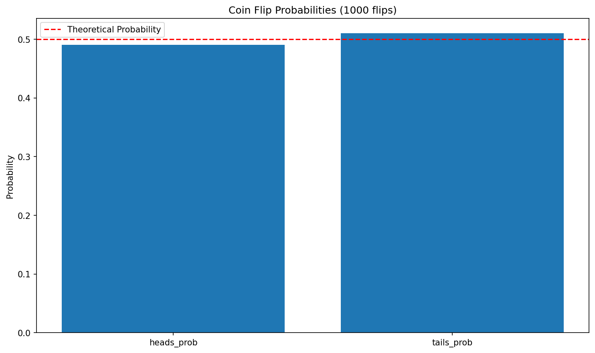
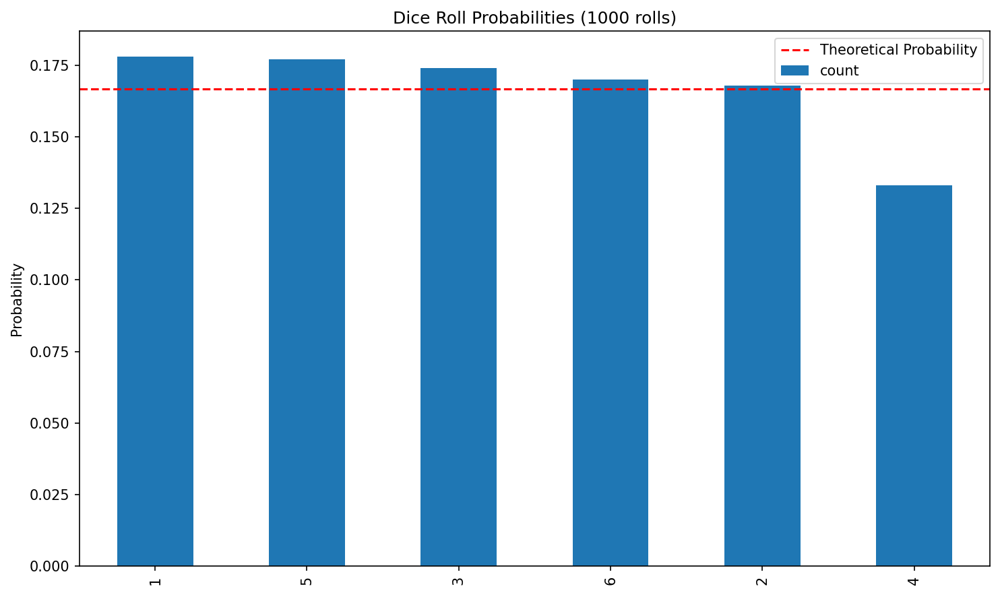
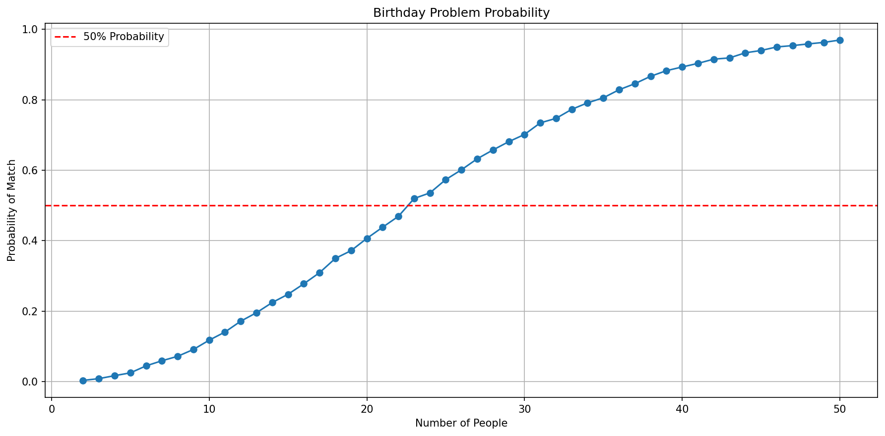
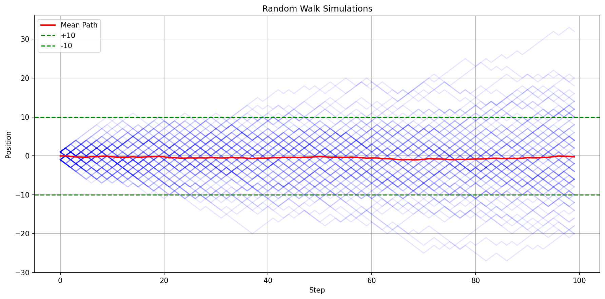
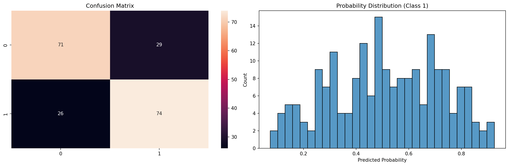

# Probability fundamentals with Python

**After this lesson:** You connect probability ideas (events, simulation, long-run frequency) to short Python examples you can run and plot.

## Overview

**Prerequisites:** Basic Python and comfort reading imports; statistics module [Introduction to Statistics](./) context helps.

**Why this lesson:** Probability is the language of **uncertainty**. Simulation in code turns abstract rules (coins, dice, draws) into histograms you can **see**-the bridge to distributions and inference later.

### Video

_Khan Academy, Introduction to probability_

## Understanding probability through code

***

### Implementing Basic Probability

we will look at probability concepts using Python:

<figure><figcaption><p>Figure 1: Coin Flip Probabilities (1000 flips)</p></figcaption></figure>

<figure><figcaption><p>Figure 2: Dice Roll Probabilities (1000 rolls)</p></figcaption></figure>

```

Coin Flip Probabilities:
heads_prob: 0.490
tails_prob: 0.510

Dice Roll Probabilities:
1    0.178
5    0.177
3    0.174
6    0.170
2    0.168
4    0.133
Name: count, dtype: float64
```

Imports

Imports NumPy for random draws, pandas for counting, Matplotlib and Seaborn for plots, and typing for readable signatures.

Coin and Dice

Seeds the RNG on init; `flip_coin` uses `random.choice` with equal weights, `roll_dice` uses `randint`-both return empirical probabilities as fractions.

Plot and Demo

Handles both dict and Series inputs in one plot method, adds a theoretical probability reference line, then runs both experiments with 1,000 trials each.


```

Coin Flip Probabilities:
heads_prob: 0.490
tails_prob: 0.510

Dice Roll Probabilities:
1    0.178
5    0.177
3    0.174
6    0.170
2    0.168
4    0.133
Name: count, dtype: float64
```

***

### Monte Carlo Simulation

Use simulation to understand probability:

<figure><figcaption><p>Figure 3: Birthday Problem Probability</p></figcaption></figure>

```

Birthday Problem:
Probability with 23 people: 0.511

Monty Hall Problem:
Probability when switching: 0.670
Probability when staying:   0.334
```

Birthday Problem

Generates `n_people` random birthdays across 365 days and counts runs where any two match, repeating this 10,000 times gives a stable probability estimate.

Monty Hall

Simulates the three-door game: the host eliminates a non-prize door, then the contestant either switches or stays, switching wins \~2/3 of the time.

Plot and Demo

Plots the birthday probability as group size grows from 2 to 50, showing the 50% crossing point near 23 people, then prints both Monty Hall outcomes.

```

Birthday Problem:
Probability with 23 people: 0.511

Monty Hall Problem:
Probability when switching: 0.670
Probability when staying: 0.334
```

## Probability Rules and Calculations

***

### Implementing Probability Rules

Create tools for probability calculations:

```

Medical Test Example:
Probability of disease given positive test: 0.088
```

Set Operations

Implements complement, union, intersection, and conditional probability as one-liners, clean translations of the formulas from the text above.

Bayes' Theorem

Computes P(A|B) by first calculating the total probability of B via the law of total probability, then applying the Bayes formula.

Medical Demo

Shows that a 95%-accurate test on a 1%-prevalence disease still yields only \~8.8% chance of disease given a positive result, a classic base-rate demonstration.

```

Medical Test Example:
Probability of disease given positive test: 0.088
```

***

### Visualizing Probability Concepts

Create visual representations of probability:

Venn Diagram

Renders a two-set Venn with `matplotlib_venn`, then computes and prints P(A), P(B), and P(A∩B) using set operations on the element counts.

Probability Tree

Builds a directed graph with NetworkX: Start → events (first level) → outcomes (second level), labelling each edge with its probability.

Demo Usage

Demonstrates both methods: a math/science student Venn diagram and a weather probability tree with Sunny/Rainy split into sub-outcomes.

## Advanced Probability Concepts

***

### Implementing Advanced Probability

Create tools for advanced probability analysis:

<figure><figcaption><p>Figure 4: Random Walk Simulations</p></figcaption></figure>

```

Probability of hitting ±10: 0.631
```

Random Walk Simulation

Generates a matrix of ±1 steps then uses `cumsum` along the step axis, one row per simulation path, fully vectorised.

Hitting Probability

Uses `np.any` row-wise to check if any step in a path reaches the threshold, then averages the boolean array for a Monte Carlo probability estimate.

Plot and Demo

Overlays individual paths at low opacity, a red mean path, and optional threshold lines, then runs 1,000 walks and reports the hitting probability.

```

Probability of hitting ±10: 0.631
```

***

### Probability in Machine Learning

Example of using probability in ML contexts:

<figure><figcaption><p>Figure 5: Confusion Matrix</p></figcaption></figure>

Probabilistic Labels

Generates labels using a sigmoid of the feature sum so each sample has a genuine probability of being class 1, not a hard boundary, making the task realistically noisy.

Naive Bayes Fit

Splits 80/20, fits Gaussian Naive Bayes, and returns both hard predictions and class probabilities alongside the confusion matrix.

Results Plot

Shows a heatmap confusion matrix on the left and a histogram of predicted class-1 probabilities on the right, illustrating calibration as well as accuracy.

<figure><figcaption><p>Figure 5: Confusion Matrix</p></figcaption></figure>

## Practice exercises

Try these probability programming exercises:

1.  **Card Game Simulator**

    ```python
    # Create a simulator that:
    # - Deals cards and calculates probabilities
    # - Simulates different poker hands
    # - Visualizes results
    ```
2.  **Disease Testing Model**

    ```python
    # Implement a system that:
    # - Simulates medical test accuracy
    # - Calculates false positive/negative rates
    # - Uses Bayes' theorem for diagnosis
    ```
3.  **Stock Market Probability**

    ```python
    # Build analysis tools for:
    # - Calculating probability of price movements
    # - Simulating trading strategies
    # - Risk assessment
    ```

Remember:

* Use NumPy for efficient calculations
* Implement proper error handling
* Validate probability assumptions
* Create clear visualizations
* Document your code

## Common pitfalls

* **Confusing P(A|B) and P(B|A)**: Write down which event is "given" before you plug into formulas.
* **Assuming independence**: Multiplication rules for probabilities only apply when events are independent (or you use the correct conditional form).
* **Law of large numbers vs one trial**: A fair coin can show many heads in a row; probability describes long-run frequency, not a guarantee on the next flip.

## Next steps

Continue to [Probability distributions](probability-distributions.md), then [Probability distribution families](probability-distribution-families.md), then [Two-variable statistics](two-variable-statistics.md). If you have not yet summarized single variables with means and spreads, work through [One-variable statistics](one-variable-statistics.md) first so notation feels familiar.
