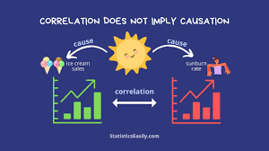

# Two-Variable Statistics 📊

## Understanding Relationships Between Variables 🔄

Have you ever wondered:
- Does more study time lead to better grades? 📚
- Do taller people weigh more? 📏
- Does ice cream sales affect sunburn cases? 🍦

Let's learn how to understand relationships between different variables!

## Correlation vs. Causation 🤔



### What is Correlation?
When two things tend to move together:
- 📈 **Positive**: Both increase together
  Example: Height and Weight
  ```
  Height: ↑  Weight: ↑
  Height: ↓  Weight: ↓
  ```
- 📉 **Negative**: One up, one down
  Example: Price and Sales
  ```
  Price: ↑   Sales: ↓
  Price: ↓   Sales: ↑
  ```



### What is Causation?
When one thing CAUSES the other:
- Rain causes wet ground
- Studying causes better grades
- Exercise causes fitness improvement



### The Big Mistake!
Just because things happen together doesn't mean one causes the other!

Funny Example:
```
Ice cream sales ↑  Sunburns ↑
```
Real cause? Summer weather! ☀️



### Remember! 💡
```
Correlation ≠ Causation
But
Causation → Correlation
```



## Proving Causation: Experiments 🔬



### Setting Up an Experiment
Like a detective solving a mystery!

1. **Question**: Does this vitamin help plants grow? 🌱
2. **Groups**:
   - Treatment: Gets vitamin
   - Control: No vitamin
3. **Measure**: Plant height after 2 weeks



### Key Components
- **Independent Variable**: What we change (vitamin)
- **Dependent Variable**: What we measure (height)
- **Control Group**: No changes (no vitamin)
- **Treatment Group**: Gets the change (vitamin)



### Making it Scientific
- **Blind Test**: Plants don't know if they got vitamin
- **Double-Blind**: Even researcher doesn't know which is which
- **Random Assignment**: Fair selection for groups



### Watch Out For! ⚠️



### Confounding Variables
Other things that might affect results:
```
Studying → Better Grades
But what about:
- Sleep quality 😴
- Stress levels 😰
- Teaching quality 👩‍🏫
```



### The Placebo Effect
People might improve just because they THINK they got treatment!
```
Sugar pill → Feel better
Why? The mind is powerful! 🧠
```



## Different Ways to Study Relationships 🔍

### Types of Studies



### 1. Observational Studies
Just watch and record:
```
Example: Do coffee drinkers live longer?
- Watch people's habits
- Record their health
- Don't change anything
```



### 2. Retrospective Studies
Look at past data:
```
Example: What caused the success?
- Look at old records
- Find patterns
- Learn from history
```



### 3. Prospective Studies
Follow into the future:
```
Example: Will this habit help?
- Start tracking now
- Follow over time
- See what happens
```



## Visualizing Relationships 📈

### Scatter Plots: A Picture of Relationship



### What They Show
Each dot = One pair of measurements
```
   y
   ↑     •
   |   •   •
   | •       •
   |•         •
   +------------→ x
```



### Types of Patterns
1. **Positive**: Dots go up ↗️
   ```
      •
    •
  •
   ```

2. **Negative**: Dots go down ↘️
   ```
   •
     •
       •
   ```

3. **No Relationship**: Dots scattered
   ```
     •  •
   •    •
     •    •
   ```



### Measuring Correlation 📏



### Correlation Coefficient (r)
- Goes from -1 to +1
- Perfect patterns = ±1
- No pattern = 0

```
-1 ←|-------|----------|→ +1
  Perfect   No       Perfect
  Negative  Pattern  Positive
```



### Examples
```
r = 0.9  → Very strong positive
r = -0.8 → Strong negative
r = 0.2  → Weak positive
r = 0    → No correlation
```




💡 **Pro Tips**:
- Always plot your data first!
- Look for unusual patterns
- Remember: correlation ≠ causation
- Use scatter plots to tell the story
