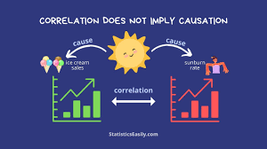

# Two-Variable Statistics

**After this lesson:** you can explain Two-Variable Statistics and try the examples in your own notebook.

## Overview

**Prerequisites:** [One-variable statistics](./one-variable-statistics.md) (means, spreads, plots) and basic Python plotting.

**Why this lesson:** Most interesting questions are about **relationships**: does X track with Y? Is the association linear? Could a third factor explain both? This page separates **correlation** (pattern in data) from **causation** (mechanism), then introduces tools you will reuse in modeling.

## Understanding relationships between variables

Have you ever wondered:

- Does more study time lead to better grades?
- Do taller people weigh more?
- Does ice cream sales affect sunburn cases?

Learn how to understand relationships between different variables!

### Video

<div class="video-embed">
<iframe width="560" height="315" src="https://www.youtube.com/embed/xZ_z8KWkhXE" frameborder="0" allow="accelerometer; autoplay; clipboard-write; encrypted-media; gyroscope; picture-in-picture" allowfullscreen></iframe>
</div>

*StatQuest with Josh Starmer, Correlation and covariance, clearly explained*

## Correlation vs. Causation

---

### What is Correlation?

**Correlation** means "tendency to move together" on average, not proof that one variable causes the other. When two things tend to move together:

- **Positive**: Both increase together
  Example: Height and Weight

  ```
  Height: ↑  Weight: ↑
  Height: ↓  Weight: ↓
  ```

- **Negative**: One up, one down
  Example: Price and Sales

  ```
  Price: ↑   Sales: ↓
  Price: ↓   Sales: ↑
  ```

---

### What is Causation?

When one thing CAUSES the other:

- Rain causes wet ground
- Studying causes better grades
- Exercise causes fitness improvement

---

### The Big Mistake

Just because things happen together doesn't mean one causes the other!

Funny Example:

```
Ice cream sales ↑  Sunburns ↑
```

Real cause? Summer weather!

### Remember

```
Correlation ≠ Causation
But
Causation → Correlation
```



## Proving Causation: Experiments

---

### Setting Up an Experiment

Like a detective solving a mystery!

1. **Question**: Does this vitamin help plants grow?
2. **Groups**:
   - Treatment: Gets vitamin
   - Control: No vitamin
3. **Measure**: Plant height after 2 weeks

---

### Key Components

- **Independent Variable**: What we change (vitamin)
- **Dependent Variable**: What we measure (height)
- **Control Group**: No changes (no vitamin)
- **Treatment Group**: Gets the change (vitamin)

---

### Making it Scientific

- **Blind Test**: Plants don't know if they got vitamin
- **Double-Blind**: Even researcher doesn't know which is which
- **Random Assignment**: Fair selection for groups

### Watch Out For

---

### Confounding Variables

Other things that might affect results:

```
Studying  Better Grades
But what about:
- Sleep quality
- Stress levels
- Teaching quality
```

---

### The Placebo Effect

People might improve just because they THINK they got treatment!

```
Sugar pill  Feel better
Why? The mind is powerful!
```

## Different Ways to Study Relationships

### Types of Studies

---

### 1. Observational Studies

Just watch and record:

```
Example: Do coffee drinkers live longer?
- Watch people's habits
- Record their health
- Don't change anything
```

---

### 2. Retrospective Studies

Look at past data:

```
Example: What caused the success?
- Look at old records
- Find patterns
- Learn from history
```

---

### 3. Prospective Studies

Follow into the future:

```
Example: Will this habit help?
- Start tracking now
- Follow over time
- See what happens
```

## Visualizing Relationships

### Scatter Plots: A Picture of Relationship

---

### What They Show

Each dot = One pair of measurements

```
   y
   ↑     •
   |   •   •
   | •       •
   |•         •
   +------------→ x
```

---

### Types of Patterns

1. **Positive**: Dots go up

   ```
      •
    •

  •

   ```

2. **Negative**: Dots go down
   ```

   •
     •
       •

   ```

3. **No Relationship**: Dots scattered
   ```

     •  •
   •    •
     •    •

   ```

### Measuring Correlation

---

### Correlation Coefficient (r)
- Goes from -1 to +1
- Perfect patterns = ±1
- No pattern = 0

```

-1 ←|-------|----------|→ +1
  Perfect   No       Perfect
  Negative  Pattern  Positive

```

---

### Examples
```

r = 0.9  → Very strong positive
r = -0.8 → Strong negative
r = 0.2  → Weak positive
r = 0    → No correlation

```


> **Tip:** Always plot your data first. Look for unusual patterns. Remember: correlation is not causation. Use scatter plots to tell the story.

## Common pitfalls

- **Treating correlation as causation**: Confounders and reverse causality can produce misleading **r** values.
- **Linear correlation for nonlinear relationships**: Pearson **r** can miss curved patterns; inspect the scatter plot.
- **Outliers driving correlation**: One extreme point can inflate or flip the sign of a correlation.

## Next steps

Continue to [Data foundation with NumPy](../1.4-data-foundation-linear-algebra/README.md), starting with [Introduction to NumPy](../1.4-data-foundation-linear-algebra/intro-numpy.md).
