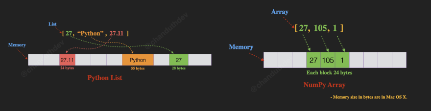

# Introduction to NumPy

**After this lesson:** You understand why NumPy exists, how **ndarray** differs from Python lists, and you can run small vectorized examples on your machine.

## Overview

**Prerequisites:** Basic Python (lists, loops, functions) from this module’s Python unit.

### Video

<div class="video-embed">
<iframe width="560" height="315" src="https://www.youtube.com/embed/QUT1VHiLmmI" frameborder="0" allow="accelerometer; autoplay; clipboard-write; encrypted-media; gyroscope; picture-in-picture" allowfullscreen></iframe>
</div>

*freeCodeCamp — Python NumPy tutorial for beginners*

**Why start here:** Almost every numeric library in Python **builds on NumPy arrays** (pandas columns are backed by NumPy; many sklearn inputs are `ndarray`). Investing an hour in dtypes, shapes, and vectorization pays off in every later module.

## What is NumPy?

NumPy (Numerical Python) is like a supercharged calculator for Python! Imagine you need to do math on thousands or millions of numbers - NumPy makes it lightning fast and super easy. It's the foundation of scientific computing in Python and is used extensively in:

- Data Analysis: Processing large datasets efficiently
- Machine Learning: Building and training models
- Financial Analysis: Computing complex financial metrics
- Scientific Research: Processing experimental data
- Game Development: Handling physics calculations
- Image Processing: Manipulating pixels in images

---

### The Problem NumPy Solves

Let's see why regular Python lists aren't ideal for numerical computations:

```python
# Without NumPy (slow!) - Let's time it
import time

# Create a big list
numbers = list(range(1000000))
start_time = time.time()

# Double each number (need explicit loop)
doubled = [x * 2 for x in numbers]  # Need a loop 
python_time = time.time() - start_time

# With NumPy (fast! )
import numpy as np
numbers_np = np.array(range(1000000))
start_time = time.time()

# Double each number (vectorized operation)
doubled_np = numbers_np * 2  # No loop needed! 
numpy_time = time.time() - start_time

print(f"Python time: {python_time:.4f} seconds")
print(f"NumPy time: {numpy_time:.4f} seconds")
print(f"NumPy is {python_time/numpy_time:.1f}x faster!")
```

```
Python time: 0.0117 seconds
NumPy time: 0.0007 seconds
NumPy is 16.6x faster!
```

Key advantages of NumPy:

1. Vectorization: Operates on entire arrays at once
2. Contiguous Memory: Data stored efficiently
3. Low-level Optimization: Written in C for speed
4. Rich Functionality: Many mathematical operations built-in

---

### Cool Things NumPy Can Do

1. Lightning-fast calculations
2. Handle multi-dimensional data
3. Complex math made simple
4. Efficient memory usage
5. Works with other data science tools

## Why is NumPy So Fast?

---

### Memory Magic

```
Python List:
[1] -> [2] -> [3] -> [4]  # Scattered in memory

NumPy Array:
[1,2,3,4]  # All together in one place!
```

- Like having all your tools on one table
- Everything is organized and easy to find

---

### Array Shapes

NumPy arrays can have any number of dimensions. Here is how 1D, 2D, and 3D arrays relate to data science concepts:



*`array.shape` is the first thing to check when something goes wrong — most dimension errors come from passing a 1D array where a 2D one is expected (or vice versa).*

---

### Vectorization Power

Instead of:

```python
# Slow way (loops)
for i in range(1000):
    result[i] = numbers[i] * 2
```

NumPy way:

```python
# Fast way (vectorized)
result = numbers * 2  # All at once! 
```



## Getting Started with NumPy

---

### Installation

Choose your way:

```bash
# Using pip
pip install numpy

# Using conda
conda install numpy
```

---

### Your First NumPy Program

```python
# Import NumPy (everyone uses 'np')
import numpy as np

# Create an array
numbers = np.array([1, 2, 3, 4, 5])

# Do magic! 
doubled = numbers * 2
squared = numbers ** 2
```

## Speed Comparison

Let's race Python lists against NumPy arrays!

---

### The Setup

```python
# Create big numbers
python_list = list(range(1_000_000))
numpy_array = np.arange(1_000_000)
```

---

### The Race

```python
# Python List (slow! )
%timeit [x * 2 for x in python_list]
# Output: 100 ms ± 10 ms per loop

# NumPy Array (zoom! )
%timeit numpy_array * 2
# Output: 1 ms ± 0.1 ms per loop
```

That's 100 times faster!

**Pro Tips**:

- Always use **np** as the alias when importing NumPy
- Use NumPy when working with large amounts of numerical data
- Think in terms of operations on entire arrays, not individual elements

## Common pitfalls

- **Python lists vs arrays** — Mixing them loses vectorized speed; convert with **np.array** when you need numeric ops on the whole structure.
- **Unexpected dtype** — Integer division and string inputs can surprise you; set **dtype=** explicitly when it matters.
- **Copy vs view** — Some slices share memory; if you mutate, you may change the original unless you **.copy()**.

## Next steps

Continue with [ndarray basics](./ndarray.md), then [array creation and basics](./ndarray-basic.md) in this submodule to work with shapes, dtypes, and indexing.
