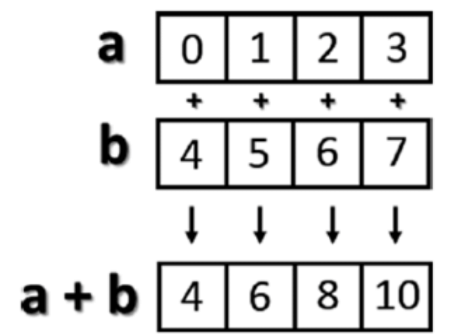
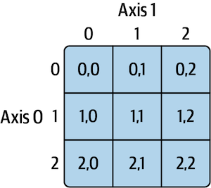

# NumPy Array Basics: Math Magic

**After this lesson:** you can explain NumPy Array Basics: Math Magic and try the examples in your own notebook.

### Video

_3Blue1Brown, Matrix multiplication as composition (Essence of linear algebra)_

## Overview

**Prerequisites:** [Introduction to NumPy](intro-numpy.md) and [What is an ndarray?](ndarray.md).

**Why this lesson:** **Vectorized** arithmetic and **broadcasting** are what make NumPy fast and concise. This page builds muscle memory for element-wise ops and shape rules before you tackle indexing and linear algebra.

## Arithmetic with Arrays

Ever wished you could do math on entire lists at once? With NumPy arrays, you can! This is called _vectorization_ - it's like having a calculator that works on all numbers simultaneously. Imagine you're:

* Calculating sales tax on thousands of prices
* Converting temperatures from Celsius to Fahrenheit
* Computing compound interest on multiple investments
* Scaling measurements from inches to centimeters

Instead of writing loops, NumPy lets you perform these operations in one go!

***

### Basic Math Operations

```python
import numpy as np

# Create a 2D array (think of it as a table of numbers)
arr = np.array([
    [1.0, 2.0, 3.0],  # First row
    [4.0, 5.0, 6.0]   # Second row
])

# Basic arithmetic operations
print("Original array:")
print(arr)

print("\nAddition (add 10 to everything):")
print(arr + 10)  # Every number gets 10 added to it

print("\nMultiplication (multiply everything by 2):")
print(arr * 2)   # Every number gets doubled

print("\nPower (square everything):")
print(arr ** 2)  # Every number gets squared

print("\nDivision (divide everything by 2):")
print(arr / 2)   # Every number gets halved

# More complex operations
print("\nSquare root of every number:")
print(np.sqrt(arr))

print("\nExponential (e^x) of every number:")
print(np.exp(arr))
```

```
Original array:
[[1. 2. 3.]
 [4. 5. 6.]]

Addition (add 10 to everything):
[[11. 12. 13.]
 [14. 15. 16.]]

Multiplication (multiply everything by 2):
[[ 2.  4.  6.]
 [ 8. 10. 12.]]

Power (square everything):
[[ 1.  4.  9.]
 [16. 25. 36.]]

Division (divide everything by 2):
[[0.5 1.  1.5]
 [2.  2.5 3. ]]

Square root of every number:
[[1.         1.41421356 1.73205081]
 [2.         2.23606798 2.44948974]]

Exponential (e^x) of every number:
[[  2.71828183   7.3890561   20.08553692]
 [ 54.59815003 148.4131591  403.42879349]]
```

Real-world example - Converting temperatures:

```python
# Temperatures in Celsius
celsius = np.array([0, 15, 30, 45])

# Convert to Fahrenheit: F = (C × 9/5) + 32
fahrenheit = (celsius * 9/5) + 32

print("Celsius:", celsius)
print("Fahrenheit:", fahrenheit)
```

```
Celsius: [ 0 15 30 45]
Fahrenheit: [ 32.  59.  86. 113.]
```

***

### How It Works

```
Original Array:     Operation:      Result:
┌─────────────┐     Multiply      ┌─────────────┐
│ 1  2  3     │       ×          │ 1  4  9     │
│ 4  5  6     │     itself       │ 16 25 36    │
└─────────────┘                   └─────────────┘
```



## Broadcasting: The Shape-Shifter

***

### What is Broadcasting?

It's NumPy's superpower to make arrays of different shapes work together! Think of it as NumPy automatically copying smaller arrays to match bigger ones.

```python
# Original 2D array
arr = np.array([
    [1.0, 2.0, 3.0],
    [4.0, 5.0, 6.0]
])

# Add [1, 1, 1] to each row
print(arr + np.array([1, 1, 1]))
# Result:
# [[2. 3. 4.]
#  [5. 6. 7.]]
```

```
[[2. 3. 4.]
 [5. 6. 7.]]
```

***

### Magic with Numbers

```python
arr1 = np.array([1, 2, 3, 4])

# Add 4 to everything
print(arr1 + 4)  # [5, 6, 7, 8]

# Square everything
print(arr1 ** 2)  # [1, 4, 9, 16]

# Divide 1 by everything
print(1 / arr1)  # [1.0, 0.5, 0.33, 0.25]
```

```
[5 6 7 8]
[ 1  4  9 16]
[1.         0.5        0.33333333 0.25      ]
```

***

### How Broadcasting Works

```
Array:     Number:     Result:
[1 2 3]  +    4    =  [1+4 2+4 3+4]
                      [5   6   7  ]

NumPy automatically turns 4 into [4 4 4]!
```

## Comparing Arrays

***

### Array Comparisons

```python
arr2 = np.array([[0.0, 4.0, 1.0],
                 [7.0, 2.0, 12.0]])

# Compare arrays
print(arr2 > arr)
# Result:
# [[False  True False]
#  [ True False  True]]
```

```
[[False  True False]
 [ True False  True]]
```

***

### Understanding the Result

```
Array 1:     Compare:    Array 2:     Result:
┌─────────┐     >      ┌─────────┐  ┌─────────┐
│ 1  2  3 │            │ 0  4  1 │  │ F  T  F │
│ 4  5  6 │            │ 7  2  12│  │ T  F  T │
└─────────┘            └─────────┘  └─────────┘
```

## Indexing and Slicing: Array Surgery

***

### Basic Indexing (1D Arrays)

```python
# Create array [0, 1, 2, 3, 4, 5, 6, 7, 8, 9]
arr = np.arange(10)

# Get single element
print(arr[5])      # 5

# Get a range
print(arr[5:8])    # [5 6 7]
```

```
5
[5 6 7]
```

***

### Changing Values

```python
# Change a range to 12
arr[5:8] = 12
print(arr)  # [0 1 2 3 4 12 12 12 8 9]

# Views share memory!
arr_slice = arr[5:8]
arr_slice[1] = 10
print(arr)  # [0 1 2 3 4 12 10 12 8 9]
```

```
[ 0  1  2  3  4 12 12 12  8  9]
[ 0  1  2  3  4 12 10 12  8  9]
```

***

### Understanding Slices

```
Index:  0  1  2  3  4  5  6  7  8  9
Array: [0, 1, 2, 3, 4, 5, 6, 7, 8, 9]
                     ↑        ↑
                   start     end
       arr[5:8] gets elements 5,6,7
```

## 2D array access (matrix indexing)

***

### Creating a 2D Array

```python
arr2d = np.array([
    [1, 2, 3],  # Row 0
    [4, 5, 6],  # Row 1
    [7, 8, 9]   # Row 2
])
```

***

### Getting Elements

```python
# Get a row
print(arr2d[1])     # [4 5 6]

# Get single element
print(arr2d[1, 2])  # 6 (row 1, column 2)
print(arr2d[1][2])  # Same thing!
```

```
[4 5 6]
6
6
```

***

### Slicing 2D Arrays

```python
# First two rows
print(arr2d[:2])
# [[1 2 3]
#  [4 5 6]]

# First two rows, skip first column
print(arr2d[:2, 1:])
# [[2 3]
#  [5 6]]
```

```
[[1 2 3]
 [4 5 6]]
[[2 3]
 [5 6]]
```

***

### Visual Guide

```
       Columns (axis 1)
       0   1   2
Rows  ┌───────────┐
(axis │ 1  2  3   │ Row 0
 0)   │ 4  5  6   │ Row 1
      │ 7  8  9   │ Row 2
      └───────────┘
```



**Pro Tips**:

* Use **:** to select everything in that dimension
* Remember: **\[row, column]** order
* Slices create views (changes affect original)
* Think of 2D arrays like spreadsheets!

## Common pitfalls

* **View side effects**: Assigning through a slice can change the parent array; use **.copy()** when you want an independent array.
* **Axis mix-ups**: **axis=0** aggregates down rows in many functions; say the shape out loud before you pick an axis.
* **Reshape without matching size**: Total elements must match; use **-1** in one dimension only when NumPy can infer it.

## Next steps

Continue to [Boolean indexing](boolean-indexing.md), then [ndarray methods](ndarray-methods.md).
