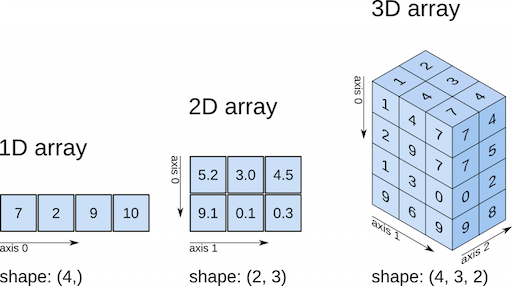

# NumPy Arrays: Your Data Superhero

**After this lesson:** you can explain the core ideas in “NumPy Arrays: Your Data Superhero” and reproduce the examples here in your own notebook or environment.

### Video

<div class="video-embed">
<iframe width="560" height="315" src="https://www.youtube.com/embed/QUT1VHiLmmI" frameborder="0" allow="accelerometer; autoplay; clipboard-write; encrypted-media; gyroscope; picture-in-picture" allowfullscreen></iframe>
</div>

*freeCodeCamp — Python NumPy tutorial for beginners*

## Overview

**Prerequisites:** [Introduction to NumPy](./intro-numpy.md) (why arrays exist) and comfort with Python lists.

**Why this lesson:** The **`ndarray`** is the concrete type behind “NumPy array.” Shape, dtype, and vectorized ops are the vocabulary for every numeric cell in this submodule.

## What is an ndarray?

Think of a NumPy array (ndarray) as a super-powered list that can work with numbers at lightning speed! It's like having a spreadsheet where every cell can do math instantly. The 'nd' in ndarray stands for 'N-dimensional', meaning it can handle data in multiple dimensions:

- 1D arrays: Like a line of numbers (vector)
- 2D arrays: Like a table (matrix)
- 3D arrays: Like a cube of numbers
- And beyond! (4D, 5D, etc.)

Real-world examples:

- 1D: Time series data (stock prices over time)
- 2D: Spreadsheet data (rows and columns)
- 3D: Image data (height × width × color channels)
- 4D: Video data (frames × height × width × color channels)

---

### Basic Example

```python
import numpy as np

# Create your first array
data = np.array([1.5, -0.1, 3])

# Watch the magic! 
print("Original data:", data)
print("Multiplied by 10:", data * 10)     # [15.0, -1.0, 30.0]
print("Added to itself:", data + data)     # [3.0, -0.2, 6.0]
print("Square root:", np.sqrt(abs(data)))  # Square root of absolute values

# Create a 2D array (matrix)
matrix = np.array([[1, 2, 3],
                  [4, 5, 6]])
print("\n2D array (matrix):")
print(matrix)
print("Shape:", matrix.shape)  # (2, 3) means 2 rows, 3 columns
```

```
Original data: [ 1.5 -0.1  3. ]
Multiplied by 10: [15. -1. 30.]
Added to itself: [ 3.  -0.2  6. ]
Square root: [1.22474487 0.31622777 1.73205081]

2D array (matrix):
[[1 2 3]
 [4 5 6]]
Shape: (2, 3)
```

---

### Why It's Cool

- Super fast calculations (100x faster than Python lists)
- Efficient memory use (contiguous memory blocks)
- Easy math operations (vectorized operations)
- Perfect for data science (integrates with pandas, scipy, etc.)
- Support for complex math (linear algebra, statistics)
- Broadcasting capabilities (work with arrays of different sizes)

## Understanding Arrays

---

### Array Anatomy

Think of an array like a container:

```
┌─────────────────────┐
│ 1.5  -0.1   3.0    │ <- All numbers same type
└─────────────────────┘
```

Key features:

- Fixed size (can't grow/shrink)
- All elements same type (like all integers or all floats)

---

### Important Properties

```python
# Shape tells you the size
print(data.shape)    # (3,) means 1D array with 3 elements

# dtype tells you the type
print(data.dtype)    # float64 means decimal numbers
```



## Creating Arrays

---

### 1D Arrays (Like a List)

```python
# From a list
simple_list = [6, 7.5, 8, 0, 1]
array_1d = np.array(simple_list)
print(array_1d)  # [6.  7.5  8.  0.  1. ]
```

```
[6.  7.5 8.  0.  1. ]
```

---

### 2D Arrays (Like a Table)

```python
# From nested lists
table_data = [
    [1, 2, 3, 4],  # First row
    [5, 6, 7, 8]   # Second row
]
array_2d = np.array(table_data)
print(array_2d)
```

```
[[1 2 3 4]
 [5 6 7 8]]
```

Looks like:

```
┌───────────────┐
│ 1  2  3  4    │ Row 1
│ 5  6  7  8    │ Row 2
└───────────────┘
```

---

### Checking Array Info

```python
print(array_2d.shape)   # (2, 4) means 2 rows, 4 columns
print(array_2d.dtype)   # int64 means whole numbers
print(array_2d.ndim)    # 2 means two-dimensional
```

```
(2, 4)
int64
2
```

## Quick Array Creation

---

### Special Arrays

```python
# Array of zeros
zeros = np.zeros(5)
print(zeros)  # [0. 0. 0. 0. 0.]

# 2D array of zeros
zeros_2d = np.zeros((3, 6))  # 3 rows, 6 columns
print(zeros_2d)
```

```
[0. 0. 0. 0. 0.]
[[0. 0. 0. 0. 0. 0.]
 [0. 0. 0. 0. 0. 0.]
 [0. 0. 0. 0. 0. 0.]]
```

---

### Controlling Data Types

```python
# Floating point numbers
floats = np.array([1, 2, 3], dtype=np.float64)
print(floats)  # [1. 2. 3.]

# Integers
ints = np.array([1, 2, 3], dtype=np.int32)
print(ints)    # [1 2 3]
```

```
[1. 2. 3.]
[1 2 3]
```

**Pro Tips**:

- Use **dtype** when you need specific number types
- 2D arrays are perfect for tables of data
- Check **shape** when you're unsure about array size

## Data types

Data types provide a mapping directly onto an underlying disk or memory representation. The numerical data types are named the same way: a type name, like `float` or `int`, followed by a number indicating the number of bits per element. A standard double-precision floating point value (what's used under the hood in Python's `float` object) takes up 8 bytes or 64 bits. Thus, this type is known in Numpy as `float64`. See the following table for a list of the numerical data types.

| Data type                         | Type code    | Description                                                                                                            |
| --------------------------------- | ------------ | ---------------------------------------------------------------------------------------------------------------------- |
| int8, uint8                       | i1, u1       | Signed and unsigned 8-bit (1 byte) integer types                                                                       |
| int16, uint16                     | i2, u2       | Signed and unsigned 16-bit integer types                                                                               |
| int32, uint32                     | i4, u4       | Signed and unsigned 32-bit integer types                                                                               |
| int64, uint64                     | i8, u8       | Signed and unsigned 64-bit integer types                                                                               |
| float16                           | f2           | Half-precision floating point                                                                                          |
| float32                           | f4 or f      | Standard single-precision floating point. Compatible with C float                                                      |
| float64                           | f8 or d      | Standard double-precision floating point. Compatible with C double and Python float object                             |
| float128                          | f16 or g     | Extended-precision floating point                                                                                      |
| complex64, complex128, complex256 | c8, c16, c32 | Complex numbers represented by two 32, 64, or 128 floats, respectively                                                 |
| bool                              | ?            | Boolean type storing True and False values                                                                             |
| object                            | O            | Python object type                                                                                                     |
| string\_                          | S            | Fixed-length ASCII string type (1 byte per character). For example, to create a string dtype with length 10, use 'S10' |
| unicode\_                         | U            | Fixed-length Unicode type (number of bytes platform specific). Same specification semantics as string\_ (e.g., 'U10')  |

You can explicitly convert or cast an array from one dtype to another using the `astype` method.

```python
arr = np.array([1, 2, 3, 4, 5])
arr.dtype
```

```
int64
```

```python
float_arr = arr.astype(np.float64)
float_arr
```

```
[1. 2. 3. 4. 5.]
```

```python
float_arr.dtype
```

```
float64
```

If you cast some floating-point numbers to be of integer dtype, the decimal part will be truncated.

```python
arr = np.array([3.7, -1.2, -2.6, 0.5, 12.9, 10.1])
arr.astype(np.int32)
```

```
[ 3 -1 -2  0 12 10]
```

You can also convert strings representing numbers to numeric form.

```python
numeric_strings = np.array(["1.25", "-9.6", "42"], dtype=np.string_)
numeric_strings.astype(float)
```

If you write `float` instead of `np.float64`, Numpy will guess the data type for you.

## Common pitfalls

- **Silent overflow** — Integer dtypes wrap instead of raising errors; use **float64** or check ranges for big numbers.
- **astype truncates** — Casting floats to integers drops the fractional part; it does not round unless you do so explicitly.
- **Object dtype** — Arrays of Python objects lose NumPy speed; only use when you truly need heterogeneous data.

## Next steps

Continue to [ndarray basics: creation and operations](./ndarray-basic.md), then [Boolean indexing](./boolean-indexing.md) in this submodule.
