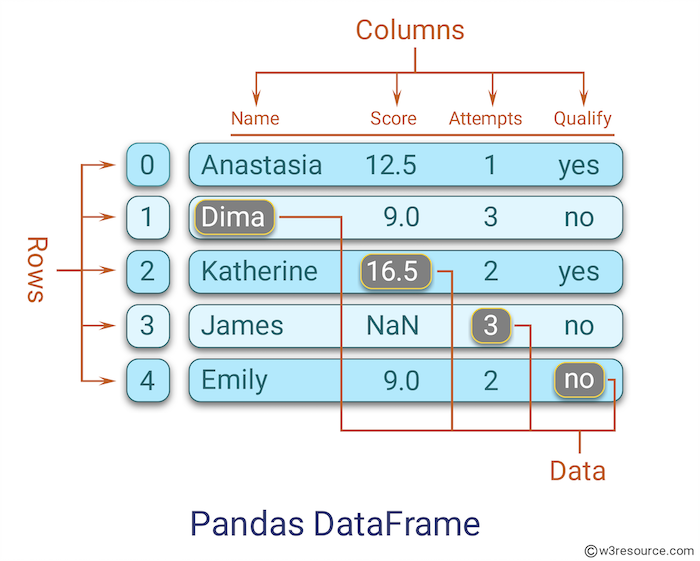

# Understanding DataFrames

**After this lesson:** you can explain Understanding DataFrames and try the examples in your own notebook.

### Video

_Corey Schafer, Python pandas tutorial (part 2): DataFrame and Series basics_

## Overview

**Prerequisites:** [Introduction to Python](../1.2-intro-python/), [NumPy basics](../1.4-data-foundation-linear-algebra/intro-numpy.md), and ideally [Series](series.md) (a DataFrame is a collection of aligned Series).

**Why this lesson:** The **DataFrame** is the main table structure you will use for rows and columns. Understanding construction, dtypes, and index early prevents silent bugs when you merge, group, and plot later.

## What is a DataFrame?

Think of a DataFrame as an Excel spreadsheet in Python! It's a 2-dimensional table with rows and columns, where each column can hold different types of data (numbers, text, dates, etc.). DataFrames are perfect for:

* Analyzing structured data (sales records, customer info)
* Time series analysis (stock prices, weather data)
* Data cleaning and preparation
* Complex data analysis and statistics

Real-world applications:

* Sales analytics
* Financial reporting
* Customer demographics analysis
* Survey data analysis
* Medical research data



***

### Creating Your First DataFrame

we will look at different ways to create a DataFrame:

**Build from dict, list of dicts, and ndarray**

* **Purpose:** See the three most common constructors: column dict (rows align by position), list of row dicts, and `DataFrame(array, columns=..., index=...)`.
* **Walkthrough:** `student_data` uses mixed dtypes; `transactions` shows ragged keys; `df_array` wires column names and a string index.

```python
import pandas as pd
import numpy as np

# 1. From a dictionary
student_data = {
    "Name": ["Alice", "Bob", "Charlie"],
    "Age": [20, 22, 21],
    "Grade": [85, 92, 78],
    "Pass": [True, True, False]
}
df = pd.DataFrame(student_data)
print("Student Database:")
print(df)
print("\nDataFrame Info:")
print(df.info())  # Shows data types and missing values

# 2. From a list of dictionaries
transactions = pd.DataFrame([
    {"date": "2023-01-01", "item": "Laptop", "price": 1200},
    {"date": "2023-01-02", "item": "Mouse", "price": 25},
    {"date": "2023-01-02", "item": "Keyboard", "price": 100}
])
print("\nTransaction Records:")
print(transactions)

# 3. From a NumPy array
array_data = np.random.rand(3, 2)  # 3 rows, 2 columns of random numbers
df_array = pd.DataFrame(array_data,
                       columns=['Value 1', 'Value 2'],
                       index=['Row 1', 'Row 2', 'Row 3'])
print("\nFrom NumPy Array:")
print(df_array)
```

```
Student Database:
      Name  Age  Grade   Pass
0    Alice   20     85   True
1      Bob   22     92   True
2  Charlie   21     78  False

DataFrame Info:
<class 'pandas.DataFrame'>
RangeIndex: 3 entries, 0 to 2
Data columns (total 4 columns):
 #   Column  Non-Null Count  Dtype
---  ------  --------------  -----
 0   Name    3 non-null      str
 1   Age     3 non-null      int64
 2   Grade   3 non-null      int64
 3   Pass    3 non-null      bool
dtypes: bool(1), int64(2), str(1)
memory usage: 207.0 bytes
None

Transaction Records:
         date      item  price
0  2023-01-01    Laptop   1200
1  2023-01-02     Mouse     25
2  2023-01-02  Keyboard    100

From NumPy Array:
        Value 1   Value 2
Row 1  0.843934  0.379260
Row 2  0.734470  0.583539
Row 3  0.023364  0.401598
```

Notice how Pandas automatically adds numbered row labels (0, 1, 2) called the index!

***

### Understanding DataFrame Structure

A DataFrame has several key components:

1. **Columns**: Named fields (like "Name", "Age", "Grade")
2. **Index**: Row labels (0, 1, 2 by default)
3. **Values**: The actual data

Check these components:

**Inspect columns, index, shape**

* **Purpose:** Name the three structural pieces (`columns`, `index`, `values` layout) using `df` from the previous block.
* **Walkthrough:** `df.columns.tolist()`, `df.index.tolist()`, `df.shape`.

```python
# Column names
print("Columns:", df.columns.tolist())

# Index
print("Index:", df.index.tolist())

# Shape (rows, columns)
print("Shape:", df.shape)
```

```
Columns: ['Name', 'Age', 'Grade', 'Pass']
Index: [0, 1, 2]
Shape: (3, 4)
```

## Basic DataFrame Operations

***

### Viewing Your Data

Pandas provides several ways to peek at your data:

**Head, info, describe**

* **Purpose:** Standard EDA trio, preview rows, schema/missing counts, and numeric summaries.
* **Walkthrough:** `head(2)`, `info()`, `describe()` (numeric columns by default).

```python
# View first few rows
print("First 2 rows:")
print(df.head(2))

# View basic information
print("\nDataFrame Info:")
print(df.info())

# View quick statistics
print("\nNumerical Statistics:")
print(df.describe())
```

```
First 2 rows:
    Name  Age  Grade  Pass
0  Alice   20     85  True
1    Bob   22     92  True

DataFrame Info:
<class 'pandas.DataFrame'>
RangeIndex: 3 entries, 0 to 2
Data columns (total 4 columns):
 #   Column  Non-Null Count  Dtype
---  ------  --------------  -----
 0   Name    3 non-null      str
 1   Age     3 non-null      int64
 2   Grade   3 non-null      int64
 3   Pass    3 non-null      bool
dtypes: bool(1), int64(2), str(1)
memory usage: 207.0 bytes
None

Numerical Statistics:
        Age  Grade
count   3.0    3.0
mean   21.0   85.0
std     1.0    7.0
min    20.0   78.0
25%    20.5   81.5
50%    21.0   85.0
75%    21.5   88.5
max    22.0   92.0
```

***

### Accessing Columns

You can access columns in two ways:

1. Dictionary-style with square brackets
2. Attribute-style with dot notation

**Bracket vs dot, and multi-column selection**

* **Purpose:** Select one column as a Series (`df['Name']`), use dot syntax when the name is a valid identifier, and pass a **list** for a sub-DataFrame.
* **Walkthrough:** `df[['Name', 'Grade']]` keeps two columns, note the double brackets.

```python
# Get the 'Name' column
print("Using square brackets:")
print(df['Name'])

print("\nUsing dot notation:")
print(df.Name)

# Get multiple columns
print("\nMultiple columns:")
print(df[['Name', 'Grade']])
```

```
Using square brackets:
0      Alice
1        Bob
2    Charlie
Name: Name, dtype: str

Using dot notation:
0      Alice
1        Bob
2    Charlie
Name: Name, dtype: str

Multiple columns:
      Name  Grade
0    Alice     85
1      Bob     92
2  Charlie     78
```

***

### Adding and Modifying Data

You can easily add or modify columns:

**Derived column and in-place update**

* **Purpose:** Add a boolean column from a condition and broadcast arithmetic across a column (`df['Age'] + 1`).
* **Walkthrough:** `df['Pass'] = df['Grade'] >= 80` evaluates element-wise; reassignment replaces the `Age` column.

```python
# Add a new column
df['Pass'] = df['Grade'] >= 80
print("Added Pass/Fail column:")
print(df)

# Modify existing column
df['Age'] = df['Age'] + 1
print("\nAfter increasing everyone's age:")
print(df)
```

```
Added Pass/Fail column:
      Name  Age  Grade   Pass
0    Alice   20     85   True
1      Bob   22     92   True
2  Charlie   21     78  False

After increasing everyone's age:
      Name  Age  Grade   Pass
0    Alice   21     85   True
1      Bob   23     92   True
2  Charlie   22     78  False
```

## Working with Rows

***

### Accessing Rows

Use `loc` for label-based indexing or `iloc` for position-based indexing:

**`iloc` vs `loc` on rows**

* **Purpose:** Contrast **integer position** (`iloc[0]`) with **label** (`loc[1]` on the default `RangeIndex`).
* **Walkthrough:** After prior edits, row `0` is Alice and label `1` is Bob.

```python
# Get row by position using iloc
print("First row:")
print(df.iloc[0])

# Get row by label using loc
print("\nRow with index 1:")
print(df.loc[1])
```

```
First row:
Name     Alice
Age         21
Grade       85
Pass      True
Name: 0, dtype: object

Row with index 1:
Name      Bob
Age        23
Grade      92
Pass     True
Name: 1, dtype: object
```

***

### Filtering Rows

You can filter rows based on conditions:

**Boolean masks and `&`**

* **Purpose:** Filter with one condition and combine conditions with `&` (parentheses required).
* **Walkthrough:** `df['Grade'] >= 80` returns a Series of booleans aligned to rows; `(cond1) & (cond2)` intersects masks.

```python
# Get all students who passed
passing_students = df[df['Grade'] >= 80]
print("Passing students:")
print(passing_students)

# Multiple conditions
good_grades_young = df[(df['Grade'] >= 85) & (df['Age'] < 22)]
print("\nYoung students with good grades:")
print(good_grades_young)
```

```
Passing students:
    Name  Age  Grade  Pass
0  Alice   21     85  True
1    Bob   23     92  True

Young students with good grades:
    Name  Age  Grade  Pass
0  Alice   21     85  True
```

## Handling Missing Data

***

### Understanding Missing Values

Real-world data often has missing values (shown as `NaN` in Pandas):

**DataFrame with `None` / NaN cells**

* **Purpose:** See missing values in a table, not just a Series, and how pandas displays them as `NaN`.
* **Walkthrough:** `None` in `Age`/`Grade` becomes float NaN in the printed frame.

```python
# Create DataFrame with missing data
student_data = pd.DataFrame({
    'Name': ['Alice', 'Bob', 'Charlie'],
    'Age': [20, None, 21],
    'Grade': [85, 92, None]
})
print(student_data)
```

```
      Name   Age  Grade
0    Alice  20.0   85.0
1      Bob   NaN   92.0
2  Charlie  21.0    NaN
```

***

### Dealing with Missing Values

Pandas provides several ways to handle missing data:

**Column-wise counts, dropna, fillna**

* **Purpose:** Quantify missingness per column, optionally drop incomplete rows, or impute a constant.
* **Walkthrough:** `isna().sum()` aggregates booleans; `dropna()` removes any row with a NaN; `fillna(0)` is a blunt default, use domain-appropriate fills in practice.

```python
# Check for missing values
print("Missing values in each column:")
print(student_data.isna().sum())

# Drop rows with any missing values
print("\nDrop rows with missing values:")
print(student_data.dropna())

# Fill missing values
print("\nFill missing values with 0:")
print(student_data.fillna(0))
```

```
Missing values in each column:
Name     0
Age      1
Grade    1
dtype: int64

Drop rows with missing values:
    Name   Age  Grade
0  Alice  20.0   85.0

Fill missing values with 0:
      Name   Age  Grade
0    Alice  20.0   85.0
1      Bob   0.0   92.0
2  Charlie  21.0    0.0
```

## Best Practices and Tips

1. **Start Simple**: Begin with a small DataFrame while learning
2. **Check Your Data**:
   * Use `info()` to see data types and missing values
   * Use `describe()` for numerical summaries
   * Use `head()` to preview your data
3. **Keep Track of Changes**:
   * Make copies before big changes: `df_backup = df.copy()`
   * Chain operations thoughtfully
4. **Handle Missing Data Early**:
   * Decide on a strategy (drop or fill)
   * Document your decisions

## Common Gotchas to Avoid

1. **Chained Indexing**: Avoid `df['column'][condition]`, use `df.loc[condition, 'column']` instead
2. **Copy vs View**: Be aware when you're working with a view vs a copy of your data
3. **Missing Data**: Don't forget to check for and handle missing values
4. **Data Types**: Make sure columns have the correct data types for your analysis

Remember: DataFrames are powerful tools for data analysis. Take time to experiment with these examples and you'll be a Pandas pro in no time!

## Next steps

Continue to [Data types and index](data-types-index.md) to control dtypes and labels, then follow the submodule lessons in [Data analysis with pandas](./).
