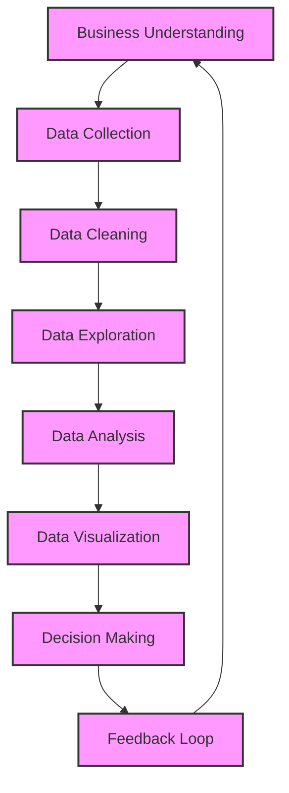
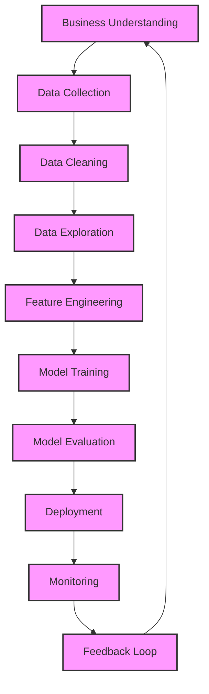

# Workflows and Lifecycle

## Data Analytics Lifecycle

The Data Analytics Lifecycle is a structured approach that guides the process of analyzing data to derive meaningful insights. It consists of several key stages that ensure a comprehensive understanding of the data and its implications for decision-making.

### Description

1. **Business Understanding**: Define the objectives and requirements of the project to ensure alignment with business goals.
2. **Data Collection**: Gather relevant data from various sources, ensuring it is sufficient for analysis.
3. **Data Cleaning**: Process the collected data to remove inaccuracies, duplicates, and irrelevant information.
4. **Data Exploration**: Analyze the data to understand its structure, patterns, and relationships through descriptive statistics and visualizations.
5. **Data Analysis**: Apply statistical and machine learning techniques to extract insights and make predictions.
6. **Data Visualization**: Create visual representations of the data and analysis results to communicate findings effectively.
7. **Decision Making**: Use the insights gained to inform business decisions and strategies.
8. **Feedback Loop**: Gather feedback on the outcomes and refine the process for future analyses.

## Data Science Lifecycle

The Data Science Lifecycle is a structured approach that guides the process of developing and delivering data science projects.

### Description

1. **Business Understanding**: Define the objectives and requirements of the project to ensure alignment with business goals.
2. **Data Collection**: Gather relevant data from various sources, ensuring it is sufficient for analysis.
3. **Data Cleaning**: Process the collected data to remove inaccuracies, duplicates, and irrelevant information.
4. **Data Exploration**: Analyze the data to understand its structure, patterns, and relationships through descriptive statistics and visualizations.
5. **Feature Engineering**: Create new features or modify existing ones to improve model performance.
6. **Model Training**: Apply machine learning algorithms to train models using the prepared dataset.
7. **Model Evaluation**: Assess the model's performance using appropriate metrics and validation techniques.
8. **Deployment**: Implement the trained model in a production environment for real-world use.
9. **Monitoring**: Continuously track the model's performance and behavior in production.
10. **Feedback Loop**: Gather feedback on the outcomes and refine the process for future projects.
