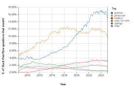
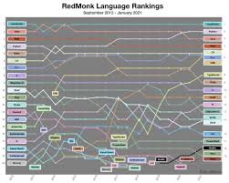

# Introduction to Python

## Overview

Python is a high-level, interpreted, and general-purpose programming language. It is known for its simplicity and readability, which makes it an excellent choice for beginners. Python is also versatile and can be used for a wide range of applications, including web development, data analysis, artificial intelligence, and scientific computing.

Python is consistently ranked in the top 3 most popular programming language (according to rankings suchs as the TIOBE Index, the PYPL Popularity of Programming Language Index and others). It is widely used by companies such as Google, Facebook, Instagram, Spotify, and Netflix.

 

## History

Python was created by Guido van Rossum, a Dutch programmer, in the late 1980s. The language was named after the British comedy group Monty Python, not the snake. Python was designed to be easy to read and write, with a clean and simple syntax.

The first version of Python, Python 0.9.0, was released in 1991. Since then, Python has evolved into a powerful and popular programming language.

## Advantages

Python has several advantages that make it a popular choice among programmers:

- **Simplicity**: Python is easy to learn and use, with a clean and simple syntax that makes it easy to read and write code.
- **Versatility**: Python can be used for a wide range of applications, from web development to scientific computing.
- **Community**: Python has a large and active community of developers who contribute to the language and provide support to beginners.
- **Libraries**: Python has a rich ecosystem of libraries and frameworks that make it easy to build complex applications.

However, Python is not without its drawbacks. It is slower than some other programming languages, such as C and C++, and may not be the best choice for performance-critical applications. Despite this, Python's simplicity, versatility, and community support make it an excellent choice for beginners and experienced programmers alike.
