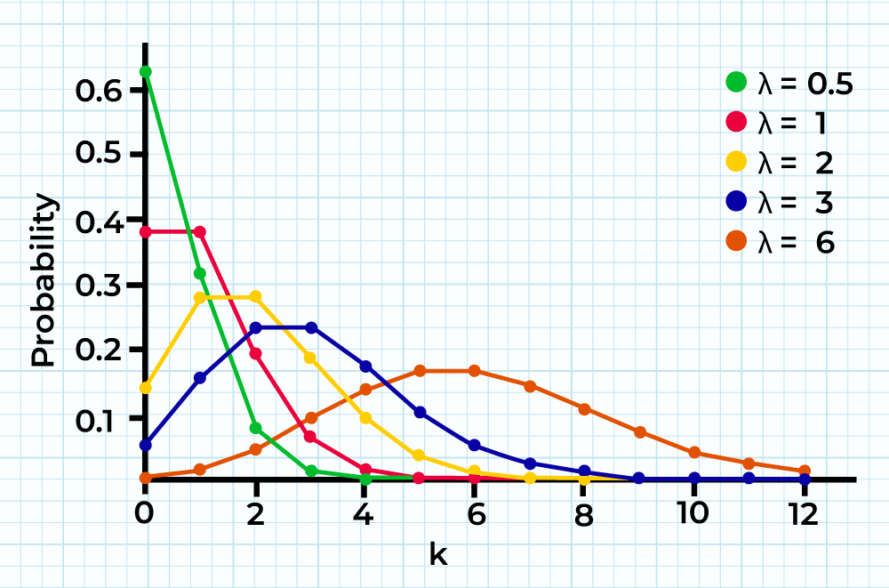

# Probability Distribution Families

A **probability distribution family** is a way to model a group of situations that show similar predictable patterns. Each distribution family has a specific set of conditions to model different types of situations.

- **Outcome of interest**: The specific outcome for which we calculate the probability, usually denoted by \(k\).
- **Parameter**: A value that connects the probability distribution to a specific situation and determines how to adjust the distribution.

A **probability distribution function** is a formula that calculates the probability of an outcome based on the situation's parameters.

## Binomial Distribution

### Definition:

The **binomial distribution** models the number of successes in a series of independent yes/no experiments (trials) with a constant probability of success.

- **Trial**: A single independent experiment with two possible outcomes (success/failure).
- **\( n \)**: Total number of trials.
- **\( p \)**: Probability of success in each trial.
- **\( k \)**: The number of successes we are interested in.

### Binomial Probability Formula:

The probability of exactly \(k\) successes in \(n\) independent trials is given by:
\[
P(X = k) = \binom{n}{k} p^k (1 - p)^{n - k}
\]
where \( \binom{n}{k} \) is the binomial coefficient:
\[
\binom{n}{k} = \frac{n!}{k!(n - k)!}
\]

### Mean and Variance of a Binomial Distribution:

- **Mean (Expected Value)**:
  \[
  \mu = n \cdot p
  \]
- **Variance**:
  \[
  \sigma^2 = n \cdot p \cdot (1 - p)
  \]

## Poisson Distribution

### Definition:

The **Poisson distribution** models the probability of a given number of events occurring in a fixed interval of time or space, assuming that these events happen at a known constant average rate and independently of the time since the last event.

- **\( \lambda \)**: The average rate of events in a given interval (also the mean of the distribution).

### Poisson Probability Formula:

The probability of observing \(k\) events in an interval is given by:
\[
P(X = k) = \frac{\lambda^k e^{-\lambda}}{k!}
\]

### Properties of the Poisson Distribution:

- **Mean**:
  \[
  \mu = \lambda
  \]
- **Variance**:
  \[
  \sigma^2 = \lambda
  \]

### Conditions for Using Poisson Distribution:

1. The random variable is discrete.
2. There is a known average success rate in a fixed interval.
3. The events are independent.
4. The occurrence of one event does not affect the probability of another event occurring.

## Normal Distribution

### Definition:

The **normal distribution** is a continuous probability distribution that is symmetrical and bell-shaped. It is often used to model real-world phenomena such as heights, weights, and test scores.

- **\( \mu \)**: Mean of the distribution.
- **\( \sigma \)**: Standard deviation, which determines the spread of the distribution.

### Probability Density Function (PDF) of Normal Distribution:

The probability density function of a normal distribution is:
\[
f(x) = \frac{1}{\sigma \sqrt{2\pi}} e^{-\frac{(x - \mu)^2}{2\sigma^2}}
\]

### Properties of the Normal Distribution:

- The curve is symmetric about the mean \( \mu \).
- The total area under the curve is 1.
- The mean \( \mu \) and standard deviation \( \sigma \) define the shape of the distribution.

### Standard Normal Distribution:

A **standard normal distribution** is a special case of the normal distribution with a mean of 0 and a standard deviation of 1. Values from any normal distribution can be converted to the standard normal distribution using the **Z-score**:
\[
Z = \frac{X - \mu}{\sigma}
\]

### The Empirical Rule (68-95-99.7 Rule):

- **68%** of data lies within 1 standard deviation of the mean.
- **95%** of data lies within 2 standard deviations of the mean.
- **99.7%** of data lies within 3 standard deviations of the mean.

## Z-Scores and Cumulative Probabilities

### Z-Score:

A Z-score indicates how many standard deviations a specific value \(X\) is from the mean:
\[
Z = \frac{X - \mu}{\sigma}
\]

### Z-Table:

The **Z-table** provides cumulative probabilities for standard normal distributions. It helps in calculating the probability that a random variable will take a value less than or equal to \(Z\).

## Central Limit Theorem (CLT)

The **Central Limit Theorem** states that the distribution of sample means from a population will tend to be normally distributed, regardless of the population’s original distribution, provided that the sample size is large enough.

### Application of CLT

This theorem is foundational for many statistical techniques, particularly in hypothesis testing and confidence intervals.
