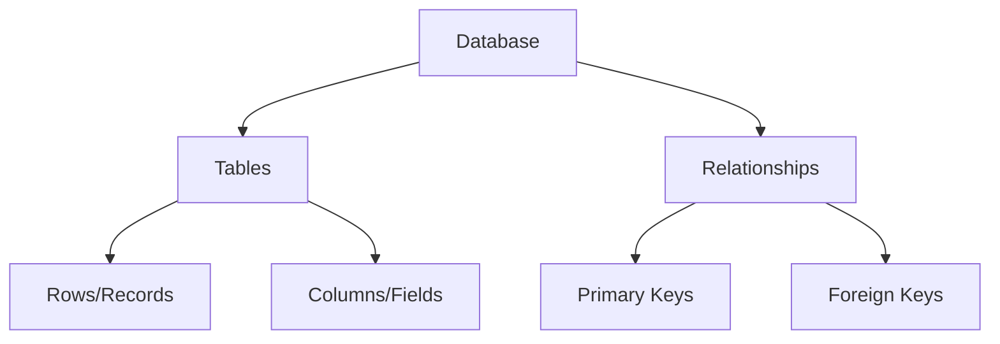

# Data Querying with SQL: Your Gateway to Data Mastery 🎯

Welcome to the fascinating world of SQL! Imagine having a conversation with your data - that's exactly what SQL allows you to do. Whether you're analyzing customer behavior, tracking business metrics, or uncovering hidden patterns, SQL is your trusted companion in the data journey.

## Learning Objectives 🎯

By the end of this module, you will be able to:

1. Master the fundamentals of relational databases and SQL
2. Craft elegant SQL queries from basic to advanced levels
3. Apply industry-standard SQL best practices
4. Design complex data operations using joins and subqueries
5. Optimize queries for lightning-fast performance

## Why SQL Matters 💡

In today's data-driven world, SQL is more relevant than ever:

- **Universal Language**: SQL is the de facto standard for data manipulation
- **Career Essential**: 90% of Fortune 500 companies use SQL databases
- **Powerful Analysis**: Process millions of records in seconds
- **Data Integration**: Connect and combine data from multiple sources

## Module Overview 📚

### 1. Introduction to Databases


- Relational Database Management Systems (RDBMS)
- Database schema design
- Keys and relationships
- SQL data types and constraints

### 2. Basic SQL Operations
Example query:
```sql
SELECT first_name, last_name, salary
FROM employees
WHERE department = 'Sales'
ORDER BY salary DESC
LIMIT 5;
```

### 3. Aggregations and Grouping
Performance consideration:
$T_{query} = O(n \log n)$ for sorted aggregations

### 4. Joins and Relationships
Visual representation:
```
Table A    JOIN    Table B
┌───┐      ⋈      ┌───┐
│   │ ──────────► │   │
└───┘             └───┘
```

### 5. Advanced SQL Concepts
Query optimization formula:
$Cost = I/O + CPU + Memory$

## Prerequisites 📋

Before starting this journey, ensure you have:

- Basic understanding of data structures
- Familiarity with database concepts
- DBeaver or similar SQL client installed

## Tools Required 🛠️

1. **DBeaver** - Universal database tool
   - Easy-to-use interface
   - Multi-platform support
   - Visual query builder

2. **Sample Database** - Northwind database
   - Real-world business scenario
   - Complex relationships
   - Rich dataset for practice

## Best Practices 🌟

1. **Query Writing**
   - Use meaningful aliases
   - Indent for readability
   - Comment complex logic

2. **Performance**
   - Index key columns
   - Avoid SELECT *
   - Use appropriate data types

## Resources 📚

### Official Documentation
- [PostgreSQL Documentation](https://www.postgresql.org/docs/)
- [SQL Style Guide](https://www.sqlstyle.guide/)

### Practice Platforms
- LeetCode SQL Problems
- HackerRank SQL Challenges
- SQL Zoo Interactive Tutorials

### Books
- "SQL Performance Explained"
- "SQL Antipatterns"

## Assignment 📝

Ready to test your SQL skills? Head over to the [SQL Assignment](../_assignments/2.1-assignment.md) to apply what you've learned!

## What's Next? 🚀

Get ready to embark on an exciting journey into the world of data querying! We'll start with the basics and gradually move to advanced concepts, with plenty of hands-on exercises along the way.

Remember: "Data is the new oil, and SQL is the drill!"

Let's dive in and master SQL together! 💪
