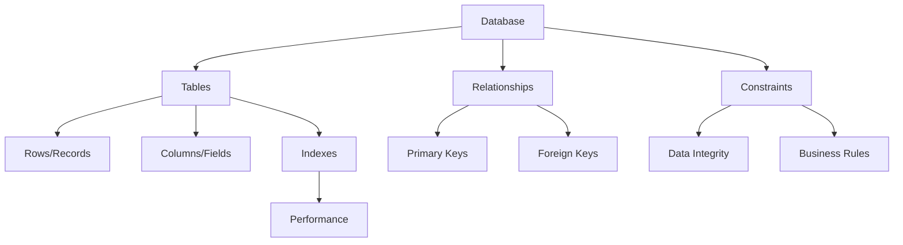
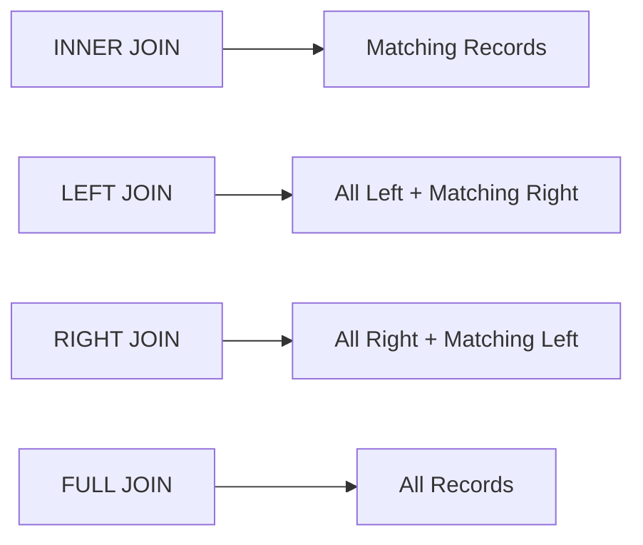

# Data Querying with SQL: Your Gateway to Data Mastery

Welcome to the fascinating world of SQL! Imagine having a conversation with your data - that's exactly what SQL allows you to do. Whether you're analyzing customer behavior, tracking business metrics, or uncovering hidden patterns, SQL is your trusted companion in the data journey.

Think of SQL as a universal language for data - just like how English helps people from different countries communicate, SQL helps different systems and people work with data in a standardized way. It's like having a Swiss Army knife for data manipulation: one tool that can slice, dice, filter, combine, and analyze data in countless ways.

For example, with a single SQL query, you can:

- Find your top 10 customers by revenue
- Calculate month-over-month growth rates
- Identify products frequently bought together
- Track user engagement patterns
- Generate complex business reports

And the best part? The same SQL query will work whether you're dealing with 100 records or 100 million records!

## Learning Objectives

By the end of this module, you will be able to:

1. Master the fundamentals of relational databases and SQL
   - Understand database architecture and design principles
   - Work with tables, schemas, and relationships
   - Handle different data types and constraints effectively

2. Craft elegant SQL queries from basic to advanced levels
   - Write clear, maintainable SELECT statements
   - Filter and sort data with precision
   - Perform calculations and data transformations
   - Master subqueries and CTEs

3. Apply industry-standard SQL best practices
   - Follow naming conventions and style guides
   - Write self-documenting code
   - Implement error handling
   - Ensure data integrity

4. Design complex data operations using joins and subqueries
   - Combine data from multiple tables efficiently
   - Write sophisticated nested queries
   - Use window functions for advanced analytics
   - Handle hierarchical data structures

5. Optimize queries for lightning-fast performance
   - Understand query execution plans
   - Use indexes effectively
   - Write efficient joins
   - Implement caching strategies

## Why SQL Matters

In today's data-driven world, SQL is more relevant than ever:

- **Universal Language**: SQL is the de facto standard for data manipulation
  - Used across industries and platforms
  - Consistent syntax and principles
  - Huge community and resources
  - Easy to learn, powerful to master

- **Career Essential**: 90% of Fortune 500 companies use SQL databases
  - Required skill for data analysts
  - Essential for business intelligence
  - Key for software development
  - Valuable for project management

- **Powerful Analysis**: Process millions of records in seconds
  - Efficient data processing
  - Complex calculations
  - Real-time analytics
  - Scalable solutions

- **Data Integration**: Connect and combine data from multiple sources
  - Merge data from different systems
  - Create unified views
  - Ensure data consistency
  - Enable cross-system analysis

Consider this real-world scenario:

```sql
-- A single query that provides valuable business insights
SELECT 
    c.customer_segment,
    COUNT(DISTINCT o.customer_id) as num_customers,
    ROUND(AVG(o.total_amount), 2) as avg_order_value,
    SUM(o.total_amount) as total_revenue,
    COUNT(o.order_id) / COUNT(DISTINCT o.customer_id) as orders_per_customer
FROM orders o
JOIN customer_segments c ON o.customer_id = c.customer_id
WHERE o.order_date >= CURRENT_DATE - INTERVAL '30 days'
GROUP BY c.customer_segment
ORDER BY total_revenue DESC;

/* Output:
customer_segment | num_customers | avg_order_value | total_revenue | orders_per_customer
----------------|---------------|-----------------|---------------|--------------------
Premium         | 1250          | 185.50          | 580,937.50    | 2.5
Standard        | 3500          | 75.25           | 395,062.50    | 1.5
Basic           | 5250          | 45.75           | 240,187.50    | 1.0
*/
```

This single query tells us:

- Which customer segments are most valuable
- Average spending patterns
- Customer engagement levels
- Revenue distribution

## Module Overview

### 1. Introduction to Databases



Learn the building blocks of databases:

- **RDBMS Fundamentals**
  - PostgreSQL, MySQL, Oracle
  - Client-server architecture
  - ACID properties
  - Transaction management

- **Schema Design**
  - Normalization principles
  - Entity relationships
  - Data modeling best practices
  - Performance considerations

- **Data Types & Constraints**

  ```sql
  CREATE TABLE products (
      product_id SERIAL PRIMARY KEY,
      name VARCHAR(100) NOT NULL,
      price DECIMAL(10,2) CHECK (price >= 0),
      created_at TIMESTAMP DEFAULT CURRENT_TIMESTAMP,
      category_id INT REFERENCES categories(id)
  );
  ```

### 2. Basic SQL Operations

Master the fundamental operations with practical examples:

```sql
-- Find top-selling products this month
SELECT 
    p.product_name,
    SUM(oi.quantity) as units_sold,
    SUM(oi.quantity * oi.price) as revenue,
    COUNT(DISTINCT o.customer_id) as unique_buyers
FROM products p
JOIN order_items oi ON p.product_id = oi.product_id
JOIN orders o ON oi.order_id = o.order_id
WHERE o.order_date >= DATE_TRUNC('month', CURRENT_DATE)
GROUP BY p.product_id, p.product_name
HAVING SUM(oi.quantity) > 0
ORDER BY units_sold DESC
LIMIT 5;

/* Output:
product_name    | units_sold | revenue  | unique_buyers
----------------|------------|----------|---------------
iPhone 13       | 250        | 250000   | 245
AirPods Pro     | 180        | 43200    | 178
MacBook Pro     | 75         | 150000   | 75
iPad Air        | 65         | 45500    | 63
Apple Watch     | 60         | 24000    | 58
*/
```

### 3. Aggregations and Grouping

Transform raw data into actionable insights:

```sql
-- Customer cohort analysis
WITH cohort_data AS (
    SELECT 
        DATE_TRUNC('month', first_order_date) as cohort_month,
        COUNT(DISTINCT customer_id) as cohort_size,
        SUM(total_spent) as total_revenue,
        AVG(orders_count) as avg_orders
    FROM customer_metrics
    GROUP BY DATE_TRUNC('month', first_order_date)
)
SELECT 
    cohort_month,
    cohort_size,
    ROUND(total_revenue/cohort_size, 2) as revenue_per_customer,
    ROUND(avg_orders, 1) as avg_orders_per_customer
FROM cohort_data
ORDER BY cohort_month DESC;
```

Performance consideration:
$T_{query} = O(n \log n)$ for sorted aggregations
$T_{memory} = O(k)$ where k = number of groups

### 4. Joins and Relationships

Master the art of combining data:



Example of complex joins:

```sql
-- Customer order history with product details
WITH customer_orders AS (
    SELECT 
        c.customer_id,
        c.name as customer_name,
        o.order_id,
        o.order_date,
        p.product_name,
        oi.quantity,
        oi.price as unit_price,
        oi.quantity * oi.price as total_amount
    FROM customers c
    LEFT JOIN orders o ON c.customer_id = o.customer_id
    LEFT JOIN order_items oi ON o.order_id = oi.order_id
    LEFT JOIN products p ON oi.product_id = p.product_id
)
SELECT 
    customer_name,
    COUNT(DISTINCT order_id) as total_orders,
    SUM(total_amount) as total_spent,
    STRING_AGG(DISTINCT product_name, ', ') as products_bought
FROM customer_orders
GROUP BY customer_id, customer_name
HAVING COUNT(DISTINCT order_id) > 0;
```

### 5. Advanced SQL Concepts

Take your SQL skills to the next level:

1. **Query Optimization**

   ```sql
   EXPLAIN ANALYZE
   SELECT /*+ INDEX(orders idx_order_date) */
       DATE_TRUNC('month', order_date) as month,
       COUNT(*) as order_count,
       SUM(total_amount) as revenue
   FROM orders
   WHERE order_date >= CURRENT_DATE - INTERVAL '1 year'
   GROUP BY DATE_TRUNC('month', order_date);
   ```

2. **Window Functions**

   ```sql
   SELECT 
       category_name,
       product_name,
       price,
       AVG(price) OVER (PARTITION BY category_name) as avg_category_price,
       price - AVG(price) OVER (PARTITION BY category_name) as price_diff_from_avg,
       RANK() OVER (PARTITION BY category_name ORDER BY price DESC) as price_rank
   FROM products p
   JOIN categories c ON p.category_id = c.category_id;
   ```

3. **Common Table Expressions (CTEs)**

   ```sql
   WITH RECURSIVE subordinates AS (
       -- Base case: direct reports
       SELECT employee_id, manager_id, name, 1 as level
       FROM employees
       WHERE manager_id = 1
       
       UNION ALL
       
       -- Recursive case: subordinates of subordinates
       SELECT e.employee_id, e.manager_id, e.name, s.level + 1
       FROM employees e
       JOIN subordinates s ON e.manager_id = s.employee_id
   )
   SELECT * FROM subordinates ORDER BY level, employee_id;
   ```

Performance considerations:

- Query Cost = $I/O + CPU + Memory$
- Index Usage = $\frac{SelectivityFactor \times DataSize}{IndexSize}$
- Join Cost = $O(n \log n)$ for hash joins

## Prerequisites

Before starting this journey, ensure you have:

1. **Basic Understanding of Data Structures**
   - Arrays and Lists: How data is organized sequentially
   - Key-Value Pairs: Understanding relationships between data points
   - Trees and Graphs: Hierarchical data organization
   - Basic Set Theory: Union, intersection, difference operations

2. **Familiarity with Database Concepts**
   - Data Organization: Tables, rows, and columns
   - Basic CRUD Operations: Create, Read, Update, Delete
   - Understanding of Tables and Relationships
   - Basic Data Types: Numbers, text, dates

3. **Development Environment**
   - PostgreSQL 13+ installed
   - Basic command line familiarity
   - Text editor for SQL scripts
   - Git for version control (optional)

4. **Mathematical Foundation**
   - Basic arithmetic operations
   - Percentage calculations
   - Simple statistics (average, sum, count)
   - Basic logical operations

## Tools Required

1. **DBeaver Community Edition**
   - Universal Database Tool

   ```bash
   # Installation commands
   # For macOS:
   brew install --cask dbeaver-community
   
   # For Ubuntu:
   sudo snap install dbeaver-ce
   ```

   Features:
   - SQL Editor with syntax highlighting
   - Visual Query Builder
   - ERD (Entity Relationship Diagram) viewer
   - Data export/import wizards
   - Multi-platform support (Windows, macOS, Linux)
   - Connection templates for all major databases

2. **Sample Database - Northwind**
   Real-world business scenario database including:

   ```sql
   -- Core tables
   - Customers (customer demographics and contacts)
   - Products (product details and inventory)
   - Orders (order details and shipping)
   - Employees (staff information and territories)
   
   -- Key relationships
   - One customer can have many orders
   - One order can have multiple products
   - Each product belongs to a category
   ```

   Installation:

   ```sql
   -- 1. Create database
   CREATE DATABASE northwind;
   
   -- 2. Import schema
   psql -d northwind -f northwind_schema.sql
   
   -- 3. Import data
   psql -d northwind -f northwind_data.sql
   ```

3. **Additional Tools (Optional)**
   - **pgAdmin 4**: Alternative GUI for PostgreSQL
   - **Visual Studio Code**: With SQL extensions
   - **DataGrip**: JetBrains SQL IDE (paid)
   - **Postman**: For testing database APIs

4. **Version Control Setup**

   ```bash
   # Initialize SQL project
   mkdir sql-practice
   cd sql-practice
   git init
   
   # Create .gitignore
   echo "*.log" > .gitignore
   echo "*.tmp" >> .gitignore
   ```

## Best Practices

1. **Query Writing Standards**

   ```sql
   --  Bad Practice
   SELECT * FROM orders o, customers c WHERE o.customer_id=c.id;
   
   --  Good Practice
   SELECT 
       c.first_name,
       c.last_name,
       o.order_date,
       o.total_amount
   FROM orders o
   JOIN customers c 
       ON o.customer_id = c.id
   WHERE 
       o.order_date >= CURRENT_DATE - INTERVAL '30 days'
   ORDER BY 
       o.order_date DESC;
   ```

2. **Performance Optimization**
   - **Indexing Strategy**

     ```sql
     -- Create indexes for frequently queried columns
     CREATE INDEX idx_orders_date ON orders(order_date);
     CREATE INDEX idx_orders_customer ON orders(customer_id);
     
     -- Use composite indexes for common query patterns
     CREATE INDEX idx_orders_customer_date 
     ON orders(customer_id, order_date);
     ```

   - **Query Optimization**

     ```sql
     --  Bad: Full table scan
     SELECT * FROM orders 
     WHERE EXTRACT(YEAR FROM order_date) = 2023;
     
     --  Good: Uses index
     SELECT * FROM orders 
     WHERE order_date >= '2023-01-01' 
       AND order_date < '2024-01-01';
     ```

3. **Data Integrity**

   ```sql
   -- Use constraints to enforce business rules
   CREATE TABLE products (
       product_id SERIAL PRIMARY KEY,
       name VARCHAR(100) NOT NULL,
       price DECIMAL(10,2) CHECK (price >= 0),
       stock INT CHECK (stock >= 0),
       category_id INT REFERENCES categories(id)
   );
   ```

4. **Code Organization**

   ```sql
   -- Use CTEs for complex queries
   WITH monthly_sales AS (
       SELECT 
           DATE_TRUNC('month', order_date) as month,
           SUM(total_amount) as revenue
       FROM orders
       GROUP BY DATE_TRUNC('month', order_date)
   ),
   sales_growth AS (
       SELECT 
           month,
           revenue,
           LAG(revenue) OVER (ORDER BY month) as prev_month_revenue
       FROM monthly_sales
   )
   SELECT 
       month,
       revenue,
       ROUND(
           ((revenue - prev_month_revenue) / prev_month_revenue * 100)::numeric, 
           2
       ) as growth_rate
   FROM sales_growth;
   ```

## Resources

### Official Documentation

- [PostgreSQL Documentation](https://www.postgresql.org/docs/)
  - Complete reference for PostgreSQL
  - Detailed explanations and examples
  - Performance tuning guidelines
  - Security best practices

- [SQL Style Guide](https://www.sqlstyle.guide/)
  - Industry-standard formatting
  - Naming conventions
  - Code organization
  - Documentation practices

### Interactive Learning

1. **Practice Platforms**
   - **LeetCode SQL Path**
     - 50+ SQL problems
     - Difficulty progression
     - Real interview questions

   - **HackerRank SQL Track**
     - Basic to advanced challenges
     - Instant feedback
     - Certification available

   - **SQL Zoo**
     - Interactive tutorials
     - Progressive learning
     - Real-world examples

2. **Online Courses**
   - **Stanford's Database Course**
     - Comprehensive coverage
     - Academic perspective
     - Free access

   - **Mode Analytics SQL Tutorial**
     - Business-focused examples
     - Interactive exercises
     - Real data scenarios

### Essential Books

1. **For Beginners**
   - "Learning SQL" by Alan Beaulieu
   - "SQL Queries for Mere Mortals"
   - "Head First SQL"

2. **For Advanced Users**
   - "SQL Performance Explained" by Markus Winand
   - "SQL Antipatterns" by Bill Karwin
   - "High Performance SQL" by Baron Schwartz

3. **Specialized Topics**
   - "PostgreSQL: Up and Running"
   - "Database Design for Mere Mortals"
   - "Data Analysis Using SQL and Excel"

### Community Resources

1. **Forums & Communities**
   - Stack Overflow SQL Tag
   - PostgreSQL Mailing Lists
   - Reddit r/SQL
   - Database Administrators Stack Exchange

2. **Blogs & Newsletters**
   - Use The Index, Luke!
   - Planet PostgreSQL
   - SQLBlog.org
   - Weekly SQL Newsletter

3. **Tools & Utilities**
   - SQLFormat.org (Query formatter)
   - DbDiagram.io (Database design)
   - SQLFiddle (Query testing)
   - Explain.depesz.com (Query plan analysis)

## Assignment

Ready to test your SQL skills? Head over to the [SQL Assignment](../_assignments/2.1-assignment.md) to apply what you've learned!

## What's Next?

Get ready to embark on an exciting journey into the world of data querying! We'll start with the basics and gradually move to advanced concepts, with plenty of hands-on exercises along the way.

Remember: "Data is the new oil, and SQL is the drill!"

Let's dive in and master SQL together!
