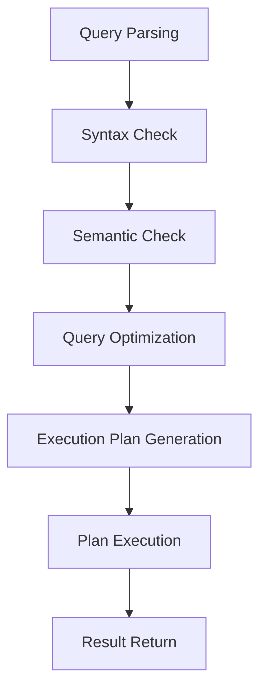

# Advanced SQL Concepts: Beyond the Basics 🚀

## Understanding Query Execution Flow 🔄

Before diving into advanced concepts, let's understand how SQL processes complex queries:



## Subqueries: Queries within Queries 🎯

Think of subqueries as helper functions that provide data to the main query.

### Types of Subqueries

1. **Scalar Subqueries**
   - Return a single value
   ```sql
   -- Compare each order to the average
   SELECT 
       order_id,
       total_amount,
       (SELECT AVG(total_amount) FROM orders) as avg_order,
       total_amount - (SELECT AVG(total_amount) FROM orders) as diff_from_avg
   FROM orders;
   ```

2. **Row Subqueries**
   - Return a single row
   ```sql
   -- Find the most recent order details
   SELECT customer_id, order_date, total_amount
   FROM orders
   WHERE (customer_id, order_date) = (
       SELECT customer_id, MAX(order_date)
       FROM orders
       GROUP BY customer_id
   );
   ```

3. **Table Subqueries**
   - Return multiple rows
   ```sql
   -- Find customers with above-average spending
   WITH customer_spending AS (
       SELECT 
           customer_id,
           SUM(total_amount) as total_spent
       FROM orders
       GROUP BY customer_id
   )
   SELECT 
       c.first_name,
       c.last_name,
       cs.total_spent
   FROM customers c
   JOIN customer_spending cs ON c.customer_id = cs.customer_id
   WHERE cs.total_spent > (
       SELECT AVG(total_spent) FROM customer_spending
   );
   ```

## Common Table Expressions (CTEs): Building Blocks 🏗️

CTEs make complex queries more readable and maintainable.

### Types of CTEs

1. **Simple CTEs**
```sql
-- Sales analysis with previous period comparison
WITH monthly_sales AS (
    SELECT 
        DATE_TRUNC('month', order_date) as month,
        SUM(total_amount) as revenue
    FROM orders
    GROUP BY DATE_TRUNC('month', order_date)
)
SELECT 
    month,
    revenue,
    LAG(revenue) OVER (ORDER BY month) as prev_month_revenue,
    ROUND(
        ((revenue - LAG(revenue) OVER (ORDER BY month)) / 
         LAG(revenue) OVER (ORDER BY month) * 100)::numeric,
        2
    ) as growth_percentage
FROM monthly_sales
ORDER BY month;
```

2. **Recursive CTEs**
```sql
-- Generate date series with running totals
WITH RECURSIVE date_sales AS (
    -- Base case
    SELECT 
        MIN(order_date)::date as date,
        SUM(total_amount) as daily_sales
    FROM orders
    GROUP BY order_date::date
    
    UNION ALL
    
    -- Recursive case
    SELECT 
        date + 1,
        COALESCE((
            SELECT SUM(total_amount)
            FROM orders
            WHERE order_date::date = date_sales.date + 1
        ), 0)
    FROM date_sales
    WHERE date < (SELECT MAX(order_date) FROM orders)
)
SELECT 
    date,
    daily_sales,
    SUM(daily_sales) OVER (ORDER BY date) as running_total
FROM date_sales;
```

## Views: Virtual Tables for Complex Logic 👀

### Types of Views

1. **Simple Views**
```sql
-- Customer order summary
CREATE VIEW customer_order_summary AS
SELECT 
    c.customer_id,
    c.first_name || ' ' || c.last_name as customer_name,
    COUNT(o.order_id) as total_orders,
    COALESCE(SUM(o.total_amount), 0) as total_spent,
    MAX(o.order_date) as last_order_date,
    CASE 
        WHEN MAX(o.order_date) >= CURRENT_DATE - INTERVAL '90 days' THEN 'Active'
        ELSE 'Inactive'
    END as customer_status
FROM customers c
LEFT JOIN orders o ON c.customer_id = o.customer_id
GROUP BY c.customer_id, c.first_name, c.last_name;
```

2. **Materialized Views**
```sql
-- Product performance metrics
CREATE MATERIALIZED VIEW product_performance AS
SELECT 
    p.product_id,
    p.product_name,
    p.category,
    COUNT(DISTINCT o.order_id) as order_count,
    SUM(oi.quantity) as units_sold,
    SUM(oi.quantity * oi.price_at_time) as revenue,
    AVG(oi.price_at_time) as avg_selling_price,
    PERCENTILE_CONT(0.5) WITHIN GROUP (ORDER BY oi.price_at_time) as median_price
FROM products p
LEFT JOIN order_items oi ON p.product_id = oi.product_id
LEFT JOIN orders o ON oi.order_id = o.order_id
GROUP BY p.product_id, p.product_name, p.category;
```

## Query Optimization: Performance Matters 🏃‍♂️

### Understanding Execution Plans
```sql
EXPLAIN (ANALYZE, BUFFERS)
SELECT 
    c.customer_id,
    c.first_name,
    COUNT(*) as order_count,
    SUM(o.total_amount) as total_spent
FROM customers c
JOIN orders o ON c.customer_id = o.customer_id
WHERE o.order_date >= CURRENT_DATE - INTERVAL '1 year'
GROUP BY c.customer_id, c.first_name
HAVING COUNT(*) > 5;
```

### Index Strategies
```sql
-- Composite index for common query patterns
CREATE INDEX idx_orders_customer_date 
ON orders(customer_id, order_date DESC);

-- Partial index for active orders
CREATE INDEX idx_active_orders 
ON orders(order_date)
WHERE status = 'active';

-- Include columns to avoid table lookups
CREATE INDEX idx_orders_customer_amount 
ON orders(customer_id)
INCLUDE (total_amount);
```

## Advanced Data Types and Functions 🛠️

### JSON Operations
```sql
-- Store and query JSON data
CREATE TABLE user_preferences (
    user_id INT,
    preferences JSONB
);

-- Insert complex preferences
INSERT INTO user_preferences VALUES
(1, '{"theme": "dark", "notifications": {"email": true, "sms": false}}');

-- Query nested JSON
SELECT 
    user_id,
    preferences->>'theme' as theme,
    preferences->'notifications'->>'email' as email_notifications
FROM user_preferences
WHERE preferences->'notifications'->>'email' = 'true';
```

### Array Operations
```sql
-- Working with arrays
CREATE TABLE product_tags (
    product_id INT,
    tags TEXT[]
);

-- Query arrays
SELECT product_id, tags
FROM product_tags
WHERE 'organic' = ANY(tags)
  AND array_length(tags, 1) > 2;
```

## Real-World Business Scenarios 💼

### 1. Customer Segmentation
```sql
WITH customer_metrics AS (
    SELECT 
        c.customer_id,
        COUNT(DISTINCT o.order_id) as order_count,
        SUM(o.total_amount) as total_spent,
        MAX(o.order_date) as last_order,
        MIN(o.order_date) as first_order,
        COUNT(DISTINCT DATE_TRUNC('month', o.order_date)) as active_months
    FROM customers c
    LEFT JOIN orders o ON c.customer_id = o.customer_id
    GROUP BY c.customer_id
)
SELECT 
    cm.*,
    CASE 
        WHEN order_count = 0 THEN 'Never Purchased'
        WHEN last_order < CURRENT_DATE - INTERVAL '6 months' THEN 'Churned'
        WHEN order_count = 1 THEN 'New Customer'
        WHEN total_spent > 1000 AND active_months > 6 THEN 'VIP'
        ELSE 'Regular'
    END as customer_segment
FROM customer_metrics cm;
```

### 2. Product Recommendations
```sql
-- Find frequently co-purchased products
WITH co_purchases AS (
    SELECT 
        oi1.product_id as product1,
        oi2.product_id as product2,
        COUNT(*) as times_bought_together
    FROM order_items oi1
    JOIN order_items oi2 
        ON oi1.order_id = oi2.order_id
        AND oi1.product_id < oi2.product_id
    GROUP BY oi1.product_id, oi2.product_id
    HAVING COUNT(*) > 5
)
SELECT 
    p1.product_name as product1_name,
    p2.product_name as product2_name,
    cp.times_bought_together
FROM co_purchases cp
JOIN products p1 ON cp.product1 = p1.product_id
JOIN products p2 ON cp.product2 = p2.product_id
ORDER BY cp.times_bought_together DESC;
```

## Performance Optimization Tips 🚀

1. **Use Appropriate Indexes**
   - Create indexes for frequently queried columns
   - Consider composite indexes for multi-column conditions
   - Use partial indexes for filtered queries

2. **Write Efficient Queries**
   - Avoid SELECT *
   - Use EXISTS instead of IN for large datasets
   - Leverage CTEs for better readability and maintenance

3. **Optimize Joins**
   - Join order matters
   - Use appropriate join types
   - Consider denormalization for performance-critical queries

4. **Monitor and Maintain**
   - Regularly update statistics
   - Rebuild indexes when needed
   - Use EXPLAIN ANALYZE to identify bottlenecks

Remember: "Optimization is about finding the right balance between performance and maintainability!" 💪
