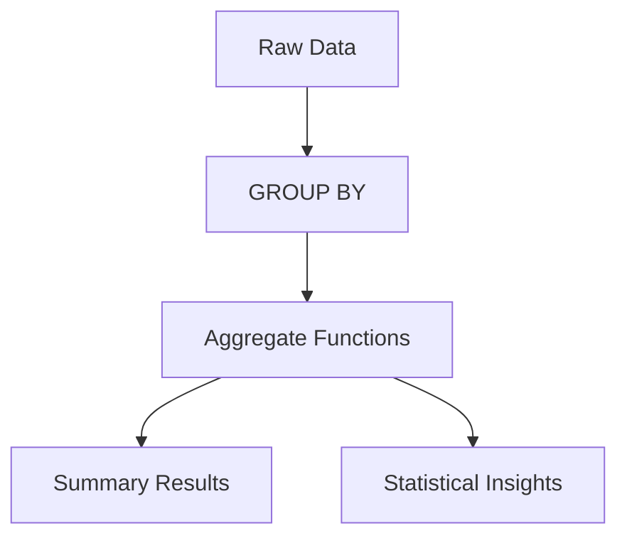

# SQL Aggregations: Transforming Data into Insights 📊

## Understanding Aggregations 🎯

Aggregations in SQL transform detailed data into meaningful summaries. Think of it like:
- Raw data = Individual grocery receipts
- Aggregated data = Monthly spending summary



## Aggregate Functions: Your Data Analysis Toolkit 🛠️

### Basic Statistical Functions

1. **COUNT**: Row Counter
   ```sql
   -- Different COUNT variations
   SELECT 
       COUNT(*) as total_rows,           -- All rows
       COUNT(1) as also_total_rows,      -- Same as COUNT(*)
       COUNT(column) as non_null_values,  -- Excludes NULL
       COUNT(DISTINCT column) as unique_values
   FROM table;
   ```

2. **SUM**: Numerical Addition
   ```sql
   -- Sales Analysis
   SELECT 
       category,
       SUM(amount) as total_sales,
       SUM(amount) FILTER (WHERE status = 'completed') as completed_sales
   FROM sales
   GROUP BY category;
   ```

3. **AVG**: Mean Calculator
   - Mathematical representation: $\bar{x} = \frac{\sum_{i=1}^{n} x_i}{n}$
   ```sql
   -- Price Analysis with Standard Error
   SELECT 
       category,
       AVG(price) as mean_price,
       STDDEV(price) / SQRT(COUNT(*)) as standard_error
   FROM products
   GROUP BY category;
   ```

4. **MIN/MAX**: Range Identifiers
   ```sql
   -- Price Range Analysis
   SELECT 
       category,
       MIN(price) as min_price,
       MAX(price) as max_price,
       MAX(price) - MIN(price) as price_range
   FROM products
   GROUP BY category;
   ```

### Statistical Functions

1. **STDDEV**: Standard Deviation
   - Formula: $s = \sqrt{\frac{\sum_{i=1}^{n} (x_i - \bar{x})^2}{n-1}}$
   ```sql
   SELECT 
       category,
       STDDEV(price) as price_std,
       AVG(price) as price_mean,
       STDDEV(price)/AVG(price) as coefficient_of_variation
   FROM products
   GROUP BY category;
   ```

2. **PERCENTILE**: Distribution Analysis
   ```sql
   -- Price Distribution
   SELECT 
       category,
       PERCENTILE_CONT(0.5) WITHIN GROUP (ORDER BY price) as median,
       PERCENTILE_CONT(0.25) WITHIN GROUP (ORDER BY price) as q1,
       PERCENTILE_CONT(0.75) WITHIN GROUP (ORDER BY price) as q3
   FROM products
   GROUP BY category;
   ```

## GROUP BY: Data Segmentation Master 🔍

### Basic Grouping
```sql
-- Sales by Region and Product
SELECT 
    region,
    product_category,
    COUNT(*) as sales_count,
    SUM(amount) as total_sales,
    AVG(amount) as avg_sale
FROM sales
GROUP BY 
    GROUPING SETS (
        (region, product_category),
        (region),
        (product_category),
        ()
    );
```

### Time-Based Grouping
```sql
-- Monthly Sales Trends
SELECT 
    DATE_TRUNC('month', sale_date) as month,
    COUNT(*) as num_sales,
    SUM(amount) as total_sales,
    AVG(amount) as avg_sale,
    SUM(amount) / COUNT(DISTINCT customer_id) as revenue_per_customer
FROM sales
GROUP BY DATE_TRUNC('month', sale_date);
```

## HAVING: The Group Filter 🎯

```sql
-- Find High-Performance Categories
SELECT 
    category,
    COUNT(*) as product_count,
    AVG(price) as avg_price,
    SUM(sales_count) as total_sales
FROM products
GROUP BY category
HAVING 
    COUNT(*) >= 5  -- Categories with at least 5 products
    AND AVG(price) > 100  -- Average price over 100
    AND SUM(sales_count) > 1000;  -- More than 1000 total sales
```

## Window Functions: Advanced Analytics 📈

### Types of Window Functions

1. **Ranking Functions**
```sql
SELECT 
    category,
    product_name,
    price,
    ROW_NUMBER() OVER w as row_num,
    RANK() OVER w as rank,
    DENSE_RANK() OVER w as dense_rank,
    NTILE(4) OVER w as quartile
FROM products
WINDOW w AS (PARTITION BY category ORDER BY price DESC);
```

2. **Moving Calculations**
```sql
-- 7-Day Moving Average of Sales
SELECT 
    sale_date,
    amount,
    AVG(amount) OVER (
        ORDER BY sale_date
        ROWS BETWEEN 6 PRECEDING AND CURRENT ROW
    ) as moving_avg,
    SUM(amount) OVER (
        ORDER BY sale_date
        ROWS BETWEEN UNBOUNDED PRECEDING AND CURRENT ROW
    ) as cumulative_sum
FROM daily_sales;
```

## Real-World Business Analytics 💼

### 1. Customer Segmentation
```sql
WITH customer_metrics AS (
    SELECT 
        customer_id,
        COUNT(*) as purchase_count,
        SUM(amount) as total_spent,
        MAX(order_date) as last_purchase,
        MIN(order_date) as first_purchase
    FROM orders
    GROUP BY customer_id
)
SELECT 
    CASE 
        WHEN total_spent > 1000 AND purchase_count > 10 THEN 'VIP'
        WHEN total_spent > 500 OR purchase_count > 5 THEN 'Regular'
        ELSE 'New'
    END as customer_segment,
    COUNT(*) as customer_count,
    AVG(total_spent) as avg_customer_value,
    AVG(purchase_count) as avg_purchase_frequency
FROM customer_metrics
GROUP BY 
    CASE 
        WHEN total_spent > 1000 AND purchase_count > 10 THEN 'VIP'
        WHEN total_spent > 500 OR purchase_count > 5 THEN 'Regular'
        ELSE 'New'
    END;
```

### 2. Sales Performance Analysis
```sql
WITH monthly_sales AS (
    SELECT 
        DATE_TRUNC('month', sale_date) as month,
        SUM(amount) as revenue
    FROM sales
    GROUP BY DATE_TRUNC('month', sale_date)
)
SELECT 
    month,
    revenue,
    LAG(revenue) OVER (ORDER BY month) as prev_month_revenue,
    ROUND(
        ((revenue - LAG(revenue) OVER (ORDER BY month)) / 
         LAG(revenue) OVER (ORDER BY month) * 100)::numeric, 
        2
    ) as growth_rate,
    AVG(revenue) OVER (
        ORDER BY month
        ROWS BETWEEN 2 PRECEDING AND CURRENT ROW
    ) as moving_avg_3month
FROM monthly_sales
ORDER BY month;
```

## Performance Optimization Tips 🚀

1. **Indexing Strategy**
   - Index columns used in GROUP BY
   - Consider covering indexes for frequently used queries

2. **Memory Considerations**
   ```sql
   -- Use LIMIT with ORDER BY
   SELECT category, COUNT(*)
   FROM products
   GROUP BY category
   ORDER BY COUNT(*) DESC
   LIMIT 10;  -- Prevents sorting entire result set
   ```

3. **Materialized Views**
   ```sql
   -- Create materialized view for common aggregations
   CREATE MATERIALIZED VIEW monthly_sales_summary AS
   SELECT 
       DATE_TRUNC('month', sale_date) as month,
       SUM(amount) as total_sales,
       COUNT(*) as transaction_count
   FROM sales
   GROUP BY DATE_TRUNC('month', sale_date);
   ```

## Common Pitfalls and Solutions ⚠️

1. **NULL Handling**
```sql
-- Include NULL handling in aggregations
SELECT 
    category,
    COUNT(*) as total_products,
    COUNT(price) as products_with_price,
    COALESCE(AVG(price), 0) as avg_price
FROM products
GROUP BY category;
```

2. **Numeric Precision**
```sql
-- Handle decimal precision
SELECT 
    category,
    ROUND(AVG(price)::numeric, 2) as avg_price,
    ROUND(STDDEV(price)::numeric, 2) as price_std
FROM products
GROUP BY category;
```

## Practice Exercises 🏋️‍♂️

1. Calculate year-over-year growth by category
2. Create a customer cohort analysis
3. Build a product recommendation engine using purchase patterns
4. Analyze seasonal sales patterns
5. Calculate customer lifetime value

## Key Takeaways 🎯

1. Choose appropriate aggregate functions for your analysis
2. Consider performance implications of complex groupings
3. Use window functions for sophisticated analytics
4. Handle NULL values and numeric precision carefully
5. Think about business context when designing aggregations

Remember: "Good aggregations tell a story about your data!" 📊
