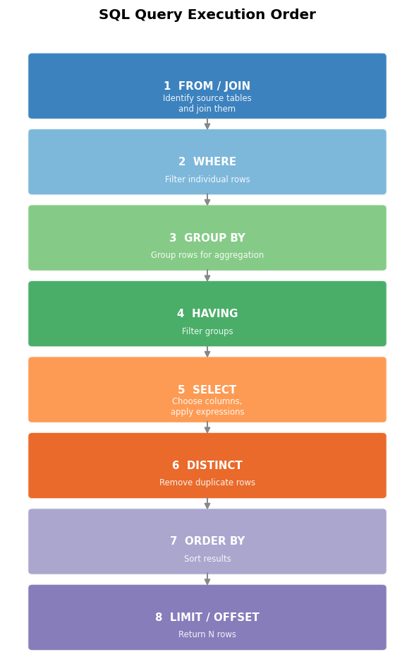

# SQL Aggregations: Transforming Data into Insights

**After this lesson:** You can group rows with **GROUP BY**, apply aggregate functions (**COUNT**, **SUM**, **AVG**, etc.), filter groups with **HAVING**, and use basic window functions for running totals and ranks.

## Helpful video

High-level introduction to SQL and relational databases.

## Overview

**Prerequisites:** [Basic SQL Operations](basic-operations.md) (**SELECT**, **WHERE**, **ORDER BY**). Comfortable with grouping ideas from descriptive stats in [Intro Statistics](../../1-data-fundamentals/1.3-intro-statistics/) is helpful but not required.

> **Time needed:** About 60 minutes, plus time for exercises.

## Why this matters

Reports and dashboards almost never show raw rows, they show **counts**, **sums**, **averages**, and **breakdowns by group**. `GROUP BY` and `HAVING` are how you express "per region," "per month," or "top ten" directly in SQL instead of exporting everything to a spreadsheet.

## Understanding Aggregations

Aggregations in SQL transform detailed data into meaningful summaries. Think of it like:

* Raw data = Individual grocery receipts
* Aggregated data = Monthly spending summary

## Aggregate Functions

### Basic Statistical Functions

1.  **COUNT**: Row Counter

    COUNT variations

    `COUNT(*)` and `COUNT(1)` count every row including NULLs. `COUNT(column)` skips NULLs. `COUNT(DISTINCT column)` counts unique non-null values, useful for unique buyer counts.

    Per-customer order analysis

    Groups by `customer_id` to produce one row per buyer. `COUNT(DISTINCT product_id)` tracks unique items purchased; `COUNT(DISTINCT DATE_TRUNC(...))` counts distinct calendar months the customer placed orders.
2.  **SUM**: Numerical Addition

    Grouped sales totals

    `SUM(amount)` totals all sales per category. `FILTER (WHERE status = 'completed')` is a modern alternative to a `CASE` expression, it restricts the aggregate to completed rows only while keeping the full row set for the outer group.

    Running total with window frame

    `SUM(amount) OVER (ORDER BY order_date ROWS BETWEEN UNBOUNDED PRECEDING AND CURRENT ROW)` keeps every row in the result and adds a cumulative total column, unlike `GROUP BY`, which would collapse rows.
3.  **AVG**: Mean Calculator

    Price statistics with confidence interval

    `STDDEV(price) / SQRT(COUNT(*))` is the standard error of the mean. Multiplying by 1.96 and adding/subtracting from `AVG` gives an approximate 95% confidence interval around the mean price per category.

    7-day moving average

    `AVG(amount) OVER (ORDER BY sale_date ROWS BETWEEN 6 PRECEDING AND CURRENT ROW)` computes a rolling 7-day average for each row. The frame shrinks at the start of the series where fewer than 7 prior rows exist.
4.  **MIN/MAX**: Range Identifiers

    Price range and spread per category

    `MAX - MIN` is the raw price range. Dividing by `AVG` (guarded with `NULLIF` to avoid division by zero) gives the coefficient of variation as a percentage, useful for comparing price dispersion across categories of different scales.

    Customer lifespan via first and last order

    `MIN(order_date)` and `MAX(order_date)` return the first and most-recent order per customer. Subtracting them yields the customer lifespan as an interval, a simple retention signal before cohort analysis.

## Advanced Aggregation Concepts

### Window Functions Deep Dive

Window functions perform calculations across a set of table rows related to the current row.

Salary rankings and stats per department

All window functions here use `PARTITION BY department` so each calculation resets per department. `AVG` gives the department mean; subtracting it shows each employee's distance from average. `RANK`, `DENSE_RANK`, `ROW_NUMBER`, and `NTILE(4)` all rank by descending salary within each partition.

Highest salary and department share

`FIRST_VALUE` with `ROWS BETWEEN UNBOUNDED PRECEDING AND UNBOUNDED FOLLOWING` reads the entire partition to return the top salary on every row. Dividing individual salary by `SUM(salary) OVER (PARTITION BY department)` expresses each employee's share of total department payroll.

Running and rolling window totals

Three frame specifications on the same column: a cumulative running total (default frame), a 7-row rolling window (`ROWS BETWEEN 6 PRECEDING AND CURRENT ROW`), and a calendar-based 3-month window using `RANGE BETWEEN INTERVAL`-showing how frame type controls which rows contribute.

### HAVING vs WHERE: Understanding the Difference

Correct: WHERE then HAVING

**WHERE status = 'active'** filters individual rows before grouping, only active employees enter the aggregate. **HAVING** then filters the grouped result: departments need 5+ employees and above-average sales to appear.

Wrong: aggregate in WHERE clause

`WHERE AVG(price) > 100` causes an error because aggregates are not allowed in a **WHERE** clause, the engine hasn't grouped yet at that point in execution.

Correct fix: move aggregate to HAVING

The corrected version removes the `WHERE AVG` and replaces it with `HAVING AVG(price) > 100`-which runs after grouping and can reference aggregate results.

### GROUP BY vs PARTITION BY: Key Differences

GROUP BY collapses to one row per group

**GROUP BY department** reduces the result to one row per department. Individual employee rows are gone, only the aggregated count and average survive in the output.

PARTITION BY keeps all rows

**PARTITION BY department** inside `OVER` computes the department average without collapsing rows. Every employee row is retained; the window columns add the department average and each employee's salary difference alongside the original data.

Combining GROUP BY and PARTITION BY with a CTE

The CTE uses `GROUP BY` to produce one summary row per department. The outer query joins back to the original `employees` table and adds a `RANK()` window to rank each employee within their department, combining both techniques.

## Common Pitfalls and Best Practices

### 1. NULL Handling

Misleading AVG when salary has NULLs

`AVG(salary)` automatically ignores `NULL` rows, so the result is the average of employees who _have_ a salary on record, not of all employees. If many salaries are missing, the figure can be significantly inflated.

Explicit NULL awareness

`COUNT(*) - COUNT(salary)` surfaces the count of missing salaries. `AVG(COALESCE(salary, 0))` treats NULLs as zero, useful for payroll totals. Both figures together let you understand the gap and choose the right interpretation.

### 2. Performance Considerations

Slow: correlated subquery per group

The correlated subquery inside `SELECT` reruns `AVG(salary)` once per department row-_N_ extra scans for _N_ departments. Combined with `GROUP BY` this is redundant work.

Fast: window function in a single pass

`AVG(salary) OVER (PARTITION BY department)` computes department averages in one pass. `SELECT DISTINCT` collapses duplicate rows so the result is still one row per department, faster and no subquery.

### 3. Precision and Rounding

Inconsistent output precision

Without explicit rounding, `AVG` and `SUM` return floating-point values whose precision varies by engine and column type, output like `75.333333...` looks unprofessional in reports.

Consistent 2-decimal-place output

`ROUND(expr::numeric, 2)` casts to `NUMERIC` first (required in PostgreSQL for `ROUND` to accept a precision argument) then rounds to 2 decimal places, giving clean, consistent output for both average and total salary.

## Practice Exercises

1.  **Basic Aggregation**

    Exercise: monthly sales metrics

    Write a query that aggregates `total sales`, `average order value`, and `order count` per calendar year-month, sorted newest first. Use `DATE_TRUNC` or `EXTRACT` to bucket by month.
2.  **Window Functions**

    Exercise: per-order window functions

    For each order, compute a running total of the customer's spend (`SUM OVER`), the previous order amount (`LAG`), average order value (`AVG OVER`), and a rank by amount within customer (`RANK OVER PARTITION BY`).
3.  **Complex Grouping**

    Exercise: multi-granularity sales summary

    Build a single query producing daily, weekly, and monthly totals alongside a year-over-year comparison, a rolling average, and each period's percentage of the grand total. Use `ROLLUP` or multiple `GROUP BY` levels plus window frames.
4.  **Advanced Analytics**

    Exercise: advanced customer analytics

    Write queries for: (1) cohort retention by first-order month, (2) product affinity pairs bought together, (3) customer lifetime value using historical order totals, and (4) a churn risk score based on recency and frequency.

## Additional Resources

* [PostgreSQL Aggregation Documentation](https://www.postgresql.org/docs/current/functions-aggregate.html)
* [Window Functions Tutorial](https://mode.com/sql-tutorial/sql-window-functions/)
* [SQL Performance Tuning Guide](https://use-the-index-luke.com/)
* [Advanced SQL Recipes](https://modern-sql.com/)

## Statistical Functions

1.  **STDDEV**: Standard Deviation

    Standard deviation and coefficient of variation

    `STDDEV(price)` measures absolute price spread. Dividing by `AVG` (guarded with `NULLIF`) and multiplying by 100 gives the coefficient of variation, a relative measure useful for comparing spread across categories at very different price levels. **HAVING COUNT(\*) >= 5** excludes categories with too few products for meaningful statistics.
2.  **PERCENTILE**: Distribution Analysis

    IQR per category

    `PERCENTILE_CONT(0.25/0.50/0.75) WITHIN GROUP (ORDER BY price)` computes exact percentiles using linear interpolation. Subtracting P25 from P75 gives the interquartile range (IQR), a reliable spread measure that ignores extreme prices at each end.

    Customer spending percentiles via subquery

    The inline subquery aggregates total spend per customer first. The outer `SELECT` then calls `PERCENTILE_CONT` on those totals to find P25, median, and P75 spending thresholds across all customers, useful for defining low/mid/high spender tiers.

## Real-World Business Analytics

### 1. Customer Segmentation

CTE 1: raw customer metrics

`customer_metrics` joins customers to orders and groups by customer to compute order count, total and average spend, first/last order dates, active months, and average monthly spend. `LEFT JOIN` keeps customers with no orders.

CTE 2: quartile and recency labels

`customer_segments` adds `NTILE(4)` spend quartile and a `CASE` recency label (Active / At Risk / Churned / Lost) based on days since last order.

Outer query: segment summary

Groups by `recency_segment` and `spend_quartile` to produce one row per combination. Rounded averages for orders, spend, order value, and monthly spend give a clean summary of each segment's behavior. `ORDER BY CASE` puts segments in business-priority order.

### 2. Product Performance Analysis

CTE 1: core product metrics

`product_metrics` joins products → order items → orders with `LEFT JOIN` to keep un-ordered products. Aggregates compute order count, units sold, revenue, average price, unique customers, and the number of active months the product saw sales.

CTE 2: rankings and velocity metrics

`product_rankings` adds window-based rankings: `RANK() OVER (PARTITION BY category ORDER BY revenue DESC)` for category rank and `PERCENT_RANK()` for overall percentile. Monthly revenue and unit velocity use `NULLIF` to guard against products with zero active months.

Outer query: performance tier labels

The final `SELECT` shapes the output: rounded numeric columns for reporting, and a `CASE` expression that maps category rank and overall percentile to a plain-language performance tier (Best Seller → Top 3 → Top 25% → Standard Performer).

### 3. Sales Trend Analysis

CTE 1: daily order and revenue totals

`daily_sales` buckets rows by day with `DATE_TRUNC`, restricted to the last 90 days. It counts orders, unique customers, and revenue, plus computes average order value per day.

CTE 2: prior-day comparison and rolling averages

`sales_stats` adds `LAG` for day-over-day comparison, a 7-day rolling `AVG`, and a 30-day rolling `PERCENTILE_CONT(0.5)` median, all as window functions over `daily_sales`.

Outer query: daily performance report

Formats all columns with `ROUND` for clean output. A `CASE` expression compares revenue to the 30-day rolling median to classify each day as Exceptional, Strong, Weak, or Normal, giving an at-a-glance performance label.

Remember: "Good aggregations tell a story about your data!"

## Next steps

* [Advanced SQL concepts](advanced-concepts.md), deeper window analytics and CTEs
* [SQL project](project.md), end-to-end practice brief
* [Module README](./), assignments and slides
