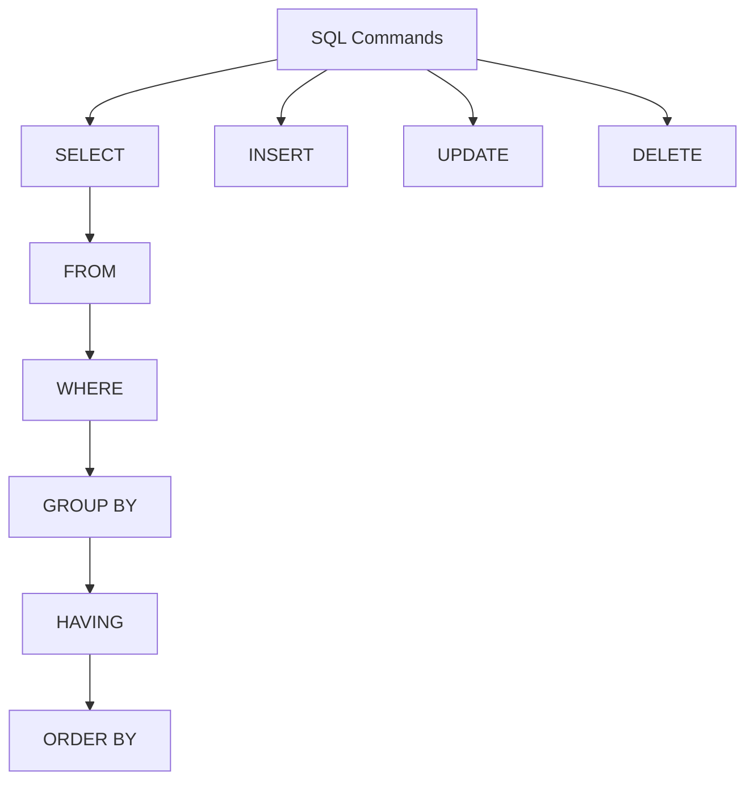
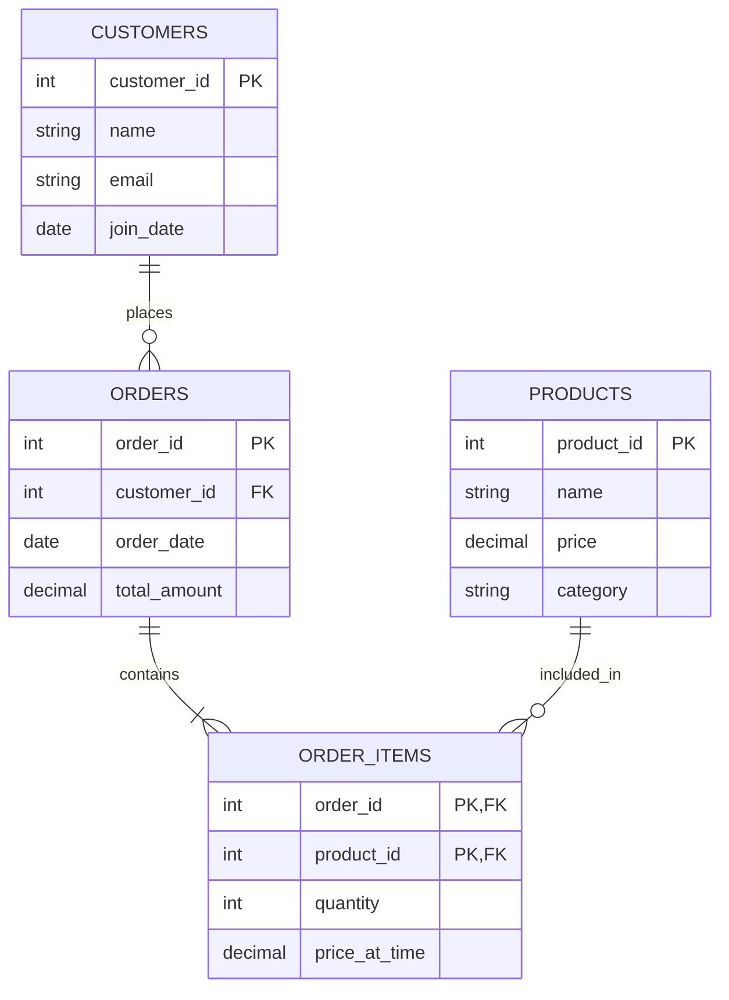

# SQL Mastery Assignment 🎯

## Overview 📋

This assignment will test your SQL skills across multiple areas:
- Basic SQL operations
- Joins and relationships
- Aggregations and grouping
- Performance optimization
- Real-world problem solving

## Part 1: Theoretical Understanding 📚

### Database Fundamentals



1. Which SQL command is used to retrieve data from a database?
   a. SELECT
   b. UPDATE
   c. INSERT
   d. DELETE
   
   **Explanation**: SELECT is the fundamental command for querying data. While other commands modify data (UPDATE, INSERT, DELETE), SELECT is specifically for data retrieval.

2. What is the purpose of the WHERE clause?
   a. To sort data
   b. To group data
   c. To filter data
   d. To join tables
   
   **Explanation**: The WHERE clause filters rows based on specified conditions. It's applied before grouping (GROUP BY) and sorting (ORDER BY).

3. Which JOIN type returns all records from both tables?
   ```mermaid
   graph LR
       A[Table A] --> B((FULL OUTER JOIN))
       C[Table B] --> B
       B --> D[Result]
       style B fill:#f96,stroke:#333
   ```
   a. INNER JOIN
   b. FULL OUTER JOIN
   c. LEFT JOIN
   d. RIGHT JOIN
   
   **Explanation**: FULL OUTER JOIN returns all records from both tables, with NULL values where there are no matches.

4. What is the purpose of GROUP BY?
   a. To sort records
   b. To group rows with similar values
   c. To filter records
   d. To join tables
   
   **Explanation**: GROUP BY combines rows with the same values in specified columns, typically used with aggregate functions.

5. Which aggregate function returns the number of rows?
   a. SUM
   b. AVG
   c. COUNT
   d. MAX
   
   **Explanation**: COUNT returns the number of rows that match the query criteria. COUNT(*) includes all rows, while COUNT(column) excludes NULL values.

### Advanced Concepts

6. What is the difference between HAVING and WHERE?
   ```sql
   -- Example showing WHERE vs HAVING
   SELECT 
       category,
       COUNT(*) as product_count,
       AVG(price) as avg_price
   FROM products
   WHERE price > 0  -- Filters individual rows
   GROUP BY category
   HAVING COUNT(*) > 5;  -- Filters groups
   ```
   a. HAVING filters grouped results, WHERE filters individual rows ✅
   b. HAVING is used before GROUP BY, WHERE after
   c. They are interchangeable
   d. HAVING can only be used with JOINs

7. Which statement about indexes is correct?
   ```sql
   -- Example of index impact
   CREATE INDEX idx_products_category ON products(category);
   
   -- Query using index
   SELECT * FROM products WHERE category = 'Electronics';
   -- vs
   SELECT * FROM products WHERE LOWER(category) = 'electronics';  -- Won't use index
   ```
   a. Indexes always improve query performance
   b. Indexes can slow down INSERT and UPDATE operations ✅
   c. You should index every column
   d. Indexes don't affect storage space

## Part 2: Practical Exercises 💻

### Sample Database Schema



```sql
-- Create tables
CREATE TABLE customers (
    customer_id SERIAL PRIMARY KEY,
    name VARCHAR(100),
    email VARCHAR(100),
    join_date DATE
);

CREATE TABLE products (
    product_id SERIAL PRIMARY KEY,
    name VARCHAR(100),
    price DECIMAL(10,2),
    category VARCHAR(50)
);

CREATE TABLE orders (
    order_id SERIAL PRIMARY KEY,
    customer_id INT REFERENCES customers(customer_id),
    order_date DATE,
    total_amount DECIMAL(10,2)
);

CREATE TABLE order_items (
    order_id INT REFERENCES orders(order_id),
    product_id INT REFERENCES products(product_id),
    quantity INT,
    price_at_time DECIMAL(10,2),
    PRIMARY KEY (order_id, product_id)
);

-- Generate sample data
INSERT INTO customers (name, email, join_date)
SELECT 
    'Customer ' || i,
    'customer' || i || '@example.com',
    CURRENT_DATE - (random() * 365)::integer
FROM generate_series(1, 1000) i;

INSERT INTO products (name, price, category)
SELECT 
    'Product ' || i,
    (random() * 1000)::numeric(10,2),
    CASE (random() * 4)::integer
        WHEN 0 THEN 'Electronics'
        WHEN 1 THEN 'Clothing'
        WHEN 2 THEN 'Books'
        ELSE 'Home'
    END
FROM generate_series(1, 100) i;

-- Add indexes for performance
CREATE INDEX idx_orders_customer ON orders(customer_id);
CREATE INDEX idx_orders_date ON orders(order_date);
CREATE INDEX idx_items_product ON order_items(product_id);
```

### Basic Queries (20 points)

1. Find all customers who joined in 2023:
   ```sql
   -- Solution
   SELECT name, email, join_date
   FROM customers
   WHERE EXTRACT(YEAR FROM join_date) = 2023;
   
   -- Better solution (index-friendly)
   SELECT name, email, join_date
   FROM customers
   WHERE join_date >= '2023-01-01'
   AND join_date < '2024-01-01';
   ```

2. List products with price greater than the average price:
   ```sql
   -- Solution with subquery
   SELECT name, price
   FROM products
   WHERE price > (SELECT AVG(price) FROM products)
   ORDER BY price DESC;
   
   -- Alternative with CTE
   WITH avg_price AS (
       SELECT AVG(price) as avg_price
       FROM products
   )
   SELECT 
       p.name,
       p.price,
       ROUND(
           ((p.price - avg_price) / avg_price * 100)::numeric,
           2
       ) as price_difference_pct
   FROM products p, avg_price
   WHERE p.price > avg_price
   ORDER BY p.price DESC;
   ```

[Previous content remains the same until the end]

## Additional Challenges 🌟

### 1. Data Analysis Dashboard
Create a comprehensive dashboard query that shows:
- Daily sales trends
- Top-selling products
- Customer segments
- Revenue by category
- Order fulfillment metrics

### 2. Inventory Management
Implement queries for:
- Stock level monitoring
- Reorder point calculations
- Supplier performance analysis
- Product turnover rates

### 3. Customer Insights
Develop queries to identify:
- Customer lifetime value
- Purchase patterns
- Product affinities
- Churn risk indicators

Remember: "Practice makes perfect - keep challenging yourself with real-world scenarios!" 💪
