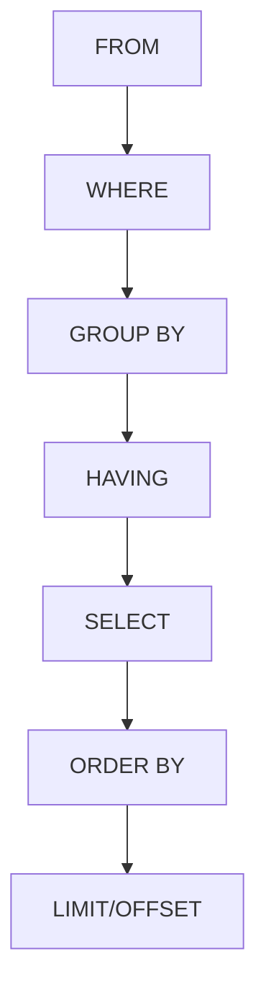

# Mastering Basic SQL Operations: Your Data Query Journey 🚀

## Understanding SQL Query Flow 🔄

Before diving into specific operations, let's understand how SQL processes queries:



## SELECT Statement: The Foundation 🎯

The SELECT statement is your gateway to data retrieval. Think of it as asking questions to your database.

### Anatomy of a SELECT Statement
```sql
SELECT column1, column2     -- What you want to see
FROM table_name            -- Where to find it
WHERE condition            -- Filter criteria
ORDER BY column1          -- How to sort it
LIMIT 10;                 -- How many to show
```

### Real-World Examples

1. **E-commerce: Find Top Customers**
```sql
-- Find customers who spent over $1000 in the last month
SELECT 
    c.first_name,
    c.last_name,
    SUM(o.total_amount) as total_spent
FROM customers c
JOIN orders o ON c.customer_id = o.customer_id
WHERE o.order_date >= CURRENT_DATE - INTERVAL '30 days'
GROUP BY c.customer_id, c.first_name, c.last_name
HAVING SUM(o.total_amount) > 1000
ORDER BY total_spent DESC;

/* Expected Output:
first_name  | last_name  | total_spent
------------|------------|-------------
John        | Smith      | 2500.00
Mary        | Johnson    | 1850.75
...
*/
```

2. **Inventory Management: Low Stock Alert**
```sql
-- Find products that need reordering
SELECT 
    product_name,
    stock_quantity,
    CASE 
        WHEN stock_quantity = 0 THEN 'OUT OF STOCK'
        WHEN stock_quantity < 10 THEN 'LOW STOCK'
        ELSE 'OK'
    END as stock_status
FROM products
WHERE stock_quantity < 20
ORDER BY stock_quantity;
```

## Filtering with WHERE: Your Data Detective Tool 🔍

The WHERE clause is your primary tool for filtering data. Performance tip: Use indexed columns in WHERE clauses for better performance.

### Comparison Operators Cheat Sheet
```
Operator | Meaning           | Example
---------|-------------------|------------------
=        | Equal            | price = 100
<>       | Not equal        | status <> 'done'
>        | Greater than     | amount > 1000
<        | Less than        | stock < 50
>=       | Greater or equal | rating >= 4
<=       | Less or equal    | discount <= 0.5
```

### Advanced Filtering Techniques

1. **Multiple Conditions**
```sql
-- Find active premium customers
SELECT *
FROM customers
WHERE status = 'active'
  AND (
    subscription_type = 'premium'
    OR total_purchases > 10000
  );
```

2. **Pattern Matching with LIKE**
```sql
-- Search for products with smart features
SELECT product_name, description
FROM products
WHERE 
    description ILIKE '%smart%'  -- Case-insensitive
    OR description LIKE '%AI%';  -- Case-sensitive
```

## Sorting and Pagination: Data Organization 📊

### Performance Considerations
Sorting large datasets? Consider these tips:
- Index columns used in ORDER BY
- Use LIMIT to restrict result size
- Consider materialized views for complex sorts

```sql
-- Efficient pagination with keyset pagination
SELECT *
FROM products
WHERE id > last_seen_id  -- More efficient than OFFSET
ORDER BY id
LIMIT 10;
```

## Working with NULL: The Special Case ⚠️

NULL represents unknown or missing data. Be careful with NULL comparisons!

```sql
-- Common NULL pitfalls
SELECT *
FROM customers
WHERE email IS NULL;      -- Correct ✅
WHERE email = NULL;       -- Wrong ❌ (always false)
```

## Query Performance Tips 🚀

1. **Use Indexes Wisely**
```sql
-- Good: Uses index on email
SELECT * FROM customers WHERE email = 'john@example.com';

-- Bad: Function prevents index use
SELECT * FROM customers WHERE LOWER(email) = 'john@example.com';
```

2. **Avoid SELECT ***
```sql
-- Better: Select only needed columns
SELECT first_name, last_name, email
FROM customers;
```

3. **Use EXISTS for Efficiency**
```sql
-- More efficient than IN for large datasets
SELECT *
FROM products p
WHERE EXISTS (
    SELECT 1 
    FROM order_items oi 
    WHERE oi.product_id = p.product_id
);
```

## Common Pitfalls and Solutions 🚧

1. **String Concatenation**
```sql
-- PostgreSQL
SELECT first_name || ' ' || last_name as full_name
FROM customers;

-- MySQL
SELECT CONCAT(first_name, ' ', last_name) as full_name
FROM customers;
```

2. **Date Handling**
```sql
-- Use date functions carefully
SELECT *
FROM orders
WHERE DATE(created_at) = CURRENT_DATE;  -- ❌ Prevents index use

-- Better approach
SELECT *
FROM orders
WHERE created_at >= CURRENT_DATE
  AND created_at < CURRENT_DATE + INTERVAL '1 day';  -- ✅
```

## Interactive Examples 💡

### Example 1: Customer Analysis
```sql
-- Find customer purchase patterns
WITH customer_stats AS (
    SELECT 
        c.customer_id,
        c.first_name,
        c.last_name,
        COUNT(o.order_id) as order_count,
        AVG(o.total_amount) as avg_order_value,
        MAX(o.order_date) as last_order_date
    FROM customers c
    LEFT JOIN orders o ON c.customer_id = o.customer_id
    GROUP BY c.customer_id, c.first_name, c.last_name
)
SELECT 
    *,
    CASE 
        WHEN order_count > 10 THEN 'VIP'
        WHEN order_count > 5 THEN 'Regular'
        ELSE 'New'
    END as customer_segment
FROM customer_stats
ORDER BY order_count DESC;
```

### Example 2: Product Performance
```sql
-- Analyze product performance
SELECT 
    p.product_name,
    p.category,
    COUNT(oi.order_id) as times_ordered,
    SUM(oi.quantity) as total_quantity_sold,
    ROUND(AVG(oi.quantity), 2) as avg_quantity_per_order,
    ROUND(SUM(oi.quantity * oi.price_at_time), 2) as total_revenue
FROM products p
LEFT JOIN order_items oi ON p.product_id = oi.product_id
GROUP BY p.product_id, p.product_name, p.category
HAVING COUNT(oi.order_id) > 0
ORDER BY total_revenue DESC;
```

## Practice Exercises with Solutions 🏋️‍♂️

1. **Basic Selection**
```sql
-- Exercise: Find all premium products with low stock
SELECT 
    product_name,
    price,
    stock_quantity
FROM products
WHERE 
    price > 1000
    AND stock_quantity < 10
ORDER BY stock_quantity;
```

2. **Data Analysis**
```sql
-- Exercise: Customer order summary for last quarter
SELECT 
    c.customer_id,
    c.email,
    COUNT(o.order_id) as order_count,
    SUM(o.total_amount) as total_spent,
    MAX(o.order_date) as last_order_date
FROM customers c
LEFT JOIN orders o ON c.customer_id = o.customer_id
WHERE o.order_date >= CURRENT_DATE - INTERVAL '3 months'
GROUP BY c.customer_id, c.email
HAVING COUNT(o.order_id) > 0
ORDER BY total_spent DESC;
```

## Key Takeaways 🎯

1. Always consider query performance
2. Use appropriate indexes
3. Be careful with NULL values
4. Choose the right operators
5. Test queries with sample data

Remember: "The art of SQL is not just about getting the right results, but getting them efficiently!" 💪
