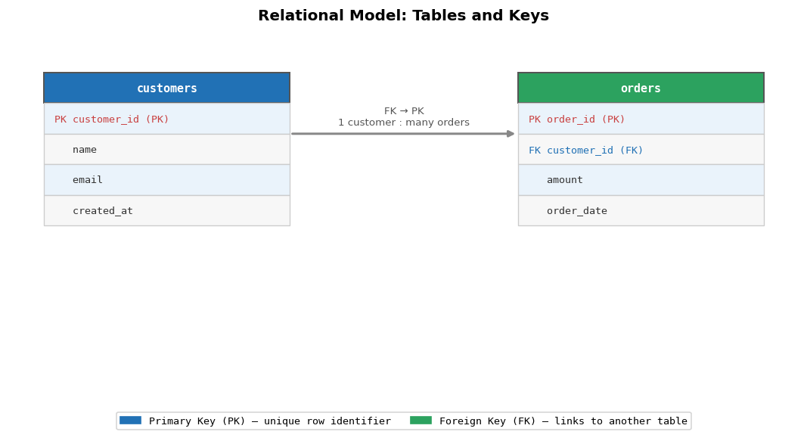

# Introduction to Databases: From Data to Knowledge

**After this lesson:** You can describe how relational databases organize data in tables, how keys link tables, and why **normalization** (splitting data to reduce redundancy) supports reliable queries.

## Helpful video

High-level introduction to SQL and relational databases.

## Overview

**Prerequisites:** [Data Querying with SQL (module README)](./) lists tools and sample data. Thinking in rows and columns, like a spreadsheet, matches what you practiced in [Pandas Series and DataFrame](../../1-data-fundamentals/1.5-data-analysis-pandas/dataframe.md).

> **Time needed:** About 45-60 minutes for a first read; longer if you run every SQL snippet.

> **Note:** **SQL** (Structured Query Language) is the standard language for querying relational databases; you will use it starting in [Basic SQL Operations](basic-operations.md).

## Why this matters

Tables and keys are not academic details, they are how organizations keep orders, customers, and inventory consistent at scale. When you later write `JOIN` and `WHERE` clauses, you are relying on this structure. A clear mental model of rows, relationships, and normalization makes the rest of the SQL submodule easier to read and debug.

## Understanding Databases

A **database** is software that stores and retrieves structured data reliably: many users, controlled updates, and rules that keep records consistent. You already think in **tables** if you have used spreadsheets or pandas; relational databases make relationships between those tables explicit with **keys** and **constraints**.

The bullets below are not separate topics to memorize in isolation, they describe what "good" database design tries to protect: organized storage, trustworthy values, and safe access at scale.

1. **Data Organization**
   * Structured vs Unstructured Data
   * Records and Fields
   * Tables and Relationships
2. **Data Integrity**
   * Accuracy
   * Consistency
   * Reliability
   * Completeness
3. **Data Access**
   * Concurrent Access
   * Security
   * Performance
   * Scalability

## Types of Databases

Not every system stores data like a spreadsheet with explicit foreign keys. This course focuses on **relational** databases, but you will hear the other families in architecture discussions, so a short map is useful.

### 1. Relational Databases (RDBMS)

* Uses structured tables with rows and columns
* Enforces relationships between tables
* Examples: PostgreSQL, MySQL, Oracle

Example of relational structure

Two tables: `customers` owns identities; `orders` references `customer_id` so each order belongs to one customer, classic parent/child FK pattern.

The two `CREATE TABLE` statements illustrate the usual pattern: `customers` holds stable identity, and `orders` points to it with `REFERENCES customers(customer_id)`-that is a **foreign key** in practice.

### 2. NoSQL Databases

NoSQL systems often relax strict table-and-key rules to gain flexibility, scale, or speed for documents, key-value pairs, wide columns, or graphs. You still need a clear data model; it is expressed differently than in SQL.

* Document Stores (MongoDB)
* Key-Value Stores (Redis)
* Column-Family Stores (Cassandra)
* Graph Databases (Neo4j)

### 3. Specialized Databases

These engines optimize for one workload, time-ordered metrics, full-text search, embeddings, or geography. Teams often combine them with a relational database: PostgreSQL for core transactions, plus Elasticsearch or a time-series DB for specialized queries.

* Time-Series Databases (InfluxDB)
* Search Engines (Elasticsearch)
* Vector Databases (Pinecone)
* Spatial Databases (PostGIS)

## Database Design Principles

### 1. Entity-Relationship Model

ER modeling is a sketch before you write DDL: **entities** (things you store), **relationships** (how they connect), and **cardinality** (one-to-many, many-to-many). The SQL below shows a classic many-to-many bridge table (`product_categories`) between `products` and `categories`.

_Read `||--o{` as "one customer places zero or more orders". The bridge table `ORDER_ITEMS` resolves the many-to-many between `ORDERS` and `PRODUCTS`._

Example of implementing entities and relation…

`products` and `categories` are linked by a junction table `product_categories` with a composite primary key, standard many-to-many modeling.

Category\_id SERIAL PRIMARY KEY,

Junction row: both columns are foreign keys; together they form the primary key so the same pair cannot be inserted twice.

Here the composite primary key on the junction table enforces "each product-category pair appears at most once," which is exactly what you want for a many-to-many link.

### 2. Data Modeling

Teams usually move from whiteboard to database in three layers:

* Conceptual Model
* Logical Model
* Physical Model

In practice: **conceptual** is business nouns and verbs on a whiteboard; **logical** is tables and keys without worrying about disk; **physical** is indexes, partitions, and types tuned to your engine.

### 3. Normalization Forms

**Normalization** reduces redundant storage and update anomalies by splitting tables until each fact lives in one logical place. The examples below are minimal illustrations, real schemas add history, soft deletes, and performance trade-offs.

1. **First Normal Form (1NF)**
   * Atomic values
   * No repeating groups

Bad: Non-1NF

Contrasts a packed text list of products with one row per product line, atomic values enable joins and counts.

> **Takeaway:** Storing several product IDs in one comma-separated column breaks 1NF: you cannot index or join cleanly, and updates are error-prone. One row per `(order_id, product_id)` is the relational fix.

2. **Second Normal Form (2NF)**
   * Must be in 1NF
   * No partial dependencies

Bad: Non-2NF

Anti-pattern: `product_name` depends only on `product_id`, not the full composite key. The fix splits `products` out.

CREATE TABLE products (

Clean `order_items` holds only keys and quantity; product names live solely in `products`.

> **Takeaway:** Here `product_name` depends only on `product_id`, not on the full `(order_id, product_id)` key, so it belongs in a `products` table. That split is the usual 2NF fix for line-item tables.

3. **Third Normal Form (3NF)**
   * Must be in 2NF
   * No transitive dependencies

Bad: Non-3NF

Redundant `department_name` on every employee row duplicates data tied to `department_id`.

CREATE TABLE departments (

Department attributes live in one place; employees reference `department_id` only, removes transitive dependency.

> **Takeaway:** `department_name` is determined by `department_id`, not by `employee_id` directly, so repeating it on every employee row risks inconsistency when a department renames. Moving department attributes to `departments` restores 3NF.

## Database Management Systems (DBMS)

A **DBMS** is the software that sits between your SQL (or API) and the disk: it stores pages, enforces permissions, runs transactions, and plans queries.

### 1. Core Functions

At minimum you should expect: durable **storage**, query **retrieval**, controlled **updates**, **admin** tooling (users, backups), and **security** (authz, auditing). The list is short; production systems add replication, HA, and observability on top.

* Data Storage
* Data Retrieval
* Data Update
* Administration
* Security

### 2. Important Features

The snippets below are **illustrative**-exact privilege syntax and backup commands depend on your engine (PostgreSQL, SQL Server, etc.). The point is to see what a DBMS provides beyond raw `SELECT`/`INSERT`.

Transaction Management

Sketch of ACID-related features: explicit `BEGIN`/`COMMIT`, `GRANT` for privileges, syntax varies by engine; backup lines are illustrative.

### 3. Performance Features

Indexing

Creates a btree index for lookups, mentions `EXPLAIN ANALYZE` for plans, and `work_mem` for sort/hash workspace, tune per workload.

## Basic Database Operations

These are the lifecycle operations you use when bootstrapping a project or adjusting a schema: create databases and schemas, define tables and views, then load or change rows.

### 1. Database Creation

Create database

`CREATE DATABASE`, optional `SCHEMA`, and `search_path` so unqualified names resolve predictably.

### 2. Table Management

Create table with constraints

`UNIQUE`, `NOT NULL`, regex `CHECK` on email, and defaults, constraints enforce rules at insert time.

Alter table

`ALTER TABLE` adds columns and constraints; `CREATE VIEW` exposes a filtered "active users" subset.

### 3. Data Management

Insert data

Standard `INSERT`-specify the target columns, then provide matching values. Omitting the column list inserts into every column in declaration order.

Update data

Conditional `UPDATE`-`SET` assigns the new value; always pair with a `WHERE` clause to avoid updating every row in the table.

Delete data

Scoped `DELETE`-the `WHERE` clause limits deletion to inactive users only. Without it the entire table is wiped.

## Additional Real-World Examples

### 1. E-commerce Analytics Platform

Track user behavior and product performance

Defines an `user_events` fact table (JSONB for flexible payloads) and a materialized view aggregating funnel metrics per product.

SELECT

Outer query joins events to products and computes conversion-style rates, typical engagement dashboard SQL.

### 2. Healthcare Management System

Patient records with privacy considerations

Illustrative DDL with `ENCRYPTED` markers, real systems use column encryption or vaults; shows versioning fields on medical records.

Patient\_id INT REFERENCES patients(patient\_id),

Row-level security policy example: only certain roles see rows, Postgres-style; wire-up depends on your auth model.

## Performance Optimization Examples

### 1. Indexing Strategies

B-tree index for exact matches and ranges

Contrasts btree, hash, GiST, and GIN, pick the access pattern (equality vs text search vs geometry).

### 2. Partitioning Examples

Range partitioning for time-series data

Parent `metrics` table partitioned by timestamp; child tables hold monthly ranges, prune partitions when dropping old data.

List partitioning for categorical data

`LIST` partitioning splits `sales` by region into separate physical tables behind one logical name.

### 3. Query Optimization

Use CTEs for better readability and performance

Monthly revenue CTE, then `LAG` for prior month, month-over-month growth pattern.

Revenue,

Computes percent growth from `LAG`; guard divide-by-zero on the first month.

## Common Pitfalls and Solutions

### 1. Connection Management

Bad: Not closing connections

Contrasts leaking connections with pooling, pseudo-SQL; real clients use poolers or context managers in app code.

### 2. Transaction Management

Bad: No error handling

Two bare `UPDATE`s vs a transactional block with savepoints, illustrates atomic transfers and rollback on failure.

END IF;

Continuation of PL/pgSQL-style error handling (dialect-specific); nested checks before `COMMIT`.

## Interactive Examples with Sample Data

### 1. Customer Analysis

Create sample customer data

`generate_series` builds synthetic customers; cohort CTE groups by signup month and running sum for cumulative count.

SELECT

Cohort query outer `SELECT`: orders cohort rows by month and applies a windowed cumulative sum.

### 2. Product Performance

Generate sample sales data

Randomized bulk insert for stress testing; windowed `NTILE` buckets products by revenue quartile.

SUM(quantity) as units\_sold,

Aggregates random sales per product: counts, units, revenue, average ticket, and quartile rank, typical product leaderboard query.

Remember: "A well-designed database is the foundation of any successful application!"

## Gotchas

* **Confusing NULL with an empty string or zero**: NULL means "value unknown"; it is not `''` or `0`. Comparing with `= NULL` always returns NULL (not true), so rows with missing values silently disappear from results. Always use `IS NULL` or `IS NOT NULL` to test for absence of a value.
* **Forgetting that a foreign key only prevents orphaned child rows, not NULL**: A column declared `REFERENCES customers(customer_id)` will accept NULL unless you also add `NOT NULL`. Without that extra constraint, a child row can exist with no parent reference at all and the database will not complain.
* **Treating normalization as always-good**: 3NF eliminates redundancy but every extra table requires a JOIN at query time. On read-heavy analytics tables it is common to intentionally denormalize (store `product_name` on the order line) to avoid expensive joins; the "right" form depends on your read/write ratio.
* **Assuming `SERIAL` / `AUTO_INCREMENT` IDs are gap-free**: When an INSERT fails or a transaction is rolled back, the sequence counter still advances. Real tables have gaps in their primary keys; code that depends on IDs being contiguous (e.g., `WHERE id BETWEEN 1 AND 100`) will miss rows.
* **Conflating the physical, logical, and conceptual models**: An ER diagram is a design sketch; the actual PostgreSQL schema may differ due to performance trade-offs (e.g., denormalized columns, materialized views). Always verify constraints in the DDL rather than trusting the diagram alone.
* **Creating indexes on every column "just in case"**: Indexes speed up reads but slow down every INSERT/UPDATE/DELETE because each index must be maintained. Add indexes only on columns that appear in frequent WHERE, JOIN ON, or ORDER BY clauses, and measure the impact with EXPLAIN ANALYZE before and after.

## Next steps

* [Basic SQL Operations](basic-operations.md), **SELECT**, filters, and sorting
* [Aggregations](aggregations.md), **GROUP BY** and summary statistics
* [Joins](joins.md), combine tables with **JOIN**
* [Module 2.1 README](./), full path and assignment
