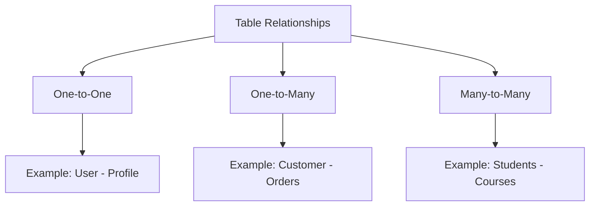
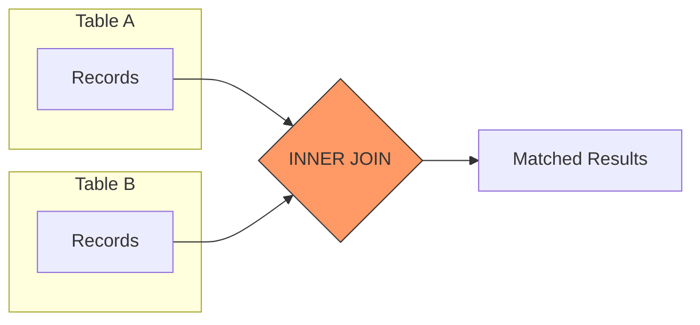
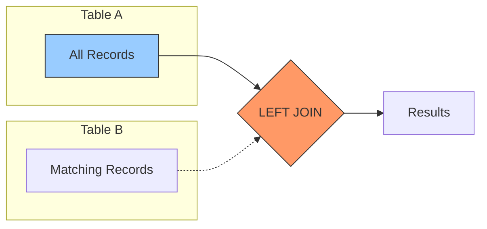
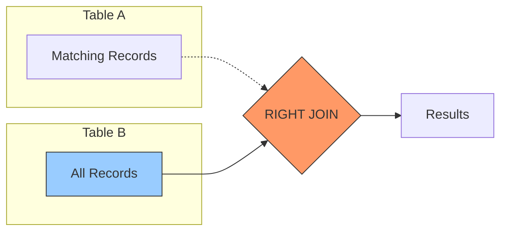
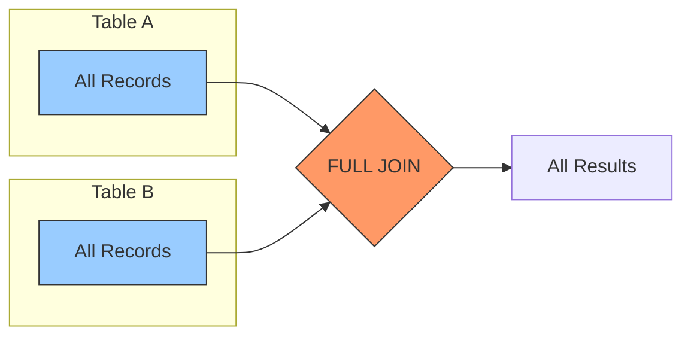

# Mastering SQL Joins: Connecting Your Data Universe 🌐

## Understanding Table Relationships: The Foundation 🔄

Think of database tables like departments in a company - they each have specific information, but they need to work together to create a complete picture. SQL joins are like meetings where these departments share information.



## Types of Joins: Your Data Connection Toolkit 🔗

### INNER JOIN: The Perfect Match 🎯
Returns only rows where there's a match in both tables.



```sql
-- Find all orders with customer information
SELECT 
    o.order_id,
    c.first_name,
    c.last_name,
    o.total_amount,
    o.order_date
FROM orders o
INNER JOIN customers c 
    ON o.customer_id = c.customer_id
WHERE o.total_amount > 100
ORDER BY o.order_date DESC;

/* Expected Output:
order_id | first_name | last_name | total_amount | order_date
---------|------------|-----------|--------------|------------
1001     | John       | Doe       | 150.00       | 2023-01-15
1002     | Jane       | Smith     | 200.00       | 2023-01-14
*/
```

### LEFT JOIN: Keep Everything from the Left 👈
Returns all rows from the left table and matching rows from the right.



```sql
-- Customer order summary including those with no orders
SELECT 
    c.customer_id,
    c.first_name,
    c.last_name,
    COUNT(o.order_id) as order_count,
    COALESCE(SUM(o.total_amount), 0) as total_spent
FROM customers c
LEFT JOIN orders o 
    ON c.customer_id = o.customer_id
GROUP BY 
    c.customer_id, 
    c.first_name, 
    c.last_name;
```

### RIGHT JOIN: Keep Everything from the Right 👉
Returns all rows from the right table and matching rows from the left.



### FULL OUTER JOIN: Keep Everything from Both 🤝
Returns all rows from both tables, matching where possible.



## Advanced Join Techniques: Power Tools 🛠️

### 1. Multi-Table Joins
```sql
-- Complex order analysis
SELECT 
    o.order_id,
    c.first_name || ' ' || c.last_name as customer_name,
    p.product_name,
    cat.category_name,
    oi.quantity,
    oi.quantity * oi.price_at_time as line_total
FROM orders o
JOIN customers c 
    ON o.customer_id = c.customer_id
JOIN order_items oi 
    ON o.order_id = oi.order_id
JOIN products p 
    ON oi.product_id = p.product_id
JOIN categories cat 
    ON p.category_id = cat.category_id;
```

### 2. Self Joins
Perfect for hierarchical data structures.

```sql
-- Employee hierarchy
SELECT 
    e.employee_id,
    e.first_name || ' ' || e.last_name as employee,
    COALESCE(m.first_name || ' ' || m.last_name, 'Top Level') as manager
FROM employees e
LEFT JOIN employees m 
    ON e.manager_id = m.employee_id;
```

### 3. Cross Joins (Cartesian Product)
```sql
-- Generate all possible product-category combinations
SELECT 
    p.product_name,
    c.category_name
FROM products p
CROSS JOIN categories c
WHERE p.category_id IS NULL;  -- Find potential categorizations
```

## Performance Optimization: Speed Matters 🚀

### 1. Join Column Indexing
```sql
-- Create indexes for frequently joined columns
CREATE INDEX idx_orders_customer_id 
    ON orders(customer_id);
CREATE INDEX idx_order_items_order_id 
    ON order_items(order_id);
```

### 2. Join Order Optimization
```sql
-- Start with the most filtered table
SELECT /*+ ORDERED */
    c.customer_name,
    o.order_id
FROM (
    SELECT * FROM orders 
    WHERE total_amount > 1000
) o
JOIN customers c 
    ON o.customer_id = c.customer_id;
```

## Real-World Business Scenarios 💼

### 1. Customer Analysis
```sql
-- Customer purchase patterns
WITH customer_stats AS (
    SELECT 
        c.customer_id,
        c.first_name || ' ' || c.last_name as customer_name,
        COUNT(DISTINCT o.order_id) as order_count,
        SUM(o.total_amount) as total_spent,
        MAX(o.order_date) as last_order_date,
        MIN(o.order_date) as first_order_date
    FROM customers c
    LEFT JOIN orders o 
        ON c.customer_id = o.customer_id
    GROUP BY 
        c.customer_id,
        c.first_name,
        c.last_name
)
SELECT 
    *,
    CASE 
        WHEN order_count > 10 THEN 'VIP'
        WHEN order_count > 5 THEN 'Regular'
        WHEN order_count > 0 THEN 'New'
        ELSE 'Never Ordered'
    END as customer_segment
FROM customer_stats;
```

### 2. Product Performance
```sql
-- Product sales analysis
SELECT 
    p.product_name,
    cat.category_name,
    COUNT(DISTINCT o.order_id) as number_of_orders,
    SUM(oi.quantity) as units_sold,
    SUM(oi.quantity * oi.price_at_time) as total_revenue,
    AVG(oi.price_at_time) as avg_selling_price
FROM products p
LEFT JOIN order_items oi 
    ON p.product_id = oi.product_id
LEFT JOIN orders o 
    ON oi.order_id = o.order_id
LEFT JOIN categories cat 
    ON p.category_id = cat.category_id
GROUP BY 
    p.product_name,
    cat.category_name;
```

## Common Pitfalls and Solutions ⚠️

### 1. Cartesian Product Warning
```sql
-- Bad: Accidental cross join
SELECT * FROM orders, customers;

-- Good: Explicit join condition
SELECT * 
FROM orders o
JOIN customers c 
    ON o.customer_id = c.customer_id;
```

### 2. NULL Handling
```sql
-- Include NULL checks in join conditions
SELECT *
FROM orders o
LEFT JOIN shipments s 
    ON o.order_id = s.order_id
    AND s.status IS NOT NULL;
```

## Set Operations: Beyond Joins 🔄

### 1. UNION / UNION ALL
```sql
-- Combine active and archived orders
SELECT order_id, order_date, 'Active' as status
FROM current_orders
UNION ALL
SELECT order_id, order_date, 'Archived'
FROM order_archive;
```

### 2. INTERSECT
```sql
-- Find products ordered in both periods
SELECT product_id
FROM order_items_2022
INTERSECT
SELECT product_id
FROM order_items_2023;
```

## Practice Exercises 🏋️‍♂️

1. Find customers who haven't ordered in the last 6 months
2. Calculate the average time between orders for each customer
3. Identify products often purchased together
4. Create a complete customer profile with all related information
5. Generate a sales hierarchy report

Remember: "Joins are like building bridges between islands of data - make sure they're strong and efficient!" 🌉
