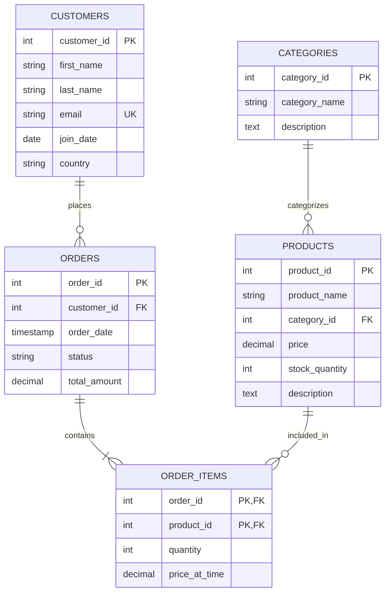

# E-commerce Data Analysis: From Data to Business Insights 🚀

## Project Overview 🎯

You're a data analyst at "GlobalMart", a growing e-commerce platform. Your task is to analyze customer behavior, product performance, and business metrics to drive strategic decisions.

## Database Schema 📊



## Setup Instructions 🛠️

```sql
-- Database creation script
CREATE DATABASE globalmart;

-- Table creation scripts
CREATE TABLE customers (
    customer_id SERIAL PRIMARY KEY,
    first_name VARCHAR(50),
    last_name VARCHAR(50),
    email VARCHAR(100) UNIQUE,
    join_date DATE,
    country VARCHAR(50)
);

-- ... (remaining table creation scripts)

-- Indexes for performance
CREATE INDEX idx_orders_customer ON orders(customer_id);
CREATE INDEX idx_orders_date ON orders(order_date);
CREATE INDEX idx_items_product ON order_items(product_id);
```

## Analysis Tasks 📝

### 1. Customer Analysis (15 points)

#### 1.1 Top Customer Analysis (3 points)
```sql
-- Find top 5 customers by total spending
WITH customer_metrics AS (
    SELECT 
        c.customer_id,
        c.first_name || ' ' || c.last_name as customer_name,
        COUNT(DISTINCT o.order_id) as order_count,
        SUM(o.total_amount) as total_spent,
        AVG(o.total_amount) as avg_order_value
    FROM customers c
    JOIN orders o ON c.customer_id = o.customer_id
    GROUP BY c.customer_id, c.first_name, c.last_name
)
SELECT 
    customer_name,
    order_count,
    ROUND(total_spent::numeric, 2) as total_spent,
    ROUND(avg_order_value::numeric, 2) as avg_order_value
FROM customer_metrics
ORDER BY total_spent DESC
LIMIT 5;

/* Expected Output:
customer_name    | order_count | total_spent | avg_order_value
-----------------|-------------|-------------|----------------
John Smith       | 12          | 2500.00     | 208.33
Sarah Johnson    | 8           | 1800.50     | 225.06
...
*/
```

#### 1.2 Customer Segmentation (6 points)
```sql
WITH customer_metrics AS (
    SELECT 
        c.customer_id,
        c.first_name || ' ' || c.last_name as customer_name,
        COUNT(DISTINCT o.order_id) as order_count,
        SUM(o.total_amount) as total_spent,
        AVG(o.total_amount) as avg_order_value,
        MAX(o.order_date) as last_order_date,
        CURRENT_DATE - MAX(o.order_date) as days_since_last_order
    FROM customers c
    LEFT JOIN orders o ON c.customer_id = o.customer_id
    GROUP BY c.customer_id, c.first_name, c.last_name
)
SELECT 
    customer_name,
    CASE 
        WHEN total_spent > 1000 AND order_count > 10 THEN 'VIP'
        WHEN total_spent > 500 OR order_count > 5 THEN 'Regular'
        WHEN total_spent > 0 THEN 'New'
        ELSE 'Inactive'
    END as customer_segment,
    order_count,
    ROUND(total_spent::numeric, 2) as total_spent,
    ROUND(avg_order_value::numeric, 2) as avg_order_value,
    days_since_last_order
FROM customer_metrics
ORDER BY total_spent DESC;
```

#### 1.3 Cohort Analysis (6 points)
```sql
-- Monthly cohort analysis
WITH cohort_dates AS (
    SELECT 
        customer_id,
        DATE_TRUNC('month', join_date) as cohort_month,
        DATE_TRUNC('month', order_date) as order_month
    FROM customers c
    LEFT JOIN orders o ON c.customer_id = o.customer_id
),
cohort_size AS (
    SELECT 
        cohort_month,
        COUNT(DISTINCT customer_id) as num_customers
    FROM cohort_dates
    GROUP BY cohort_month
),
retention_table AS (
    SELECT 
        cohort_month,
        order_month,
        COUNT(DISTINCT customer_id) as num_customers
    FROM cohort_dates
    GROUP BY cohort_month, order_month
)
SELECT 
    c.cohort_month,
    cs.num_customers as cohort_size,
    r.order_month,
    r.num_customers as active_customers,
    ROUND(100.0 * r.num_customers / cs.num_customers, 2) as retention_rate
FROM cohort_size cs
JOIN retention_table r ON cs.cohort_month = r.cohort_month
ORDER BY c.cohort_month, r.order_month;
```

### 2. Product Analysis (15 points)

#### 2.1 Product Performance (5 points)
```sql
WITH product_metrics AS (
    SELECT 
        p.product_id,
        p.product_name,
        c.category_name,
        COUNT(DISTINCT o.order_id) as num_orders,
        SUM(oi.quantity) as total_units_sold,
        SUM(oi.quantity * oi.price_at_time) as total_revenue,
        p.stock_quantity as current_stock
    FROM products p
    LEFT JOIN order_items oi ON p.product_id = oi.product_id
    LEFT JOIN orders o ON oi.order_id = o.order_id
    LEFT JOIN categories c ON p.category_id = c.category_id
    GROUP BY p.product_id, p.product_name, c.category_name
)
SELECT 
    product_name,
    category_name,
    num_orders,
    total_units_sold,
    ROUND(total_revenue::numeric, 2) as total_revenue,
    current_stock,
    CASE 
        WHEN current_stock = 0 THEN 'Out of Stock'
        WHEN current_stock < total_units_sold * 0.1 THEN 'Low Stock'
        ELSE 'In Stock'
    END as stock_status
FROM product_metrics
ORDER BY total_revenue DESC;
```

#### 2.2 Category Analysis (5 points)
```sql
-- Category performance over time
SELECT 
    c.category_name,
    DATE_TRUNC('month', o.order_date) as month,
    COUNT(DISTINCT o.order_id) as num_orders,
    SUM(oi.quantity) as units_sold,
    ROUND(SUM(oi.quantity * oi.price_at_time)::numeric, 2) as revenue,
    ROUND(AVG(oi.price_at_time)::numeric, 2) as avg_price
FROM categories c
JOIN products p ON c.category_id = p.category_id
JOIN order_items oi ON p.product_id = oi.product_id
JOIN orders o ON oi.order_id = o.order_id
GROUP BY c.category_name, DATE_TRUNC('month', o.order_date)
ORDER BY c.category_name, month;
```

#### 2.3 Product Recommendations (5 points)
```sql
-- Find frequently co-purchased products
WITH co_purchases AS (
    SELECT 
        oi1.product_id as product1_id,
        oi2.product_id as product2_id,
        COUNT(*) as times_bought_together
    FROM order_items oi1
    JOIN order_items oi2 
        ON oi1.order_id = oi2.order_id
        AND oi1.product_id < oi2.product_id
    GROUP BY oi1.product_id, oi2.product_id
    HAVING COUNT(*) >= 3
)
SELECT 
    p1.product_name as product1,
    p2.product_name as product2,
    cp.times_bought_together,
    ROUND(
        100.0 * cp.times_bought_together / 
        LEAST(
            (SELECT COUNT(*) FROM order_items WHERE product_id = p1.product_id),
            (SELECT COUNT(*) FROM order_items WHERE product_id = p2.product_id)
        ),
        2
    ) as purchase_affinity
FROM co_purchases cp
JOIN products p1 ON cp.product1_id = p1.product_id
JOIN products p2 ON cp.product2_id = p2.product_id
ORDER BY cp.times_bought_together DESC;
```

### 3. Business Metrics (20 points)

#### 3.1 Revenue Analysis (7 points)
```sql
-- Monthly revenue trends with YoY growth
WITH monthly_revenue AS (
    SELECT 
        DATE_TRUNC('month', order_date) as month,
        SUM(total_amount) as revenue
    FROM orders
    GROUP BY DATE_TRUNC('month', order_date)
),
revenue_growth AS (
    SELECT 
        month,
        revenue,
        LAG(revenue) OVER (ORDER BY month) as prev_month_revenue,
        LAG(revenue) OVER (
            ORDER BY month 
            RANGE BETWEEN INTERVAL '1 year' PRECEDING 
            AND INTERVAL '1 year' PRECEDING
        ) as prev_year_revenue
    FROM monthly_revenue
)
SELECT 
    month,
    ROUND(revenue::numeric, 2) as revenue,
    ROUND(
        100.0 * (revenue - prev_month_revenue) / prev_month_revenue,
        2
    ) as mom_growth,
    ROUND(
        100.0 * (revenue - prev_year_revenue) / prev_year_revenue,
        2
    ) as yoy_growth
FROM revenue_growth
ORDER BY month;
```

#### 3.2 Order Analysis (7 points)
```sql
-- Order patterns and fulfillment analysis
SELECT 
    DATE_TRUNC('hour', order_date) as hour_of_day,
    COUNT(*) as num_orders,
    ROUND(AVG(total_amount)::numeric, 2) as avg_order_value,
    COUNT(CASE WHEN status = 'completed' THEN 1 END) as completed_orders,
    COUNT(CASE WHEN status = 'cancelled' THEN 1 END) as cancelled_orders,
    ROUND(
        100.0 * COUNT(CASE WHEN status = 'completed' THEN 1 END)::numeric / COUNT(*),
        2
    ) as completion_rate
FROM orders
GROUP BY DATE_TRUNC('hour', order_date)
ORDER BY hour_of_day;
```

#### 3.3 Customer Lifetime Value (6 points)
```sql
WITH customer_value AS (
    SELECT 
        c.customer_id,
        c.join_date,
        COUNT(DISTINCT o.order_id) as total_orders,
        SUM(o.total_amount) as total_spent,
        MAX(o.order_date) as last_order_date,
        EXTRACT(YEAR FROM AGE(MAX(o.order_date), MIN(o.order_date))) as years_active
    FROM customers c
    LEFT JOIN orders o ON c.customer_id = o.customer_id
    GROUP BY c.customer_id, c.join_date
)
SELECT 
    customer_id,
    total_orders,
    ROUND(total_spent::numeric, 2) as total_spent,
    ROUND((total_spent / NULLIF(years_active, 0))::numeric, 2) as annual_value,
    CASE 
        WHEN last_order_date >= CURRENT_DATE - INTERVAL '90 days' THEN 'Active'
        WHEN last_order_date >= CURRENT_DATE - INTERVAL '180 days' THEN 'At Risk'
        ELSE 'Churned'
    END as status
FROM customer_value
ORDER BY total_spent DESC;
```

## Bonus Challenges 🌟

### 1. Dynamic Pricing Analysis (10 points)
Implement a price optimization model considering:
- Historical sales data
- Competitor pricing
- Seasonal trends
- Stock levels

### 2. Predictive Analytics (10 points)
Create SQL queries to:
- Predict future sales
- Identify potential churners
- Recommend inventory levels
- Optimize marketing spend

## Submission Requirements 📋

1. SQL Files:
   - All queries in a single .sql file
   - Comments explaining each section
   - Performance optimization notes

2. Documentation:
   - Analysis methodology
   - Key findings
   - Recommendations
   - Performance considerations

3. Results:
   - Sample output for each query
   - Visualization suggestions
   - Business implications

## Evaluation Criteria 📊

| Criterion | Weight | Description |
|-----------|---------|-------------|
| Query Correctness | 40% | Accurate results, proper joins, correct aggregations |
| Performance | 20% | Efficient execution, proper indexing, optimization |
| Code Quality | 20% | Readability, comments, organization |
| Business Insight | 20% | Meaningful analysis, actionable recommendations |

## Tips for Success 💡

1. **Start Simple**
   - Begin with basic queries
   - Add complexity gradually
   - Test each component

2. **Optimize Performance**
   - Use appropriate indexes
   - Avoid SELECT *
   - Consider query execution plans

3. **Handle Edge Cases**
   - NULL values
   - Empty results
   - Data type conversions

4. **Document Everything**
   - Query purpose
   - Assumptions made
   - Known limitations

Remember: "The goal is not just to query data, but to derive actionable insights!" 🎯
