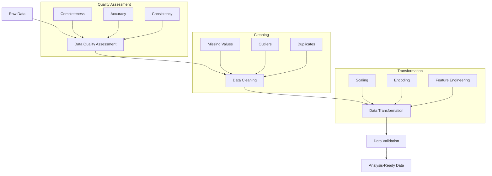

# Data Wrangling: From Raw Data to Reliable Insights 🚀

## The Data Wrangling Journey 🗺️



## Learning Objectives 🎯

After completing this module, you will be able to:

1. **Assess Data Quality** 📊
   - Identify data quality dimensions
   - Measure data completeness
   - Evaluate data consistency
   - Detect anomalies

2. **Clean Data Effectively** 🧹
   - Handle missing values strategically
   - Treat outliers appropriately
   - Remove or merge duplicates
   - Fix inconsistencies

3. **Transform Data** 🔄
   - Scale numerical features
   - Encode categorical variables
   - Engineer new features
   - Standardize formats

4. **Validate Results** ✅
   - Implement quality checks
   - Verify transformations
   - Ensure data integrity
   - Document changes

## Real-World Example: E-commerce Data 🛍️

Let's look at a practical example using Python:

```python
import pandas as pd
import numpy as np
from sklearn.preprocessing import StandardScaler

# Load messy e-commerce data
df = pd.read_csv('sales_data.csv')

# 1. Data Quality Assessment
print("Data Quality Report")
print("-" * 50)
print(f"Total Records: {len(df)}")
print(f"Missing Values:\n{df.isnull().sum()}")
print(f"\nDuplicate Records: {df.duplicated().sum()}")

# 2. Handle Missing Values
# Numeric columns: fill with median
numeric_cols = df.select_dtypes(include=[np.number]).columns
df[numeric_cols] = df[numeric_cols].fillna(df[numeric_cols].median())

# Categorical columns: fill with mode
cat_cols = df.select_dtypes(include=['object']).columns
df[cat_cols] = df[cat_cols].fillna(df[cat_cols].mode().iloc[0])

# 3. Handle Outliers
def remove_outliers(df, column, n_std=3):
    mean = df[column].mean()
    std = df[column].std()
    df = df[np.abs(df[column] - mean) <= (n_std * std)]
    return df

# Remove outliers from price
df = remove_outliers(df, 'price')

# 4. Feature Engineering
# Create new features
df['total_value'] = df['price'] * df['quantity']
df['order_month'] = pd.to_datetime(df['order_date']).dt.month

# 5. Data Validation
def validate_data(df):
    assert df.isnull().sum().sum() == 0, "Found missing values"
    assert df['price'].min() >= 0, "Found negative prices"
    assert df['quantity'].min() >= 0, "Found negative quantities"
    print("Data validation passed!")

validate_data(df)
```

## Common Data Quality Issues and Solutions 🔧

| Issue | Detection Method | Solution Strategy |
|-------|-----------------|-------------------|
| Missing Values | `df.isnull().sum()` | Imputation, deletion |
| Outliers | Z-score, IQR | Capping, removal |
| Duplicates | `df.duplicated()` | Remove or merge |
| Inconsistent Formats | Pattern matching | Standardization |
| Invalid Values | Domain validation | Correction or removal |

## Data Transformation Techniques 🔄

### 1. Scaling Methods
```python
# Standardization (Z-score normalization)
from sklearn.preprocessing import StandardScaler
scaler = StandardScaler()
df['scaled_price'] = scaler.fit_transform(df[['price']])

# Min-Max Scaling
from sklearn.preprocessing import MinMaxScaler
scaler = MinMaxScaler()
df['normalized_price'] = scaler.fit_transform(df[['price']])
```

### 2. Encoding Categorical Variables
```python
# One-Hot Encoding
df_encoded = pd.get_dummies(df, columns=['category'])

# Label Encoding
from sklearn.preprocessing import LabelEncoder
le = LabelEncoder()
df['encoded_category'] = le.fit_transform(df['category'])
```

## Best Practices for Data Wrangling 📝

1. **Document Everything**
   ```python
   # Data cleaning log
   cleaning_log = {
       'original_rows': len(df),
       'missing_values_handled': True,
       'outliers_removed': 15,
       'features_added': ['total_value', 'order_month']
   }
   ```

2. **Create Reusable Functions**
   ```python
   def clean_dataset(df):
       """
       Clean dataset using standard procedures
       
       Parameters:
       df (pandas.DataFrame): Input dataframe
       
       Returns:
       pandas.DataFrame: Cleaned dataframe
       """
       df = handle_missing_values(df)
       df = remove_outliers(df)
       df = create_features(df)
       validate_data(df)
       return df
   ```

3. **Validate Transformations**
   ```python
   def validate_transformation(original_df, transformed_df):
       """Validate data transformation results"""
       assert len(transformed_df) > 0, "Empty dataframe"
       assert transformed_df.isnull().sum().sum() == 0, "Missing values found"
       print("Transformation validated successfully!")
   ```

## Performance Considerations 🚀

1. **Memory Efficiency**
   ```python
   # Optimize datatypes
   def optimize_dtypes(df):
       for col in df.columns:
           if df[col].dtype == 'float64':
               df[col] = pd.to_numeric(df[col], downcast='float')
           elif df[col].dtype == 'int64':
               df[col] = pd.to_numeric(df[col], downcast='integer')
       return df
   ```

2. **Processing Speed**
   ```python
   # Use vectorized operations
   # Good:
   df['total'] = df['price'] * df['quantity']
   
   # Avoid:
   # for i in range(len(df)):
   #     df.loc[i, 'total'] = df.loc[i, 'price'] * df.loc[i, 'quantity']
   ```

## Prerequisites 📋

- Python 3.x
- Key libraries:
  ```bash
  pip install pandas numpy scikit-learn matplotlib seaborn
  ```

## Tools and Resources 🛠️

1. **Python Libraries**
   - pandas: Data manipulation
   - numpy: Numerical operations
   - scikit-learn: Data preprocessing
   - matplotlib/seaborn: Visualization

2. **Development Environment**
   - Jupyter Notebook
   - VS Code with Python extension
   - Git for version control

3. **Additional Resources**
   - [Pandas Documentation](https://pandas.pydata.org/docs/)
   - [Data Cleaning Guide](https://scikit-learn.org/stable/modules/preprocessing.html)
   - [Feature Engineering Book](https://www.oreilly.com/library/view/feature-engineering-for/9781491953235/)

## Assignment 📝

Ready to practice your data wrangling skills? Head over to the [Data Wrangling Assignment](../_assignments/2.2-assignment.md) to apply what you've learned!

Let's transform messy data into analysis-ready datasets! 💪
