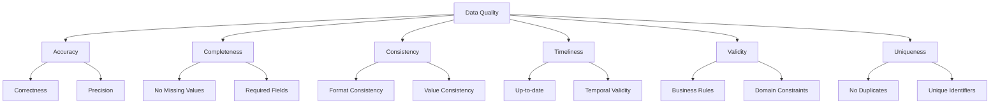

# Data Quality Assessment: Building Trust in Your Data 🎯

Data quality is the foundation of reliable analytics and machine learning. Poor data quality can lead to incorrect insights, biased models, and costly business decisions. This comprehensive guide will help you master the art and science of data quality assessment.

## Understanding Data Quality Dimensions 🌟

Data quality is multifaceted and can be evaluated across several key dimensions. Each dimension represents a critical aspect of data reliability:

1. **Accuracy**: The degree to which data correctly represents the real-world entity or event
   - Example: Customer age should be a reasonable number (0-120)
   - Impact: Inaccurate data leads to wrong insights

2. **Completeness**: The extent to which required data is available
   - Example: All mandatory fields in a form should be filled
   - Impact: Missing data can bias analysis

3. **Consistency**: The degree to which data maintains integrity across the dataset
   - Example: Date formats should be uniform throughout
   - Impact: Inconsistent data causes processing errors

4. **Timeliness**: Whether the data represents the reality from the required point in time
   - Example: Stock prices should be real-time for trading
   - Impact: Outdated data leads to wrong decisions

5. **Validity**: The extent to which data follows business rules and constraints
   - Example: Email addresses should have correct format
   - Impact: Invalid data causes system failures

6. **Uniqueness**: The degree to which data is free from duplicates
   - Example: Each customer should have one unique ID
   - Impact: Duplicates skew analytics results



## Data Quality Metrics and Formulas 📊

Let's explore key metrics for measuring data quality with practical examples:

### 1. Completeness Score
```python
def calculate_completeness(df):
    """
    Calculate completeness score for each column
    
    Parameters:
    df (pandas.DataFrame): Input dataframe
    
    Returns:
    dict: Completeness scores by column
    """
    total_rows = len(df)
    scores = {}
    
    for column in df.columns:
        non_missing = df[column].count()
        completeness = (non_missing / total_rows) * 100
        scores[column] = round(completeness, 2)
    
    return scores

# Example usage
completeness_scores = calculate_completeness(df)
print("\nCompleteness Scores (%):")
for col, score in completeness_scores.items():
    print(f"{col}: {score}%")
```

### 2. Accuracy Score
```python
def check_accuracy(df, rules):
    """
    Check accuracy against business rules
    
    Parameters:
    df (pandas.DataFrame): Input dataframe
    rules (dict): Dictionary of validation rules
    
    Returns:
    dict: Accuracy scores by column
    """
    accuracy_scores = {}
    
    for column, rule in rules.items():
        valid_values = df[column].apply(rule)
        accuracy = (valid_values.sum() / len(df)) * 100
        accuracy_scores[column] = round(accuracy, 2)
    
    return accuracy_scores

# Example usage
rules = {
    'age': lambda x: 0 <= x <= 120,
    'email': lambda x: isinstance(x, str) and '@' in x,
    'price': lambda x: x > 0
}
accuracy_scores = check_accuracy(df, rules)
```

### 3. Consistency Score
```python
def check_consistency(df, consistency_rules):
    """
    Check data consistency across columns
    
    Parameters:
    df (pandas.DataFrame): Input dataframe
    consistency_rules (list): List of consistency check functions
    
    Returns:
    dict: Consistency check results
    """
    results = {}
    
    for rule in consistency_rules:
        rule_name = rule.__name__
        consistent_rows = df.apply(rule, axis=1)
        consistency_score = (consistent_rows.sum() / len(df)) * 100
        results[rule_name] = round(consistency_score, 2)
    
    return results

# Example usage
def check_date_consistency(row):
    return row['order_date'] <= row['delivery_date']

def check_price_consistency(row):
    return row['unit_price'] * row['quantity'] == row['total_price']

consistency_rules = [check_date_consistency, check_price_consistency]
consistency_scores = check_consistency(df, consistency_rules)

```python
def calculate_completeness(df):
    """Calculate completeness score for each column"""
    total_rows = len(df)
    completeness_scores = {}
    
    for column in df.columns:
        non_missing = df[column].count()
        completeness = (non_missing / total_rows) * 100
        completeness_scores[column] = round(completeness, 2)
    
    return completeness_scores

# Example usage
completeness_scores = calculate_completeness(df)
print("Completeness Scores (%):")
for col, score in completeness_scores.items():
    print(f"{col}: {score}%")
```

### 2. Accuracy Score
$Accuracy = \frac{Correct\space Values}{Total\space Values} \times 100$

```python
def check_accuracy(df, rules):
    """Check accuracy against business rules"""
    accuracy_scores = {}
    
    for column, rule in rules.items():
        valid_values = df[column].apply(rule)
        accuracy = (valid_values.sum() / len(df)) * 100
        accuracy_scores[column] = round(accuracy, 2)
    
    return accuracy_scores

# Example usage
rules = {
    'age': lambda x: 0 <= x <= 120,
    'email': lambda x: isinstance(x, str) and '@' in x
}
accuracy_scores = check_accuracy(df, rules)
```

## Real-World Example: E-commerce Data Quality 🛍️

### Loading and Initial Assessment

```python
import pandas as pd
import numpy as np
import seaborn as sns
import matplotlib.pyplot as plt

# Load sample e-commerce data
df = pd.read_csv('sales_data.csv')

# Quick overview
print("Dataset Overview")
print("=" * 50)
print(f"Total Records: {len(df):,}")
print(f"Total Features: {len(df.columns):,}")
print("\nMemory Usage:", df.memory_usage().sum() / 1024**2, "MB")

# Data types summary
print("\nData Types:")
print(df.dtypes.value_counts())
```

### Comprehensive Quality Assessment

```python
class DataQualityAssessment:
    def __init__(self, df):
        self.df = df
        self.quality_scores = {}
    
    def check_completeness(self):
        """Check for missing values"""
        completeness = 1 - (self.df.isnull().sum() / len(self.df))
        self.quality_scores['completeness'] = completeness
        
        # Visualize missing values
        plt.figure(figsize=(12, 6))
        sns.heatmap(self.df.isnull(), yticklabels=False, cbar=True)
        plt.title('Missing Values Heatmap')
        plt.show()
    
    def check_uniqueness(self):
        """Check for duplicates"""
        duplicates = self.df.duplicated().sum()
        self.quality_scores['uniqueness'] = 1 - (duplicates / len(self.df))
        
        if duplicates > 0:
            print(f"Found {duplicates} duplicate records")
            
    def check_validity(self, rules):
        """Check data validity against rules"""
        validity_scores = {}
        
        for column, rule in rules.items():
            if column in self.df.columns:
                valid = self.df[column].apply(rule)
                validity_scores[column] = valid.mean()
        
        self.quality_scores['validity'] = validity_scores
    
    def generate_report(self):
        """Generate comprehensive quality report"""
        report = {
            'record_count': len(self.df),
            'feature_count': len(self.df.columns),
            'memory_usage_mb': self.df.memory_usage().sum() / 1024**2,
            'quality_scores': self.quality_scores
        }
        
        return report

# Example usage
quality_assessment = DataQualityAssessment(df)

# Define validation rules
validation_rules = {
    'price': lambda x: x > 0,
    'quantity': lambda x: x >= 0,
    'email': lambda x: isinstance(x, str) and '@' in x,
    'order_date': lambda x: pd.to_datetime(x, errors='coerce') is not None
}

# Run assessment
quality_assessment.check_completeness()
quality_assessment.check_uniqueness()
quality_assessment.check_validity(validation_rules)

# Get report
report = quality_assessment.generate_report()
```

## Advanced Quality Metrics 📈

### 1. Statistical Quality Control
```python
def statistical_quality_check(df, column, n_std=3):
    """Perform statistical quality control"""
    mean = df[column].mean()
    std = df[column].std()
    
    lower_bound = mean - (n_std * std)
    upper_bound = mean + (n_std * std)
    
    outliers = df[
        (df[column] < lower_bound) | 
        (df[column] > upper_bound)
    ]
    
    return {
        'mean': mean,
        'std': std,
        'bounds': (lower_bound, upper_bound),
        'outliers_count': len(outliers),
        'outliers_percentage': (len(outliers) / len(df)) * 100
    }
```

### 2. Pattern Analysis
```python
def analyze_patterns(df, column):
    """Analyze patterns in data"""
    patterns = {
        'unique_values': df[column].nunique(),
        'value_distribution': df[column].value_counts(normalize=True),
        'common_patterns': df[column].str.extract(r'(\w+)')[0].value_counts()
        if df[column].dtype == 'object' else None
    }
    
    return patterns
```

## Performance Optimization Tips 🚀

1. **Memory Efficiency**
```python
def optimize_datatypes(df):
    """Optimize dataframe memory usage"""
    for col in df.columns:
        if df[col].dtype == 'float64':
            df[col] = pd.to_numeric(df[col], downcast='float')
        elif df[col].dtype == 'int64':
            df[col] = pd.to_numeric(df[col], downcast='integer')
    return df
```

2. **Parallel Processing**
```python
from multiprocessing import Pool

def parallel_quality_check(df_split):
    """Run quality checks in parallel"""
    quality_assessment = DataQualityAssessment(df_split)
    quality_assessment.check_completeness()
    quality_assessment.check_uniqueness()
    return quality_assessment.quality_scores

# Split dataframe and process in parallel
def parallel_assessment(df, n_processes=4):
    splits = np.array_split(df, n_processes)
    with Pool(n_processes) as pool:
        results = pool.map(parallel_quality_check, splits)
    return results
```

## Common Pitfalls and Solutions ⚠️

1. **Missing Value Interpretation**
```python
# Bad: Dropping all missing values
df.dropna()

# Good: Understanding and handling missing values appropriately
def handle_missing_values(df):
    strategies = {
        'numeric': df.select_dtypes(include=[np.number]).columns,
        'categorical': df.select_dtypes(include=['object']).columns
    }
    
    # Handle numeric columns
    df[strategies['numeric']] = df[strategies['numeric']].fillna(
        df[strategies['numeric']].median()
    )
    
    # Handle categorical columns
    df[strategies['categorical']] = df[strategies['categorical']].fillna(
        df[strategies['categorical']].mode().iloc[0]
    )
    
    return df
```

2. **Data Type Mismatches**
```python
def standardize_datatypes(df):
    """Standardize data types across columns"""
    type_mapping = {
        'date_columns': ['order_date', 'shipping_date'],
        'numeric_columns': ['price', 'quantity'],
        'categorical_columns': ['category', 'status']
    }
    
    # Convert date columns
    for col in type_mapping['date_columns']:
        df[col] = pd.to_datetime(df[col], errors='coerce')
    
    # Convert numeric columns
    for col in type_mapping['numeric_columns']:
        df[col] = pd.to_numeric(df[col], errors='coerce')
    
    # Convert categorical columns
    for col in type_mapping['categorical_columns']:
        df[col] = df[col].astype('category')
    
    return df
```

## Interactive Quality Dashboard 📊

```python
import plotly.express as px
import plotly.graph_objects as go

def create_quality_dashboard(df):
    """Create interactive quality dashboard"""
    # Completeness chart
    completeness = (1 - df.isnull().sum() / len(df)) * 100
    fig1 = px.bar(
        x=completeness.index,
        y=completeness.values,
        title='Data Completeness by Column'
    )
    
    # Value distribution
    numeric_cols = df.select_dtypes(include=[np.number]).columns
    fig2 = go.Figure()
    for col in numeric_cols:
        fig2.add_trace(go.Box(y=df[col], name=col))
    fig2.update_layout(title='Value Distributions')
    
    # Show plots
    fig1.show()
    fig2.show()
```

## Practice Exercise: E-commerce Data Quality Assessment 🏋️‍♂️

1. Load the sample dataset
2. Perform initial quality assessment
3. Handle data quality issues
4. Create quality metrics
5. Generate quality report
6. Visualize results

```python
# Sample solution structure
def assess_ecommerce_data(file_path):
    # Load data
    df = pd.read_csv(file_path)
    
    # Initialize quality assessment
    qa = DataQualityAssessment(df)
    
    # Define validation rules
    rules = {
        'price': lambda x: x > 0,
        'quantity': lambda x: x >= 0,
        'customer_id': lambda x: x > 0,
        'order_date': lambda x: pd.to_datetime(x, errors='coerce') is not None
    }
    
    # Run assessment
    qa.check_completeness()
    qa.check_uniqueness()
    qa.check_validity(rules)
    
    # Generate report
    report = qa.generate_report()
    
    # Create visualizations
    create_quality_dashboard(df)
    
    return report

# Run assessment
report = assess_ecommerce_data('sales_data.csv')
```

Remember: "Data quality is not a destination, but a continuous journey of improvement!" 🚀
