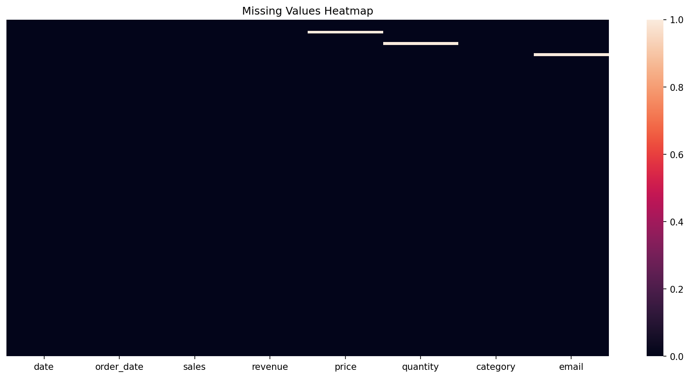

# Data Quality Assessment: Building Trust in Your Data

**After this lesson:** You can evaluate data along dimensions like **accuracy**, **completeness**, **consistency**, and **timeliness**, and document issues before modeling or reporting.

## Helpful video

Pandas DataFrames in a quick walkthrough, useful for cleaning and wrangling.

## Overview

**Prerequisites:** [Pandas](../../1-data-fundamentals/1.5-data-analysis-pandas/) (**describe**, **info**, **value\_counts**). [SQL (Module 2.1)](../2.1-sql/) helps if your source data lives in a database.

> **Time needed:** About 45-60 minutes for concepts; more if you build the full dashboard examples.

## Why this matters

You cannot fix what you do not measure. **Accuracy**, **completeness**, and **consistency** sound like buzzwords until a duplicate customer ID doubles revenue or a silent NULL column trains the wrong model. This lesson gives you a shared checklist to _document_ problems before you impute, plot, or report.

Data quality is the foundation of reliable analytics and machine learning. Poor data quality can lead to incorrect insights, biased models, and costly business decisions. This guide walks through dimensions and metrics you can apply on real tables.

## Understanding Data Quality Dimensions

Data quality is multifaceted and can be evaluated across several key dimensions. Each dimension represents a critical aspect of data reliability:

1. **Accuracy**: The degree to which data correctly represents the real-world entity or event
   * Example: Customer age should be a reasonable number (0-120)
   * Impact: Inaccurate data leads to wrong insights
2. **Completeness**: The extent to which required data is available
   * Example: All mandatory fields in a form should be filled
   * Impact: Missing data can bias analysis
3. **Consistency**: The degree to which data maintains integrity across the dataset
   * Example: Date formats should be uniform throughout
   * Impact: Inconsistent data causes processing errors
4. **Timeliness**: Whether the data represents the reality from the required point in time
   * Example: Stock prices should be real-time for trading
   * Impact: Outdated data leads to wrong decisions
5. **Validity**: The extent to which data follows business rules and constraints
   * Example: Email addresses should have correct format
   * Impact: Invalid data causes system failures
6. **Uniqueness**: The degree to which data is free from duplicates
   * Example: Each customer should have one unique ID
   * Impact: Duplicates skew analytics results

## Data Quality Metrics and Formulas

we will look at key metrics for measuring data quality with practical examples:

### 1. Completeness Score

```

Completeness Scores (%):
date: 100.0%
order_date: 100.0%
sales: 100.0%
revenue: 100.0%
price: 99.17%
quantity: 99.17%
category: 100.0%
email: 99.17%
```

Imports and data loading

Imports pandas and NumPy, then reads the sales CSV into a DataFrame.

calculate\_completeness function

For each column, divides non-null count by total rows and multiplies by 100. Returns a dict mapping column name to completeness percentage.

Example usage

Calls the function and prints each column's completeness score so you can immediately see which columns have missing data.

```

Completeness Scores (%):
date: 100.0%
order_date: 100.0%
sales: 100.0%
revenue: 100.0%
price: 99.17%
quantity: 99.17%
category: 100.0%
email: 99.17%
```

### 2. Accuracy Score

Function definition and docstring

Defines `check_accuracy`, documenting that `rules` is a dict mapping column names to validator functions and that it returns accuracy scores per column.

Apply rules and example usage

Applies each validator with `df[column].apply(rule)` and computes the percentage of rows that pass, then demonstrates with age range, email format, and positive-price checks.

### 3. Consistency Score

Function definition and implementation

Applies each rule function row-wise with `df.apply(rule, axis=1)`, computes the percentage of rows that satisfy it, and stores the result keyed by the rule's function name.

Example consistency rules

Defines two row-level validators: order date must precede delivery date, and unit price × quantity must equal total price, common cross-column integrity checks.

```
Completeness Scores (%):
date: 100.0%
order_date: 100.0%
sales: 100.0%
revenue: 100.0%
price: 99.17%
quantity: 99.17%
category: 100.0%
email: 99.17%
```

Completeness function (condensed)

A concise version of the completeness calculation: iterates over columns, computes the non-null fraction, rounds to 2 decimal places, and returns the scores dict.

Example usage

Calls the function and prints each column's score, use this as a quick quality check at the start of any analysis.

```
Completeness Scores (%):
date: 100.0%
order_date: 100.0%
sales: 100.0%
revenue: 100.0%
price: 99.17%
quantity: 99.17%
category: 100.0%
email: 99.17%
```

### 2. Accuracy Score

$Accuracy = \frac{Correct\space Values}{Total\space Values} \times 100$

Accuracy check function (condensed)

A compact version without the docstring: applies each rule function and computes the percentage of rows that pass, returning scores keyed by column name.

Example usage

Demonstrates with two lambda rules: valid age range (0-120) and email format containing '@'-both are simple domain constraints any dataset should satisfy.

## Real-World Example: E-commerce Data Quality

### Loading and Initial Assessment

```
Dataset Overview
==================================================
Total Records: 120
Total Features: 8

Memory Usage: 0.007450103759765625 MB

Data Types:
str        4
float64    4
Name: count, dtype: int64
```

Imports and data loading

Imports four libraries and reads the sales CSV, seaborn and matplotlib are available here for later quality visualisations.

Quick dataset overview

Prints record count, feature count, memory footprint, and a dtype summary, four numbers that tell you scale, cost, and what types of quality checks are relevant.

```
Dataset Overview
==================================================
Total Records: 120
Total Features: 8

Memory Usage: 0.007450103759765625 MB

Data Types:
str        4
float64    4
Name: count, dtype: int64
```

### Comprehensive Quality Assessment

Class definition and \_\_init\_\_

Stores the DataFrame and initialises an empty `quality_scores` dict that will accumulate scores from each check method.

check\_completeness and check\_uniqueness

`check_completeness` computes the non-null fraction per column and renders a heatmap; `check_uniqueness` counts duplicates and stores the uniqueness ratio.

check\_validity

Applies each rule function to its column and stores the fraction of rows that pass, one score per column present in the rules dict.

generate\_report

Assembles record count, feature count, memory usage, and accumulated quality scores into a single report dictionary.

Example usage

Instantiates the assessor, defines validation rules for four columns, runs all three checks in sequence, and generates the final quality report.

<figure><figcaption><p>Figure 1: Missing Values Heatmap</p></figcaption></figure>

## Advanced Quality Metrics

### 1. Statistical Quality Control

Compute bounds

Computes the column mean and std, then sets lower and upper control limits at ±_n_·σ from the mean (default 3σ).

Filter outliers and return report

Filters rows outside the bounds, then returns a dict with mean, std, the bounds, and both the count and percentage of values outside them.

### 2. Pattern Analysis

Pattern analysis

Returns unique value count, normalised value frequencies, and (for string columns) the most common word patterns extracted via regex, useful for spotting typos or inconsistent formats.

## Performance Optimization Tips

1. **Memory Efficiency**

Def optimize\_datatypes(df):

**Def optimize\_datatypes(df):**, lines 1-8. Walk this block top to bottom: imports, inputs, then the transformation or plot that uses them.

2. **Parallel Processing**

From multiprocessing import Pool

**From multiprocessing import Pool**, lines 1-7. Walk this block top to bottom: imports, inputs, then the transformation or plot that uses them.

Return quality\_assessment.quality\_scores

**Return quality\_assessment.quality\_scores**, lines 8-15 in the highlighted code. Identify what this band does: DDL (table/column definitions), row changes (`INSERT`/`UPDATE`/`DELETE`), or a `SELECT` pipeline, then read joins and predicates in snippet order.

## Common Pitfalls and Solutions

1. **Missing Value Interpretation**

Bad: Dropping all missing values

**Bad: Dropping all missing values**, lines 1-10 in the snippet. Contrast this with the alternative below; the goal is to avoid accidental cartesian products, non-sargable predicates, or silent data loss.

Handle numeric columns

**Handle numeric columns**, lines 11-21 in the highlighted code. Identify what this band does: DDL (table/column definitions), row changes (`INSERT`/`UPDATE`/`DELETE`), or a `SELECT` pipeline, then read joins and predicates in snippet order.

2. **Data Type Mismatches**

Def standardize\_datatypes(df):

**Def standardize\_datatypes(df):**, lines 1-10. Walk this block top to bottom: imports, inputs, then the transformation or plot that uses them.

Df\[col] = pd.to\_datetime(df\[col], errors='coe…

**Df\[col] = pd.to\_datetime(df\[col], errors='coe…**, lines 11-21 in the highlighted code. Identify what this band does: DDL (table/column definitions), row changes (`INSERT`/`UPDATE`/`DELETE`), or a `SELECT` pipeline, then read joins and predicates in snippet order.

## Interactive Quality Dashboard

Import plotly.express as px

**Import plotly.express as px**, lines 1-11. Walk this block top to bottom: imports, inputs, then the transformation or plot that uses them.

)

**)**, lines 12-23 in the highlighted code. Identify what this band does: DDL (table/column definitions), row changes (`INSERT`/`UPDATE`/`DELETE`), or a `SELECT` pipeline, then read joins and predicates in snippet order.

## Practice Exercise: E-commerce Data Quality Assessment

1. Load the sample dataset
2. Perform initial quality assessment
3. Handle data quality issues
4. Create quality metrics
5. Generate quality report
6. Visualize results

<figure><figcaption><p>Figure 1: Missing Values Heatmap</p></figcaption></figure>

Sample solution structure

**Sample solution structure**, lines 1-10 in the highlighted code. Identify what this band does: DDL (table/column definitions), row changes (`INSERT`/`UPDATE`/`DELETE`), or a `SELECT` pipeline, then read joins and predicates in snippet order.

'price': lambda x: x > 0,

**'price': lambda x: x > 0,**, lines 11-20 in the highlighted code. Identify what this band does: DDL (table/column definitions), row changes (`INSERT`/`UPDATE`/`DELETE`), or a `SELECT` pipeline, then read joins and predicates in snippet order.

Generate report

**Generate report**, lines 21-31 in the highlighted code. Identify what this band does: DDL (table/column definitions), row changes (`INSERT`/`UPDATE`/`DELETE`), or a `SELECT` pipeline, then read joins and predicates in snippet order.

<figure><figcaption><p>Figure 2: Missing Values Heatmap</p></figcaption></figure>

Remember: "Data quality is not a destination, but a continuous journey of improvement!"

## Next steps

* [Missing values](missing-values.md), patterns and imputation
* [Outliers](outliers.md), detection and treatment
* [Transformations](transformations.md), encode and scale for analysis
* [Module README](./)
