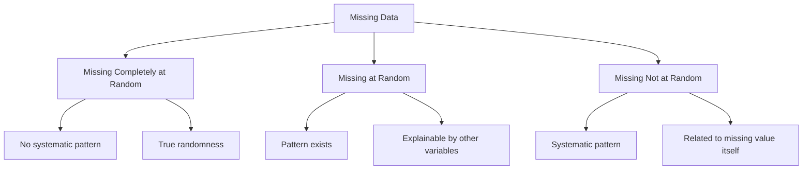
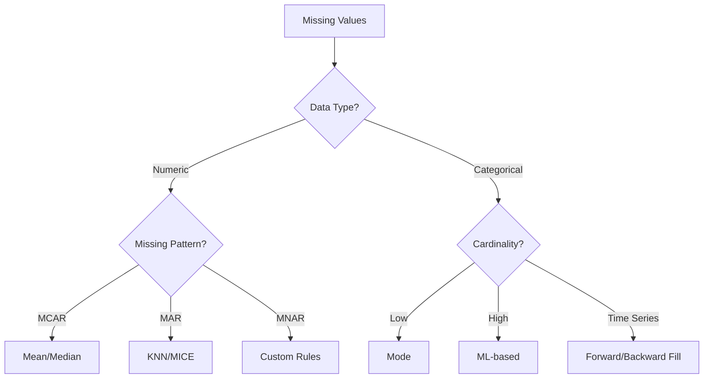

# Missing Values: Strategies for Incomplete Data 🔍

Missing data is one of the most common and challenging issues in data analysis. Understanding the nature of missing values and choosing appropriate handling strategies is crucial for maintaining data integrity and ensuring reliable analysis results.

## Understanding Missing Data Mechanisms 📊

Missing data can occur through different mechanisms, each requiring different handling approaches:



### Missing Data Mechanisms Explained

1. **Missing Completely at Random (MCAR)**
   - Definition: Missing values occur purely by chance
   - Mathematical: $P(R|X_{complete}) = P(R)$
   - Example: Survey responses lost due to system error
   - Detection: Little's MCAR test
   - Impact: Unbiased estimates possible with complete case analysis

2. **Missing at Random (MAR)**
   - Definition: Missing values depend on observed data
   - Mathematical: $P(R|X_{complete}) = P(R|X_{observed})$
   - Example: Older people more likely to skip income questions
   - Detection: Analyze patterns in observed data
   - Impact: Can be handled with multiple imputation

3. **Missing Not at Random (MNAR)**
   - Definition: Missing values depend on unobserved data
   - Mathematical: $P(R|X_{complete}) \neq P(R|X_{observed})$
   - Example: People with high incomes not reporting income
   - Detection: Requires domain knowledge
   - Impact: Most challenging to handle, may need sensitivity analysis

```python
def analyze_missing_mechanism(df):
    """
    Analyze missing data patterns to suggest likely mechanism
    
    Parameters:
    df (pandas.DataFrame): Input dataframe
    
    Returns:
    dict: Analysis results and mechanism suggestions
    """
    from scipy import stats
    
    results = {
        'missing_patterns': {},
        'correlations': {},
        'mechanism_hints': []
    }
    
    # Analyze missing patterns
    missing_patterns = df.isnull().sum() / len(df) * 100
    results['missing_patterns'] = missing_patterns.to_dict()
    
    # Check for relationships between missing values
    missing_corr = df.isnull().corr()
    results['correlations'] = missing_corr.to_dict()
    
    # Perform Little's MCAR test
    # Note: This is a simplified version
    numeric_cols = df.select_dtypes(include=[np.number]).columns
    if len(numeric_cols) >= 2:
        chi2, p_value = stats.chi2_contingency(df[numeric_cols].isnull())[:2]
        results['littles_test'] = {
            'chi2': chi2,
            'p_value': p_value,
            'interpretation': 'MCAR possible' if p_value > 0.05 else 'Not MCAR'
        }
    
    return results

## Missing Value Analysis Framework 🔬

### 1. Detection and Visualization

```python
import pandas as pd
import numpy as np
import seaborn as sns
import matplotlib.pyplot as plt
import missingno as msno

def analyze_missing_values(df):
    """Comprehensive missing value analysis"""
    
    # Basic statistics
    missing_stats = pd.DataFrame({
        'Missing Count': df.isnull().sum(),
        'Missing Percentage': (df.isnull().sum() / len(df)) * 100,
        'Data Type': df.dtypes
    })
    
    # Visualizations
    plt.figure(figsize=(15, 8))
    
    # 1. Missing value heatmap
    plt.subplot(2, 2, 1)
    sns.heatmap(df.isnull(), yticklabels=False, cbar=True)
    plt.title('Missing Value Patterns')
    
    # 2. Missing value correlation
    plt.subplot(2, 2, 2)
    msno.matrix(df)
    plt.title('Missing Value Matrix')
    
    # 3. Missing value bar chart
    plt.subplot(2, 2, 3)
    missing_stats['Missing Percentage'].plot(kind='bar')
    plt.title('Missing Value Percentage by Column')
    plt.xticks(rotation=45)
    
    # 4. Missing value correlation heatmap
    plt.subplot(2, 2, 4)
    msno.heatmap(df)
    plt.title('Missing Value Correlation')
    
    plt.tight_layout()
    plt.show()
    
    return missing_stats

# Example usage
missing_analysis = analyze_missing_values(df)
print("\nMissing Value Statistics:")
print(missing_analysis)
```

## Imputation Strategies Decision Tree 🌳



## Advanced Imputation Techniques 🚀

### 1. Statistical Imputation

```python
class StatisticalImputer:
    """Advanced statistical imputation methods"""
    
    def __init__(self, strategy='mean'):
        self.strategy = strategy
        self.statistics = {}
    
    def fit(self, df):
        """Calculate statistics for imputation"""
        for column in df.select_dtypes(include=[np.number]):
            if self.strategy == 'mean':
                self.statistics[column] = df[column].mean()
            elif self.strategy == 'median':
                self.statistics[column] = df[column].median()
            elif self.strategy == 'weighted_mean':
                # Weighted mean based on correlation
                correlations = df[column].corr(df.drop(columns=[column]))
                weights = correlations.abs() / correlations.abs().sum()
                self.statistics[column] = (df[column] * weights).sum()
    
    def transform(self, df):
        """Apply imputation"""
        df_imputed = df.copy()
        for column, value in self.statistics.items():
            df_imputed[column].fillna(value, inplace=True)
        return df_imputed
```

### 2. Machine Learning Imputation

```python
from sklearn.ensemble import RandomForestRegressor, RandomForestClassifier

class MLImputer:
    """Machine learning based imputation"""
    
    def __init__(self, categorical_features=None):
        self.categorical_features = categorical_features or []
        self.models = {}
    
    def fit_transform(self, df):
        df_imputed = df.copy()
        
        for column in df.columns:
            if df[column].isnull().any():
                # Prepare training data
                known_data = df[~df[column].isnull()].copy()
                missing_data = df[df[column].isnull()].copy()
                
                # Select features for prediction
                features = [f for f in df.columns if f != column]
                
                # Handle categorical features
                if column in self.categorical_features:
                    model = RandomForestClassifier(n_estimators=100)
                else:
                    model = RandomForestRegressor(n_estimators=100)
                
                # Train model
                model.fit(
                    known_data[features].fillna(0),
                    known_data[column]
                )
                
                # Predict missing values
                predictions = model.predict(
                    missing_data[features].fillna(0)
                )
                
                # Fill missing values
                df_imputed.loc[df[column].isnull(), column] = predictions
                
                self.models[column] = model
        
        return df_imputed
```

### 3. Multiple Imputation

```python
def multiple_imputation(df, n_imputations=5):
    """Multiple imputation with uncertainty estimation"""
    
    imputed_datasets = []
    
    for i in range(n_imputations):
        # Create imputer with different random state
        imputer = IterativeImputer(
            estimator=RandomForestRegressor(),
            random_state=i,
            max_iter=10
        )
        
        # Impute values
        imputed_data = imputer.fit_transform(df)
        imputed_df = pd.DataFrame(imputed_data, columns=df.columns)
        
        imputed_datasets.append(imputed_df)
    
    # Calculate statistics across imputations
    combined_stats = {}
    for column in df.columns:
        values = np.array([df[column].values for df in imputed_datasets])
        combined_stats[column] = {
            'mean': np.mean(values, axis=0),
            'std': np.std(values, axis=0),
            'ci_lower': np.percentile(values, 2.5, axis=0),
            'ci_upper': np.percentile(values, 97.5, axis=0)
        }
    
    return imputed_datasets, combined_stats
```

## Performance Impact Analysis 📈

```python
def analyze_imputation_impact(original_df, imputed_df, target_col):
    """Analyze impact of imputation on model performance"""
    
    from sklearn.model_selection import train_test_split
    from sklearn.metrics import mean_squared_error, r2_score
    
    results = {}
    
    # Split data
    X_orig = original_df.drop(columns=[target_col])
    y_orig = original_df[target_col]
    
    X_imp = imputed_df.drop(columns=[target_col])
    y_imp = imputed_df[target_col]
    
    # Train models
    models = {
        'original': RandomForestRegressor(n_estimators=100),
        'imputed': RandomForestRegressor(n_estimators=100)
    }
    
    for name, model in models.items():
        X = X_orig if name == 'original' else X_imp
        y = y_orig if name == 'original' else y_imp
        
        X_train, X_test, y_train, y_test = train_test_split(
            X, y, test_size=0.2, random_state=42
        )
        
        model.fit(X_train, y_train)
        y_pred = model.predict(X_test)
        
        results[name] = {
            'mse': mean_squared_error(y_test, y_pred),
            'r2': r2_score(y_test, y_pred)
        }
    
    return results
```

## Best Practices and Common Pitfalls ⚠️

### 1. Data Understanding
- Always investigate why data is missing
- Consider domain knowledge
- Document assumptions

### 2. Method Selection
```python
def select_imputation_method(df, column):
    """Select appropriate imputation method"""
    
    missing_rate = df[column].isnull().mean()
    data_type = df[column].dtype
    unique_ratio = df[column].nunique() / len(df)
    
    if missing_rate > 0.5:
        return "Consider dropping column"
    
    if pd.api.types.is_numeric_dtype(data_type):
        if missing_rate < 0.1:
            return "Mean/Median imputation"
        else:
            return "KNN/MICE imputation"
    
    if pd.api.types.is_categorical_dtype(data_type):
        if unique_ratio < 0.05:
            return "Mode imputation"
        else:
            return "ML-based imputation"
    
    return "Custom imputation needed"
```

### 3. Validation
```python
def validate_imputation(original_df, imputed_df):
    """Validate imputation results"""
    
    validations = []
    
    # Check value ranges
    for column in original_df.columns:
        if pd.api.types.is_numeric_dtype(original_df[column]):
            orig_range = original_df[column].describe()
            imp_range = imputed_df[column].describe()
            
            validations.append({
                'column': column,
                'check': 'range',
                'original': [orig_range['min'], orig_range['max']],
                'imputed': [imp_range['min'], imp_range['max']]
            })
    
    # Check correlations
    orig_corr = original_df.corr()
    imp_corr = imputed_df.corr()
    
    correlation_diff = (orig_corr - imp_corr).abs().max().max()
    validations.append({
        'check': 'correlation_preservation',
        'max_difference': correlation_diff
    })
    
    return validations
```

## Practice Exercise: E-commerce Missing Data 🏋️‍♂️

Scenario: You have an e-commerce dataset with missing customer and transaction data.

```python
# Load and prepare data
df = pd.read_csv('ecommerce_data.csv')

# 1. Analyze missing patterns
missing_analysis = analyze_missing_values(df)

# 2. Apply appropriate imputation
numeric_imputer = StatisticalImputer(strategy='weighted_mean')
categorical_imputer = MLImputer(
    categorical_features=['category', 'customer_segment']
)

# 3. Validate results
validation_results = validate_imputation(df, imputed_df)

# 4. Document findings
imputation_report = {
    'missing_analysis': missing_analysis,
    'imputation_methods': {
        'numeric': 'weighted_mean',
        'categorical': 'ml_based'
    },
    'validation_results': validation_results
}
```

Remember: "The quality of your imputation directly impacts the reliability of your analysis!" 🎯
