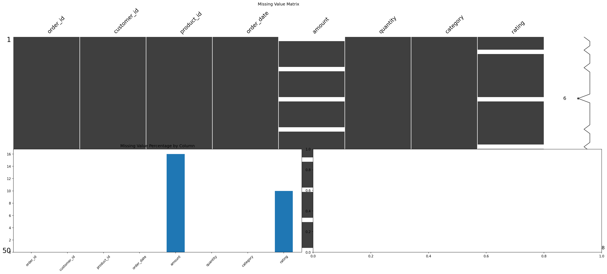

# Missing Values: Strategies for Incomplete Data

**After this lesson:** You can tell **MCAR**, **MAR**, and **MNAR** apart in plain language, explore missingness patterns in **pandas**, and pick a defensible strategy (drop, impute, or model) for a simple dataset.

## Helpful video

Pandas DataFrames in a quick walkthrough—useful for cleaning and wrangling.

<iframe width="560" height="315" src="https://www.youtube.com/embed/m1_33jhhiLE" title="Learn PANDAS in 5 minutes" frameborder="0" allow="accelerometer; autoplay; clipboard-write; encrypted-media; gyroscope; picture-in-picture" allowfullscreen></iframe>

## Overview

**Prerequisites:** [Data quality assessment](data-quality.md) and [Pandas](../../1-data-fundamentals/1.5-data-analysis-pandas/README.md) basics (**isna**, indexing). Optional: probability ideas from [Intro Statistics](../../1-data-fundamentals/1.3-intro-statistics/README.md).

> **Time needed:** 60–90 minutes; the code examples are dense—run them in a notebook.

> **Note:** **MCAR** (Missing Completely at Random), **MAR** (Missing at Random), and **MNAR** (Missing Not at Random) describe *why* data might be missing—see the diagram below.

## Why this matters

Defaulting to “drop all rows with NA” or “fill with zero” can **bias** estimates or hide real effects. The mechanism (MCAR / MAR / MNAR) tells you whether simple fixes are defensible or whether you need domain input, imputation, or sensitivity analysis.

Missing data is one of the most common and challenging issues in data analysis. Understanding the nature of missing values and choosing appropriate handling strategies is crucial for maintaining data integrity and ensuring reliable analysis results.

## Understanding Missing Data Mechanisms

Missing data can occur through different mechanisms, each requiring different handling approaches:



### Missing Data Mechanisms Explained

1. **Missing Completely at Random (MCAR)**
   - Definition: Missing values occur purely by chance
   - Mathematical: $P(R|X_{complete}) = P(R)$
   - Example: Survey responses lost due to system error
   - Detection: Little's MCAR test
   - Impact: Unbiased estimates possible with complete case analysis

2. **Missing at Random (MAR)**
   - Definition: Missing values depend on observed data
   - Mathematical: $P(R|X_{complete}) = P(R|X_{observed})$
   - Example: Older people more likely to skip income questions
   - Detection: Analyze patterns in observed data
   - Impact: Can be handled with multiple imputation

3. **Missing Not at Random (MNAR)**
   - Definition: Missing values depend on unobserved data
   - Mathematical: $P(R|X_{complete}) \neq P(R|X_{observed})$
   - Example: People with high incomes not reporting income
   - Detection: Requires domain knowledge
   - Impact: Most challenging to handle, may need sensitivity analysis

<div class="code-explainer" data-code-explainer>
<div class="code-explainer__code">


# no-output
def analyze_missing_mechanism(df):
    """
    Analyze missing data patterns to suggest likely mechanism
    
    Parameters:
    df (pandas.DataFrame): Input dataframe
    
    Returns:
    dict: Analysis results and mechanism suggestions
    """
    from scipy import stats
    
    results = {
        'missing_patterns': {},
        'correlations': {},
        'mechanism_hints': []
    }
    
    # Analyze missing patterns
    missing_patterns = df.isnull().sum() / len(df) * 100
    results['missing_patterns'] = missing_patterns.to_dict()
    
    # Check for relationships between missing values
    missing_corr = df.isnull().corr()
    results['correlations'] = missing_corr.to_dict()
    
    # Perform Little's MCAR test
    # Note: This is a simplified version
    numeric_cols = df.select_dtypes(include=[np.number]).columns
    if len(numeric_cols) >= 2:
        chi2, p_value = stats.chi2_contingency(df[numeric_cols].isnull())[:2]
        results['littles_test'] = {
            'chi2': chi2,
            'p_value': p_value,
            'interpretation': 'MCAR possible' if p_value > 0.05 else 'Not MCAR'
        }
    
    return results

</div>
<aside class="code-explainer__callouts" aria-label="Code walkthrough">
  <div class="code-callout" data-lines="1-11" data-tint="1">
    <div class="code-callout__meta">
      <span class="code-callout__lines"></span>
      <span class="code-callout__title">Function signature and docstring</span>
    </div>
    <div class="code-callout__body">
      <p>Defines <code>analyze_missing_mechanism</code> and documents its parameters and return value—a dict of analysis results.</p>
    </div>
  </div>
  <div class="code-callout" data-lines="12-22" data-tint="2">
    <div class="code-callout__meta">
      <span class="code-callout__lines"></span>
      <span class="code-callout__title">Analyze missing patterns and correlations</span>
    </div>
    <div class="code-callout__body">
      <p>Calculates per-column missing rates (as percentages) and the correlation matrix between missing indicators—high correlation suggests MAR rather than MCAR.</p>
    </div>
  </div>
  <div class="code-callout" data-lines="27-39" data-tint="3">
    <div class="code-callout__meta">
      <span class="code-callout__lines"></span>
      <span class="code-callout__title">Little's MCAR test</span>
    </div>
    <div class="code-callout__body">
      <p>Runs a simplified chi-squared test on the null indicators. A p-value &gt; 0.05 is consistent with MCAR; lower values suggest a systematic pattern.</p>
    </div>
  </div>
</aside>
</div>

## Missing Value Analysis Framework 

### 1. Detection and Visualization

<div class="code-explainer" data-code-explainer>
<div class="code-explainer__code">


import pandas as pd
import numpy as np
import seaborn as sns
import matplotlib.pyplot as plt
import missingno as msno

df = pd.read_csv('../_data/ecommerce_data.csv')

def analyze_missing_values(df):
    """Comprehensive missing value analysis"""
    
    # Basic statistics
    missing_stats = pd.DataFrame({
        'Missing Count': df.isnull().sum(),
        'Missing Percentage': (df.isnull().sum() / len(df)) * 100,
        'Data Type': df.dtypes
    })
    
    # Visualizations
    plt.figure(figsize=(15, 8))
    
    # 1. Missing value heatmap
    plt.subplot(2, 2, 1)
    sns.heatmap(df.isnull(), yticklabels=False, cbar=True)
    plt.title('Missing Value Patterns')
    
    # 2. Missing value correlation
    plt.subplot(2, 2, 2)
    msno.matrix(df)
    plt.title('Missing Value Matrix')
    
    # 3. Missing value bar chart
    plt.subplot(2, 2, 3)
    missing_stats['Missing Percentage'].plot(kind='bar')
    plt.title('Missing Value Percentage by Column')
    plt.xticks(rotation=45)
    
    # 4. Missing value correlation heatmap
    plt.subplot(2, 2, 4)
    msno.heatmap(df)
    plt.title('Missing Value Correlation')
    
    plt.tight_layout()
    plt.show()
    
    return missing_stats

# Example usage
missing_analysis = analyze_missing_values(df)
print("\nMissing Value Statistics:")
print(missing_analysis)




```

Missing Value Statistics:
             Missing Count  Missing Percentage Data Type
customer_id              0                 0.0     int64
product_id               0                 0.0     int64
order_date               0                 0.0       str
amount                   8                16.0   float64
quantity                 0                 0.0   float64
category                 0                 0.0       str
rating                   5                10.0   float64
```

</div>
<aside class="code-explainer__callouts" aria-label="Code walkthrough">
  <div class="code-callout" data-lines="1-7" data-tint="1">
    <div class="code-callout__meta">
      <span class="code-callout__lines"></span>
      <span class="code-callout__title">Imports and data loading</span>
    </div>
    <div class="code-callout__body">
      <p>Imports five libraries (pandas, NumPy, seaborn, matplotlib, missingno) and reads the e-commerce CSV into a DataFrame.</p>
    </div>
  </div>
  <div class="code-callout" data-lines="9-17" data-tint="2">
    <div class="code-callout__meta">
      <span class="code-callout__lines"></span>
      <span class="code-callout__title">Compute missing-value statistics</span>
    </div>
    <div class="code-callout__body">
      <p>Builds a summary DataFrame showing missing count, missing percentage, and data type for every column.</p>
    </div>
  </div>
  <div class="code-callout" data-lines="19-36" data-tint="3">
    <div class="code-callout__meta">
      <span class="code-callout__lines"></span>
      <span class="code-callout__title">Four-panel visualization</span>
    </div>
    <div class="code-callout__body">
      <p>Creates a 2×2 figure: a heatmap of null positions, a missingno matrix, a bar chart of missing percentages, and a missingno correlation heatmap.</p>
    </div>
  </div>
  <div class="code-callout" data-lines="43-51" data-tint="4">
    <div class="code-callout__meta">
      <span class="code-callout__lines"></span>
      <span class="code-callout__title">Display and return results</span>
    </div>
    <div class="code-callout__body">
      <p>Calls <code>tight_layout</code> and shows the figure, then returns the statistics DataFrame. The final two lines call the function and print its output.</p>
    </div>
  </div>
</aside>
</div>


<figure>

<figcaption>Figure 1: Missing Value Patterns</figcaption>
</figure>


<figure>

<figcaption>Figure 2: Generated visualization</figcaption>
</figure>


<figure>

<figcaption>Figure 3: Missing Value Correlation</figcaption>
</figure>

```

Missing Value Statistics:
             Missing Count  Missing Percentage Data Type
order_id                 0                 0.0     int64
customer_id              0                 0.0     int64
product_id               0                 0.0     int64
order_date               0                 0.0       str
amount                   8                16.0   float64
quantity                 0                 0.0   float64
category                 0                 0.0       str
rating                   5                10.0   float64
```

## Imputation Strategies Decision Tree



## Advanced Imputation Techniques

### 1. Statistical Imputation

<div class="code-explainer" data-code-explainer>
<div class="code-explainer__code">


class StatisticalImputer:
    """Advanced statistical imputation methods"""
    
    def __init__(self, strategy='mean'):
        self.strategy = strategy
        self.statistics = {}
    
    def fit(self, df):
        """Calculate statistics for imputation"""
        for column in df.select_dtypes(include=[np.number]):
            if self.strategy == 'mean':
                self.statistics[column] = df[column].mean()
            elif self.strategy == 'median':
                self.statistics[column] = df[column].median()
            elif self.strategy == 'weighted_mean':
                # Weighted mean based on correlation
                correlations = df[column].corr(df.drop(columns=[column]))
                weights = correlations.abs() / correlations.abs().sum()
                self.statistics[column] = (df[column] * weights).sum()
    
    def transform(self, df):
        """Apply imputation"""
        df_imputed = df.copy()
        for column, value in self.statistics.items():
            df_imputed[column].fillna(value, inplace=True)
        return df_imputed

</div>
<aside class="code-explainer__callouts" aria-label="Code walkthrough">
  <div class="code-callout" data-lines="1-7" data-tint="1">
    <div class="code-callout__meta">
      <span class="code-callout__lines"></span>
      <span class="code-callout__title">Class definition and __init__</span>
    </div>
    <div class="code-callout__body">
      <p>Defines the class with a <code>strategy</code> parameter ('mean', 'median', or 'weighted_mean') and an empty <code>statistics</code> dict that will store computed fill values.</p>
    </div>
  </div>
  <div class="code-callout" data-lines="8-19" data-tint="2">
    <div class="code-callout__meta">
      <span class="code-callout__lines"></span>
      <span class="code-callout__title">fit: compute fill statistics</span>
    </div>
    <div class="code-callout__body">
      <p>Loops over numeric columns and computes mean, median, or a correlation-weighted mean—whichever strategy was chosen—storing results in <code>self.statistics</code>.</p>
    </div>
  </div>
  <div class="code-callout" data-lines="21-26" data-tint="3">
    <div class="code-callout__meta">
      <span class="code-callout__lines"></span>
      <span class="code-callout__title">transform: apply imputation</span>
    </div>
    <div class="code-callout__body">
      <p>Copies the DataFrame and fills each column's nulls with the value stored in <code>self.statistics</code>, leaving the original untouched.</p>
    </div>
  </div>
</aside>
</div>

### 2. Machine Learning Imputation

<div class="code-explainer" data-code-explainer>
<div class="code-explainer__code">


from sklearn.ensemble import RandomForestRegressor, RandomForestClassifier

class MLImputer:
    """Machine learning based imputation"""
    
    def __init__(self, categorical_features=None):
        self.categorical_features = categorical_features or []
        self.models = {}
    
    def fit_transform(self, df):
        df_imputed = df.copy()
        
        for column in df.columns:
            if df[column].isnull().any():
                # Prepare training data
                known_data = df[~df[column].isnull()].copy()
                missing_data = df[df[column].isnull()].copy()
                
                # Select features for prediction
                features = [f for f in df.columns if f != column]
                
                # Handle categorical features
                if column in self.categorical_features:
                    model = RandomForestClassifier(n_estimators=100)
                else:
                    model = RandomForestRegressor(n_estimators=100)
                
                # Train model
                model.fit(
                    known_data[features].fillna(0),
                    known_data[column]
                )
                
                # Predict missing values
                predictions = model.predict(
                    missing_data[features].fillna(0)
                )
                
                # Fill missing values
                df_imputed.loc[df[column].isnull(), column] = predictions
                
                self.models[column] = model
        
        return df_imputed

</div>
<aside class="code-explainer__callouts" aria-label="Code walkthrough">
  <div class="code-callout" data-lines="1-8" data-tint="1">
    <div class="code-callout__meta">
      <span class="code-callout__lines"></span>
      <span class="code-callout__title">Imports, class definition, and __init__</span>
    </div>
    <div class="code-callout__body">
      <p>Imports both Random Forest variants and defines the class; <code>__init__</code> stores which columns are categorical and initializes an empty <code>models</code> dict.</p>
    </div>
  </div>
  <div class="code-callout" data-lines="10-20" data-tint="2">
    <div class="code-callout__meta">
      <span class="code-callout__lines"></span>
      <span class="code-callout__title">Prepare training and missing subsets</span>
    </div>
    <div class="code-callout__body">
      <p>For each column with nulls, splits the data into rows where the value is known (for training) and rows where it is missing (for prediction).</p>
    </div>
  </div>
  <div class="code-callout" data-lines="22-32" data-tint="3">
    <div class="code-callout__meta">
      <span class="code-callout__lines"></span>
      <span class="code-callout__title">Choose model type and train</span>
    </div>
    <div class="code-callout__body">
      <p>Selects a classifier for categorical columns or a regressor for numeric ones, then fits it on the known rows (zero-filling any remaining nulls in the features).</p>
    </div>
  </div>
  <div class="code-callout" data-lines="34-44" data-tint="4">
    <div class="code-callout__meta">
      <span class="code-callout__lines"></span>
      <span class="code-callout__title">Predict, fill, and return</span>
    </div>
    <div class="code-callout__body">
      <p>Predicts values for the missing rows, writes them back into the copied DataFrame, stores the fitted model, and returns the imputed result.</p>
    </div>
  </div>
</aside>
</div>

### 3. Multiple Imputation

<div class="code-explainer" data-code-explainer>
<div class="code-explainer__code">


# no-output
def multiple_imputation(df, n_imputations=5):
    """Multiple imputation with uncertainty estimation"""
    
    imputed_datasets = []
    
    for i in range(n_imputations):
        # Create imputer with different random state
        imputer = IterativeImputer(
            estimator=RandomForestRegressor(),
            random_state=i,
            max_iter=10
        )
        
        # Impute values
        imputed_data = imputer.fit_transform(df)
        imputed_df = pd.DataFrame(imputed_data, columns=df.columns)
        
        imputed_datasets.append(imputed_df)
    
    # Calculate statistics across imputations
    combined_stats = {}
    for column in df.columns:
        values = np.array([df[column].values for df in imputed_datasets])
        combined_stats[column] = {
            'mean': np.mean(values, axis=0),
            'std': np.std(values, axis=0),
            'ci_lower': np.percentile(values, 2.5, axis=0),
            'ci_upper': np.percentile(values, 97.5, axis=0)
        }
    
    return imputed_datasets, combined_stats

</div>
<aside class="code-explainer__callouts" aria-label="Code walkthrough">
  <div class="code-callout" data-lines="1-5" data-tint="1">
    <div class="code-callout__meta">
      <span class="code-callout__lines"></span>
      <span class="code-callout__title">Function definition</span>
    </div>
    <div class="code-callout__body">
      <p>Defines <code>multiple_imputation</code> with a default of 5 runs; <code>imputed_datasets</code> will collect one completed DataFrame per iteration.</p>
    </div>
  </div>
  <div class="code-callout" data-lines="7-19" data-tint="2">
    <div class="code-callout__meta">
      <span class="code-callout__lines"></span>
      <span class="code-callout__title">Run multiple imputations</span>
    </div>
    <div class="code-callout__body">
      <p>Loops <code>n_imputations</code> times, each time creating an <code>IterativeImputer</code> with a different random seed, fitting+transforming the data, and appending the result.</p>
    </div>
  </div>
  <div class="code-callout" data-lines="21-32" data-tint="3">
    <div class="code-callout__meta">
      <span class="code-callout__lines"></span>
      <span class="code-callout__title">Aggregate statistics across imputations</span>
    </div>
    <div class="code-callout__body">
      <p>Stacks the imputed values into an array and computes mean, standard deviation, and 95% confidence intervals per column—capturing uncertainty from the multiple runs.</p>
    </div>
  </div>
</aside>
</div>

## Performance Impact Analysis

<div class="code-explainer" data-code-explainer>
<div class="code-explainer__code">


def analyze_imputation_impact(original_df, imputed_df, target_col):
    """Analyze impact of imputation on model performance"""
    
    from sklearn.model_selection import train_test_split
    from sklearn.metrics import mean_squared_error, r2_score
    
    results = {}
    
    # Split data
    X_orig = original_df.drop(columns=[target_col])
    y_orig = original_df[target_col]
    
    X_imp = imputed_df.drop(columns=[target_col])
    y_imp = imputed_df[target_col]
    
    # Train models
    models = {
        'original': RandomForestRegressor(n_estimators=100),
        'imputed': RandomForestRegressor(n_estimators=100)
    }
    
    for name, model in models.items():
        X = X_orig if name == 'original' else X_imp
        y = y_orig if name == 'original' else y_imp
        
        X_train, X_test, y_train, y_test = train_test_split(
            X, y, test_size=0.2, random_state=42
        )
        
        model.fit(X_train, y_train)
        y_pred = model.predict(X_test)
        
        results[name] = {
            'mse': mean_squared_error(y_test, y_pred),
            'r2': r2_score(y_test, y_pred)
        }
    
    return results

</div>
<aside class="code-explainer__callouts" aria-label="Code walkthrough">
  <div class="code-callout" data-lines="1-7" data-tint="1">
    <div class="code-callout__meta">
      <span class="code-callout__lines"></span>
      <span class="code-callout__title">Function definition and imports</span>
    </div>
    <div class="code-callout__body">
      <p>Defines the function and imports train/test split and regression metrics inside the function scope.</p>
    </div>
  </div>
  <div class="code-callout" data-lines="9-20" data-tint="2">
    <div class="code-callout__meta">
      <span class="code-callout__lines"></span>
      <span class="code-callout__title">Prepare feature/target pairs</span>
    </div>
    <div class="code-callout__body">
      <p>Separates features and target for both the original (with nulls) and imputed DataFrames, then instantiates two Random Forest models keyed by name.</p>
    </div>
  </div>
  <div class="code-callout" data-lines="22-38" data-tint="3">
    <div class="code-callout__meta">
      <span class="code-callout__lines"></span>
      <span class="code-callout__title">Train and evaluate both models</span>
    </div>
    <div class="code-callout__body">
      <p>Loops over the two models, splits each into train/test, fits and predicts, then stores MSE and R² in the results dict before returning it.</p>
    </div>
  </div>
</aside>
</div>

## Best Practices and Common Pitfalls

### 1. Data Understanding

- Always investigate why data is missing
- Consider domain knowledge
- Document assumptions

### 2. Method Selection

<div class="code-explainer" data-code-explainer>
<div class="code-explainer__code">


def select_imputation_method(df, column):
    """Select appropriate imputation method"""
    
    missing_rate = df[column].isnull().mean()
    data_type = df[column].dtype
    unique_ratio = df[column].nunique() / len(df)
    
    if missing_rate > 0.5:
        return "Consider dropping column"
    
    if pd.api.types.is_numeric_dtype(data_type):
        if missing_rate < 0.1:
            return "Mean/Median imputation"
        else:
            return "KNN/MICE imputation"
    
    if pd.api.types.is_categorical_dtype(data_type):
        if unique_ratio < 0.05:
            return "Mode imputation"
        else:
            return "ML-based imputation"
    
    return "Custom imputation needed"

</div>
<aside class="code-explainer__callouts" aria-label="Code walkthrough">
  <div class="code-callout" data-lines="1-9" data-tint="1">
    <div class="code-callout__meta">
      <span class="code-callout__lines"></span>
      <span class="code-callout__title">Compute column characteristics</span>
    </div>
    <div class="code-callout__body">
      <p>Calculates missing rate, data type, and cardinality ratio for the column. If &gt;50% is missing, recommends dropping the column outright.</p>
    </div>
  </div>
  <div class="code-callout" data-lines="11-23" data-tint="2">
    <div class="code-callout__meta">
      <span class="code-callout__lines"></span>
      <span class="code-callout__title">Select strategy by type and missing rate</span>
    </div>
    <div class="code-callout__body">
      <p>Routes to mean/median for low-missing numeric columns, KNN/MICE for higher missingness, mode or ML-based for categoricals, and a custom fallback otherwise.</p>
    </div>
  </div>
</aside>
</div>

### 3. Validation

<div class="code-explainer" data-code-explainer>
<div class="code-explainer__code">


def validate_imputation(original_df, imputed_df):
    """Validate imputation results"""
    
    validations = []
    
    # Check value ranges
    for column in original_df.columns:
        if pd.api.types.is_numeric_dtype(original_df[column]):
            orig_range = original_df[column].describe()
            imp_range = imputed_df[column].describe()
            
            validations.append({
                'column': column,
                'check': 'range',
                'original': [orig_range['min'], orig_range['max']],
                'imputed': [imp_range['min'], imp_range['max']]
            })
    
    # Check correlations
    orig_corr = original_df.corr()
    imp_corr = imputed_df.corr()
    
    correlation_diff = (orig_corr - imp_corr).abs().max().max()
    validations.append({
        'check': 'correlation_preservation',
        'max_difference': correlation_diff
    })
    
    return validations

</div>
<aside class="code-explainer__callouts" aria-label="Code walkthrough">
  <div class="code-callout" data-lines="1-17" data-tint="1">
    <div class="code-callout__meta">
      <span class="code-callout__lines"></span>
      <span class="code-callout__title">Check value ranges</span>
    </div>
    <div class="code-callout__body">
      <p>For each numeric column, records the min/max of the original and imputed DataFrames side by side so you can spot any imputed values outside the original range.</p>
    </div>
  </div>
  <div class="code-callout" data-lines="19-29" data-tint="2">
    <div class="code-callout__meta">
      <span class="code-callout__lines"></span>
      <span class="code-callout__title">Check correlation preservation</span>
    </div>
    <div class="code-callout__body">
      <p>Computes the max absolute difference between original and imputed correlation matrices—large differences indicate imputation may have distorted relationships between columns.</p>
    </div>
  </div>
</aside>
</div>

## Practice Exercise: E-commerce Missing Data

Scenario: You have an e-commerce dataset with missing customer and transaction data.

<div class="code-explainer" data-code-explainer>
<div class="code-explainer__code">


# no-output
# Load and prepare data
df = pd.read_csv('../_data/ecommerce_data.csv')

# 1. Analyze missing patterns
missing_analysis = analyze_missing_values(df)

# 2. Apply appropriate imputation
numeric_imputer = StatisticalImputer(strategy='weighted_mean')
categorical_imputer = MLImputer(
    categorical_features=['category', 'customer_segment']
)

# 3. Validate results
validation_results = validate_imputation(df, imputed_df)

# 4. Document findings
imputation_report = {
    'missing_analysis': missing_analysis,
    'imputation_methods': {
        'numeric': 'weighted_mean',
        'categorical': 'ml_based'
    },
    'validation_results': validation_results
}

</div>
<aside class="code-explainer__callouts" aria-label="Code walkthrough">
  <div class="code-callout" data-lines="1-12" data-tint="1">
    <div class="code-callout__meta">
      <span class="code-callout__lines"></span>
      <span class="code-callout__title">Load, analyse, and impute</span>
    </div>
    <div class="code-callout__body">
      <p>Reads the e-commerce CSV, calls <code>analyze_missing_values</code>, then sets up a weighted-mean imputer for numeric columns and an ML-based imputer for categoricals.</p>
    </div>
  </div>
  <div class="code-callout" data-lines="13-25" data-tint="2">
    <div class="code-callout__meta">
      <span class="code-callout__lines"></span>
      <span class="code-callout__title">Validate and document findings</span>
    </div>
    <div class="code-callout__body">
      <p>Validates the imputed result, then assembles a report dictionary recording the analysis results, chosen methods, and validation outcomes for traceability.</p>
    </div>
  </div>
</aside>
</div>

Remember: "The quality of your imputation directly impacts the reliability of your analysis!"

## Next steps

- [Outliers](outliers.md) — extreme values that interact with missingness
- [Transformations](transformations.md) — scaling and encoding after cleaning
- [Exploratory Data Analysis (Module 2.3)](../2.3-eda/README.md) — validate patterns after imputation
- [Module README](README.md) — assignments and notebook
