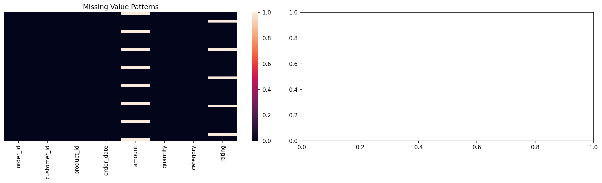

# Missing Values: Strategies for Incomplete Data

**After this lesson:** You can tell **MCAR**, **MAR**, and **MNAR** apart in plain language, explore missingness patterns in **pandas**, and pick a defensible strategy (drop, impute, or model) for a simple dataset.

## Helpful video

Pandas DataFrames in a quick walkthrough, useful for cleaning and wrangling.

## Overview

**Prerequisites:** [Data quality assessment](data-quality.md) and [Pandas](../../1-data-fundamentals/1.5-data-analysis-pandas/) basics (**isna**, indexing). Optional: probability ideas from [Intro Statistics](../../1-data-fundamentals/1.3-intro-statistics/).

> **Time needed:** 60-90 minutes; the code examples are dense, run them in a notebook.

> **Note:** **MCAR** (Missing Completely at Random), **MAR** (Missing at Random), and **MNAR** (Missing Not at Random) describe _why_ data might be missing, see the diagram below.

## Why this matters

Defaulting to "drop all rows with NA" or "fill with zero" can **bias** estimates or hide real effects. The mechanism (MCAR / MAR / MNAR) tells you whether simple fixes are defensible or whether you need domain input, imputation, or sensitivity analysis.

Missing data is one of the most common and challenging issues in data analysis. Understanding the nature of missing values and choosing appropriate handling strategies is important for maintaining data integrity and ensuring reliable analysis results.

## Understanding Missing Data Mechanisms

Missing data can occur through different mechanisms, each requiring different handling approaches:

### Missing Data Mechanisms Explained

1. **Missing Completely at Random (MCAR)**
   * Definition: Missing values occur purely by chance
   * Mathematical: $P(R|X\_{complete}) = P(R)$
   * Example: Survey responses lost due to system error
   * Detection: Little's MCAR test
   * Impact: Unbiased estimates possible with complete case analysis
2. **Missing at Random (MAR)**
   * Definition: Missing values depend on observed data
   * Mathematical: $P(R|X\_{complete}) = P(R|X\_{observed})$
   * Example: Older people more likely to skip income questions
   * Detection: Analyze patterns in observed data
   * Impact: Can be handled with multiple imputation
3. **Missing Not at Random (MNAR)**
   * Definition: Missing values depend on unobserved data
   * Mathematical: $P(R|X\_{complete}) \neq P(R|X\_{observed})$
   * Example: People with high incomes not reporting income
   * Detection: Requires domain knowledge
   * Impact: Most challenging to handle, may need sensitivity analysis

Function signature and docstring

Defines `analyze_missing_mechanism` and documents its parameters and return value, a dict of analysis results.

Analyze missing patterns and correlations

Calculates per-column missing rates (as percentages) and the correlation matrix between missing indicators, high correlation suggests MAR rather than MCAR.

Little's MCAR test

Runs a simplified chi-squared test on the null indicators. A p-value > 0.05 is consistent with MCAR; lower values suggest a systematic pattern.

## Missing Value Analysis Framework

### 1. Detection and Visualization


```

Missing Value Statistics:
             Missing Count  Missing Percentage Data Type
customer_id              0                 0.0     int64
product_id               0                 0.0     int64
order_date               0                 0.0       str
amount                   8                16.0   float64
quantity                 0                 0.0   float64
category                 0                 0.0       str
rating                   5                10.0   float64
```

Imports and data loading

Imports five libraries (pandas, NumPy, seaborn, matplotlib, missingno) and reads the e-commerce CSV into a DataFrame.

Compute missing-value statistics

Builds a summary DataFrame showing missing count, missing percentage, and data type for every column.

Four-panel visualization

Creates a 2×2 figure: a heatmap of null positions, a missingno matrix, a bar chart of missing percentages, and a missingno correlation heatmap.

Display and return results

Calls `tight_layout` and shows the figure, then returns the statistics DataFrame. The final two lines call the function and print its output.

<figure><figcaption><p>Figure 1: Missing Value Patterns</p></figcaption></figure>

<figure><figcaption><p>Figure 2: Generated visualization</p></figcaption></figure>

<figure><figcaption><p>Figure 3: Missing Value Correlation</p></figcaption></figure>

```

Missing Value Statistics:
             Missing Count  Missing Percentage Data Type
order_id                 0                 0.0     int64
customer_id              0                 0.0     int64
product_id               0                 0.0     int64
order_date               0                 0.0       str
amount                   8                16.0   float64
quantity                 0                 0.0   float64
category                 0                 0.0       str
rating                   5                10.0   float64
```

## Imputation Strategies Decision Tree

## Advanced Imputation Techniques

### 1. Statistical Imputation

Class definition and \_\_init\_\_

Defines the class with a `strategy` parameter ('mean', 'median', or 'weighted\_mean') and an empty `statistics` dict that will store computed fill values.

fit: compute fill statistics

Loops over numeric columns and computes mean, median, or a correlation-weighted mean, whichever strategy was chosen, storing results in `self.statistics`.

transform: apply imputation

Copies the DataFrame and fills each column's nulls with the value stored in `self.statistics`, leaving the original untouched.

### 2. Machine Learning Imputation

Imports, class definition, and \_\_init\_\_

Imports both Random Forest variants and defines the class; `__init__` stores which columns are categorical and initializes an empty `models` dict.

Prepare training and missing subsets

For each column with nulls, splits the data into rows where the value is known (for training) and rows where it is missing (for prediction).

Choose model type and train

Selects a classifier for categorical columns or a regressor for numeric ones, then fits it on the known rows (zero-filling any remaining nulls in the features).

Predict, fill, and return

Predicts values for the missing rows, writes them back into the copied DataFrame, stores the fitted model, and returns the imputed result.

### 3. Multiple Imputation

Function definition

Defines `multiple_imputation` with a default of 5 runs; `imputed_datasets` will collect one completed DataFrame per iteration.

Run multiple imputations

Loops `n_imputations` times, each time creating an `IterativeImputer` with a different random seed, fitting+transforming the data, and appending the result.

Aggregate statistics across imputations

Stacks the imputed values into an array and computes mean, standard deviation, and 95% confidence intervals per column, capturing uncertainty from the multiple runs.

## Performance Impact Analysis

Function definition and imports

Defines the function and imports train/test split and regression metrics inside the function scope.

Prepare feature/target pairs

Separates features and target for both the original (with nulls) and imputed DataFrames, then instantiates two Random Forest models keyed by name.

Train and evaluate both models

Loops over the two models, splits each into train/test, fits and predicts, then stores MSE and R² in the results dict before returning it.

## Best Practices and Common Pitfalls

### 1. Data Understanding

* Always investigate why data is missing
* Consider domain knowledge
* Document assumptions

### 2. Method Selection

Compute column characteristics

Calculates missing rate, data type, and cardinality ratio for the column. If >50% is missing, recommends dropping the column outright.

Select strategy by type and missing rate

Routes to mean/median for low-missing numeric columns, KNN/MICE for higher missingness, mode or ML-based for categoricals, and a custom fallback otherwise.

### 3. Validation

Check value ranges

For each numeric column, records the min/max of the original and imputed DataFrames side by side so you can spot any imputed values outside the original range.

Check correlation preservation

Computes the max absolute difference between original and imputed correlation matrices, large differences indicate imputation may have distorted relationships between columns.

## Practice Exercise: E-commerce Missing Data

Scenario: You have an e-commerce dataset with missing customer and transaction data.

Load, analyse, and impute

Reads the e-commerce CSV, calls `analyze_missing_values`, then sets up a weighted-mean imputer for numeric columns and an ML-based imputer for categoricals.

Validate and document findings

Validates the imputed result, then assembles a report dictionary recording the analysis results, chosen methods, and validation outcomes for traceability.

Remember: "The quality of your imputation directly impacts the reliability of your analysis!"

## Next steps

* [Outliers](outliers.md), extreme values that interact with missingness
* [Transformations](transformations.md), scaling and encoding after cleaning
* [Exploratory Data Analysis (Module 2.3)](../2.3-eda/), validate patterns after imputation
* [Module README](./), assignments and notebook
