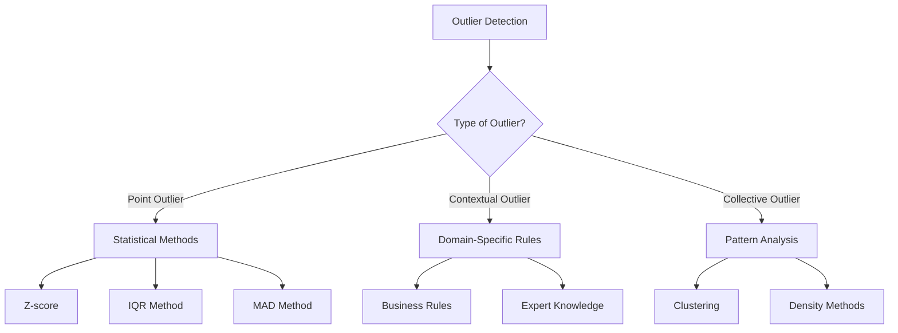

# Outliers: Detection and Treatment Strategies

Outliers are observations that deviate significantly from the general pattern of a dataset. While they can sometimes represent errors, they may also contain valuable insights about unusual but important phenomena. This comprehensive guide will help you master the art of outlier detection and treatment.

## Understanding Outliers: A Comprehensive Framework

Outliers can be classified into several types, each requiring different detection and treatment approaches:

1. **Point Outliers**
   - Individual observations that deviate significantly
   - Example: A transaction amount of $999,999 in typical $100 transactions
   - Detection: Statistical methods (Z-score, IQR)

2. **Contextual Outliers**
   - Values unusual in a specific context
   - Example: 20°C temperature in winter
   - Detection: Domain-specific rules

3. **Collective Outliers**
   - Groups of observations that deviate together
   - Example: Unusual patterns in time series data
   - Detection: Pattern analysis, clustering



## Mathematical Foundations and Implementation

### 1. Statistical Methods

#### Z-Score Method

```python
def detect_outliers_zscore(data, threshold=3):
    """
    Detect outliers using Z-score method
    
    Parameters:
    data (array-like): Input data
    threshold (float): Z-score threshold (default=3)
    
    Returns:
    array: Boolean mask of outliers
    """
    z_scores = np.abs((data - np.mean(data)) / np.std(data))
    return z_scores > threshold

# Mathematical representation:
# Z = (x - μ) / σ
# where:
# x is the observation
# μ is the mean
# σ is the standard deviation
```

#### IQR Method

```python
def detect_outliers_iqr(data, k=1.5):
    """
    Detect outliers using Interquartile Range method
    
    Parameters:
    data (array-like): Input data
    k (float): IQR multiplier (default=1.5)
    
    Returns:
    array: Boolean mask of outliers
    """
    Q1 = np.percentile(data, 25)
    Q3 = np.percentile(data, 75)
    IQR = Q3 - Q1
    
    lower_bound = Q1 - k * IQR
    upper_bound = Q3 + k * IQR
    
    return (data < lower_bound) | (data > upper_bound)

# Mathematical representation:
# IQR = Q3 - Q1
# Lower Bound = Q1 - k × IQR
# Upper Bound = Q3 + k × IQR
```

#### Modified Z-Score (MAD)

```python
def detect_outliers_mad(data, threshold=3.5):
    """
    Detect outliers using Modified Z-score method
    
    Parameters:
    data (array-like): Input data
    threshold (float): Modified Z-score threshold (default=3.5)
    
    Returns:
    array: Boolean mask of outliers
    """
    median = np.median(data)
    mad = np.median(np.abs(data - median))
    modified_zscore = 0.6745 * (data - median) / mad
    return np.abs(modified_zscore) > threshold

# Mathematical representation:
# MAD = median(|xi - median(x)|)
# Mi = 0.6745(xi - median(x)) / MAD
```

### 2. Machine Learning Methods

#### Isolation Forest

```python
from sklearn.ensemble import IsolationForest

def detect_outliers_iforest(data, contamination=0.1):
    """
    Detect outliers using Isolation Forest
    
    Parameters:
    data (array-like): Input data
    contamination (float): Expected proportion of outliers
    
    Returns:
    array: Boolean mask of outliers
    """
    clf = IsolationForest(
        contamination=contamination,
        random_state=42
    )
    return clf.fit_predict(data.reshape(-1, 1)) == -1
```

#### Local Outlier Factor

```python
from sklearn.neighbors import LocalOutlierFactor

def detect_outliers_lof(data, contamination=0.1):
    """
    Detect outliers using Local Outlier Factor
    
    Parameters:
    data (array-like): Input data
    contamination (float): Expected proportion of outliers
    
    Returns:
    array: Boolean mask of outliers
    """
    clf = LocalOutlierFactor(contamination=contamination)
    return clf.fit_predict(data.reshape(-1, 1)) == -1
```

## Comprehensive Outlier Detection Framework

```python
import pandas as pd
import numpy as np
import seaborn as sns
import matplotlib.pyplot as plt
from scipy import stats
from sklearn.ensemble import IsolationForest
from sklearn.neighbors import LocalOutlierFactor

class OutlierDetector:
    """Comprehensive outlier detection framework"""
    
    def __init__(self, data, column):
        self.data = data[column]
        self.column = column
        self.outliers = {}
        
    def detect_statistical_outliers(self):
        """Statistical outlier detection methods"""
        # Z-score method
        z_scores = np.abs(stats.zscore(self.data))
        self.outliers['zscore'] = z_scores > 3
        
        # IQR method
        Q1 = self.data.quantile(0.25)
        Q3 = self.data.quantile(0.75)
        IQR = Q3 - Q1
        self.outliers['iqr'] = (
            (self.data < (Q1 - 1.5 * IQR)) | 
            (self.data > (Q3 + 1.5 * IQR))
        )
        
        # Modified Z-score method
        median = np.median(self.data)
        mad = np.median(np.abs(self.data - median))
        modified_z_scores = 0.6745 * (self.data - median) / mad
        self.outliers['modified_zscore'] = np.abs(modified_z_scores) > 3.5
        
        return self.outliers
    
    def detect_machine_learning_outliers(self):
        """Machine learning based outlier detection"""
        # Reshape data for sklearn
        X = self.data.values.reshape(-1, 1)
        
        # Isolation Forest
        iso_forest = IsolationForest(contamination=0.1, random_state=42)
        self.outliers['isolation_forest'] = iso_forest.fit_predict(X) == -1
        
        # Local Outlier Factor
        lof = LocalOutlierFactor(contamination=0.1)
        self.outliers['lof'] = lof.fit_predict(X) == -1
        
        return self.outliers
    
    def visualize_outliers(self):
        """Comprehensive outlier visualization"""
        plt.figure(figsize=(15, 10))
        
        # Box plot
        plt.subplot(231)
        sns.boxplot(y=self.data)
        plt.title('Box Plot')
        
        # Histogram
        plt.subplot(232)
        sns.histplot(self.data, kde=True)
        plt.title('Distribution')
        
        # Q-Q plot
        plt.subplot(233)
        stats.probplot(self.data, dist="norm", plot=plt)
        plt.title('Q-Q Plot')
        
        # Outlier comparison
        plt.subplot(234)
        outlier_counts = pd.Series({
            method: sum(mask) 
            for method, mask in self.outliers.items()
        })
        outlier_counts.plot(kind='bar')
        plt.title('Outliers by Method')
        plt.xticks(rotation=45)
        
        # Scatter plot with outliers
        plt.subplot(235)
        plt.scatter(
            range(len(self.data)),
            self.data,
            c=self.outliers['zscore'],
            cmap='coolwarm'
        )
        plt.title('Z-score Outliers')
        
        plt.tight_layout()
        plt.show()
```

## Advanced Treatment Strategies

### 1. Robust Statistics

```python
def calculate_robust_statistics(data):
    """Calculate statistics robust to outliers"""
    return {
        'median': np.median(data),
        'mad': stats.median_abs_deviation(data),
        'trimmed_mean': stats.trim_mean(data, 0.1),
        'winsorized_mean': stats.mstats.winsorize(data, limits=[0.05, 0.05]).mean()
    }
```

### 2. Adaptive Capping

```python
def adaptive_capping(data, sensitivity=1.5):
    """Cap outliers based on local density"""
    def estimate_local_bounds(x, window=100):
        rolling_median = pd.Series(x).rolling(window).median()
        rolling_std = pd.Series(x).rolling(window).std()
        upper_bound = rolling_median + sensitivity * rolling_std
        lower_bound = rolling_median - sensitivity * rolling_std
        return lower_bound, upper_bound
    
    lower, upper = estimate_local_bounds(data)
    return np.clip(data, lower, upper)
```

### 3. Feature Engineering

```python
def engineer_outlier_features(data):
    """Create features from outlier information"""
    outlier_info = {}
    
    # Distance from mean
    mean_dist = np.abs(data - np.mean(data))
    outlier_info['mean_distance'] = mean_dist / np.std(data)
    
    # Distance from median
    median_dist = np.abs(data - np.median(data))
    mad = stats.median_abs_deviation(data)
    outlier_info['median_distance'] = median_dist / mad
    
    # Local density
    kde = stats.gaussian_kde(data)
    outlier_info['density'] = kde.evaluate(data)
    
    return pd.DataFrame(outlier_info)
```

## Real-World Case Study: E-commerce Transactions

```python
def analyze_transaction_outliers(transactions_df):
    """Analyze outliers in e-commerce transactions"""
    
    # Initialize detector
    detector = OutlierDetector(transactions_df, 'amount')
    
    # Detect outliers using multiple methods
    statistical_outliers = detector.detect_statistical_outliers()
    ml_outliers = detector.detect_machine_learning_outliers()
    
    # Analyze patterns
    time_patterns = transactions_df[
        statistical_outliers['zscore']
    ]['timestamp'].dt.hour.value_counts()
    
    category_patterns = transactions_df[
        statistical_outliers['zscore']
    ]['category'].value_counts()
    
    # Visualize patterns
    plt.figure(figsize=(15, 5))
    
    plt.subplot(131)
    time_patterns.plot(kind='bar')
    plt.title('Outlier Transactions by Hour')
    
    plt.subplot(132)
    category_patterns.plot(kind='bar')
    plt.title('Outlier Transactions by Category')
    
    plt.subplot(133)
    sns.scatterplot(
        data=transactions_df,
        x='amount',
        y='frequency',
        hue=statistical_outliers['zscore']
    )
    plt.title('Amount vs Frequency')
    
    plt.tight_layout()
    plt.show()
    
    return {
        'outliers': statistical_outliers,
        'time_patterns': time_patterns,
        'category_patterns': category_patterns
    }
```

## Performance Impact Analysis

```python
def analyze_outlier_impact(data, target, outlier_mask):
    """Analyze impact of outliers on model performance"""
    from sklearn.model_selection import train_test_split
    from sklearn.linear_model import LinearRegression
    from sklearn.metrics import mean_squared_error, r2_score
    
    # Split data
    X = data.drop(columns=[target])
    y = data[target]
    
    # Train with and without outliers
    results = {}
    for name, mask in [('all_data', slice(None)), ('no_outliers', ~outlier_mask)]:
        X_train, X_test, y_train, y_test = train_test_split(
            X[mask], y[mask], test_size=0.2, random_state=42
        )
        
        model = LinearRegression()
        model.fit(X_train, y_train)
        y_pred = model.predict(X_test)
        
        results[name] = {
            'mse': mean_squared_error(y_test, y_pred),
            'r2': r2_score(y_test, y_pred),
            'coef_std': np.std(model.coef_)
        }
    
    return results
```

## Best Practices and Common Pitfalls

### 1. Detection Strategy Selection

```python
def select_outlier_strategy(data):
    """Select appropriate outlier detection strategy"""
    
    skewness = stats.skew(data)
    kurtosis = stats.kurtosis(data)
    sample_size = len(data)
    
    if abs(skewness) > 2 or abs(kurtosis) > 7:
        return "Use robust methods (MAD, IQR)"
    elif sample_size < 30:
        return "Use IQR method"
    else:
        return "Use multiple methods and compare"
```

### 2. Validation Framework

```python
def validate_outlier_treatment(original, treated):
    """Validate the impact of outlier treatment"""
    
    validation = {}
    
    # Distribution statistics
    validation['distribution'] = {
        'skewness_change': stats.skew(treated) - stats.skew(original),
        'kurtosis_change': stats.kurtosis(treated) - stats.kurtosis(original)
    }
    
    # Range and spread
    validation['range'] = {
        'original': (np.min(original), np.max(original)),
        'treated': (np.min(treated), np.max(treated))
    }
    
    # Correlation preservation
    if len(original.shape) > 1:
        orig_corr = np.corrcoef(original)
        treated_corr = np.corrcoef(treated)
        validation['correlation_change'] = np.abs(orig_corr - treated_corr).max()
    
    return validation
```

## Practice Exercise: Financial Data Analysis

```python
# Load and prepare data
df = pd.read_csv('financial_data.csv')

# 1. Detect outliers
detector = OutlierDetector(df, 'returns')
outliers = detector.detect_statistical_outliers()
detector.visualize_outliers()

# 2. Analyze patterns
analysis = analyze_transaction_outliers(df)

# 3. Treat outliers
treated_data = adaptive_capping(df['returns'])

# 4. Validate treatment
validation = validate_outlier_treatment(df['returns'], treated_data)

# 5. Analyze impact
impact = analyze_outlier_impact(df, 'returns', outliers['zscore'])

# 6. Document findings
report = {
    'outlier_counts': {method: sum(mask) for method, mask in outliers.items()},
    'treatment_validation': validation,
    'performance_impact': impact
}
```

Remember: "Not all outliers are errors, and not all errors are outliers. Context is key!"
