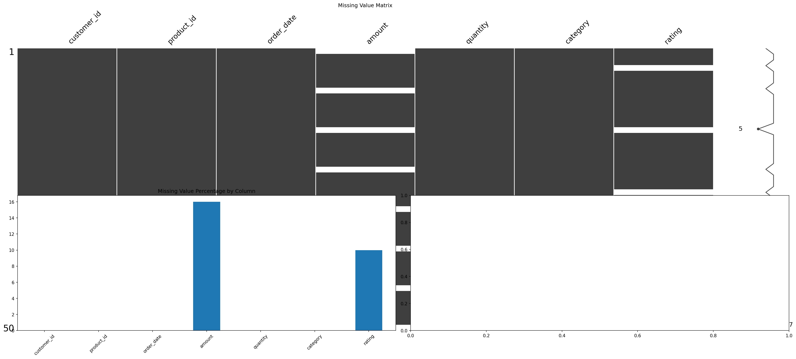

# Outliers: Detection and Treatment Strategies

**After this lesson:** You can detect point outliers with **z-scores** and **IQR** rules, interpret **contextual** and **collective** outliers at a high level, and choose treatment (keep, cap, remove) based on the analysis goal.

## Helpful video

Pandas DataFrames in a quick walkthrough, useful for cleaning and wrangling.

## Overview

**Prerequisites:** [Data quality](data-quality.md) and basic descriptive statistics from [Intro Statistics](../../1-data-fundamentals/1.3-intro-statistics/). [NumPy](../../1-data-fundamentals/1.4-data-foundation-linear-algebra/) arrays and [Pandas](../../1-data-fundamentals/1.5-data-analysis-pandas/) Series are assumed.

> **Time needed:** About 60 minutes.

## Why this matters

A single bad sensor reading or mistyped value can dominate means, distort plots, and mislead models. The goal is not always to delete extremes, sometimes the rare point _is_ the insight, so you need **detection** plus a **decision** (keep, cap, investigate, or remove) tied to your question.

Outliers are observations that deviate significantly from the general pattern of a dataset. While they can sometimes represent errors, they may also contain valuable information about unusual but important phenomena.

## Understanding Outliers: A Comprehensive Framework

Outliers can be classified into several types, each requiring different detection and treatment approaches:

1. **Point Outliers**
   * Individual observations that deviate significantly
   * Example: A transaction amount of $999,999 in typical $100 transactions
   * Detection: Statistical methods (Z-score, IQR)
2. **Contextual Outliers**
   * Values unusual in a specific context
   * Example: 20°C temperature in winter
   * Detection: Domain-specific rules
3. **Collective Outliers**
   * Groups of observations that deviate together
   * Example: Unusual patterns in time series data
   * Detection: Pattern analysis, clustering

## Mathematical Foundations and Implementation

### 1. Statistical Methods

#### Z-Score Method

Function definition and computation

Defines the function with its docstring, then computes the absolute z-score for each point and returns a boolean mask where True means the value exceeds the threshold.

Mathematical representation

Shows the z-score formula in plain notation: subtract the mean (μ) and divide by standard deviation (σ) to standardise each observation.

#### IQR Method

Function definition and docstring

Defines the function; `k=1.5` is the standard Tukey fence, larger values (e.g. 3.0) are more lenient and flag fewer points as outliers.

IQR computation and fence bounds

Computes Q1, Q3, and IQR, then sets lower and upper fences at Q1 − k·IQR and Q3 + k·IQR. Returns a boolean mask where True means outside the fences.

#### Modified Z-Score (MAD)

Function definition and computation

Computes the median absolute deviation (MAD), scales it by 0.6745 (the normal-distribution calibration factor), and returns a boolean mask for values above the threshold.

Mathematical representation

Summarises the MAD formula and the modified z-score Mi, showing how the 0.6745 factor makes it comparable to a standard z-score under normality.

### 2. Machine Learning Methods

#### Isolation Forest

Import and function signature

Imports IsolationForest and defines the function; `contamination` is the expected fraction of outliers, adjust it to your domain knowledge.

Fit and predict outliers

Instantiates the forest with a fixed random seed for reproducibility, then returns True where the model assigns a score of −1 (anomaly).

#### Local Outlier Factor

Import and function signature

Imports LocalOutlierFactor and defines the function with its docstring; LOF compares each point's density to its neighbours rather than using a global threshold.

Fit and predict

Fits the LOF model in one call and returns a boolean mask where −1 predictions (low-density points) are marked as outliers.

## Comprehensive Outlier Detection Framework

Imports and class initialisation

Imports six libraries, then defines the class; `__init__` stores the target column's Series and initialises an empty `outliers` dict keyed by method name.

Statistical outlier detection (z-score, IQR, MAD)

Applies three statistical rules in sequence, standard z-score, Tukey IQR fences, and modified z-score (MAD), storing a boolean mask for each in `self.outliers`.

ML outlier detection (Isolation Forest and LOF)

Reshapes the data for sklearn, runs Isolation Forest and Local Outlier Factor, and adds their boolean masks to `self.outliers`.

Five-panel outlier visualisation

Produces a 2×3 figure: box plot, distribution histogram, Q-Q plot, per-method outlier counts bar chart, and a scatter plot coloured by z-score outlier status.

## Advanced Treatment Strategies

### 1. reliable Statistics

Four outlier-resistant summary statistics

Returns median, MAD, 10%-trimmed mean, and Winsorised mean (5th-95th percentile), all of which are far less influenced by extreme values than their standard counterparts.

### 2. Adaptive Capping

Adaptive capping using local density

Computes rolling median and std over a 100-point window to derive local upper and lower bounds, then clips values to those dynamic limits rather than a single global threshold.

### 3. Feature Engineering

Distance from mean (z-score)

Computes absolute deviation from the mean, normalised by standard deviation, equivalent to an unsigned z-score stored as a feature.

Distance from median and local density

Adds a MAD-normalised median distance for robustness, then uses a KDE to estimate each point's local probability density, low density indicates a potential outlier region.

## Real-World Case Study: E-commerce Transactions

Detect outliers

Initialises an `OutlierDetector` on the `amount` column, then runs both statistical and ML detection methods to populate all outlier masks.

Analyse temporal and category patterns

Filters to z-score-flagged rows and counts them by hour-of-day and by product category, revealing whether outlier transactions cluster at specific times or in specific segments.

Three-panel pattern visualisation

Plots outlier counts by hour, outlier counts by category, and a scatter of amount vs frequency with outlier points coloured differently for quick visual inspection.

Return results dict

Packages the outlier masks, temporal patterns, and category patterns into a single dictionary for downstream analysis or reporting.

## Performance Impact Analysis

Set up features, targets, and models

Imports metrics, separates features and target, then defines two linear regression models keyed as 'all\_data' and 'no\_outliers' for side-by-side comparison.

Train each model and record metrics

For each model, applies the outlier mask or a full-data slice, splits into train/test, fits and predicts, then stores MSE, R², and coefficient std, showing the impact of outlier removal.

## Best Practices and Common Pitfalls

### 1. Detection Strategy Selection

Choose detection strategy by distribution shape

Measures skewness, kurtosis, and sample size: highly non-normal data gets robust methods (MAD, IQR); small samples get IQR; everything else gets multi-method comparison.

### 2. Validation Framework

Distribution shape change

Computes the change in skewness and kurtosis after treatment, large reductions confirm the outliers were distorting the distribution.

Range and correlation preservation

Records the original and treated min/max, then for multivariate data computes the max absolute correlation-matrix difference to check that relationships between columns were not distorted.

## Practice Exercise: Financial Data Analysis

Load, detect, and analyse patterns

Reads the financial CSV, detects and visualises outliers on the `returns` column, then analyses temporal and category patterns using the framework functions.

Treat, validate, assess impact, and report

Applies adaptive capping, validates the treatment, measures model-performance impact with and without outliers, then assembles all findings into a report dictionary.

Remember: "Not all outliers are errors, and not all errors are outliers. Context is key!"

## Next steps

* [Transformations](transformations.md), when trimming or scaling after outlier work
* [Distributions (EDA)](../2.3-eda/distributions.md), see skew and tails on clean plots
* [Module README](./)
