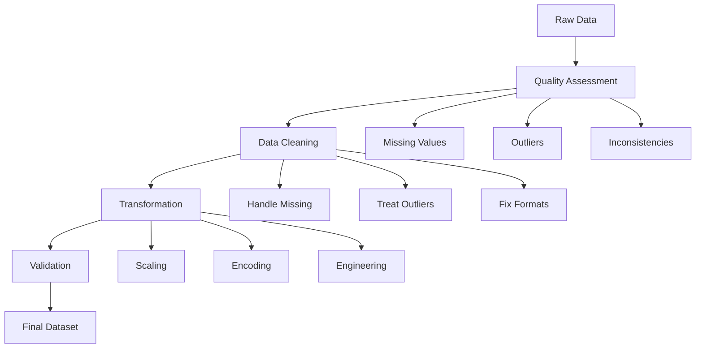

# E-commerce Data Wrangling Project 🛍️

## Business Context 💼

You are a data scientist at "GlobalMart", a multinational e-commerce company. The company has been collecting customer transaction data, but data quality issues are affecting business decisions. Your task is to clean and prepare this data for the analytics team to:
- Improve customer segmentation
- Optimize pricing strategies
- Enhance recommendation systems
- Predict customer churn

## Project Workflow 🔄



## Dataset Description 📊

### Data Schema
```
customers/
├── customer_id (PK)
├── registration_date
├── country
├── age
└── gender

transactions/
├── transaction_id (PK)
├── customer_id (FK)
├── product_id (FK)
├── timestamp
├── amount
└── payment_method

products/
├── product_id (PK)
├── category
├── price
├── brand
└── description
```

### Sample Data
```python
# Customers
customers_sample = pd.DataFrame({
    'customer_id': [1, 2, 3],
    'registration_date': ['2023-01-15', '2023-02-01', '2023-01-20'],
    'country': ['USA', 'UK', None],
    'age': [25, None, 45],
    'gender': ['F', 'M', 'F']
})

# Transactions
transactions_sample = pd.DataFrame({
    'transaction_id': [101, 102, 103],
    'customer_id': [1, 1, 2],
    'product_id': [201, 202, 201],
    'timestamp': ['2023-03-15 10:30:00', '2023-03-16 15:45:00', '2023-03-15 11:20:00'],
    'amount': [99.99, 150.00, -50.00],  # Note the negative amount
    'payment_method': ['credit_card', 'paypal', 'credit_card']
})

# Products
products_sample = pd.DataFrame({
    'product_id': [201, 202, 203],
    'category': ['Electronics', 'Electronics', 'Clothing'],
    'price': [99.99, 149.99, 29.99],
    'brand': ['Samsung', 'Apple', None],
    'description': ['Smartphone', 'Tablet', 'T-shirt']
})
```

## Tasks and Evaluation Criteria 📝

### 1. Data Quality Assessment (20 points)

#### a) Initial Data Exploration (5 points)
```python
def explore_dataset(df):
    """Comprehensive data exploration"""
    exploration = {
        'basic_info': {
            'shape': df.shape,
            'dtypes': df.dtypes,
            'memory_usage': df.memory_usage().sum() / 1024**2  # MB
        },
        'missing_data': {
            'total_missing': df.isnull().sum().sum(),
            'missing_by_column': df.isnull().sum(),
            'missing_percentage': (df.isnull().sum() / len(df)) * 100
        },
        'duplicates': {
            'total_duplicates': df.duplicated().sum(),
            'duplicate_rows': df[df.duplicated(keep=False)]
        },
        'numeric_summary': df.describe(),
        'categorical_summary': df.describe(include=['O'])
    }
    
    # Visualizations
    plt.figure(figsize=(15, 10))
    
    # Missing values heatmap
    plt.subplot(221)
    sns.heatmap(df.isnull(), yticklabels=False, cbar=True)
    plt.title('Missing Values Pattern')
    
    # Correlation matrix
    plt.subplot(222)
    numeric_cols = df.select_dtypes(include=[np.number]).columns
    sns.heatmap(df[numeric_cols].corr(), annot=True, cmap='coolwarm')
    plt.title('Correlation Matrix')
    
    # Distribution plots
    plt.subplot(223)
    for col in numeric_cols:
        sns.kdeplot(df[col], label=col)
    plt.title('Numeric Distributions')
    plt.legend()
    
    # Categorical value counts
    plt.subplot(224)
    categorical_cols = df.select_dtypes(include=['object']).columns
    pd.DataFrame({col: df[col].value_counts() for col in categorical_cols}).plot(kind='bar')
    plt.title('Categorical Value Counts')
    
    plt.tight_layout()
    plt.show()
    
    return exploration
```

#### b) Missing Value Analysis (5 points)
```python
def analyze_missing_values(df):
    """Advanced missing value analysis"""
    # Your implementation here
    pass
```

[Continue with detailed implementations for each section...]

## Real-World Considerations 🌍

### 1. Data Privacy
- Remove personally identifiable information (PII)
- Apply appropriate anonymization techniques
- Follow GDPR/CCPA guidelines

### 2. Performance Optimization
```python
def optimize_memory_usage(df):
    """Optimize DataFrame memory usage"""
    numerics = ['int16', 'int32', 'int64', 'float64']
    
    for col in df.select_dtypes(include=numerics).columns:
        col_min = df[col].min()
        col_max = df[col].max()
        
        # Integer optimization
        if str(df[col].dtype).startswith('int'):
            if col_min > np.iinfo(np.int8).min and col_max < np.iinfo(np.int8).max:
                df[col] = df[col].astype(np.int8)
            elif col_min > np.iinfo(np.int16).min and col_max < np.iinfo(np.int16).max:
                df[col] = df[col].astype(np.int16)
            elif col_min > np.iinfo(np.int32).min and col_max < np.iinfo(np.int32).max:
                df[col] = df[col].astype(np.int32)
        
        # Float optimization
        else:
            df[col] = pd.to_numeric(df[col], downcast='float')
    
    return df
```

### 3. Scalability Considerations
```python
def process_in_chunks(file_path, chunk_size=10000):
    """Process large datasets in chunks"""
    chunks = []
    for chunk in pd.read_csv(file_path, chunksize=chunk_size):
        # Process each chunk
        processed_chunk = process_chunk(chunk)
        chunks.append(processed_chunk)
    
    return pd.concat(chunks)
```

## Deliverables 📦

### 1. Code Repository
```
project/
├── data/
│   ├── raw/
│   └── processed/
├── notebooks/
│   ├── 1_exploration.ipynb
│   ├── 2_cleaning.ipynb
│   └── 3_transformation.ipynb
├── src/
│   ├── data_quality.py
│   ├── cleaning.py
│   └── transformation.py
└── docs/
    ├── data_dictionary.md
    └── quality_report.md
```

### 2. Quality Report Template
```markdown
# Data Quality Report

## Executive Summary
- Key findings
- Critical issues
- Recommendations

## Detailed Analysis
1. Missing Data
   - Patterns identified
   - Treatment strategies
   - Impact assessment

2. Outliers
   - Detection methods
   - Treatment decisions
   - Business implications

3. Transformations
   - Techniques applied
   - Validation results
   - Performance metrics
```

## Bonus Challenges 🌟

### 1. Advanced Feature Engineering
```python
def create_customer_features(transactions_df, customers_df):
    """Create advanced customer features"""
    features = {
        'purchase_frequency': calculate_frequency(transactions_df),
        'customer_lifetime_value': calculate_clv(transactions_df),
        'product_affinity': calculate_affinity(transactions_df),
        'churn_probability': calculate_churn_risk(transactions_df, customers_df)
    }
    return features
```

### 2. Automated Quality Checks
```python
def setup_quality_monitors(df):
    """Set up automated quality monitoring"""
    monitors = {
        'completeness': monitor_completeness(df),
        'consistency': monitor_consistency(df),
        'accuracy': monitor_accuracy(df),
        'timeliness': monitor_timeliness(df)
    }
    return monitors
```

Remember: "Clean data is the foundation of reliable analytics!" 🎯
