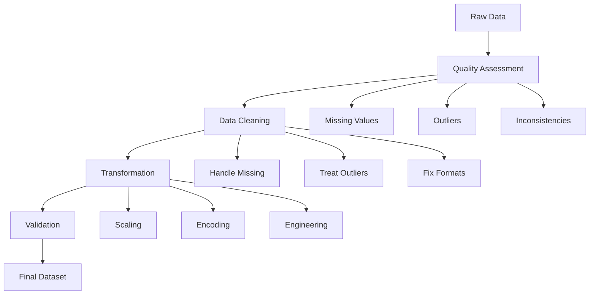

# E-commerce Data Wrangling Project: From Raw Data to Actionable Insights 🛍️

## Business Context 💼

As a data scientist at "GlobalMart", you face a critical challenge: the company's raw data needs significant cleaning and preparation before it can be used for advanced analytics. This project will guide you through the complete data wrangling process, from initial assessment to final validation.

### Business Objectives
1. **Customer Segmentation**: Identify distinct customer groups for targeted marketing
2. **Pricing Optimization**: Analyze price elasticity and optimize pricing strategies
3. **Recommendation System**: Build a robust product recommendation engine
4. **Churn Prediction**: Develop early warning system for customer churn

## Project Workflow 🔄



## Dataset Description 📊

### Data Schema
```sql
-- Customer Information
CREATE TABLE customers (
    customer_id INT PRIMARY KEY,
    registration_date DATE,
    country VARCHAR(50),
    age INT,
    gender VARCHAR(10),
    email VARCHAR(100),
    last_login_date TIMESTAMP
);

-- Transaction Records
CREATE TABLE transactions (
    transaction_id INT PRIMARY KEY,
    customer_id INT REFERENCES customers(customer_id),
    product_id INT REFERENCES products(product_id),
    timestamp TIMESTAMP,
    amount DECIMAL(10,2),
    payment_method VARCHAR(50),
    device_type VARCHAR(50)
);

-- Product Catalog
CREATE TABLE products (
    product_id INT PRIMARY KEY,
    category VARCHAR(50),
    price DECIMAL(10,2),
    brand VARCHAR(50),
    description TEXT,
    stock_level INT,
    supplier_id INT
);
```

## Implementation Guide 🛠️

### 1. Data Quality Assessment (20%)

```python
def assess_data_quality(df):
    """Comprehensive data quality assessment"""
    
    quality_report = {
        'completeness': {},
        'validity': {},
        'consistency': {},
        'uniqueness': {}
    }
    
    # Completeness check
    quality_report['completeness'] = {
        'missing_values': df.isnull().sum(),
        'missing_percentage': (df.isnull().sum() / len(df)) * 100
    }
    
    # Validity check
    numeric_cols = df.select_dtypes(include=[np.number]).columns
    quality_report['validity']['numeric_ranges'] = {
        col: {'min': df[col].min(), 'max': df[col].max()}
        for col in numeric_cols
    }
    
    # Consistency check
    if 'registration_date' in df.columns and 'last_login_date' in df.columns:
        quality_report['consistency']['date_order'] = (
            df['last_login_date'] >= df['registration_date']
        ).mean()
    
    # Uniqueness check
    quality_report['uniqueness'] = {
        col: df[col].nunique() / len(df)
        for col in df.columns
    }
    
    return quality_report
```

### 2. Data Cleaning Implementation (30%)

```python
class DataCleaner:
    """Data cleaning pipeline for e-commerce data"""
    
    def __init__(self, config=None):
        self.config = config or {
            'age_range': (13, 100),
            'price_range': (0, 10000),
            'outlier_threshold': 3
        }
    
    def clean_customer_data(self, customers_df):
        """Clean customer dataset"""
        df = customers_df.copy()
        
        # Handle missing values
        df['age'] = df['age'].fillna(df['age'].median())
        df['country'] = df['country'].fillna(df['country'].mode()[0])
        
        # Fix data types
        df['registration_date'] = pd.to_datetime(df['registration_date'])
        
        # Validate age range
        df.loc[~df['age'].between(*self.config['age_range']), 'age'] = np.nan
        
        # Standardize country codes
        df['country'] = df['country'].str.upper()
        
        return df
    
    def clean_transaction_data(self, transactions_df):
        """Clean transaction dataset"""
        df = transactions_df.copy()
        
        # Remove duplicate transactions
        df = df.drop_duplicates(subset=['customer_id', 'timestamp', 'amount'])
        
        # Handle outliers in amount
        z_scores = np.abs(stats.zscore(df['amount']))
        df.loc[z_scores > self.config['outlier_threshold'], 'amount'] = np.nan
        
        # Standardize payment methods
        df['payment_method'] = df['payment_method'].str.lower()
        
        return df
```

### 3. Feature Engineering (30%)

```python
class FeatureEngineer:
    """Feature engineering for e-commerce data"""
    
    def create_customer_features(self, customers_df, transactions_df):
        """Create customer-level features"""
        
        # Customer lifetime value
        clv = transactions_df.groupby('customer_id')['amount'].sum()
        
        # Purchase frequency
        purchase_freq = transactions_df.groupby('customer_id').size()
        
        # Average order value
        avg_order = transactions_df.groupby('customer_id')['amount'].mean()
        
        # Days since last purchase
        last_purchase = transactions_df.groupby('customer_id')['timestamp'].max()
        days_since = (pd.Timestamp.now() - last_purchase).dt.days
        
        # Combine features
        features = pd.DataFrame({
            'customer_lifetime_value': clv,
            'purchase_frequency': purchase_freq,
            'average_order_value': avg_order,
            'days_since_last_purchase': days_since
        })
        
        return features
    
    def create_product_features(self, products_df, transactions_df):
        """Create product-level features"""
        
        # Sales velocity
        sales_velocity = transactions_df.groupby('product_id').size()
        
        # Price elasticity
        def calculate_elasticity(group):
            price_pct_change = group['price'].pct_change()
            demand_pct_change = group['quantity'].pct_change()
            return (demand_pct_change / price_pct_change).mean()
        
        elasticity = transactions_df.groupby('product_id').apply(calculate_elasticity)
        
        # Combine features
        features = pd.DataFrame({
            'sales_velocity': sales_velocity,
            'price_elasticity': elasticity
        })
        
        return features
```

### 4. Data Validation (20%)

```python
def validate_final_dataset(df, validation_rules):
    """Validate the final dataset"""
    
    validation_results = {
        'completeness': {},
        'consistency': {},
        'statistical_validity': {}
    }
    
    # Check completeness
    missing_values = df.isnull().sum()
    validation_results['completeness'] = {
        'missing_values': missing_values,
        'missing_percentage': (missing_values / len(df)) * 100
    }
    
    # Check consistency
    for rule_name, rule_func in validation_rules['consistency'].items():
        validation_results['consistency'][rule_name] = rule_func(df)
    
    # Statistical validation
    numeric_cols = df.select_dtypes(include=[np.number]).columns
    validation_results['statistical_validity'] = {
        col: {
            'mean': df[col].mean(),
            'std': df[col].std(),
            'skew': df[col].skew(),
            'kurtosis': df[col].kurtosis()
        }
        for col in numeric_cols
    }
    
    return validation_results
```

## Project Deliverables 📦

### 1. Code Repository Structure
```
project/
├── data/
│   ├── raw/
│   │   ├── customers.csv
│   │   ├── transactions.csv
│   │   └── products.csv
│   └── processed/
│       └── final_dataset.csv
├── notebooks/
│   ├── 1_exploration.ipynb
│   ├── 2_cleaning.ipynb
│   └── 3_transformation.ipynb
├── src/
│   ├── data_quality.py
│   ├── cleaning.py
│   └── transformation.py
└── docs/
    ├── data_dictionary.md
    └── quality_report.md
```

### 2. Quality Report Template
```markdown
# Data Quality Report

## Executive Summary
- Key findings
- Critical issues
- Recommendations

## Detailed Analysis
1. Missing Data
   - Patterns identified
   - Treatment strategies
   - Impact assessment

2. Outliers
   - Detection methods
   - Treatment decisions
   - Business implications

3. Transformations
   - Techniques applied
   - Validation results
   - Performance metrics
```

## Best Practices 📝

1. **Version Control**
   - Use Git for code versioning
   - Document all data transformations
   - Track data quality metrics

2. **Performance Optimization**
   - Use efficient data structures
   - Implement parallel processing
   - Optimize memory usage

3. **Documentation**
   - Maintain clear documentation
   - Create data dictionaries
   - Document assumptions and decisions

## Evaluation Criteria 📊

1. **Code Quality (30%)**
   - Clean, well-organized code
   - Proper error handling
   - Efficient implementations

2. **Documentation (20%)**
   - Clear explanations
   - Comprehensive data dictionary
   - Well-documented decisions

3. **Results (50%)**
   - Data quality improvements
   - Feature engineering effectiveness
   - Validation metrics

Remember: "The quality of your data wrangling directly impacts the reliability of your analytics!" 🎯
