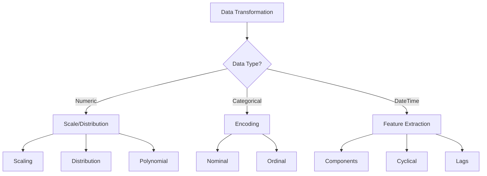

# Data Transformations: Shaping Data for Analysis 🔄

## Understanding Data Transformations: A Decision Framework 📊



## Mathematical Foundations 📐

### 1. Scaling Transformations
- **Standard Scaling**: $z = \frac{x - \mu}{\sigma}$
- **Min-Max Scaling**: $x_{scaled} = \frac{x - x_{min}}{x_{max} - x_{min}}$
- **Robust Scaling**: $x_{robust} = \frac{x - Q_2}{Q_3 - Q_1}$

### 2. Distribution Transformations
- **Log Transform**: $x_{log} = \log(x + c)$
- **Box-Cox**: $x_{boxcox}(\lambda) = \begin{cases} \frac{x^\lambda - 1}{\lambda} & \lambda \neq 0 \\ \log(x) & \lambda = 0 \end{cases}$
- **Yeo-Johnson**: Similar to Box-Cox but handles negative values

## Comprehensive Transformation Framework 🔬

```python
import pandas as pd
import numpy as np
import seaborn as sns
import matplotlib.pyplot as plt
from scipy import stats
from sklearn.preprocessing import (
    StandardScaler, MinMaxScaler, RobustScaler,
    PowerTransformer, QuantileTransformer
)

class DataTransformer:
    """Comprehensive data transformation framework"""
    
    def __init__(self, data):
        self.data = data
        self.transformations = {}
        self.scalers = {}
        
    def analyze_distribution(self, column):
        """Analyze distribution characteristics"""
        stats_dict = {
            'mean': np.mean(self.data[column]),
            'median': np.median(self.data[column]),
            'skew': stats.skew(self.data[column]),
            'kurtosis': stats.kurtosis(self.data[column]),
            'normality_test': stats.normaltest(self.data[column])
        }
        
        # Visualization
        plt.figure(figsize=(15, 5))
        
        # Histogram
        plt.subplot(131)
        sns.histplot(self.data[column], kde=True)
        plt.title('Distribution')
        
        # Q-Q plot
        plt.subplot(132)
        stats.probplot(self.data[column], dist="norm", plot=plt)
        plt.title('Q-Q Plot')
        
        # Box plot
        plt.subplot(133)
        sns.boxplot(y=self.data[column])
        plt.title('Box Plot')
        
        plt.tight_layout()
        plt.show()
        
        return stats_dict
    
    def suggest_transformation(self, column):
        """Suggest appropriate transformation"""
        data = self.data[column]
        skew = stats.skew(data)
        kurtosis = stats.kurtosis(data)
        
        suggestions = []
        
        if abs(skew) > 1:
            if data.min() >= 0:
                suggestions.append('log')
            suggestions.append('yeo-johnson')
            
        if abs(kurtosis) > 3:
            suggestions.append('box-cox')
            
        if data.std() / data.mean() > 1:
            suggestions.append('robust_scale')
        else:
            suggestions.append('standard_scale')
            
        return suggestions
    
    def apply_transformation(self, column, method):
        """Apply specified transformation"""
        data = self.data[column].values.reshape(-1, 1)
        
        if method == 'log':
            transformed = np.log1p(data)
        elif method == 'box-cox':
            transformed, _ = stats.boxcox(data.flatten() + 1)
        elif method == 'yeo-johnson':
            pt = PowerTransformer(method='yeo-johnson')
            transformed = pt.fit_transform(data)
            self.scalers[f'{column}_{method}'] = pt
        elif method == 'standard_scale':
            scaler = StandardScaler()
            transformed = scaler.fit_transform(data)
            self.scalers[f'{column}_{method}'] = scaler
        elif method == 'robust_scale':
            scaler = RobustScaler()
            transformed = scaler.fit_transform(data)
            self.scalers[f'{column}_{method}'] = scaler
        else:
            raise ValueError(f"Unknown transformation method: {method}")
        
        self.transformations[f'{column}_{method}'] = transformed
        return transformed
    
    def evaluate_transformation(self, column, method):
        """Evaluate transformation results"""
        original = self.data[column]
        transformed = self.transformations[f'{column}_{method}'].flatten()
        
        comparison = pd.DataFrame({
            'Original': [
                np.mean(original),
                np.std(original),
                stats.skew(original),
                stats.kurtosis(original)
            ],
            'Transformed': [
                np.mean(transformed),
                np.std(transformed),
                stats.skew(transformed),
                stats.kurtosis(transformed)
            ]
        }, index=['Mean', 'Std', 'Skewness', 'Kurtosis'])
        
        # Visualization
        plt.figure(figsize=(12, 4))
        
        plt.subplot(121)
        sns.histplot(original, kde=True)
        plt.title('Original Distribution')
        
        plt.subplot(122)
        sns.histplot(transformed, kde=True)
        plt.title(f'{method} Transformed')
        
        plt.tight_layout()
        plt.show()
        
        return comparison
```

## Advanced Transformation Techniques 🚀

### 1. Feature Scaling Pipeline
```python
def create_scaling_pipeline(numeric_features, categorical_features):
    """Create a comprehensive scaling pipeline"""
    from sklearn.compose import ColumnTransformer
    from sklearn.pipeline import Pipeline
    
    numeric_transformer = Pipeline(steps=[
        ('scaler', StandardScaler())
    ])
    
    categorical_transformer = Pipeline(steps=[
        ('onehot', OneHotEncoder(drop='first', sparse=False))
    ])
    
    preprocessor = ColumnTransformer(
        transformers=[
            ('num', numeric_transformer, numeric_features),
            ('cat', categorical_transformer, categorical_features)
        ])
    
    return preprocessor
```

### 2. Distribution Transformer
```python
class DistributionTransformer:
    """Transform data to follow specific distributions"""
    
    def __init__(self, distribution='normal'):
        self.distribution = distribution
        self.transformer = None
        
    def fit_transform(self, data):
        if self.distribution == 'normal':
            self.transformer = QuantileTransformer(
                output_distribution='normal',
                n_quantiles=1000
            )
        elif self.distribution == 'uniform':
            self.transformer = QuantileTransformer(
                output_distribution='uniform',
                n_quantiles=1000
            )
        
        return self.transformer.fit_transform(data.reshape(-1, 1))
```

### 3. Cyclical Feature Transformer
```python
def create_cyclical_features(data, column, period):
    """Create sine and cosine features for cyclical data"""
    angle = 2 * np.pi * data[column] / period
    return pd.DataFrame({
        f'{column}_sin': np.sin(angle),
        f'{column}_cos': np.cos(angle)
    })
```

## Real-World Case Study: E-commerce Data 💼

```python
def transform_ecommerce_data(df):
    """Transform e-commerce dataset features"""
    
    # Initialize transformer
    transformer = DataTransformer(df)
    
    # 1. Price transformations
    price_suggestions = transformer.suggest_transformation('price')
    for method in price_suggestions:
        transformed_price = transformer.apply_transformation('price', method)
        print(f"\nPrice transformation using {method}:")
        print(transformer.evaluate_transformation('price', method))
    
    # 2. Time-based features
    df['hour'] = pd.to_datetime(df['timestamp']).dt.hour
    df['day_of_week'] = pd.to_datetime(df['timestamp']).dt.dayofweek
    
    cyclical_hour = create_cyclical_features(df, 'hour', 24)
    cyclical_day = create_cyclical_features(df, 'day_of_week', 7)
    
    # 3. Categorical encoding
    categorical_cols = ['category', 'brand']
    cat_transformer = create_scaling_pipeline([], categorical_cols)
    encoded_cats = cat_transformer.fit_transform(df[categorical_cols])
    
    # Combine transformations
    transformed_df = pd.concat([
        pd.DataFrame(transformed_price, columns=['price_transformed']),
        cyclical_hour,
        cyclical_day,
        pd.DataFrame(encoded_cats, columns=cat_transformer.get_feature_names_out())
    ], axis=1)
    
    return transformed_df
```

## Performance Impact Analysis 📈

```python
def analyze_transformation_impact(original_data, transformed_data, target):
    """Analyze impact of transformations on model performance"""
    from sklearn.model_selection import cross_val_score
    from sklearn.linear_model import LinearRegression
    
    models = {
        'original': LinearRegression().fit(original_data, target),
        'transformed': LinearRegression().fit(transformed_data, target)
    }
    
    results = {}
    for name, model in models.items():
        scores = cross_val_score(
            model,
            original_data if name == 'original' else transformed_data,
            target,
            cv=5,
            scoring='r2'
        )
        results[name] = {
            'mean_score': scores.mean(),
            'std_score': scores.std()
        }
    
    return results
```

## Best Practices and Common Pitfalls ⚠️

### 1. Transformation Selection
```python
def select_transformation_strategy(data):
    """Select appropriate transformation strategy"""
    
    skewness = stats.skew(data)
    kurtosis = stats.kurtosis(data)
    zeros = (data == 0).sum()
    negatives = (data < 0).sum()
    
    if negatives > 0:
        return "Use Yeo-Johnson or custom scaling"
    elif zeros > 0:
        return "Use log1p or custom scaling"
    elif abs(skewness) > 2:
        return "Use Box-Cox or log transform"
    elif abs(kurtosis) > 7:
        return "Use rank or quantile transform"
    else:
        return "Standard scaling may be sufficient"
```

### 2. Validation Framework
```python
def validate_transformations(original, transformed):
    """Validate transformation results"""
    
    validation = {}
    
    # Distribution tests
    validation['normality'] = {
        'original': stats.normaltest(original),
        'transformed': stats.normaltest(transformed)
    }
    
    # Correlation preservation
    if len(original.shape) > 1:
        orig_corr = np.corrcoef(original)
        trans_corr = np.corrcoef(transformed)
        validation['correlation_change'] = np.abs(orig_corr - trans_corr).max()
    
    # Range and spread
    validation['ranges'] = {
        'original': (np.min(original), np.max(original)),
        'transformed': (np.min(transformed), np.max(transformed))
    }
    
    return validation
```

## Practice Exercise: Financial Data Transformation 🏋️‍♂️

```python
# Load and prepare data
df = pd.read_csv('financial_data.csv')

# 1. Analyze distributions
transformer = DataTransformer(df)
for column in df.select_dtypes(include=[np.number]).columns:
    print(f"\nAnalyzing {column}:")
    stats = transformer.analyze_distribution(column)
    suggestions = transformer.suggest_transformation(column)
    print(f"Suggested transformations: {suggestions}")

# 2. Apply transformations
transformed_data = {}
for column in df.select_dtypes(include=[np.number]).columns:
    suggestions = transformer.suggest_transformation(column)
    for method in suggestions:
        transformed = transformer.apply_transformation(column, method)
        evaluation = transformer.evaluate_transformation(column, method)
        transformed_data[f'{column}_{method}'] = transformed

# 3. Validate results
for name, data in transformed_data.items():
    validation = validate_transformations(
        df[name.split('_')[0]],
        data.flatten()
    )
    print(f"\nValidation results for {name}:")
    print(validation)
```

Remember: "The right transformation can reveal patterns, but the wrong one can hide them. Choose wisely!" 🎯
