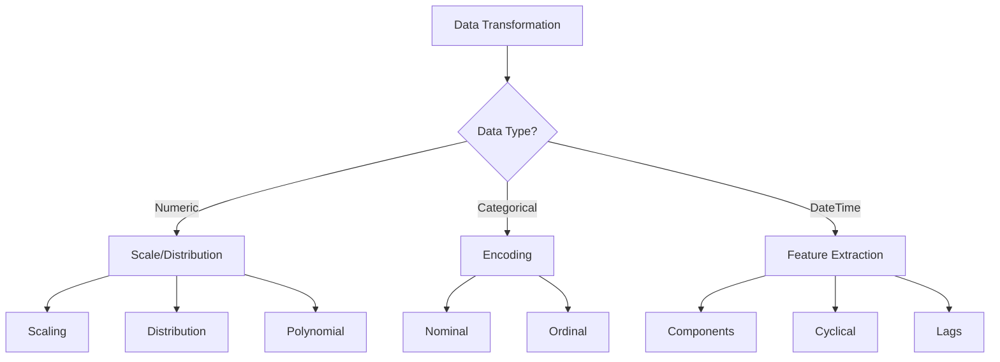

# Data Transformations: Shaping Data for Analysis 🔄

Data transformation is a crucial step in the data preparation process that involves converting data from one format or structure into another. This comprehensive guide covers various transformation techniques and when to use them effectively.

## Understanding Data Transformations: A Strategic Framework 📊

Data transformations serve multiple purposes:

1. **Normalization**
   - Purpose: Scale features to a common range
   - Use cases: Machine learning algorithms, distance-based methods
   - Examples: Min-max scaling, standardization

2. **Distribution Adjustment**
   - Purpose: Make data more normally distributed
   - Use cases: Statistical analysis, linear modeling
   - Examples: Log transformation, Box-Cox transformation

3. **Feature Engineering**
   - Purpose: Create new meaningful features
   - Use cases: Improve model performance, capture domain knowledge
   - Examples: Polynomial features, interaction terms

4. **Type Conversion**
   - Purpose: Convert data types for analysis
   - Use cases: Memory optimization, algorithm requirements
   - Examples: Categorical encoding, datetime parsing



## Mathematical Foundations 📐

### 1. Scaling Transformations
- **Standard Scaling (Z-score)**
  ```python
  z = (x - μ) / σ
  # Where:
  # x is the original value
  # μ is the mean
  # σ is the standard deviation
  ```

- **Min-Max Scaling**
  ```python
  x_scaled = (x - x_min) / (x_max - x_min)
  # Scales data to [0, 1] range
  ```

- **Robust Scaling**
  ```python
  x_robust = (x - Q2) / (Q3 - Q1)
  # Where:
  # Q1 is 25th percentile
  # Q2 is median
  # Q3 is 75th percentile
  ```

### 2. Distribution Transformations
- **Log Transform**
  ```python
  x_log = log(x + c)  # c is a constant to handle zeros
  ```

- **Box-Cox Transform**
  ```python
  x_boxcox = {
      (x^λ - 1) / λ  if λ ≠ 0
      log(x)         if λ = 0
  }
  ```

- **Yeo-Johnson Transform**
  ```python
  # Handles negative values unlike Box-Cox
  x_yeojohnson = {
      ((x + 1)^λ - 1) / λ     if λ ≠ 0, x ≥ 0
      log(x + 1)              if λ = 0, x ≥ 0
      -((-x + 1)^(2-λ) - 1) / (2-λ)   if λ ≠ 2, x < 0
      -log(-x + 1)            if λ = 2, x < 0
  }
  ```

## Advanced Transformation Techniques 🚀

### 1. Feature Scaling Pipeline
```python
from sklearn.compose import ColumnTransformer
from sklearn.pipeline import Pipeline
from sklearn.preprocessing import StandardScaler, OneHotEncoder

def create_transformation_pipeline(numeric_features, categorical_features):
    """
    Create a comprehensive transformation pipeline
    
    Parameters:
    numeric_features (list): List of numeric column names
    categorical_features (list): List of categorical column names
    
    Returns:
    sklearn.Pipeline: Transformation pipeline
    """
    numeric_transformer = Pipeline(steps=[
        ('scaler', StandardScaler())
    ])
    
    categorical_transformer = Pipeline(steps=[
        ('onehot', OneHotEncoder(drop='first', sparse=False))
    ])
    
    preprocessor = ColumnTransformer(
        transformers=[
            ('num', numeric_transformer, numeric_features),
            ('cat', categorical_transformer, categorical_features)
        ])
    
    return Pipeline(steps=[('preprocessor', preprocessor)])
```

### 2. Advanced Distribution Transformer
```python
class DistributionTransformer:
    """Transform data to follow specific distributions"""
    
    def __init__(self, method='box-cox', target_distribution='normal'):
        self.method = method
        self.target_distribution = target_distribution
        self.transformer = None
        self.lambda_ = None
    
    def fit_transform(self, data):
        """
        Fit and transform the data
        
        Parameters:
        data (array-like): Input data
        
        Returns:
        array: Transformed data
        """
        if self.method == 'box-cox':
            transformed_data, self.lambda_ = stats.boxcox(data)
        elif self.method == 'yeo-johnson':
            pt = PowerTransformer(method='yeo-johnson')
            transformed_data = pt.fit_transform(data.reshape(-1, 1))
            self.transformer = pt
        elif self.method == 'quantile':
            qt = QuantileTransformer(
                output_distribution=self.target_distribution,
                n_quantiles=1000
            )
            transformed_data = qt.fit_transform(data.reshape(-1, 1))
            self.transformer = qt
        
        return transformed_data
    
    def inverse_transform(self, transformed_data):
        """
        Inverse transform the data back to original scale
        
        Parameters:
        transformed_data (array-like): Transformed data
        
        Returns:
        array: Original scale data
        """
        if self.method == 'box-cox':
            return special.inv_boxcox(transformed_data, self.lambda_)
        elif self.method in ['yeo-johnson', 'quantile']:
            return self.transformer.inverse_transform(transformed_data)
```

### 3. Time Feature Engineering
```python
def engineer_time_features(df, datetime_column):
    """
    Create comprehensive time-based features
    
    Parameters:
    df (pandas.DataFrame): Input dataframe
    datetime_column (str): Name of datetime column
    
    Returns:
    pandas.DataFrame: DataFrame with engineered features
    """
    dt = pd.to_datetime(df[datetime_column])
    
    # Basic components
    time_features = pd.DataFrame({
        'year': dt.dt.year,
        'month': dt.dt.month,
        'day': dt.dt.day,
        'hour': dt.dt.hour,
        'dayofweek': dt.dt.dayofweek,
        'quarter': dt.dt.quarter
    })
    
    # Cyclical features
    time_features['month_sin'] = np.sin(2 * np.pi * dt.dt.month / 12)
    time_features['month_cos'] = np.cos(2 * np.pi * dt.dt.month / 12)
    time_features['hour_sin'] = np.sin(2 * np.pi * dt.dt.hour / 24)
    time_features['hour_cos'] = np.cos(2 * np.pi * dt.dt.hour / 24)
    
    # Business logic features
    time_features['is_weekend'] = dt.dt.dayofweek >= 5
    time_features['is_business_hour'] = (dt.dt.hour >= 9) & (dt.dt.hour < 17)
    time_features['is_morning'] = dt.dt.hour < 12
    
    return time_features
```

## Real-World Applications 💼

### 1. E-commerce Data Transformation
```python
def transform_ecommerce_data(df):
    """Transform e-commerce dataset for analysis"""
    
    # 1. Handle monetary values
    price_transformer = DistributionTransformer(method='box-cox')
    df['price_transformed'] = price_transformer.fit_transform(df['price'])
    
    # 2. Create time features
    time_features = engineer_time_features(df, 'order_date')
    
    # 3. Encode categories
    cat_encoder = OneHotEncoder(drop='first', sparse=False)
    encoded_categories = cat_encoder.fit_transform(
        df[['category', 'payment_method']]
    )
    
    # 4. Create interaction features
    df['price_per_unit'] = df['total_amount'] / df['quantity']
    df['items_per_order'] = df.groupby('order_id')['quantity'].transform('sum')
    
    return pd.concat([
        df,
        pd.DataFrame(encoded_categories, columns=cat_encoder.get_feature_names_out()),
        time_features
    ], axis=1)
```

### 2. Financial Data Transformation
```python
def transform_financial_data(df):
    """Transform financial time series data"""
    
    # 1. Calculate returns
    df['returns'] = df['price'].pct_change()
    
    # 2. Log transform for volatility
    df['log_returns'] = np.log1p(df['returns'])
    
    # 3. Rolling statistics
    windows = [5, 21, 63]  # 1 week, 1 month, 3 months
    for window in windows:
        df[f'rolling_mean_{window}'] = df['price'].rolling(window).mean()
        df[f'rolling_std_{window}'] = df['price'].rolling(window).std()
        df[f'rolling_zscore_{window}'] = (
            (df['price'] - df[f'rolling_mean_{window}']) / 
            df[f'rolling_std_{window}']
        )
    
    # 4. Technical indicators
    df['RSI'] = calculate_rsi(df['price'])
    df['MACD'] = calculate_macd(df['price'])
    
    return df
```

## Best Practices and Common Pitfalls ⚠️

### 1. Transformation Selection Guidelines
- Consider the data distribution
- Understand algorithm requirements
- Preserve important relationships
- Handle special cases (zeros, negatives)

### 2. Validation Framework
```python
def validate_transformation(original, transformed):
    """
    Validate transformation results
    
    Parameters:
    original (array-like): Original data
    transformed (array-like): Transformed data
    
    Returns:
    dict: Validation metrics
    """
    validation = {
        'distribution_metrics': {
            'original_skew': stats.skew(original),
            'transformed_skew': stats.skew(transformed),
            'original_kurtosis': stats.kurtosis(original),
            'transformed_kurtosis': stats.kurtosis(transformed)
        },
        'normality_tests': {
            'original': stats.normaltest(original),
            'transformed': stats.normaltest(transformed)
        },
        'range_metrics': {
            'original_range': (np.min(original), np.max(original)),
            'transformed_range': (np.min(transformed), np.max(transformed))
        }
    }
    
    # Visualize comparison
    fig, (ax1, ax2) = plt.subplots(1, 2, figsize=(12, 4))
    
    sns.histplot(original, ax=ax1)
    ax1.set_title('Original Distribution')
    
    sns.histplot(transformed, ax=ax2)
    ax2.set_title('Transformed Distribution')
    
    plt.tight_layout()
    plt.show()
    
    return validation
```

### 3. Performance Considerations
```python
def optimize_transformation_pipeline(df, pipeline):
    """
    Optimize transformation pipeline performance
    
    Parameters:
    df (pandas.DataFrame): Input dataframe
    pipeline (sklearn.Pipeline): Transformation pipeline
    
    Returns:
    sklearn.Pipeline: Optimized pipeline
    """
    # Memory optimization
    df_optimized = df.copy()
    for col in df_optimized.columns:
        if df_optimized[col].dtype == 'float64':
            df_optimized[col] = pd.to_numeric(df_optimized[col], downcast='float')
        elif df_optimized[col].dtype == 'int64':
            df_optimized[col] = pd.to_numeric(df_optimized[col], downcast='integer')
    
    # Pipeline optimization
    pipeline.set_params(memory='cachedir')
    
    return pipeline.fit(df_optimized)
```

## Practice Exercise: Customer Data Transformation 🏋️‍♂️

Transform a customer dataset for churn prediction:

```python
# Load data
df = pd.read_csv('customer_data.csv')

# 1. Analyze distributions
for col in df.select_dtypes(include=[np.number]):
    print(f"\nAnalyzing {col}:")
    print(stats.describe(df[col]))

# 2. Create transformation pipeline
numeric_features = ['age', 'income', 'tenure']
categorical_features = ['occupation', 'subscription_type']

pipeline = create_transformation_pipeline(
    numeric_features,
    categorical_features
)

# 3. Transform data
transformed_df = pipeline.fit_transform(df)

# 4. Validate results
for i, col in enumerate(numeric_features):
    validation = validate_transformation(
        df[col],
        transformed_df[:, i]
    )
    print(f"\nValidation results for {col}:")
    print(validation)
```

Remember: "Choose transformations that enhance the signal in your data while preserving meaningful relationships!" 🎯
