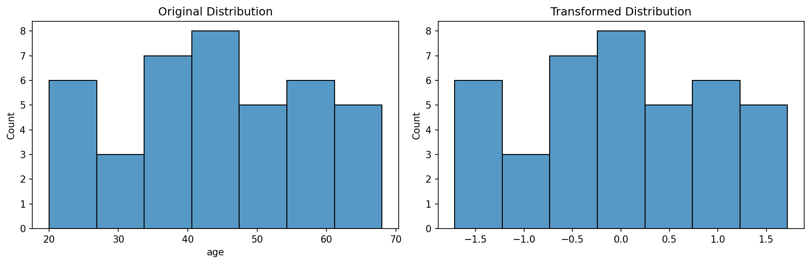
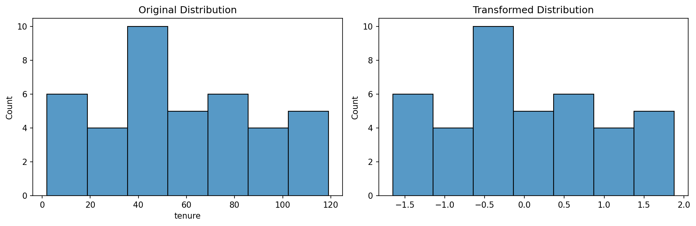

# Data Transformations: Shaping Data for Analysis

**After this lesson:** You can scale numeric features (**standard**, **min-max**), encode categoricals (**one-hot**, **label**), and apply common fixes (log, datetime features) with a clear reason for each choice.

## Helpful video

Pandas DataFrames in a quick walkthrough, useful for cleaning and wrangling.

## Overview

**Prerequisites:** [Missing values](missing-values.md) and [Outliers](outliers.md) (or equivalent cleaning). Familiarity with **scikit-learn**'s preprocessing module is useful; we cite it in examples.

> **Time needed:** About 60 minutes.

## Why this matters

Models and charts respond to **scale** and **representation**: distance-based algorithms care about units; trees often care less; linear models care about approximate linearity. Transformations align your features with those expectations, on purpose, not by habit.

Data transformation is a important step in the data preparation process: converting data from one format or structure into another. The sections below map common transforms to those goals.

## Understanding Data Transformations: A Strategic Framework

Data transformations serve multiple purposes:

1. **Normalization**
   * Purpose: Scale features to a common range
   * Use cases: Machine learning algorithms, distance-based methods
   * Examples: Min-max scaling, standardization
2. **Distribution Adjustment**
   * Purpose: Make data more normally distributed
   * Use cases: Statistical analysis, linear modeling
   * Examples: Log transformation, Box-Cox transformation
3. **Feature Engineering**
   * Purpose: Create new meaningful features
   * Use cases: Improve model performance, capture domain knowledge
   * Examples: Polynomial features, interaction terms
4. **Type Conversion**
   * Purpose: Convert data types for analysis
   * Use cases: Memory optimization, algorithm requirements
   * Examples: Categorical encoding, datetime parsing

## Mathematical Foundations

### 1. Scaling Transformations

*   **Standard Scaling (Z-score)**

    Z-score formula

    Subtracts the column mean (μ) and divides by its standard deviation (σ), producing a value whose sign shows direction and magnitude shows how many standard deviations away.
*   **Min-Max Scaling**

    Min-Max formula

    Shifts each value by the column minimum, then divides by the total range, compressing all values into \[0, 1].
*   **reliable Scaling**

    reliable scaling formula

    Centers on the median (Q2) and scales by the interquartile range (Q3 − Q1), making it insensitive to extreme outliers unlike standard or min-max scaling.

### 2. Distribution Transformations

*   **Log Transform**

    Log transform formula

    Adds a small constant _c_ before taking the log to handle zero values; compresses right-skewed distributions toward a more normal shape.
*   **Box-Cox Transform**

    Box-Cox transform formula

    A power transform parameterised by λ: when λ = 0 it reduces to a log; otherwise it applies a power law. Requires strictly positive data.
*   **Yeo-Johnson Transform**

    Yeo-Johnson transform formula

    Extends Box-Cox to handle zero and negative values with separate piecewise cases for x ≥ 0 and x < 0, making it applicable to any numeric column.

## Advanced Transformation Techniques

### 1. Feature Scaling Pipeline


Imports and function signature

Imports three sklearn components and defines the function, documenting that it accepts lists of numeric and categorical column names and returns a fitted Pipeline.

Build and combine sub-pipelines

Creates a StandardScaler pipeline for numeric features and a OneHotEncoder pipeline for categoricals, joins them in a ColumnTransformer, and wraps the result in a final Pipeline.

### 2. Advanced Distribution Transformer

Class definition and \_\_init\_\_

Stores the transform `method` (box-cox, yeo-johnson, or quantile) and `target_distribution`, initializing placeholders for the fitted transformer and lambda parameter.

fit\_transform: signature and docstring

Defines the method and documents that it accepts array-like data and returns a transformed array.

Three transform branches

Dispatches to Box-Cox (stores λ), Yeo-Johnson via `PowerTransformer`, or quantile normalisation via `QuantileTransformer`-storing the fitted object for later inverse-transform.

inverse\_transform

Reverses the transform: uses scipy's `inv_boxcox` with the stored λ for Box-Cox, or delegates to the stored sklearn transformer's `inverse_transform` for the other methods.

### 3. Time Feature Engineering

Function signature and docstring

Defines the function and documents its inputs (DataFrame + column name) and output (DataFrame of engineered time features).

Basic datetime components

Parses the column to datetime, then extracts year, month, day, hour, day-of-week, and quarter into a new DataFrame.

Cyclical and business-logic features

Adds sin/cos encodings for month and hour (so the model sees January and December as adjacent), plus boolean flags for weekend, business hour, and morning.

## Real-World Applications

### 1. E-commerce Data Transformation

Monetary values and time features

Applies a Box-Cox transform to `price` to reduce skew, then calls `engineer_time_features` to extract datetime components from `order_date`.

Encode categories, add interaction features, and combine

One-hot encodes category and payment method, creates price-per-unit and items-per-order interaction columns, then concatenates everything into a single DataFrame.

### 2. Financial Data Transformation

Returns and log returns

Computes percentage price changes (`returns`) and their log equivalent (`log_returns`), which is more normally distributed and additive across periods.

Rolling statistics and technical indicators

Generates rolling mean, std, and z-score for three window lengths (1 week, 1 month, 3 months), then appends RSI and MACD technical indicators before returning the enriched DataFrame.

## Best Practices and Common Pitfalls

### 1. Transformation Selection Guidelines

* Consider the data distribution
* Understand algorithm requirements
* Preserve important relationships
* Handle special cases (zeros, negatives)

### 2. Validation Framework

Function signature and docstring

Defines the function, documents that it takes original and transformed arrays, and returns a metrics dictionary.

Compute validation metrics

Records skew and kurtosis before and after, runs normality tests on both, and captures min/max range to check for unexpected clipping or expansion.

Side-by-side histogram comparison

Plots the original and transformed distributions in two panels so you can visually confirm the transform had the intended effect before returning the metrics dict.

### 3. Performance Considerations

Function signature and docstring

Defines the function and documents that it accepts a DataFrame and an unfitted sklearn Pipeline, returning an optimised fitted Pipeline.

Memory optimisation and pipeline caching

Downcasts float64 and int64 columns to smaller types to cut memory usage, then enables sklearn Pipeline caching via `set_params(memory=...)` before fitting.

## Practice Exercise: Customer Data Transformation

Transform a customer dataset for churn prediction:


```

Analyzing customer_id:
DescribeResult(nobs=np.int64(40), minmax=(np.int64(1), np.int64(40)), mean=np.float64(20.5), variance=np.float64(136.66666666666666), skewness=np.float64(0.0), kurtosis=np.float64(-1.201500938086304))

Analyzing age:
DescribeResult(nobs=np.int64(40), minmax=(np.int64(20), np.int64(68)), mean=np.float64(43.975), variance=np.float64(200.28141025641025), skewness=np.float64(-0.012562191403870635), kurtosis=np.float64(-1.0821420745312342))

Analyzing income:
DescribeResult(nobs=np.int64(40), minmax=(np.float64(20957.09506763072), np.float64(130942.3995248616)), mean=np.float64(82334.25940723266), variance=np.float64(1090563668.5542665), skewness=np.float64(-0.2318415185752648), kurtosis=np.float64(-1.1567951739204037))

Analyzing tenure:
DescribeResult(nobs=np.int64(40), minmax=(np.int64(2), np.int64(119)), mean=np.float64(56.8), variance=np.float64(1124.5230769230768), skewness=np.float64(0.24466179126919488), kurtosis=np.float64(-0.9849466326562171))

Analyzing spending:
DescribeResult(nobs=np.int64(40), minmax=(np.float64(211.73896804551777), np.float64(4848.964249003847)), mean=np.float64(2495.191596246369), variance=np.float64(1996206.2350566147), skewness=np.float64(0.0032941507320504446), kurtosis=np.float64(-1.1741950054579988))

Validation results for age:
{'distribution_metrics': {'original_skew': np.float64(-0.012562191403870635), 'transformed_skew': np.float64(-0.012562191403870571), 'original_kurtosis': np.float64(-1.0821420745312342), 'transformed_kurtosis': np.float64(-1.0821420745312345)}, 'normality_tests': {'original': NormaltestResult(statistic=np.float64(5.303572081068238), pvalue=np.float64(0.07052513974965449)), 'transformed': NormaltestResult(statistic=np.float64(5.303572081068246), pvalue=np.float64(0.07052513974965421))}, 'range_metrics': {'original_range': (np.int64(20), np.int64(68)), 'transformed_range': (np.float64(-1.715678810762139), np.float64(1.7192568687616427))}}

Validation results for income:
{'distribution_metrics': {'original_skew': np.float64(-0.2318415185752648), 'transformed_skew': np.float64(-0.231841518575264), 'original_kurtosis': np.float64(-1.1567951739204037), 'transformed_kurtosis': np.float64(-1.1567951739204052)}, 'normality_tests': {'original': NormaltestResult(statistic=np.float64(7.540657486692158), pvalue=np.float64(0.023044486320313473)), 'transformed': NormaltestResult(statistic=np.float64(7.540657486692189), pvalue=np.float64(0.023044486320313112))}, 'range_metrics': {'original_range': (np.float64(20957.09506763072), np.float64(130942.3995248616)), 'transformed_range': (np.float64(-1.8822573400166058), np.float64(1.4906688750677477))}}

Validation results for tenure:
{'distribution_metrics': {'original_skew': np.float64(0.24466179126919488), 'transformed_skew': np.float64(0.24466179126919477), 'original_kurtosis': np.float64(-0.9849466326562171), 'transformed_kurtosis': np.float64(-0.9849466326562166)}, 'normality_tests': {'original': NormaltestResult(statistic=np.float64(4.092861552058872), pvalue=np.float64(0.129195208268122)), 'transformed': NormaltestResult(statistic=np.float64(4.092861552058864), pvalue=np.float64(0.1291952082681225))}, 'range_metrics': {'original_range': (np.int64(2), np.int64(119)), 'transformed_range': (np.float64(-1.6549850099914483), np.float64(1.8784683872530672))}}
```

Load data and inspect distributions

Reads the customer CSV and prints scipy's describe output for every numeric column so you can assess skew and kurtosis before choosing transforms.

Build pipeline, transform, and validate

Creates the feature lists, builds a transformation pipeline, fits and transforms the data, then validates each numeric feature by comparing original and scaled distributions.

<figure><figcaption><p>Figure 1: Original Distribution</p></figcaption></figure>

<figure><figcaption><p>Figure 2: Original Distribution</p></figcaption></figure>

<figure><figcaption><p>Figure 3: Original Distribution</p></figcaption></figure>

```

Analyzing customer_id:
DescribeResult(nobs=np.int64(40), minmax=(np.int64(1), np.int64(40)), mean=np.float64(20.5), variance=np.float64(136.66666666666666), skewness=np.float64(0.0), kurtosis=np.float64(-1.201500938086304))

Analyzing age:
DescribeResult(nobs=np.int64(40), minmax=(np.int64(20), np.int64(68)), mean=np.float64(43.975), variance=np.float64(200.28141025641025), skewness=np.float64(-0.012562191403870635), kurtosis=np.float64(-1.0821420745312342))

Analyzing income:
DescribeResult(nobs=np.int64(40), minmax=(np.float64(20957.09506763072), np.float64(130942.3995248616)), mean=np.float64(82334.25940723266), variance=np.float64(1090563668.5542665), skewness=np.float64(-0.2318415185752648), kurtosis=np.float64(-1.1567951739204037))

Analyzing tenure:
DescribeResult(nobs=np.int64(40), minmax=(np.int64(2), np.int64(119)), mean=np.float64(56.8), variance=np.float64(1124.5230769230768), skewness=np.float64(0.24466179126919488), kurtosis=np.float64(-0.9849466326562171))

Analyzing spending:
DescribeResult(nobs=np.int64(40), minmax=(np.float64(211.73896804551777), np.float64(4848.964249003847)), mean=np.float64(2495.191596246369), variance=np.float64(1996206.2350566147), skewness=np.float64(0.0032941507320504446), kurtosis=np.float64(-1.1741950054579988))

Validation results for age:
{'distribution_metrics': {'original_skew': np.float64(-0.012562191403870635), 'transformed_skew': np.float64(-0.012562191403870571), 'original_kurtosis': np.float64(-1.0821420745312342), 'transformed_kurtosis': np.float64(-1.0821420745312345)}, 'normality_tests': {'original': NormaltestResult(statistic=np.float64(5.303572081068238), pvalue=np.float64(0.07052513974965449)), 'transformed': NormaltestResult(statistic=np.float64(5.303572081068246), pvalue=np.float64(0.07052513974965421))}, 'range_metrics': {'original_range': (np.int64(20), np.int64(68)), 'transformed_range': (np.float64(-1.715678810762139), np.float64(1.7192568687616427))}}

Validation results for income:
{'distribution_metrics': {'original_skew': np.float64(-0.2318415185752648), 'transformed_skew': np.float64(-0.231841518575264), 'original_kurtosis': np.float64(-1.1567951739204037), 'transformed_kurtosis': np.float64(-1.1567951739204052)}, 'normality_tests': {'original': NormaltestResult(statistic=np.float64(7.540657486692158), pvalue=np.float64(0.023044486320313473)), 'transformed': NormaltestResult(statistic=np.float64(7.540657486692189), pvalue=np.float64(0.023044486320313112))}, 'range_metrics': {'original_range': (np.float64(20957.09506763072), np.float64(130942.3995248616)), 'transformed_range': (np.float64(-1.8822573400166058), np.float64(1.4906688750677477))}}

Validation results for tenure:
{'distribution_metrics': {'original_skew': np.float64(0.24466179126919488), 'transformed_skew': np.float64(0.24466179126919477), 'original_kurtosis': np.float64(-0.9849466326562171), 'transformed_kurtosis': np.float64(-0.9849466326562166)}, 'normality_tests': {'original': NormaltestResult(statistic=np.float64(4.092861552058872), pvalue=np.float64(0.129195208268122)), 'transformed': NormaltestResult(statistic=np.float64(4.092861552058864), pvalue=np.float64(0.1291952082681225))}, 'range_metrics': {'original_range': (np.int64(2), np.int64(119)), 'transformed_range': (np.float64(-1.6549850099914483), np.float64(1.8784683872530672))}}
```

Remember: "Choose transformations that enhance the signal in your data while preserving meaningful relationships!"

## Next steps

* [Wrangling project](project.md), consolidate cleaning and transforms in one brief
* [Exploratory Data Analysis (Module 2.3)](../2.3-eda/), explore distributions after transforming
* [Data engineering (Module 2.4)](../2.4-data-engineering/), where transforms often run in pipelines
* [Module README](./)
