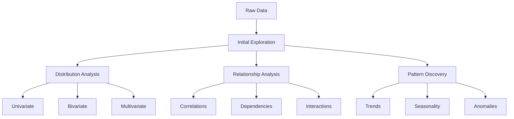

# Exploratory Data Analysis: From Data to Insights

Exploratory Data Analysis (EDA) is the crucial first step in any data analysis project. It's like being a detective - you investigate your data to uncover patterns, spot anomalies, test hypotheses, and check assumptions. Through EDA, you transform raw data into actionable insights.

## The EDA Journey: A Systematic Approach

The journey of EDA is both an art and a science. Like a skilled explorer, you need to:

1. Start with broad questions about your data
2. Use visualizations and statistics to find answers
3. Let those answers lead to more specific questions
4. Iterate until you have a deep understanding of your dataset



## Comprehensive EDA Framework

### 1. Initial Data Exploration

```python
import pandas as pd
import numpy as np
import matplotlib.pyplot as plt
import seaborn as sns
import plotly.express as px
from scipy import stats

class DataExplorer:
    """A comprehensive framework for exploratory data analysis.
    
    This class provides methods to systematically explore and understand your dataset
    through summary statistics, visualizations, and pattern detection.
    
    Key Features:
    - Automated data type detection
    - Comprehensive summary statistics
    - Missing data analysis
    - Correlation analysis
    - Distribution visualization
    - Relationship exploration
    """
    
    def __init__(self, df):
        self.df = df
        self.numeric_cols = df.select_dtypes(include=[np.number]).columns
        self.categorical_cols = df.select_dtypes(include=['object']).columns
        
    def generate_summary(self):
        """Generate a comprehensive data summary including statistics and data quality metrics.
        
        This method provides a complete overview of your dataset by analyzing:
        - Basic information (shape, data types, memory usage)
        - Numeric column statistics (mean, std, quartiles, etc.)
        - Categorical column summaries (unique values, frequencies)
        - Missing data patterns
        - Correlation structure
        
        Returns:
            dict: A dictionary containing various summary metrics and analyses
        """
        summary = {
            'basic_info': {
                'shape': self.df.shape,
                'dtypes': self.df.dtypes,
                'memory_usage': self.df.memory_usage().sum() / 1024**2
            },
            'numeric_summary': self.df[self.numeric_cols].describe(),
            'categorical_summary': self.df[self.categorical_cols].describe(),
            'missing_data': self.analyze_missing_data(),
            'correlations': self.analyze_correlations()
        }
        return summary
    
    def analyze_missing_data(self):
        """Analyze missing values"""
        missing = pd.DataFrame({
            'count': self.df.isnull().sum(),
            'percentage': (self.df.isnull().sum() / len(self.df)) * 100
        })
        return missing[missing['count'] > 0]
    
    def analyze_correlations(self):
        """Analyze correlations between numeric variables"""
        return self.df[self.numeric_cols].corr()
    
    def plot_distributions(self):
        """Plot distributions for all numeric variables"""
        n_cols = len(self.numeric_cols)
        fig, axes = plt.subplots(n_cols, 2, figsize=(15, 5*n_cols))
        
        for i, col in enumerate(self.numeric_cols):
            # Histogram
            sns.histplot(self.df[col], kde=True, ax=axes[i,0])
            axes[i,0].set_title(f'{col} Distribution')
            
            # Box plot
            sns.boxplot(y=self.df[col], ax=axes[i,1])
            axes[i,1].set_title(f'{col} Box Plot')
        
        plt.tight_layout()
        plt.show()
    
    def plot_relationships(self):
        """Plot relationships between variables"""
        # Correlation heatmap
        plt.figure(figsize=(10, 8))
        sns.heatmap(self.analyze_correlations(), annot=True, cmap='coolwarm')
        plt.title('Correlation Matrix')
        plt.show()
        
        # Scatter matrix
        if len(self.numeric_cols) > 1:
            pd.plotting.scatter_matrix(
                self.df[self.numeric_cols],
                figsize=(15, 15),
                diagonal='kde'
            )
            plt.show()
    
    def analyze_categorical(self):
        """Analyze categorical variables"""
        for col in self.categorical_cols:
            plt.figure(figsize=(10, 5))
            
            # Value counts
            counts = self.df[col].value_counts()
            sns.barplot(x=counts.index, y=counts.values)
            plt.title(f'{col} Value Counts')
            plt.xticks(rotation=45)
            plt.show()
            
            # Cross-tabulations with numeric variables
            for num_col in self.numeric_cols:
                plt.figure(figsize=(10, 5))
                sns.boxplot(x=col, y=num_col, data=self.df)
                plt.title(f'{num_col} by {col}')
                plt.xticks(rotation=45)
                plt.show()
```

### 2. Advanced Analysis Techniques

```python
class AdvancedAnalyzer:
    """Advanced techniques for in-depth exploratory data analysis.
    
    This class implements sophisticated methods for:
    - Outlier detection using multiple methods
    - Distribution analysis with statistical tests
    - Time pattern analysis with decomposition
    - Advanced visualization techniques
    
    Perfect for when you need to dig deeper into your data's characteristics
    and uncover subtle patterns or anomalies.
    """
    
    def __init__(self, df):
        self.df = df
        
    def detect_outliers(self, column, method='zscore'):
        """Detect outliers using multiple methods"""
        if method == 'zscore':
            z_scores = np.abs(stats.zscore(self.df[column]))
            return z_scores > 3
        elif method == 'iqr':
            Q1 = self.df[column].quantile(0.25)
            Q3 = self.df[column].quantile(0.75)
            IQR = Q3 - Q1
            return (self.df[column] < (Q1 - 1.5 * IQR)) | (self.df[column] > (Q3 + 1.5 * IQR))
    
    def analyze_distributions(self, column):
        """Analyze distribution characteristics"""
        dist_stats = {
            'normality': {
                'shapiro': stats.shapiro(self.df[column]),
                'normaltest': stats.normaltest(self.df[column])
            },
            'moments': {
                'mean': np.mean(self.df[column]),
                'std': np.std(self.df[column]),
                'skew': stats.skew(self.df[column]),
                'kurtosis': stats.kurtosis(self.df[column])
            }
        }
        return dist_stats
    
    def analyze_time_patterns(self, date_column, value_column):
        """Analyze time-based patterns"""
        self.df[date_column] = pd.to_datetime(self.df[date_column])
        
        # Resample to different frequencies
        patterns = {
            'daily': self.df.resample('D', on=date_column)[value_column].mean(),
            'weekly': self.df.resample('W', on=date_column)[value_column].mean(),
            'monthly': self.df.resample('M', on=date_column)[value_column].mean()
        }
        
        # Decompose time series
        from statsmodels.tsa.seasonal import seasonal_decompose
        decomposition = seasonal_decompose(
            patterns['daily'].dropna(),
            period=7,
            extrapolate_trend='freq'
        )
        
        return patterns, decomposition
```

## Real-World Case Study: E-commerce Analytics

```python
# Load sample e-commerce data
df = pd.read_csv('ecommerce_data.csv')

# Initialize explorers
explorer = DataExplorer(df)
analyzer = AdvancedAnalyzer(df)

# 1. Basic Exploration
summary = explorer.generate_summary()
print("Data Summary:")
print(summary['basic_info'])

# 2. Distribution Analysis
explorer.plot_distributions()

# 3. Sales Analysis
sales_patterns, decomp = analyzer.analyze_time_patterns('order_date', 'amount')

# Visualize sales trends
plt.figure(figsize=(15, 10))

plt.subplot(411)
decomp.observed.plot()
plt.title('Observed Sales')

plt.subplot(412)
decomp.trend.plot()
plt.title('Sales Trend')

plt.subplot(413)
decomp.seasonal.plot()
plt.title('Seasonal Pattern')

plt.subplot(414)
decomp.resid.plot()
plt.title('Residuals')

plt.tight_layout()
plt.show()

# 4. Customer Segmentation
customer_segments = pd.DataFrame({
    'total_spent': df.groupby('customer_id')['amount'].sum(),
    'order_count': df.groupby('customer_id')['order_id'].count(),
    'avg_order_value': df.groupby('customer_id')['amount'].mean()
})

# Visualize customer segments
fig = px.scatter_3d(
    customer_segments.reset_index(),
    x='total_spent',
    y='order_count',
    z='avg_order_value',
    color='total_spent',
    title='Customer Segmentation'
)
fig.show()
```

## Performance Optimization Tips

When working with large datasets, performance optimization becomes crucial. Here are some battle-tested strategies to make your EDA more efficient:

### 1. Memory Management: Working Smart with Big Data

```python
def optimize_dataframe(df):
    """Optimize DataFrame memory usage"""
    
    # Numeric optimization
    numerics = ['int16', 'int32', 'int64', 'float64']
    for col in df.select_dtypes(include=numerics).columns:
        col_min = df[col].min()
        col_max = df[col].max()
        
        # Integer optimization
        if str(df[col].dtype).startswith('int'):
            if col_min > np.iinfo(np.int8).min and col_max < np.iinfo(np.int8).max:
                df[col] = df[col].astype(np.int8)
            elif col_min > np.iinfo(np.int16).min and col_max < np.iinfo(np.int16).max:
                df[col] = df[col].astype(np.int16)
            elif col_min > np.iinfo(np.int32).min and col_max < np.iinfo(np.int32).max:
                df[col] = df[col].astype(np.int32)
        
        # Float optimization
        else:
            df[col] = pd.to_numeric(df[col], downcast='float')
    
    # Categorical optimization
    for col in df.select_dtypes(include=['object']).columns:
        if df[col].nunique() / len(df) < 0.5:  # If less than 50% unique values
            df[col] = df[col].astype('category')
    
    return df
```

### 2. Chunked Processing

```python
def analyze_large_dataset(file_path, chunk_size=10000):
    """Process large datasets in chunks"""
    chunks = []
    
    # Process file in chunks
    for chunk in pd.read_csv(file_path, chunksize=chunk_size):
        # Optimize memory usage
        chunk = optimize_dataframe(chunk)
        
        # Process chunk
        chunk_stats = process_chunk(chunk)
        chunks.append(chunk_stats)
    
    # Combine results
    return pd.concat(chunks)
```

## Common Pitfalls and Solutions

Even experienced data scientists can fall into these common traps. Here's how to avoid them:

1. **Skewed Distributions: The Silent Analysis Killer**

   ```python
   # Bad: Assuming normal distribution
   mean = df['amount'].mean()
   std = df['amount'].std()
   
   # Good: Use robust statistics
   median = df['amount'].median()
   mad = stats.median_abs_deviation(df['amount'])
   ```

2. **Correlation vs Causation: Don't Jump to Conclusions**

   ```python
   # Correlation analysis
   correlation = df['price'].corr(df['sales'])
   
   # Additional analysis needed
   # - Time series analysis
   # - A/B testing
   # - Control for confounding variables
   ```

3. **Missing Data Impact: The Hidden Influence**

   ```python
   # Bad: Drop all missing values
   df_clean = df.dropna()
   
   # Good: Analyze missing patterns
   missing_patterns = pd.DataFrame({
       'missing_count': df.isnull().sum(),
       'missing_pct': (df.isnull().sum() / len(df)) * 100,
       'missing_corr': df.isnull().corr()
   })
   ```

## Interactive Visualization Tips: Making Your Data Come Alive

Static visualizations are good, but interactive ones can tell a more compelling story. Here's how to create engaging visualizations that help stakeholders explore and understand the data themselves:

```python
def create_interactive_dashboard(df):
    """Create interactive visualizations with Plotly"""
    
    # Sales trends
    fig1 = px.line(
        df.resample('D', on='date')['amount'].sum(),
        title='Daily Sales Trend'
    )
    
    # Customer segments
    fig2 = px.scatter(
        df,
        x='recency',
        y='frequency',
        size='monetary',
        color='segment',
        title='RFM Analysis'
    )
    
    # Product analysis
    fig3 = px.treemap(
        df.groupby('category')['amount'].sum().reset_index(),
        path=['category'],
        values='amount',
        title='Sales by Category'
    )
    
    return [fig1, fig2, fig3]
```

## Assignment

Ready to practice your EDA skills? Head over to the [EDA Assignment](../_assignments/2.3-assignment.md) to apply what you've learned!

Remember: "EDA is not just about looking at data, it's about understanding the story it tells!"

Pro Tips:

- Always start with simple visualizations before moving to complex ones
- Let your business questions guide your exploration
- Document your findings and assumptions along the way
- Be prepared to iterate as you discover new patterns
- Share your insights in a way that non-technical stakeholders can understand

Next, dive into specific aspects of EDA:

- [Understanding Distributions](distributions.md)
- [Analyzing Relationships](relationships.md)
- [Time Series Analysis](time-series.md)
