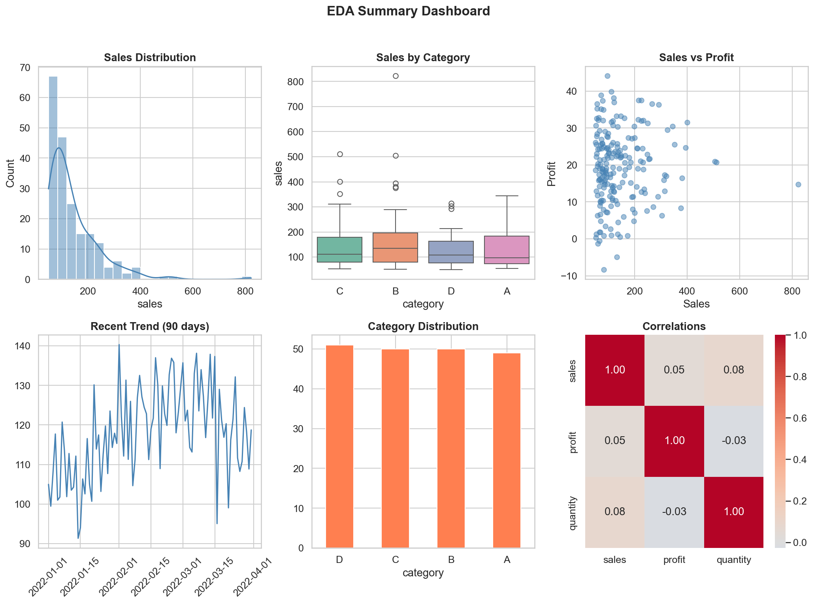
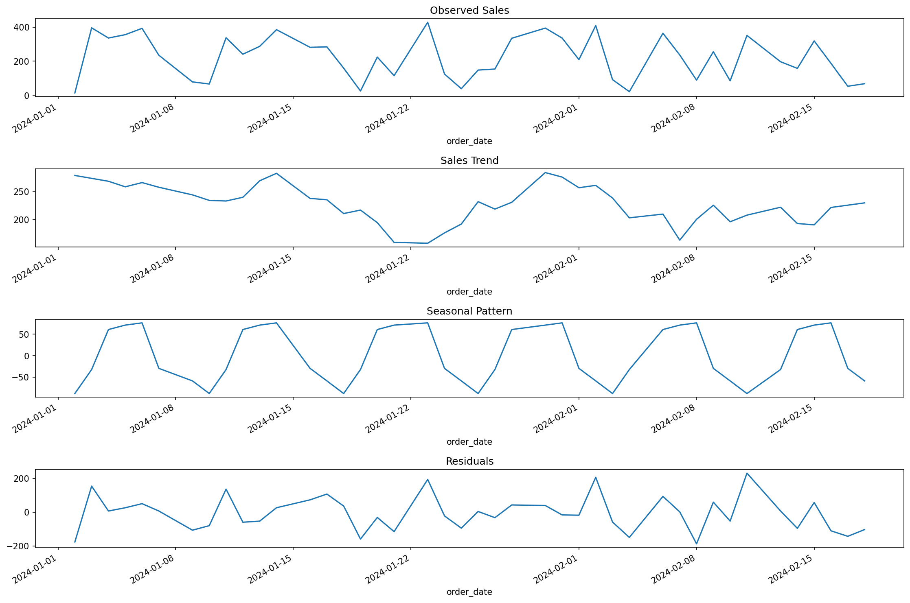
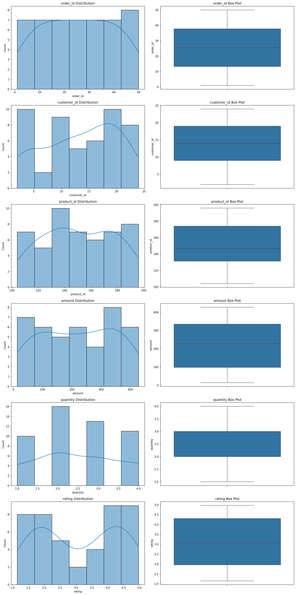

# 2.3-eda

## Exploratory Data Analysis: From Data to Insights

**After this submodule:** Profile a dataset, plot distributions and relationships, and document findings before modeling, using a repeatable **EDA workflow** (see the mermaid diagram below).

### Overview

**Prerequisites:** [Data wrangling (Module 2.2)](../2.2-data-wrangling/) and [Pandas](../../1-data-fundamentals/1.5-data-analysis-pandas/). [Visualization basics](../../3-data-visualization/3.1-intro-data-viz/) complement this unit.

> **Time needed:** Several hours across readings, the tutorial notebook, and practice.



### Lesson path (site order)

1. [Distributions](distributions.md)
2. [Relationships](relationships.md)
3. [Time series](time-series.md)
4. [EDA project](project.md)

### Why this matters

EDA is where you catch **skewed distributions**, **leaky features**, **wrong units**, and **silent missingness** before they become a pretty chart or a bad model. A short, repeatable EDA pass saves hours of debugging later and gives stakeholders confidence in your numbers.

Exploratory Data Analysis (EDA) is the important first step in any data analysis project. It is like being a detective: you investigate your data to uncover patterns, spot anomalies, test hypotheses, and check assumptions. Through EDA, you turn raw tables into questions you can answer with statistics or visualization.

#### Video Tutorial: Exploratory Data Analysis

_Exploratory Data Analysis (EDA) Using Python - Edureka_

### The EDA Journey: A Systematic Approach

The journey of EDA is both an art and a science. Like a skilled explorer, you need to:

1. Start with broad questions about your data
2. Use visualizations and statistics to find answers
3. Let those answers lead to more specific questions
4. Iterate until you have a deep understanding of your dataset

### Comprehensive EDA Framework

#### 1. Initial Data Exploration

Imports

Six standard imports: pandas and numpy for data, matplotlib and seaborn for static plots, plotly for interactive charts, and scipy for statistical tests.

DataExplorer class definition

The class docstring lists its six key features. `__init__` receives a DataFrame and immediately splits columns into `numeric_cols` and `categorical_cols` for later use.

generate\_summary

Builds a dict with `basic_info` (shape, dtypes, memory), numeric and categorical `describe()` outputs, missing-data counts, and the correlation matrix, all in one call.

analyze\_missing\_data and analyze\_correlations

`analyze_missing_data` returns only columns that have at least one null. `analyze_correlations` calls `.corr()` on numeric columns and returns the full matrix.

plot\_distributions

Loops over every numeric column, placing a histogram+KDE in the left subplot and a box plot in the right. `tight_layout` prevents label overlap before `plt.show()`.

plot\_relationships and analyze\_categorical

`plot_relationships` draws a heatmap and an optional scatter matrix. `analyze_categorical` plots value counts for each categorical column and cross-tabulates against every numeric column via box plots.

#### 2. Advanced Analysis Techniques

AdvancedAnalyzer class and constructor

The class docstring names four capability areas. `__init__` simply stores the DataFrame; column splitting happens in each method as needed.

detect\_outliers

Supports two strategies: **z-score** (flags rows more than 3 standard deviations from the mean) and **IQR** (flags rows outside 1.5×IQR below Q1 or above Q3).

analyze\_distributions

Runs Shapiro-Wilk and D'Agostino normality tests, then computes the four distribution moments: mean, std, skewness, and excess kurtosis.

analyze\_time\_patterns

Resamples to daily, weekly, and monthly averages, then calls `seasonal_decompose` on the daily series (period=7, extrapolated trend) to separate trend, seasonality, and residuals.

### Real-World Case Study: E-commerce Analytics



```
Data Summary:
{'shape': (50, 8), 'dtypes': order_id         int64
customer_id      int64
product_id       int64
order_date         str
amount         float64
quantity       float64
category           str
rating         float64
dtype: object, 'memory_usage': np.float64(0.003177642822265625)}
```

Setup

Loads the CSV and initialises both explorer objects-`DataExplorer` for summaries and plots, `AdvancedAnalyzer` for outlier and time-pattern work.

Basic exploration

Calls `generate_summary()` and prints `basic_info`, then calls `plot_distributions()` to get a first visual read on the data.

Sales decomposition plot

Calls `analyze_time_patterns` on the order-date column, then creates a 4-subplot figure showing observed, trend, seasonal, and residual components using `plt.subplot(41x)` layout.

Customer segmentation

Aggregates per customer into total spend, order count, and average order value, then visualises in a 3-D interactive scatter coloured by `total_spent`.

<figure><figcaption><p>Figure 1: order_id Distribution</p></figcaption></figure>

<figure><figcaption><p>Figure 2: Observed Sales</p></figcaption></figure>

```
Data Summary:
{'shape': (50, 8), 'dtypes': order_id         int64
customer_id      int64
product_id       int64
order_date         str
amount         float64
quantity       float64
category           str
rating         float64
dtype: object, 'memory_usage': np.float64(0.003177642822265625)}
```

### Performance Optimization Tips

When working with large datasets, performance optimization becomes important. Here are some battle-tested strategies to make your EDA more efficient:

#### 1. Memory Management: Working Smart with Big Data

Integer downcast

For each numeric column the function checks min/max against int8, int16, and int32 bounds, picking the smallest integer type that fits.

Float downcast and categorical conversion

Float columns are passed to `pd.to_numeric(downcast='float')`. Object columns with fewer than 50% unique values are converted to the memory-efficient `category` dtype.

#### 2. Chunked Processing

Function signature and setup

Opens an empty list to collect per-chunk results; the `chunksize` parameter controls how many rows are held in memory at once.

Chunk loop and combine

Each chunk is memory-optimised with `optimize_dataframe`, processed via `process_chunk`, and appended to the list. `pd.concat` merges all results at the end.

### Common Pitfalls and Solutions

Even experienced data scientists can fall into these common traps. Here's how to avoid them:

1. **Skewed Distributions: The Silent Analysis Killer**

## no-output

import pandas as pd from scipy import stats

df = pd.read\_csv('../\_data/ecommerce\_data.csv')

## Bad: Assuming normal distribution

mean = df\['amount'].mean() std = df\['amount'].std()

## Good: Use reliable statistics

median = df\['amount'].median() mad = stats.median\_abs\_deviation(df\['amount'])

Fragile approach: mean and std

Using mean and std assumes a normal distribution. For right-skewed data (e.g. revenue) these statistics misrepresent the typical value.

reliable approach: median and MAD

Median and median absolute deviation (MAD) are resistant to outliers and make no normality assumption, prefer them for skewed distributions.

2.  **Correlation vs Causation: Don't Jump to Conclusions**

    Pearson correlation

    A single correlation number tells you direction and strength, but not causation, confounding variables or reversed causality can produce the same value.

    Follow-up analyses needed

    The comment block lists three next steps, time-series analysis, A/B testing, and controlling for confounders, that must follow before any causal claim.
3.  **Missing Data Impact: The Hidden Influence**

    Fragile approach: dropna

    Blindly dropping all rows with nulls can silently discard non-random missingness, biasing the remaining dataset.

    Better approach: profile missing patterns

    Building a DataFrame of missing count, percentage, and cross-column correlation reveals whether nulls are random (MAR) or systematic (MNAR) before deciding how to handle them.

### Interactive Visualization Tips: Making Your Data Come Alive

Static visualizations are good, but interactive ones can tell a more compelling story. Here's how to create engaging visualizations that help stakeholders explore and understand the data themselves:

Sales trend and RFM scatter

`fig1` shows a daily sales line resampled from the raw data. `fig2` is an RFM scatter where bubble size encodes monetary value and colour encodes customer segment.

Category treemap and return

`fig3` uses a treemap to show revenue share by product category, each tile area is proportional to total sales amount. The function returns all three figures for embedding in a notebook or app.

### Session Notebooks

* [EDA Analysis Session Notebook (Google Colab)](https://colab.research.google.com/drive/1mwUvWH-BzjdfD7Qyx4z21t5Qxxyu8Yfw#scrollTo=H0Nuio29lvQa)

### Assignment

Ready to practice your EDA skills? Head over to the [Module 2 assignment (student version)](../assignments/module-assignment-student.md) to apply what you have learned.

Remember: "EDA is about more than looking at data, it's about understanding the story it tells!"

Pro Tips:

* Always start with simple visualizations before moving to complex ones
* Let your business questions guide your exploration
* Document your findings and assumptions along the way
* Be prepared to iterate as you discover new patterns
* Share your insights in a way that non-technical stakeholders can understand

### Next steps (lesson path)

* [Understanding Distributions](distributions.md)
* [Analyzing Relationships](relationships.md)
* [Time Series Analysis](time-series.md)
* [EDA project](project.md)
