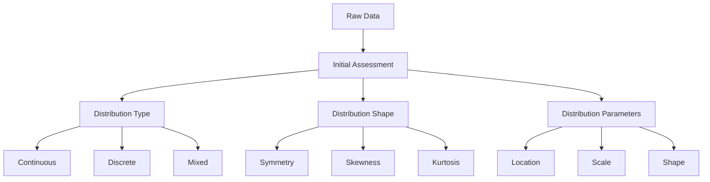

# Understanding Data Distributions: A Comprehensive Guide 📊

Data distributions are fundamental to understanding your dataset's characteristics and making informed analytical decisions. This guide will help you master the art and science of distribution analysis.

## Why Study Distributions? 🤔

Understanding distributions helps you:
1. Choose appropriate statistical methods
2. Identify outliers and anomalies
3. Make better decisions about data transformations
4. Validate assumptions for advanced analyses
5. Communicate data characteristics effectively

## Distribution Analysis Workflow 🔄

The systematic process of understanding your data's distribution:



## Mathematical Foundations 📐

### 1. Measures of Central Tendency: Finding the Center

Each measure tells a different story about your data's center:

- **Mean**: $\bar{x} = \frac{1}{n}\sum_{i=1}^n x_i$
  - Best for symmetric distributions
  - Sensitive to outliers
  - Used in many statistical procedures
  
- **Median**: Middle value when sorted
  - Robust to outliers
  - Better for skewed distributions
  - Splits data into equal halves
  
- **Mode**: Most frequent value
  - Important for categorical data
  - Can identify multiple peaks
  - Useful for understanding data clusters

### 2. Measures of Spread: Understanding Variability

Different spread measures capture different aspects of variability:

- **Variance**: $\sigma^2 = \frac{1}{n}\sum_{i=1}^n (x_i - \bar{x})^2$
  - Fundamental measure of variability
  - Units are squared (harder to interpret)
  - Foundation for many statistical methods
  
- **Standard Deviation**: $\sigma = \sqrt{\frac{1}{n}\sum_{i=1}^n (x_i - \bar{x})^2}$
  - Same units as original data
  - Approximately 68-95-99.7 rule for normal distributions
  - Most commonly used spread measure
  
- **IQR**: $IQR = Q_3 - Q_1$
  - Robust to outliers
  - Used in box plots
  - Contains middle 50% of data

### 3. Shape Measures: Understanding Distribution Form

Shape measures help identify the need for transformations:

- **Skewness**: $\gamma_1 = \frac{m_3}{m_2^{3/2}}$ where $m_k = \frac{1}{n}\sum_{i=1}^n (x_i - \bar{x})^k$
  - Measures asymmetry
  - Positive: right tail longer
  - Negative: left tail longer
  - |γ₁| > 1 indicates significant skewness
  
- **Kurtosis**: $\gamma_2 = \frac{m_4}{m_2^2} - 3$
  - Measures tail heaviness
  - Higher values: heavier tails
  - Normal distribution: γ₂ = 0
  - Important for identifying outlier-prone distributions

## Comprehensive Distribution Analysis Framework: A Practical Guide 🔬

This framework provides a systematic approach to understanding your data's distribution:

```python
import pandas as pd
import numpy as np
import matplotlib.pyplot as plt
import seaborn as sns
from scipy import stats
import plotly.express as px
import plotly.graph_objects as go

class DistributionAnalyzer:
    """A comprehensive framework for analyzing data distributions.
    
    This class provides methods to:
    - Calculate and interpret descriptive statistics
    - Test for normality and other distribution types
    - Create informative visualizations
    - Identify potential issues and anomalies
    - Guide decisions about data transformations
    """
    
    def __init__(self, data, column):
        self.data = data[column]
        self.column = column
        self.stats = {}
        self.tests = {}
        
    def analyze_basic_stats(self):
        """Calculate and interpret comprehensive distribution statistics.
        
        This method provides:
        - Basic summary statistics
        - Shape characteristics
        - Outlier indicators
        - Distribution type hints
        
        Returns:
            dict: A comprehensive set of distribution statistics
        """
        self.stats = {
            'n': len(self.data),
            'missing': self.data.isnull().sum(),
            'mean': self.data.mean(),
            'median': self.data.median(),
            'mode': self.data.mode().iloc[0],
            'std': self.data.std(),
            'var': self.data.var(),
            'skew': self.data.skew(),
            'kurtosis': self.data.kurtosis(),
            'iqr': self.data.quantile(0.75) - self.data.quantile(0.25),
            'range': self.data.max() - self.data.min()
        }
        return self.stats
    
    def analyze_distribution_type(self):
        """Determine likely distribution type"""
        # Continuous vs Discrete check
        unique_ratio = len(self.data.unique()) / len(self.data)
        
        # Normality tests
        shapiro_test = stats.shapiro(self.data.dropna())
        anderson_test = stats.anderson(self.data.dropna(), 'norm')
        
        self.tests = {
            'unique_ratio': unique_ratio,
            'likely_type': 'continuous' if unique_ratio > 0.05 else 'discrete',
            'normality_tests': {
                'shapiro': {
                    'statistic': shapiro_test[0],
                    'p_value': shapiro_test[1]
                },
                'anderson': {
                    'statistic': anderson_test.statistic,
                    'critical_values': anderson_test.critical_values
                }
            }
        }
        return self.tests
    
    def plot_distribution_suite(self):
        """Create comprehensive distribution visualization"""
        fig = plt.figure(figsize=(20, 10))
        
        # Histogram with KDE
        plt.subplot(231)
        sns.histplot(self.data, kde=True)
        plt.title('Distribution with KDE')
        
        # Box plot
        plt.subplot(232)
        sns.boxplot(y=self.data)
        plt.title('Box Plot')
        
        # Violin plot
        plt.subplot(233)
        sns.violinplot(y=self.data)
        plt.title('Violin Plot')
        
        # Q-Q plot
        plt.subplot(234)
        stats.probplot(self.data.dropna(), dist="norm", plot=plt)
        plt.title('Q-Q Plot')
        
        # ECDF
        plt.subplot(235)
        sns.ecdfplot(self.data)
        plt.title('Empirical CDF')
        
        # Scatter plot with jitter
        plt.subplot(236)
        plt.scatter(
            np.random.normal(0, 0.1, size=len(self.data)),
            self.data,
            alpha=0.5
        )
        plt.title('Scatter with Jitter')
        
        plt.tight_layout()
        plt.show()
    
    def create_interactive_plots(self):
        """Create interactive visualizations with Plotly"""
        # Distribution plot
        fig1 = go.Figure()
        fig1.add_trace(go.Histogram(
            x=self.data,
            name='Histogram',
            nbinsx=30
        ))
        fig1.add_trace(go.Violin(
            y=self.data,
            name='Violin',
            side='right'
        ))
        fig1.update_layout(title='Interactive Distribution Plot')
        fig1.show()
        
        # Box plot with points
        fig2 = px.box(
            y=self.data,
            points='all',
            title='Interactive Box Plot'
        )
        fig2.show()
```

## Real-World Case Study: Sales Data Analysis 💼

Let's analyze a real sales dataset to understand common distribution patterns and their business implications:

```python
# Load sample sales data
sales_data = pd.read_csv('sales_data.csv')

# Initialize analyzer
analyzer = DistributionAnalyzer(sales_data, 'revenue')

# 1. Basic Analysis
stats = analyzer.analyze_basic_stats()
print("Basic Statistics:")
print(pd.DataFrame([stats]).T)

# 2. Distribution Type Analysis
tests = analyzer.analyze_distribution_type()
print("\nDistribution Analysis:")
print(pd.DataFrame([tests]).T)

# 3. Visualization
analyzer.plot_distribution_suite()
analyzer.create_interactive_plots()

# 4. Business Insights
if stats['skew'] > 1:
    print("\nRevenue distribution is right-skewed:")
    print("- Consider log transformation for analysis")
    print("- Focus on median for central tendency")
    print("- Investigate high-value outliers")
```

## Common Distribution Patterns and Their Business Implications 📈

Understanding these patterns helps make better business decisions:

1. **Normal Distribution (Bell Curve)**
   - Common in: Customer satisfaction scores, product measurements
   - Business implications:
     * Quality control limits
     * Performance benchmarks
     * Risk assessment

2. **Right-Skewed Distribution**
   - Common in: Sales data, income distributions
   - Business implications:
     * Pricing strategies
     * Market segmentation
     * Revenue forecasting

3. **Left-Skewed Distribution**
   - Common in: Product ratings, service scores
   - Business implications:
     * Customer satisfaction analysis
     * Quality improvement targets
     * Performance metrics

4. **Bimodal Distribution**
   - Common in: Customer segments, usage patterns
   - Business implications:
     * Market segmentation
     * Product differentiation
     * Target marketing

### 1. Normal Distribution
```python
def analyze_normality(data, alpha=0.05):
    """Comprehensive normality analysis"""
    results = {
        'tests': {
            'shapiro': stats.shapiro(data),
            'normaltest': stats.normaltest(data),
            'anderson': stats.anderson(data)
        },
        'shape': {
            'skewness': stats.skew(data),
            'kurtosis': stats.kurtosis(data)
        }
    }
    
    # Interpretation
    results['is_normal'] = all([
        abs(results['shape']['skewness']) < 0.5,
        abs(results['shape']['kurtosis']) < 0.5,
        results['tests']['shapiro'][1] > alpha
    ])
    
    return results
```

### 2. Long-Tailed Distributions
```python
def analyze_tail_behavior(data):
    """Analyze distribution tail behavior"""
    percentiles = np.percentile(data, [1, 5, 95, 99])
    iqr = np.percentile(data, 75) - np.percentile(data, 25)
    
    return {
        'tail_ratios': {
            'left_tail': (percentiles[1] - percentiles[0]) / iqr,
            'right_tail': (percentiles[3] - percentiles[2]) / iqr
        },
        'interpretation': {
            'left_heavy': (percentiles[1] - percentiles[0]) / iqr > 1.5,
            'right_heavy': (percentiles[3] - percentiles[2]) / iqr > 1.5
        }
    }
```

### 3. Multimodal Distributions
```python
def detect_multimodality(data, bandwidth=None):
    """Detect multiple modes in distribution"""
    from scipy.signal import find_peaks
    
    # KDE estimation
    kde = stats.gaussian_kde(data)
    x_range = np.linspace(min(data), max(data), 1000)
    y = kde(x_range)
    
    # Find peaks
    peaks, _ = find_peaks(y)
    
    return {
        'n_modes': len(peaks),
        'mode_locations': x_range[peaks],
        'is_multimodal': len(peaks) > 1
    }
```

## Performance Optimization Tips: Handling Large-Scale Distribution Analysis 🚀

### 1. Memory Efficiency
```python
def optimize_numeric_analysis(data):
    """Optimize numeric computations"""
    # Use numpy arrays for computations
    arr = np.array(data)
    
    # Compute statistics in one pass
    n = len(arr)
    mean = np.mean(arr)
    diff = arr - mean
    var = np.sum(diff**2) / n
    skew = np.sum(diff**3) / (n * var**1.5)
    kurt = np.sum(diff**4) / (n * var**2) - 3
    
    return {
        'mean': mean,
        'variance': var,
        'skewness': skew,
        'kurtosis': kurt
    }
```

### 2. Efficient Visualization
```python
def create_efficient_plots(data, max_points=10000):
    """Create efficient visualizations for large datasets"""
    if len(data) > max_points:
        # Systematic sampling
        idx = np.linspace(0, len(data)-1, max_points).astype(int)
        sample = data.iloc[idx]
    else:
        sample = data
    
    # Create plots
    fig, axes = plt.subplots(1, 2, figsize=(12, 5))
    
    # Histogram (using bins)
    axes[0].hist(sample, bins='auto')
    axes[0].set_title('Histogram')
    
    # Box plot
    axes[1].boxplot(sample)
    axes[1].set_title('Box Plot')
    
    plt.tight_layout()
    plt.show()
```

## Common Pitfalls and Solutions: Learning from Experience ⚠️

Avoid these common mistakes in distribution analysis:

1. **Assuming Normality**
   ```python
   # Bad: Always using mean and std
   summary = {'mean': data.mean(), 'std': data.std()}
   
   # Good: Use robust statistics when appropriate
   def robust_summary(data):
       return {
           'median': np.median(data),
           'mad': stats.median_abs_deviation(data),
           'iqr': np.percentile(data, 75) - np.percentile(data, 25)
       }
   ```

2. **Ignoring Sample Size**
   ```python
   def adjust_for_sample_size(data):
       """Adjust analysis based on sample size"""
       n = len(data)
       if n < 30:
           print("Warning: Small sample size")
           # Use non-parametric methods
           return {
               'central': np.median(data),
               'spread': stats.iqr(data),
               'test': stats.shapiro(data)
           }
       else:
           return {
               'central': np.mean(data),
               'spread': np.std(data),
               'test': stats.normaltest(data)
           }
   ```

3. **Overlooking Outliers**
   ```python
   def analyze_with_outliers(data):
       """Analyze distribution with and without outliers"""
       Q1, Q3 = np.percentile(data, [25, 75])
       IQR = Q3 - Q1
       outlier_mask = (data < Q1 - 1.5*IQR) | (data > Q3 + 1.5*IQR)
       
       return {
           'with_outliers': data.describe(),
           'without_outliers': data[~outlier_mask].describe(),
           'n_outliers': sum(outlier_mask)
       }
   ```

Remember: "The choice of distribution analysis method should be guided by your data's characteristics and your analysis goals!" 🎯
