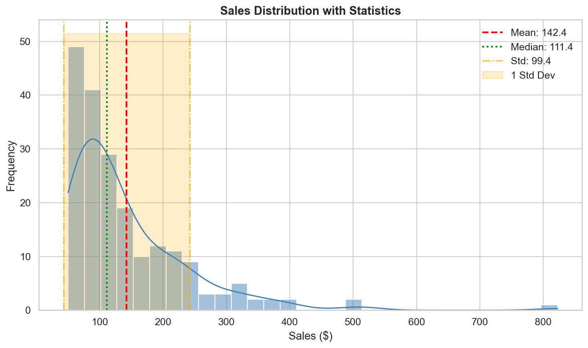
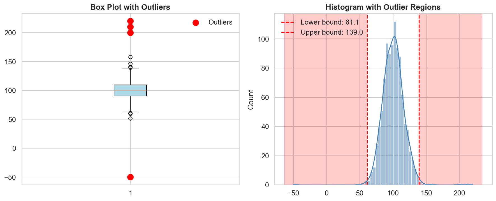

# Understanding Data Distributions: A guide

**After this lesson:** You can summarize a numeric column with appropriate center and spread, recognize skew and heavy tails from plots, and connect distribution shape to next steps (transform, reliable stats, or modeling).

## Helpful video

Summarizing distributions with percentiles, common in exploratory analysis.

<iframe width="560" height="315" src="https://www.youtube.com/embed/IFKQLDmRK0Y" title="Quantiles and Percentiles, Clearly Explained" frameborder="0" allow="accelerometer; autoplay; clipboard-write; encrypted-media; gyroscope; picture-in-picture" allowfullscreen></iframe>

## Overview

**Prerequisites:** [Module 2.3 README](README.md) and [Pandas](../../1-data-fundamentals/1.5-data-analysis-pandas/README.md). [Two-variable statistics](../../1-data-fundamentals/1.3-intro-statistics/two-variable-statistics.md) supports correlation context.

> **Time needed:** About 60-90 minutes.

## Why this matters

Summary numbers hide shape: **mean** and **standard deviation** can look reasonable while the data is bimodal, skewed, or dominated by outliers. Looking at distributions first tells you whether classical assumptions make sense and which transforms or robust methods belong in the next step.

Data distributions are fundamental to understanding your dataset's characteristics and making informed analytical decisions. The sections below connect plots and summaries to those decisions.

## Why Study Distributions?

Understanding distributions helps you:

1. Choose appropriate statistical methods
2. Identify outliers and anomalies
3. Make better decisions about data transformations
4. Validate assumptions for advanced analyses
5. Communicate data characteristics effectively

## Distribution Analysis Workflow

The systematic process of understanding your data's distribution:



## Mathematical Foundations

### 1. Measures of Central Tendency: Finding the Center

Each measure tells a different story about your data's center:

- **Mean**: $\bar{x} = \frac{1}{n}\sum_{i=1}^n x_i$
  - Best for symmetric distributions
  - Sensitive to outliers
  - Used in many statistical procedures

- **Median**: Middle value when sorted
  - reliable to outliers
  - Better for skewed distributions
  - Splits data into equal halves

- **Mode**: Most frequent value
  - Important for categorical data
  - Can identify multiple peaks
  - Useful for understanding data clusters

### 2. Measures of Spread: Understanding Variability

Different spread measures capture different aspects of variability:

- **Variance**: $\sigma^2 = \frac{1}{n}\sum_{i=1}^n (x_i - \bar{x})^2$
  - Fundamental measure of variability
  - Units are squared (harder to interpret)
  - Foundation for many statistical methods

- **Standard Deviation**: $\sigma = \sqrt{\frac{1}{n}\sum_{i=1}^n (x_i - \bar{x})^2}$
  - Same units as original data
  - Approximately 68-95-99.7 rule for normal distributions
  - Most commonly used spread measure

- **IQR**: $IQR = Q_3 - Q_1$
  - reliable to outliers
  - Used in box plots
  - Contains middle 50% of data

### 3. Shape Measures: Understanding Distribution Form

Shape measures help identify the need for transformations:

- **Skewness**: $\gamma_1 = \frac{m_3}{m_2^{3/2}}$ where $m_k = \frac{1}{n}\sum_{i=1}^n (x_i - \bar{x})^k$
  - Measures asymmetry
  - Positive: right tail longer
  - Negative: left tail longer
  - |γ₁| > 1 indicates significant skewness

- **Kurtosis**: $\gamma_2 = \frac{m_4}{m_2^2} - 3$
  - Measures tail heaviness
  - Higher values: heavier tails
  - Normal distribution: γ₂ = 0
  - Important for identifying outlier-prone distributions

## Comprehensive Distribution Analysis Framework: A Practical Guide

This framework provides a systematic approach to understanding your data's distribution:


import pandas as pd
import numpy as np
import matplotlib.pyplot as plt
import seaborn as sns
from scipy import stats
import plotly.express as px
import plotly.graph_objects as go

class DistributionAnalyzer:
    """A comprehensive framework for analyzing data distributions.

    This class provides methods to:
    - Calculate and interpret descriptive statistics
    - Test for normality and other distribution types
    - Create informative visualizations
    - Identify potential issues and anomalies
    - Guide decisions about data transformations
    """

    def __init__(self, data, column):
        self.data = data[column]
        self.column = column
        self.stats = {}
        self.tests = {}

    def analyze_basic_stats(self):
        """Calculate and interpret comprehensive distribution statistics.

        This method provides:
        - Basic summary statistics
        - Shape characteristics
        - Outlier indicators
        - Distribution type hints

        Returns:
            dict: A comprehensive set of distribution statistics
        """
        self.stats = {
            'n': len(self.data),
            'missing': self.data.isnull().sum(),
            'mean': self.data.mean(),
            'median': self.data.median(),
            'mode': self.data.mode().iloc[0],
            'std': self.data.std(),
            'var': self.data.var(),
            'skew': self.data.skew(),
            'kurtosis': self.data.kurtosis(),
            'iqr': self.data.quantile(0.75) - self.data.quantile(0.25),
            'range': self.data.max() - self.data.min()
        }
        return self.stats

    def analyze_distribution_type(self):
        """Determine likely distribution type"""
        # Continuous vs Discrete check
        unique_ratio = len(self.data.unique()) / len(self.data)

        # Normality tests
        shapiro_test = stats.shapiro(self.data.dropna())
        anderson_test = stats.anderson(self.data.dropna(), 'norm')

        self.tests = {
            'unique_ratio': unique_ratio,
            'likely_type': 'continuous' if unique_ratio > 0.05 else 'discrete',
            'normality_tests': {
                'shapiro': {
                    'statistic': shapiro_test[0],
                    'p_value': shapiro_test[1]
                },
                'anderson': {
                    'statistic': anderson_test.statistic,
                    'critical_values': anderson_test.critical_values
                }
            }
        }
        return self.tests

    def plot_distribution_suite(self):
        """Create comprehensive distribution visualization"""
        fig = plt.figure(figsize=(20, 10))

        # Histogram with KDE
        plt.subplot(231)
        sns.histplot(self.data, kde=True)
        plt.title('Distribution with KDE')

        # Box plot
        plt.subplot(232)
        sns.boxplot(y=self.data)
        plt.title('Box Plot')

        # Violin plot
        plt.subplot(233)
        sns.violinplot(y=self.data)
        plt.title('Violin Plot')

        # Q-Q plot
        plt.subplot(234)
        stats.probplot(self.data.dropna(), dist="norm", plot=plt)
        plt.title('Q-Q Plot')

        # ECDF
        plt.subplot(235)
        sns.ecdfplot(self.data)
        plt.title('Empirical CDF')

        # Scatter plot with jitter
        plt.subplot(236)
        plt.scatter(
            np.random.normal(0, 0.1, size=len(self.data)),
            self.data,
            alpha=0.5
        )
        plt.title('Scatter with Jitter')

        plt.tight_layout()
        plt.show()

    def create_interactive_plots(self):
        """Create interactive visualizations with Plotly"""
        # Distribution plot
        fig1 = go.Figure()
        fig1.add_trace(go.Histogram(
            x=self.data,
            name='Histogram',
            nbinsx=30
        ))
        fig1.add_trace(go.Violin(
            y=self.data,
            name='Violin',
            side='right'
        ))
        fig1.update_layout(title='Interactive Distribution Plot')
        fig1.show()

        # Box plot with points
        fig2 = px.box(
            y=self.data,
            points='all',
            title='Interactive Box Plot'
        )
        fig2.show()


<aside class="code-explainer__callouts" aria-label="Code walkthrough">
  

    

      
      Imports
    

    

      
Seven imports: pandas and numpy for data, matplotlib and seaborn for static charts, scipy for statistical tests, and plotly (express + graph_objects) for interactive plots.

    

  

  

    

      
      DistributionAnalyzer class and constructor
    

    

      
The constructor accepts a DataFrame and a column name, storing the series and initialising empty <code>stats</code> and <code>tests</code> dicts that the other methods populate.

    

  

  

    

      
      analyze_basic_stats
    

    

      
Computes eleven summary statistics: count, missing count, mean, median, mode, std, variance, skewness, kurtosis, IQR, and range, returning them in a single dict.

    

  

  

    

      
      analyze_distribution_type
    

    

      
Estimates continuous vs discrete via unique-value ratio, then runs Shapiro-Wilk and Anderson-Darling normality tests, storing results in <code>self.tests</code>.

    

  

  

    

      
      plot_distribution_suite
    

    

      
Creates a 2×3 subplot grid: histogram+KDE, box plot, violin plot, Q-Q plot, empirical CDF, and jittered scatter, giving six complementary views of the same column.

    

  

  

    

      
      create_interactive_plots
    

    

      
Builds two Plotly figures: a combined histogram+violin trace and an interactive box plot with all data points overlaid (<code>points='all'</code>).

    

  

</aside>

## Real-World Case Study: Sales Data Analysis

Analyze a real sales dataset to understand common distribution patterns and their business implications:


# Load sample sales data
sales_data = pd.read_csv('../_data/sales_data.csv')

# Initialize analyzer
analyzer = DistributionAnalyzer(sales_data, 'revenue')

# 1. Basic Analysis
stats = analyzer.analyze_basic_stats()
print("Basic Statistics:")
print(pd.DataFrame([stats]).T)

# 2. Distribution Type Analysis
tests = analyzer.analyze_distribution_type()
print("\nDistribution Analysis:")
print(pd.DataFrame([tests]).T)

# 3. Visualization
analyzer.plot_distribution_suite()
analyzer.create_interactive_plots()

# 4. Business Insights
if stats['skew'] > 1:
    print("\nRevenue distribution is right-skewed:")
    print("- Consider log transformation for analysis")
    print("- Focus on median for central tendency")
    print("- Investigate high-value outliers")


<aside class="code-explainer__callouts" aria-label="Code walkthrough">
  

    

      
      Load data and run statistics
    

    

      
Loads the CSV, creates an analyser instance, then calls <code>analyze_basic_stats()</code> and <code>analyze_distribution_type()</code>, printing each result as a transposed DataFrame.

    

  

  

    

      
      Visualise and interpret
    

    

      
Calls both plotting methods, then checks whether skewness exceeds 1 and prints three targeted recommendations for right-skewed revenue data.

    

  

</aside>

## Common Distribution Patterns and Their Business Implications

Understanding these patterns helps make better business decisions:

1. **Normal Distribution (Bell Curve)**
   - Common in: Customer satisfaction scores, product measurements
   - Business implications:
     - Quality control limits
     - Performance benchmarks
     - Risk assessment

2. **Right-Skewed Distribution**
   - Common in: Sales data, income distributions
   - Business implications:
     - Pricing strategies
     - Market segmentation
     - Revenue forecasting

3. **Left-Skewed Distribution**
   - Common in: Product ratings, service scores
   - Business implications:
     - Customer satisfaction analysis
     - Quality improvement targets
     - Performance metrics

4. **Bimodal Distribution**
   - Common in: Customer segments, usage patterns
   - Business implications:
     - Market segmentation
     - Product differentiation
     - Target marketing

### 1. Normal Distribution


def analyze_normality(data, alpha=0.05):
    """Comprehensive normality analysis"""
    results = {
        'tests': {
            'shapiro': stats.shapiro(data),
            'normaltest': stats.normaltest(data),
            'anderson': stats.anderson(data)
        },
        'shape': {
            'skewness': stats.skew(data),
            'kurtosis': stats.kurtosis(data)
        }
    }

    # Interpretation
    results['is_normal'] = all([
        abs(results['shape']['skewness']) < 0.5,
        abs(results['shape']['kurtosis']) < 0.5,
        results['tests']['shapiro'][1] > alpha
    ])

    return results


<aside class="code-explainer__callouts" aria-label="Code walkthrough">
  

    

      
      Collect test results and shape metrics
    

    

      
Runs three normality tests (Shapiro-Wilk, D'Agostino, Anderson-Darling) and records skewness and kurtosis in a single <code>results</code> dict.

    

  

  

    

      
      Combined normality verdict
    

    

      
Sets <code>is_normal</code> to <code>True</code> only when all three conditions hold: skewness and kurtosis both below 0.5, and Shapiro p-value above alpha.

    

  

</aside>

### 2. Long-Tailed Distributions


def analyze_tail_behavior(data):
    """Analyze distribution tail behavior"""
    percentiles = np.percentile(data, [1, 5, 95, 99])
    iqr = np.percentile(data, 75) - np.percentile(data, 25)

    return {
        'tail_ratios': {
            'left_tail': (percentiles[1] - percentiles[0]) / iqr,
            'right_tail': (percentiles[3] - percentiles[2]) / iqr
        },
        'interpretation': {
            'left_heavy': (percentiles[1] - percentiles[0]) / iqr > 1.5,
            'right_heavy': (percentiles[3] - percentiles[2]) / iqr > 1.5
        }
    }


<aside class="code-explainer__callouts" aria-label="Code walkthrough">
  

    

      
      Compute key percentiles and IQR
    

    

      
Grabs the 1st, 5th, 95th, and 99th percentiles plus the IQR, these four extremes anchor the tail-ratio calculation.

    

  

  

    

      
      Tail ratios and heavy-tail flags
    

    

      
Divides the span of each tail by the IQR. Ratios above 1.5 are flagged as heavy tails, indicating the distribution has more extreme values than a normal distribution.

    

  

</aside>

### 3. Multimodal Distributions


def detect_multimodality(data, bandwidth=None):
    """Detect multiple modes in distribution"""
    from scipy.signal import find_peaks

    # KDE estimation
    kde = stats.gaussian_kde(data)
    x_range = np.linspace(min(data), max(data), 1000)
    y = kde(x_range)

    # Find peaks
    peaks, _ = find_peaks(y)

    return {
        'n_modes': len(peaks),
        'mode_locations': x_range[peaks],
        'is_multimodal': len(peaks) > 1
    }


<aside class="code-explainer__callouts" aria-label="Code walkthrough">
  

    

      
      KDE estimation
    

    

      
Fits a Gaussian kernel density estimate over 1 000 evenly-spaced x values to produce a smooth density curve <code>y</code> used for peak detection.

    

  

  

    

      
      Peak detection and result
    

    

      
<code>find_peaks</code> identifies local maxima in the KDE curve. The function returns the count of peaks, their x positions, and a boolean <code>is_multimodal</code> flag.

    

  

</aside>

## Performance Optimization Tips: Handling Large-Scale Distribution Analysis

### 1. Memory Efficiency


def optimize_numeric_analysis(data):
    """Optimize numeric computations"""
    # Use numpy arrays for computations
    arr = np.array(data)

    # Compute statistics in one pass
    n = len(arr)
    mean = np.mean(arr)
    diff = arr - mean
    var = np.sum(diff**2) / n
    skew = np.sum(diff**3) / (n * var**1.5)
    kurt = np.sum(diff**4) / (n * var**2) - 3

    return {
        'mean': mean,
        'variance': var,
        'skewness': skew,
        'kurtosis': kurt
    }


<aside class="code-explainer__callouts" aria-label="Code walkthrough">
  

    

      
      Single-pass setup
    

    

      
Converts to a NumPy array once, computes n and mean, then subtracts the mean once into <code>diff</code>-reusing this array for all higher moments avoids repeated passes.

    

  

  

    

      
      Variance, skewness, and kurtosis
    

    

      
Variance uses squared deviations, skewness uses cubed deviations divided by var1.5, and excess kurtosis uses fourth-power deviations divided by var2 minus 3.

    

  

</aside>

### 2. Efficient Visualization


def create_efficient_plots(data, max_points=10000):
    """Create efficient visualizations for large datasets"""
    if len(data) > max_points:
        # Systematic sampling
        idx = np.linspace(0, len(data)-1, max_points).astype(int)
        sample = data.iloc[idx]
    else:
        sample = data

    # Create plots
    fig, axes = plt.subplots(1, 2, figsize=(12, 5))

    # Histogram (using bins)
    axes[0].hist(sample, bins='auto')
    axes[0].set_title('Histogram')

    # Box plot
    axes[1].boxplot(sample)
    axes[1].set_title('Box Plot')

    plt.tight_layout()
    plt.show()


<aside class="code-explainer__callouts" aria-label="Code walkthrough">
  

    

      
      Systematic sampling for large data
    

    

      
If the series exceeds <code>max_points</code>, evenly-spaced integer indices are computed with <code>np.linspace</code> to draw a representative systematic sample, preserving the shape without random variance.

    

  

  

    

      
      Histogram and box plot
    

    

      
Plots the sample in a side-by-side layout: left is a histogram with automatic binning, right is a box plot. Both use the same sampled data for visual consistency.

    

  

</aside>

## Common Pitfalls and Solutions: Learning from Experience

Avoid these common mistakes in distribution analysis:

1. **Assuming Normality**

   

   

   
      # Bad: Always using mean and std
      summary = {'mean': data.mean(), 'std': data.std()}

      # Good: Use reliable statistics when appropriate
      def robust_summary(data):
          return {
              'median': np.median(data),
              'mad': stats.median_abs_deviation(data),
              'iqr': np.percentile(data, 75) - np.percentile(data, 25)
          }
   
   

   <aside class="code-explainer__callouts" aria-label="Code walkthrough">
     

       

         
         Fragile: mean and std
       

       

         
Always using mean and std assumes normality, they become misleading when data is skewed or has heavy tails.

       

     

     

       

         
         reliable summary statistics
       

       

         
<code>robust_summary</code> returns median, MAD, and IQR, all outlier-resistant and valid regardless of distribution shape.

       

     

   </aside>
   

2. **Ignoring Sample Size**

   

   

   
      def adjust_for_sample_size(data):
          """Adjust analysis based on sample size"""
          n = len(data)
          if n < 30:
              print("Warning: Small sample size")
              # Use non-parametric methods
              return {
                  'central': np.median(data),
                  'spread': stats.iqr(data),
                  'test': stats.shapiro(data)
              }
          else:
              return {
                  'central': np.mean(data),
                  'spread': np.std(data),
                  'test': stats.normaltest(data)
              }
   
   

   <aside class="code-explainer__callouts" aria-label="Code walkthrough">
     

       

         
         Small-sample branch (n &lt; 30)
       

       

         
For fewer than 30 observations, parametric assumptions are unreliable. The function falls back to non-parametric statistics: median, IQR, and Shapiro-Wilk.

       

     

     

       

         
         Large-sample branch (n ≥ 30)
       

       

         
With enough data, parametric methods are appropriate: mean, std, and D'Agostino's normality test are more powerful than their non-parametric counterparts.

       

     

   </aside>
   

3. **Overlooking Outliers**

   

   

   
      def analyze_with_outliers(data):
          """Analyze distribution with and without outliers"""
          Q1, Q3 = np.percentile(data, [25, 75])
          IQR = Q3 - Q1
          outlier_mask = (data < Q1 - 1.5*IQR) | (data > Q3 + 1.5*IQR)

          return {
              'with_outliers': data.describe(),
              'without_outliers': data[~outlier_mask].describe(),
              'n_outliers': sum(outlier_mask)
          }
   
   

   <aside class="code-explainer__callouts" aria-label="Code walkthrough">
     

       

         
         IQR outlier mask
       

       

         
Computes Q1, Q3, and IQR, then creates a boolean mask for values outside the 1.5×IQR fence.

       

     

     

       

         
         Compare distributions with and without outliers
       

       

         
Returns <code>describe()</code> for the full series and for the outlier-filtered series side by side, plus the count of outliers, making the impact visible before deciding how to handle them.

       

     

   </aside>
   

Remember: "The choice of distribution analysis method should be guided by your data's characteristics and your analysis goals!"

## Next steps

- [Analyzing relationships](relationships.md), correlations and group comparisons
- [Time series analysis](time-series.md), trends and seasonality
- [EDA project](project.md)
- [Module README](README.md)
