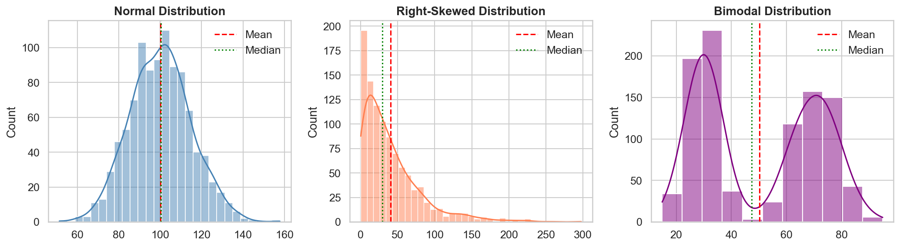
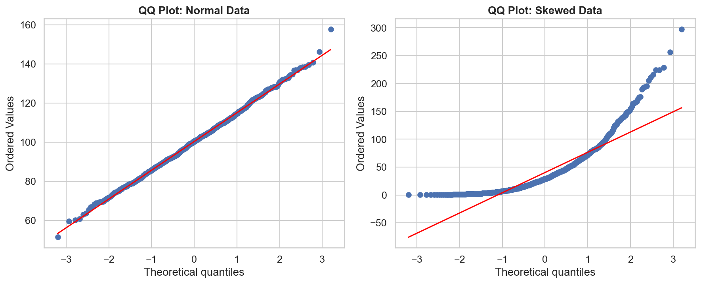

# Understanding Data Distributions: A guide

**After this lesson:** You can summarize a numeric column with appropriate center and spread, recognize skew and heavy tails from plots, and connect distribution shape to next steps (transform, reliable stats, or modeling).

## Helpful video

Summarizing distributions with percentiles, common in exploratory analysis.

## Overview

**Prerequisites:** [Module 2.3 README](./) and [Pandas](../../1-data-fundamentals/1.5-data-analysis-pandas/). [Two-variable statistics](../../1-data-fundamentals/1.3-intro-statistics/two-variable-statistics.md) supports correlation context.

> **Time needed:** About 60-90 minutes.

## Why this matters

Summary numbers hide shape: **mean** and **standard deviation** can look reasonable while the data is bimodal, skewed, or dominated by outliers. Looking at distributions first tells you whether classical assumptions make sense and which transforms or robust methods belong in the next step.

Data distributions are fundamental to understanding your dataset's characteristics and making informed analytical decisions. The sections below connect plots and summaries to those decisions.

## Why Study Distributions?

Understanding distributions helps you:

1. Choose appropriate statistical methods
2. Identify outliers and anomalies
3. Make better decisions about data transformations
4. Validate assumptions for advanced analyses
5. Communicate data characteristics effectively

## Distribution Analysis Workflow

The systematic process of understanding your data's distribution:

## Mathematical Foundations

### 1. Measures of Central Tendency: Finding the Center

Each measure tells a different story about your data's center:

* **Mean**: $\bar{x} = \frac{1}{n}\sum\_{i=1}^n x\_i$
  * Best for symmetric distributions
  * Sensitive to outliers
  * Used in many statistical procedures
* **Median**: Middle value when sorted
  * reliable to outliers
  * Better for skewed distributions
  * Splits data into equal halves
* **Mode**: Most frequent value
  * Important for categorical data
  * Can identify multiple peaks
  * Useful for understanding data clusters

### 2. Measures of Spread: Understanding Variability

Different spread measures capture different aspects of variability:

* **Variance**: $\sigma^2 = \frac{1}{n}\sum\_{i=1}^n (x\_i - \bar{x})^2$
  * Fundamental measure of variability
  * Units are squared (harder to interpret)
  * Foundation for many statistical methods
* **Standard Deviation**: $\sigma = \sqrt{\frac{1}{n}\sum\_{i=1}^n (x\_i - \bar{x})^2}$
  * Same units as original data
  * Approximately 68-95-99.7 rule for normal distributions
  * Most commonly used spread measure
* **IQR**: $IQR = Q\_3 - Q\_1$
  * reliable to outliers
  * Used in box plots
  * Contains middle 50% of data

### 3. Shape Measures: Understanding Distribution Form

Shape measures help identify the need for transformations:

* **Skewness**: $\gamma\_1 = \frac{m\_3}{m\_2^{3/2\}}$ where $m\_k = \frac{1}{n}\sum\_{i=1}^n (x\_i - \bar{x})^k$
  * Measures asymmetry
  * Positive: right tail longer
  * Negative: left tail longer
  * |γ₁| > 1 indicates significant skewness
* **Kurtosis**: $\gamma\_2 = \frac{m\_4}{m\_2^2} - 3$
  * Measures tail heaviness
  * Higher values: heavier tails
  * Normal distribution: γ₂ = 0
  * Important for identifying outlier-prone distributions

## Comprehensive Distribution Analysis Framework: A Practical Guide

This framework provides a systematic approach to understanding your data's distribution:

Imports

Seven imports: pandas and numpy for data, matplotlib and seaborn for static charts, scipy for statistical tests, and plotly (express + graph\_objects) for interactive plots.

DistributionAnalyzer class and constructor

The constructor accepts a DataFrame and a column name, storing the series and initialising empty `stats` and `tests` dicts that the other methods populate.

analyze\_basic\_stats

Computes eleven summary statistics: count, missing count, mean, median, mode, std, variance, skewness, kurtosis, IQR, and range, returning them in a single dict.

analyze\_distribution\_type

Estimates continuous vs discrete via unique-value ratio, then runs Shapiro-Wilk and Anderson-Darling normality tests, storing results in `self.tests`.

plot\_distribution\_suite

Creates a 2×3 subplot grid: histogram+KDE, box plot, violin plot, Q-Q plot, empirical CDF, and jittered scatter, giving six complementary views of the same column.

create\_interactive\_plots

Builds two Plotly figures: a combined histogram+violin trace and an interactive box plot with all data points overlaid (`points='all'`).

## Real-World Case Study: Sales Data Analysis

Analyze a real sales dataset to understand common distribution patterns and their business implications:

Load data and run statistics

Loads the CSV, creates an analyser instance, then calls `analyze_basic_stats()` and `analyze_distribution_type()`, printing each result as a transposed DataFrame.

Visualise and interpret

Calls both plotting methods, then checks whether skewness exceeds 1 and prints three targeted recommendations for right-skewed revenue data.

## Common Distribution Patterns and Their Business Implications

Understanding these patterns helps make better business decisions:

1. **Normal Distribution (Bell Curve)**
   * Common in: Customer satisfaction scores, product measurements
   * Business implications:
     * Quality control limits
     * Performance benchmarks
     * Risk assessment
2. **Right-Skewed Distribution**
   * Common in: Sales data, income distributions
   * Business implications:
     * Pricing strategies
     * Market segmentation
     * Revenue forecasting
3. **Left-Skewed Distribution**
   * Common in: Product ratings, service scores
   * Business implications:
     * Customer satisfaction analysis
     * Quality improvement targets
     * Performance metrics
4. **Bimodal Distribution**
   * Common in: Customer segments, usage patterns
   * Business implications:
     * Market segmentation
     * Product differentiation
     * Target marketing

### 1. Normal Distribution

Collect test results and shape metrics

Runs three normality tests (Shapiro-Wilk, D'Agostino, Anderson-Darling) and records skewness and kurtosis in a single `results` dict.

Combined normality verdict

Sets `is_normal` to `True` only when all three conditions hold: skewness and kurtosis both below 0.5, and Shapiro p-value above alpha.

### 2. Long-Tailed Distributions

Compute key percentiles and IQR

Grabs the 1st, 5th, 95th, and 99th percentiles plus the IQR, these four extremes anchor the tail-ratio calculation.

Tail ratios and heavy-tail flags

Divides the span of each tail by the IQR. Ratios above 1.5 are flagged as heavy tails, indicating the distribution has more extreme values than a normal distribution.

### 3. Multimodal Distributions

KDE estimation

Fits a Gaussian kernel density estimate over 1 000 evenly-spaced x values to produce a smooth density curve `y` used for peak detection.

Peak detection and result

`find_peaks` identifies local maxima in the KDE curve. The function returns the count of peaks, their x positions, and a boolean `is_multimodal` flag.

## Performance Optimization Tips: Handling Large-Scale Distribution Analysis

### 1. Memory Efficiency

Single-pass setup

Converts to a NumPy array once, computes n and mean, then subtracts the mean once into `diff`-reusing this array for all higher moments avoids repeated passes.

Variance, skewness, and kurtosis

Variance uses squared deviations, skewness uses cubed deviations divided by var1.5, and excess kurtosis uses fourth-power deviations divided by var2 minus 3.

### 2. Efficient Visualization

Systematic sampling for large data

If the series exceeds `max_points`, evenly-spaced integer indices are computed with `np.linspace` to draw a representative systematic sample, preserving the shape without random variance.

Histogram and box plot

Plots the sample in a side-by-side layout: left is a histogram with automatic binning, right is a box plot. Both use the same sampled data for visual consistency.

## Common Pitfalls and Solutions: Learning from Experience

Avoid these common mistakes in distribution analysis:

1.  **Assuming Normality**

    Fragile: mean and std

    Always using mean and std assumes normality, they become misleading when data is skewed or has heavy tails.

    reliable summary statistics

    `robust_summary` returns median, MAD, and IQR, all outlier-resistant and valid regardless of distribution shape.
2.  **Ignoring Sample Size**

    Small-sample branch (n < 30)

    For fewer than 30 observations, parametric assumptions are unreliable. The function falls back to non-parametric statistics: median, IQR, and Shapiro-Wilk.

    Large-sample branch (n ≥ 30)

    With enough data, parametric methods are appropriate: mean, std, and D'Agostino's normality test are more powerful than their non-parametric counterparts.
3.  **Overlooking Outliers**

    IQR outlier mask

    Computes Q1, Q3, and IQR, then creates a boolean mask for values outside the 1.5×IQR fence.

    Compare distributions with and without outliers

    Returns `describe()` for the full series and for the outlier-filtered series side by side, plus the count of outliers, making the impact visible before deciding how to handle them.

Remember: "The choice of distribution analysis method should be guided by your data's characteristics and your analysis goals!"

## Next steps

* [Analyzing relationships](relationships.md), correlations and group comparisons
* [Time series analysis](time-series.md), trends and seasonality
* [EDA project](project.md)
* [Module README](./)
