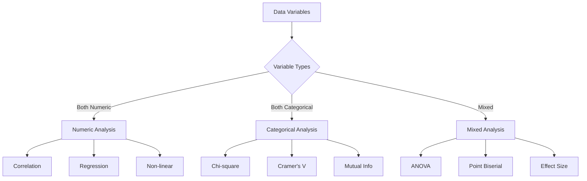

# Understanding Data Relationships: A Comprehensive Guide

Understanding relationships between variables is crucial for:

- Making better predictions
- Identifying key drivers
- Discovering hidden patterns
- Making informed business decisions

## Why Study Relationships?

Relationship analysis helps you:

1. Identify cause-and-effect patterns
2. Predict future outcomes
3. Optimize business processes
4. Make data-driven decisions
5. Validate business hypotheses

## Relationship Analysis Workflow: A Systematic Approach

Follow this workflow to uncover meaningful relationships in your data:



## Mathematical Foundations

### 1. Correlation Measures: Understanding Association Strength

Choose the right correlation measure for your data:

- **Pearson Correlation**: $r = \frac{\sum_{i=1}^n (x_i - \bar{x})(y_i - \bar{y})}{\sqrt{\sum_{i=1}^n (x_i - \bar{x})^2}\sqrt{\sum_{i=1}^n (y_i - \bar{y})^2}}$
  - Best for linear relationships
  - Requires continuous variables
  - Sensitive to outliers
  - Range: [-1, 1]

- **Spearman Rank Correlation**: $\rho = 1 - \frac{6\sum d_i^2}{n(n^2-1)}$ where $d_i$ is rank difference
  - Works with non-linear monotonic relationships
  - Less sensitive to outliers
  - Can handle ordinal data
  - Range: [-1, 1]

- **Kendall's Tau**: $\tau = \frac{2(P - Q)}{n(n-1)}$ where P and Q are concordant and discordant pairs
  - More robust than Spearman
  - Better for small sample sizes
  - Handles tied ranks well
  - Range: [-1, 1]

### 2. Categorical Associations: Analyzing Non-Numeric Relationships

Methods for understanding relationships between categorical variables:

- **Chi-square Test**: $\chi^2 = \sum \frac{(O - E)^2}{E}$
  - Tests independence between variables
  - Non-directional measure
  - Sensitive to sample size
  - Requires sufficient cell counts

- **Cramer's V**: $V = \sqrt{\frac{\chi^2}{n \min(r-1, c-1)}}$
  - Normalized measure of association
  - Range: [0, 1]
  - Comparable across tables
  - Adjusts for table size

- **Mutual Information**: $I(X;Y) = \sum_{y \in Y} \sum_{x \in X} p(x,y) \log(\frac{p(x,y)}{p(x)p(y)})$
  - Measures general dependence
  - Not limited to linear relationships
  - Information theory based
  - Always non-negative

## Comprehensive Relationship Analysis Framework: A Practical Guide

This framework helps you systematically analyze relationships in your data:

```python
import pandas as pd
import numpy as np
import matplotlib.pyplot as plt
import seaborn as sns
from scipy import stats
import plotly.express as px
import plotly.graph_objects as go
from sklearn.preprocessing import LabelEncoder
from sklearn.metrics import mutual_info_score

class RelationshipAnalyzer:
    """A comprehensive framework for analyzing relationships between variables.
    
    This class provides methods to:
    - Detect and quantify relationships
    - Visualize patterns and associations
    - Test statistical significance
    - Handle different variable types
    - Generate insights and recommendations
    """
    
    def __init__(self, data):
        self.data = data
        self.numeric_cols = data.select_dtypes(include=[np.number]).columns
        self.categorical_cols = data.select_dtypes(include=['object']).columns
        
    def analyze_numeric_relationship(self, x, y):
        """Analyze relationship between numeric variables"""
        # Basic correlation measures
        correlations = {
            'pearson': stats.pearsonr(self.data[x], self.data[y]),
            'spearman': stats.spearmanr(self.data[x], self.data[y]),
            'kendall': stats.kendalltau(self.data[x], self.data[y])
        }
        
        # Create visualization suite
        fig = plt.figure(figsize=(20, 5))
        
        # Scatter plot with regression line
        plt.subplot(141)
        sns.regplot(data=self.data, x=x, y=y)
        plt.title('Linear Relationship')
        
        # Residual plot
        model = np.polyfit(self.data[x], self.data[y], 1)
        residuals = self.data[y] - np.polyval(model, self.data[x])
        plt.subplot(142)
        plt.scatter(self.data[x], residuals)
        plt.axhline(y=0, color='r', linestyle='--')
        plt.title('Residual Plot')
        
        # Joint distribution
        plt.subplot(143)
        sns.kdeplot(data=self.data, x=x, y=y)
        plt.title('Joint Distribution')
        
        # QQ plot of residuals
        plt.subplot(144)
        stats.probplot(residuals, dist="norm", plot=plt)
        plt.title('Q-Q Plot of Residuals')
        
        plt.tight_layout()
        plt.show()
        
        return correlations
    
    def analyze_categorical_relationship(self, x, y):
        """Analyze relationship between categorical variables"""
        # Create contingency table
        contingency = pd.crosstab(self.data[x], self.data[y])
        
        # Chi-square test
        chi2, p_value, dof, expected = stats.chi2_contingency(contingency)
        
        # Cramer's V
        n = contingency.sum().sum()
        min_dim = min(contingency.shape) - 1
        cramer_v = np.sqrt(chi2 / (n * min_dim))
        
        # Mutual information
        le = LabelEncoder()
        mi_score = mutual_info_score(
            le.fit_transform(self.data[x]),
            le.fit_transform(self.data[y])
        )
        
        # Visualizations
        fig = plt.figure(figsize=(15, 5))
        
        # Heatmap
        plt.subplot(131)
        sns.heatmap(contingency, annot=True, fmt='d', cmap='YlOrRd')
        plt.title('Contingency Table')
        
        # Mosaic plot
        plt.subplot(132)
        from statsmodels.graphics.mosaicplot import mosaic
        mosaic(self.data, [x, y])
        plt.title('Mosaic Plot')
        
        # Stacked bar
        plt.subplot(133)
        proportions = contingency.div(contingency.sum(axis=1), axis=0)
        proportions.plot(kind='bar', stacked=True)
        plt.title('Stacked Proportions')
        
        plt.tight_layout()
        plt.show()
        
        return {
            'chi_square': {'statistic': chi2, 'p_value': p_value},
            'cramers_v': cramer_v,
            'mutual_information': mi_score
        }
    
    def analyze_mixed_relationship(self, numeric_col, categorical_col):
        """Analyze relationship between numeric and categorical variables"""
        # ANOVA
        categories = self.data[categorical_col].unique()
        category_groups = [
            self.data[self.data[categorical_col] == cat][numeric_col]
            for cat in categories
        ]
        f_stat, p_value = stats.f_oneway(*category_groups)
        
        # Effect size (Eta-squared)
        df_total = len(self.data) - 1
        df_between = len(categories) - 1
        ss_between = sum(len(group) * (group.mean() - self.data[numeric_col].mean())**2 
                        for group in category_groups)
        ss_total = sum((self.data[numeric_col] - self.data[numeric_col].mean())**2)
        eta_squared = ss_between / ss_total
        
        # Visualizations
        fig = plt.figure(figsize=(15, 5))
        
        # Box plot
        plt.subplot(131)
        sns.boxplot(data=self.data, x=categorical_col, y=numeric_col)
        plt.xticks(rotation=45)
        plt.title('Distribution by Category')
        
        # Violin plot
        plt.subplot(132)
        sns.violinplot(data=self.data, x=categorical_col, y=numeric_col)
        plt.xticks(rotation=45)
        plt.title('Density by Category')
        
        # Point plot with CI
        plt.subplot(133)
        sns.pointplot(data=self.data, x=categorical_col, y=numeric_col)
        plt.xticks(rotation=45)
        plt.title('Mean with CI')
        
        plt.tight_layout()
        plt.show()
        
        return {
            'anova': {'f_statistic': f_stat, 'p_value': p_value},
            'eta_squared': eta_squared
        }
```

## Real-World Case Study: Customer Analysis

Let's analyze customer behavior to understand key relationships:

1. **Purchase Patterns**
   - Relationship between purchase amount and frequency
   - Impact of customer age on product preferences
   - Seasonal trends in buying behavior

2. **Customer Segments**
   - Demographic correlations
   - Behavioral clusters
   - Loyalty patterns

3. **Marketing Effectiveness**
   - Campaign response rates
   - Channel preferences
   - Conversion drivers

```python
# Load sample customer data
df = pd.read_csv('customer_data.csv')
analyzer = RelationshipAnalyzer(df)

# 1. Analyze spending vs age relationship
spending_age = analyzer.analyze_numeric_relationship('spending', 'age')
print("\nSpending vs Age Analysis:")
print(f"Correlation: {spending_age['pearson'][0]:.3f} (p={spending_age['pearson'][1]:.3f})")

# 2. Analyze category vs loyalty relationship
category_loyalty = analyzer.analyze_categorical_relationship('category', 'loyalty_level')
print("\nCategory vs Loyalty Analysis:")
print(f"Cramer's V: {category_loyalty['cramers_v']:.3f}")

# 3. Analyze spending by segment
segment_spending = analyzer.analyze_mixed_relationship('spending', 'customer_segment')
print("\nSpending by Segment Analysis:")
print(f"Effect Size (): {segment_spending['eta_squared']:.3f}")
```

## Performance Optimization Tips: Handling Large-Scale Relationship Analysis

Optimize your analysis for large datasets:

1. **Efficient Computation**
   - Use vectorized operations
   - Implement chunked processing
   - Leverage parallel computing
   - Optimize memory usage

2. **Smart Sampling**
   - Stratified sampling
   - Random sampling
   - Progressive sampling
   - Reservoir sampling

3. **Visualization Strategies**
   - Bin data for plotting
   - Use density plots
   - Implement interactive views
   - Focus on relevant subsets

### 1. Efficient Correlation Computation

```python
def compute_correlations_efficiently(df, method='pearson'):
    """Compute correlations efficiently for large datasets"""
    # Use numpy for faster computation
    if method == 'pearson':
        corr_matrix = np.corrcoef(df.values.T)
    else:
        # Use pandas for other methods
        corr_matrix = df.corr(method=method)
    
    return pd.DataFrame(
        corr_matrix,
        index=df.columns,
        columns=df.columns
    )
```

### 2. Memory-Efficient Categorical Analysis

```python
def analyze_categories_efficiently(df, cat1, cat2, max_categories=50):
    """Memory-efficient categorical analysis"""
    # Check cardinality
    n_cat1 = df[cat1].nunique()
    n_cat2 = df[cat2].nunique()
    
    if n_cat1 > max_categories or n_cat2 > max_categories:
        # Use sampling for high cardinality
        sample_size = min(len(df), 10000)
        df_sample = df.sample(n=sample_size, random_state=42)
        contingency = pd.crosstab(df_sample[cat1], df_sample[cat2])
    else:
        contingency = pd.crosstab(df[cat1], df[cat2])
    
    return contingency
```

## Common Pitfalls and Solutions: Learning from Experience

Avoid these common mistakes in relationship analysis:

1. **Correlation vs. Causation**
   - Always investigate confounding variables
   - Use controlled experiments when possible
   - Consider temporal relationships
   - Document assumptions and limitations

2. **Ignoring Data Quality**
   - Check for missing values
   - Validate data types
   - Handle outliers appropriately
   - Verify data consistency

3. **Oversimplifying Complex Relationships**
   - Look beyond linear relationships
   - Consider interaction effects
   - Use appropriate statistical tests
   - Validate findings across subsets

1. **Correlation  Causation**

   ```python
   def check_confounding(df, x, y, potential_confounders):
       """Check for confounding variables"""
       # Original correlation
       original_corr = df[x].corr(df[y])
       
       # Partial correlations
       partial_corrs = {}
       for conf in potential_confounders:
           # Calculate partial correlation
           partial_corr = partial_correlation(df[x], df[y], df[conf])
           partial_corrs[conf] = partial_corr
       
       return {
           'original': original_corr,
           'partial': partial_corrs
       }
   ```

2. **Non-linear Relationships**

   ```python
   def check_nonlinearity(df, x, y):
       """Check for non-linear relationships"""
       # Linear correlation
       linear_corr = df[x].corr(df[y])
       
       # Spearman correlation
       monotonic_corr = df[x].corr(df[y], method='spearman')
       
       # Difference indicates non-linearity
       nonlinearity = abs(linear_corr - monotonic_corr)
       
       return {
           'linear_corr': linear_corr,
           'monotonic_corr': monotonic_corr,
           'nonlinearity': nonlinearity
       }
   ```

3. **Sample Size Considerations**

   ```python
   def adjust_for_sample_size(statistic, n, type='correlation'):
       """Adjust statistics for sample size"""
       if type == 'correlation':
           # Fisher transformation
           z = np.arctanh(statistic)
           se = 1 / np.sqrt(n - 3)
           ci = (np.tanh(z - 1.96*se), np.tanh(z + 1.96*se))
           return {'adjusted': z, 'ci': ci}
       elif type == 'chi_square':
           # Yates correction for small samples
           if n < 30:
               return statistic - ((n > 1) / 2)
           return statistic
   ```

Remember: "Correlation is not causation, but it's a good place to start looking!"
