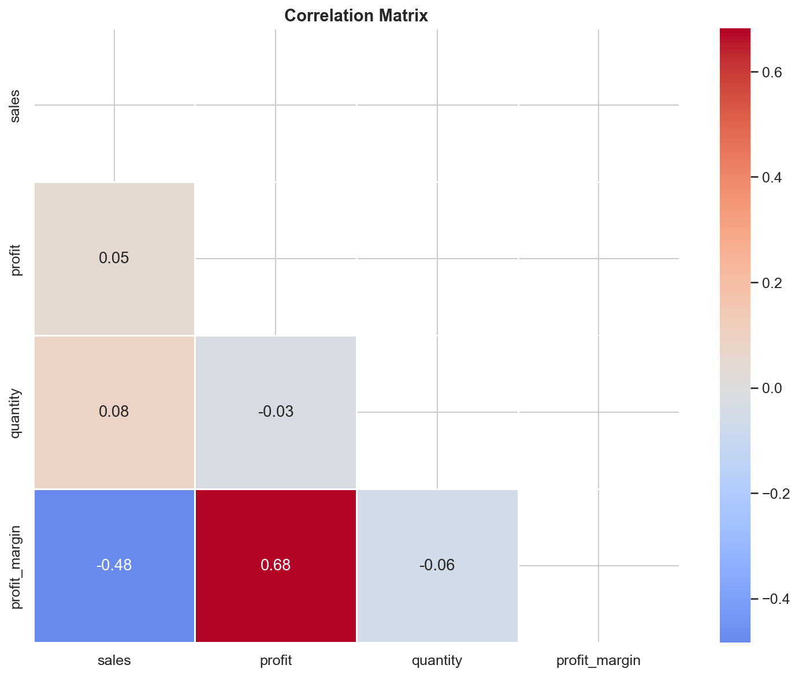
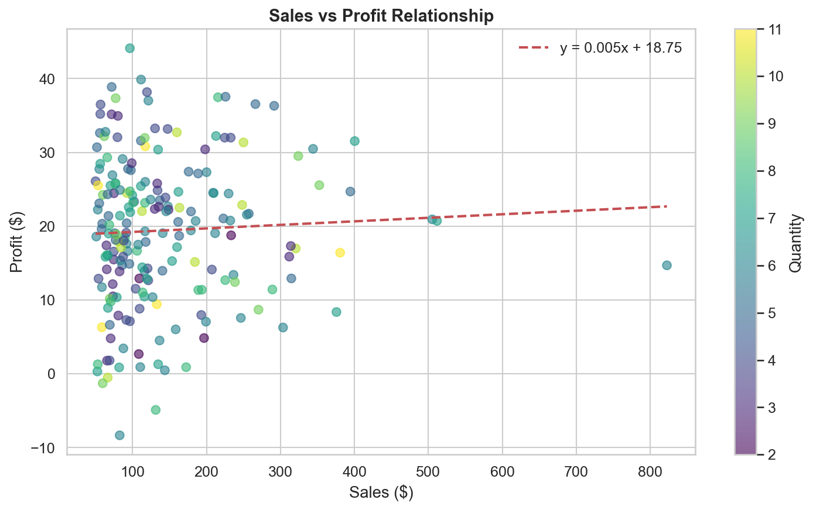
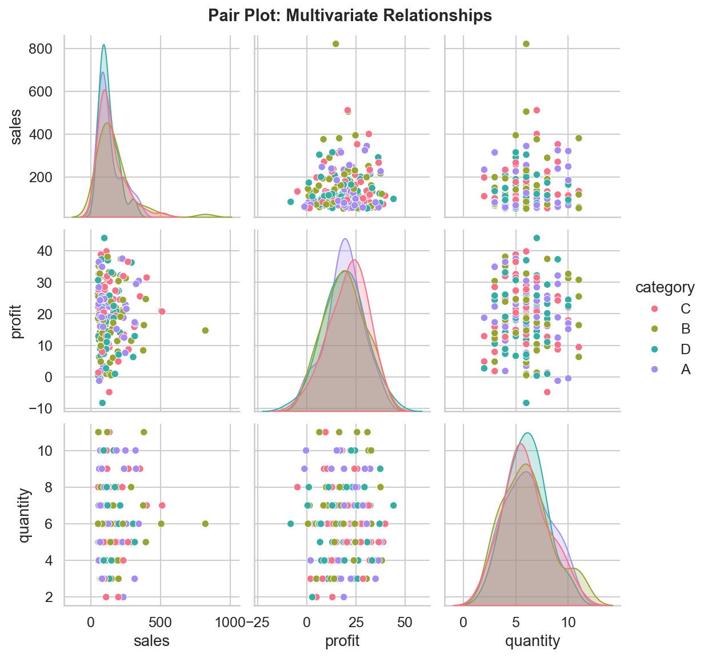
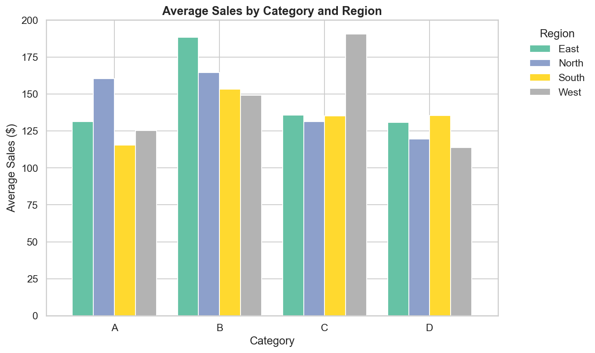
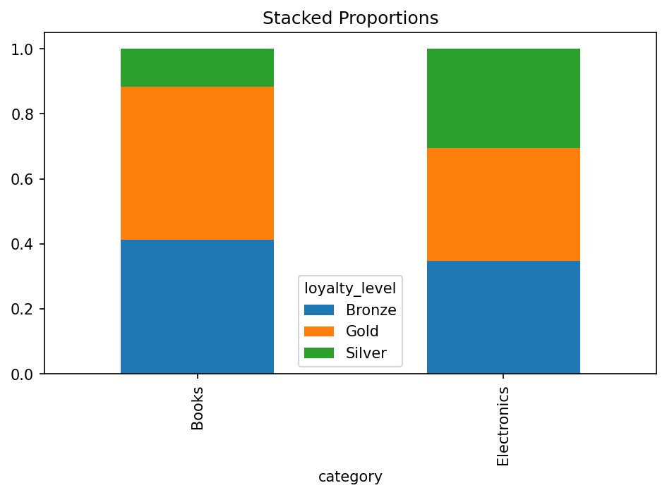

# Understanding Data Relationships: A guide

**After this lesson:** You can choose sensible analyses for numeric-numeric, categorical-categorical, and mixed pairs, interpret correlation and effect size with caution, and avoid claiming causation from association alone.

## Helpful video

Summarizing distributions with percentiles, common in exploratory analysis.

## Overview

**Prerequisites:** [Distributions](distributions.md) and [two-variable statistics](../../1-data-fundamentals/1.3-intro-statistics/two-variable-statistics.md). [Pandas](../../1-data-fundamentals/1.5-data-analysis-pandas/) for plotting.

> **Time needed:** About 60-90 minutes.

## Why this matters

Association is easy to compute and easy to over-interpret: **correlation is not causation**, and lurking variables can create misleading patterns. This lesson helps you **pair** the right summaries and plots with each combination of variable types and to **qualify** what the evidence supports.

Understanding relationships between variables is important for:

* Making better predictions
* Identifying key drivers
* Discovering hidden patterns
* Making informed business decisions

## Why Study Relationships?



Relationship analysis helps you:

1. Identify cause-and-effect patterns
2. Predict future outcomes
3. Optimize business processes
4. Make data-driven decisions
5. Validate business hypotheses

## Relationship Analysis Workflow: A Systematic Approach

Follow this workflow to uncover meaningful relationships in your data:

## Mathematical Foundations

### 1. Correlation Measures: Understanding Association Strength

Choose the right correlation measure for your data:

* **Pearson Correlation**: $r = \frac{\sum\_{i=1}^n (x\_i - \bar{x})(y\_i - \bar{y})}{\sqrt{\sum\_{i=1}^n (x\_i - \bar{x})^2}\sqrt{\sum\_{i=1}^n (y\_i - \bar{y})^2\}}$
  * Best for linear relationships
  * Requires continuous variables
  * Sensitive to outliers
  * Range: \[-1, 1]
* **Spearman Rank Correlation**: $\rho = 1 - \frac{6\sum d\_i^2}{n(n^2-1)}$ where $d\_i$ is rank difference
  * Works with non-linear monotonic relationships
  * Less sensitive to outliers
  * Can handle ordinal data
  * Range: \[-1, 1]
* **Kendall's Tau**: $\tau = \frac{2(P - Q)}{n(n-1)}$ where P and Q are concordant and discordant pairs
  * More reliable than Spearman
  * Better for small sample sizes
  * Handles tied ranks well
  * Range: \[-1, 1]

### 2. Categorical Associations: Analyzing Non-Numeric Relationships

Methods for understanding relationships between categorical variables:

* **Chi-square Test**: $\chi^2 = \sum \frac{(O - E)^2}{E}$
  * Tests independence between variables
  * Non-directional measure
  * Sensitive to sample size
  * Requires sufficient cell counts
* **Cramer's V**: $V = \sqrt{\frac{\chi^2}{n \min(r-1, c-1)\}}$
  * Normalized measure of association
  * Range: \[0, 1]
  * Comparable across tables
  * Adjusts for table size
* **Mutual Information**: $I(X;Y) = \sum\_{y \in Y} \sum\_{x \in X} p(x,y) \log(\frac{p(x,y)}{p(x)p(y)})$
  * Measures general dependence
  * Not limited to linear relationships
  * Information theory based
  * Always non-negative

## Comprehensive Relationship Analysis Framework: A Practical Guide

This framework helps you systematically analyze relationships in your data:

Imports and RelationshipAnalyzer class

Nine imports; the constructor splits columns into `numeric_cols` and `categorical_cols` upfront so each method knows which pairs to operate on.

analyze\_numeric\_relationship

Computes Pearson, Spearman, and Kendall correlations, then creates four subplots: regression scatter, residual plot, joint KDE, and Q-Q plot of residuals to check linearity and normality of errors.

analyze\_categorical\_relationship

Builds a contingency table, runs chi-square test, computes Cramér's V effect size and mutual information score, then visualises with heatmap, mosaic plot, and stacked proportions bar chart.

analyze\_mixed\_relationship, ANOVA and effect size

Groups the numeric column by category, runs one-way ANOVA for the F-statistic and p-value, then computes eta-squared (SS\_between / SS\_total) as the effect size measure.

Mixed-relationship visualisations

Three side-by-side plots per group: box plot for spread, violin plot for density shape, and point plot with confidence intervals for mean comparison across categories.







## Real-World Case Study: Customer Analysis

Analyze customer behavior to understand key relationships:

1. **Purchase Patterns**
   * Relationship between purchase amount and frequency
   * Impact of customer age on product preferences
   * Seasonal trends in buying behavior
2. **Customer Segments**
   * Demographic correlations
   * Behavioral clusters
   * Loyalty patterns
3. **Marketing Effectiveness**
   * Campaign response rates
   * Channel preferences
   * Conversion drivers




```

Spending vs Age Analysis:
Correlation: 0.119 (p=0.465)

Category vs Loyalty Analysis:
Cramer's V: 0.313

Spending by Segment Analysis:
Effect Size (): 0.006
```

Load data and analyse numeric-numeric pair

Loads the CSV, creates the analyser, then runs `analyze_numeric_relationship` on spending vs age, printing the Pearson correlation and its p-value.

Categorical-categorical pair

Analyses category vs loyalty using chi-square and Cramér's V, printing the effect size to judge practical significance beyond the p-value.

Mixed pair: numeric by category

Uses ANOVA to test whether spending differs significantly across customer segments, printing eta-squared to quantify what fraction of spending variance is explained by segment.

<figure><figcaption><p>Figure 1: Linear Relationship</p></figcaption></figure>

<figure><figcaption><p>Figure 2: Contingency Table</p></figcaption></figure>

<figure><figcaption><p>Figure 3: Generated visualization</p></figcaption></figure>

<figure><figcaption><p>Figure 4: Stacked Proportions</p></figcaption></figure>

<figure><figcaption><p>Figure 5: Distribution by Category</p></figcaption></figure>

```

Spending vs Age Analysis:
Correlation: -0.122 (p=0.454)

Category vs Loyalty Analysis:
Cramer's V: 0.223

Spending by Segment Analysis:
Effect Size (): 0.015
```

## Performance Optimization Tips: Handling Large-Scale Relationship Analysis

Optimize your analysis for large datasets:

1. **Efficient Computation**
   * Use vectorized operations
   * Implement chunked processing
   * Leverage parallel computing
   * Optimize memory usage
2. **Smart Sampling**
   * Stratified sampling
   * Random sampling
   * Progressive sampling
   * Reservoir sampling
3. **Visualization Strategies**
   * Bin data for plotting
   * Use density plots
   * Implement interactive views
   * Focus on relevant subsets

### 1. Efficient Correlation Computation

Fast Pearson via NumPy

For Pearson, `np.corrcoef` on the transposed values array is faster than the pandas method for wide DataFrames.

Other methods and return

For Spearman or Kendall, delegates to `df.corr(method=method)`. The result is always wrapped back into a labeled DataFrame with column names on both axes.

### 2. Memory-Efficient Categorical Analysis

Cardinality check

Counts unique values in both columns. If either exceeds `max_categories`, a contingency table on the full dataset would be excessively sparse and slow.

Sampling and crosstab

High-cardinality columns are sampled to at most 10 000 rows (reproducibly with seed 42) before building the contingency table. Low-cardinality columns use the full dataset.

## Common Pitfalls and Solutions: Learning from Experience

Avoid these common mistakes in relationship analysis:

1. **Correlation vs. Causation**
   * Always investigate confounding variables
   * Use controlled experiments when possible
   * Consider temporal relationships
   * Document assumptions and limitations
2. **Ignoring Data Quality**
   * Check for missing values
   * Validate data types
   * Handle outliers appropriately
   * Verify data consistency
3. **Oversimplifying Complex Relationships**
   * Look beyond linear relationships
   * Consider interaction effects
   * Use appropriate statistical tests
   * Validate findings across subsets
4.  **Correlation Causation**

    Original correlation

    Records the raw Pearson correlation between x and y before controlling for anything, this is the number that looks causal but may not be.

    Partial correlations per confounder

    Loops over candidate confounders, computing the partial correlation between x and y after removing the linear effect of each confounder. Large drops reveal spurious associations.
5.  **Non-linear Relationships**

    Linear and monotonic correlations

    Computes Pearson (linear) and Spearman (monotonic) correlations. Spearman can capture any monotonic relationship, not just linear ones.

    Non-linearity score

    The absolute difference between the two correlations is the non-linearity estimate: large values suggest a monotonic-but-curved relationship that Pearson would understate.
6.  **Sample Size Considerations**

    Fisher z-transform for correlation CI

    Applies Fisher's r-to-z transformation, computes standard error (1/√(n-3)), and back-transforms a ±1.96 SE interval into the original correlation scale.

    Yates correction for small chi-square samples

    For chi-square statistics with n < 30, applies a 0.5 continuity correction to reduce inflated test values from small expected cell counts.

Remember: "Correlation is not causation, but it's a good place to start looking!"

## Next steps

* [Time series analysis](time-series.md), temporal relationships
* [EDA project](project.md)
* [Data engineering (Module 2.4)](../2.4-data-engineering/), pipelines after exploration
* [Module README](./)
