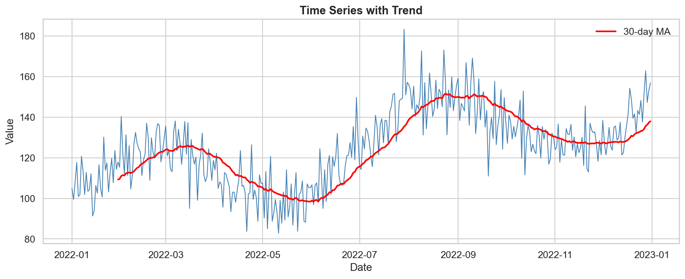
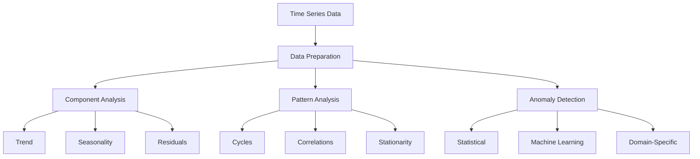
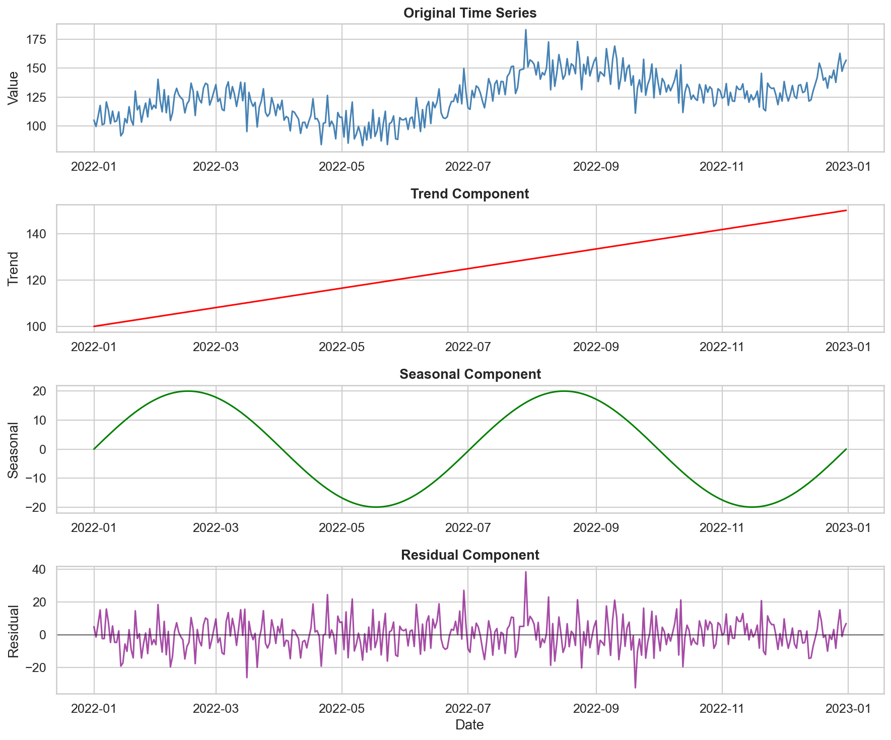
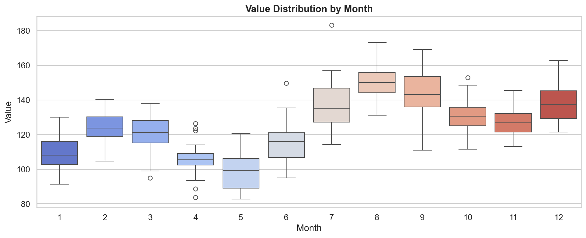
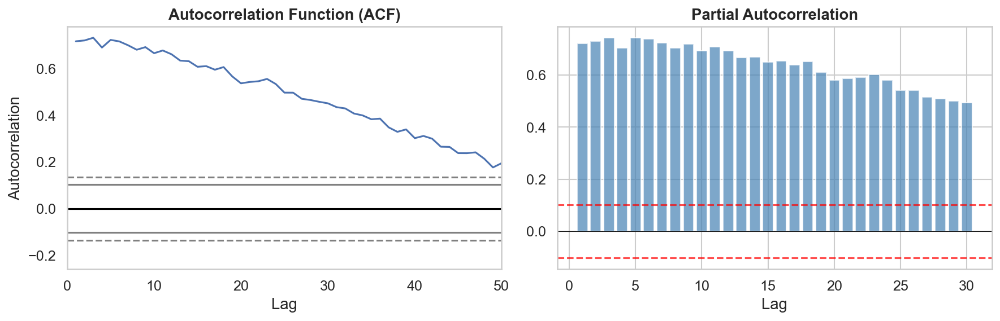

# Time Series Analysis: Understanding Temporal Patterns

Time series analysis is crucial for:

- Forecasting future trends
- Understanding seasonal patterns
- Detecting anomalies
- Making data-driven decisions
- Optimizing business operations

## Why Analyze Time Series?



Time series analysis helps you:

1. Predict future values
2. Understand cyclical patterns
3. Identify unusual events
4. Plan resource allocation
5. Monitor performance trends

## Time Series Analysis Workflow: A Systematic Approach

Follow this workflow to uncover temporal patterns in your data:



## Mathematical Foundations

### 1. Time Series Components: Understanding the Building Blocks

Each component tells a different part of the story:

- **Trend** ($T_t$): Long-term direction
  - Overall movement direction
  - Growth or decline patterns
  - Long-term cycles
  
- **Seasonality** ($S_t$): Regular patterns
  - Repeating cycles
  - Calendar effects
  - Periodic fluctuations
  
- **Residuals** ($R_t$): Random variations
  - Unexplained fluctuations
  - Noise in the data
  - Potential anomalies

### 2. Decomposition Models: Breaking Down the Signal

Choose the right model based on your data characteristics:

- **Additive Model**: $Y_t = T_t + S_t + R_t$
  - For constant amplitude variations
  - When seasonality doesn't depend on trend
  - Most common for stable series
  
- **Multiplicative Model**: $Y_t = T_t \times S_t \times R_t$
  - For varying amplitude over time
  - When seasonality scales with trend
  - Better for growing time series

### 3. Moving Averages: Smoothing and Trend Detection

Different smoothing techniques serve different purposes:

- **Simple Moving Average**: $MA_t = \frac{1}{n}\sum_{i=0}^{n-1} Y_{t-i}$
  - Equal weight to all points
  - Good for basic trend detection
  - Window size affects smoothing
  - Lags behind actual changes
  
- **Exponential Moving Average**: $EMA_t = \alpha Y_t + (1-\alpha)EMA_{t-1}$
  - More weight to recent points
  - Faster response to changes
  - controls smoothing strength
  - Better for real-time analysis

## Comprehensive Time Series Framework: A Practical Guide

This framework helps you systematically analyze temporal patterns:

```python
import pandas as pd
import numpy as np
import matplotlib.pyplot as plt
import seaborn as sns
from statsmodels.tsa.seasonal import seasonal_decompose
from statsmodels.tsa.stattools import adfuller, acf, pacf
import plotly.express as px
import plotly.graph_objects as go

class TimeSeriesAnalyzer:
    """A comprehensive framework for analyzing time series data.
    
    This class provides methods to:
    - Decompose time series components
    - Analyze temporal patterns
    - Detect seasonality and trends
    - Identify anomalies
    - Generate forecasts
    - Validate assumptions
    """
    
    def __init__(self, data, date_column, value_column):
        self.data = data.copy()
        self.data[date_column] = pd.to_datetime(self.data[date_column])
        self.data.set_index(date_column, inplace=True)
        self.value_column = value_column
        
    def analyze_components(self, period=None):
        """Analyze time series components"""
        # Determine period if not provided
        if period is None:
            # Estimate based on data frequency
            if self.data.index.freq == 'D':
                period = 7  # Weekly
            elif self.data.index.freq == 'M':
                period = 12  # Monthly
            else:
                period = 30  # Default
        
        # Perform decomposition
        decomposition = seasonal_decompose(
            self.data[self.value_column],
            period=period,
            extrapolate_trend='freq'
        )
        
        # Plot components
        fig = plt.figure(figsize=(15, 12))
        
        plt.subplot(411)
        plt.plot(self.data[self.value_column])
        plt.title('Original Time Series')
        
        plt.subplot(412)
        plt.plot(decomposition.trend)
        plt.title('Trend')
        
        plt.subplot(413)
        plt.plot(decomposition.seasonal)
        plt.title('Seasonal')
        
        plt.subplot(414)
        plt.plot(decomposition.resid)
        plt.title('Residual')
        
        plt.tight_layout()
        plt.show()
        
        return decomposition
    
    def analyze_patterns(self):
        """Analyze temporal patterns"""
        # Create multiple temporal views
        patterns = {
            'hourly': self.data[self.value_column].groupby(self.data.index.hour).mean(),
            'daily': self.data[self.value_column].groupby(self.data.index.dayofweek).mean(),
            'monthly': self.data[self.value_column].groupby(self.data.index.month).mean(),
            'yearly': self.data[self.value_column].groupby(self.data.index.year).mean()
        }
        
        # Plot patterns
        fig = plt.figure(figsize=(15, 10))
        
        plt.subplot(221)
        patterns['hourly'].plot(kind='line')
        plt.title('Hourly Pattern')
        
        plt.subplot(222)
        patterns['daily'].plot(kind='bar')
        plt.title('Daily Pattern')
        
        plt.subplot(223)
        patterns['monthly'].plot(kind='bar')
        plt.title('Monthly Pattern')
        
        plt.subplot(224)
        patterns['yearly'].plot(kind='bar')
        plt.title('Yearly Pattern')
        
        plt.tight_layout()
        plt.show()
        
        return patterns
    
    def analyze_stationarity(self):
        """Analyze stationarity"""
        # Rolling statistics
        rolling_mean = self.data[self.value_column].rolling(window=7).mean()
        rolling_std = self.data[self.value_column].rolling(window=7).std()
        
        # Plot rolling statistics
        plt.figure(figsize=(15, 5))
        plt.plot(self.data[self.value_column], label='Original')
        plt.plot(rolling_mean, label='Rolling Mean')
        plt.plot(rolling_std, label='Rolling Std')
        plt.legend()
        plt.title('Rolling Statistics')
        plt.show()
        
        # Perform ADF test
        adf_result = adfuller(self.data[self.value_column].dropna())
        
        return {
            'adf_statistic': adf_result[0],
            'p_value': adf_result[1],
            'critical_values': adf_result[4],
            'is_stationary': adf_result[1] < 0.05
        }
    
    def detect_anomalies(self, window=30, threshold=3):
        """Detect anomalies using statistical methods"""
        # Calculate rolling statistics
        rolling_mean = self.data[self.value_column].rolling(window=window).mean()
        rolling_std = self.data[self.value_column].rolling(window=window).std()
        
        # Define bounds
        upper_bound = rolling_mean + (threshold * rolling_std)
        lower_bound = rolling_mean - (threshold * rolling_std)
        
        # Detect anomalies
        anomalies = self.data[self.value_column].copy()
        anomalies[anomalies.between(lower_bound, upper_bound)] = np.nan
        
        # Plot
        plt.figure(figsize=(15, 5))
        plt.plot(self.data[self.value_column], label='Original')
        plt.plot(upper_bound, 'r--', label='Upper Bound')
        plt.plot(lower_bound, 'r--', label='Lower Bound')
        plt.plot(anomalies, 'ro', label='Anomalies')
        plt.legend()
        plt.title('Anomaly Detection')
        plt.show()
        
        return anomalies.dropna()
```

**Example Output - Seasonal Decomposition:**


**Example Output - Monthly Pattern Analysis:**


**Example Output - Autocorrelation Analysis:**


## Real-World Case Study: Sales Forecasting

Let's analyze sales data to understand temporal patterns:

1. **Sales Trends**
   - Long-term growth patterns
   - Seasonal variations
   - Weekly/monthly cycles
   - Year-over-year changes

2. **Customer Behavior**
   - Peak shopping hours
   - Seasonal preferences
   - Holiday effects
   - Special event impacts

3. **Inventory Planning**
   - Demand forecasting
   - Stock level optimization
   - Lead time analysis
   - Safety stock calculation

```python
# Load sample sales data
sales_data = pd.read_csv('sales_data.csv')
analyzer = TimeSeriesAnalyzer(sales_data, 'date', 'sales')

# 1. Analyze Components
decomposition = analyzer.analyze_components()

# 2. Analyze Patterns
patterns = analyzer.analyze_patterns()

# 3. Check Stationarity
stationarity = analyzer.analyze_stationarity()

# 4. Detect Anomalies
anomalies = analyzer.detect_anomalies()

# 5. Create Interactive Dashboard
def create_sales_dashboard(data, decomposition):
    """Create interactive sales dashboard"""
    # Original series with trend
    fig1 = go.Figure()
    fig1.add_trace(go.Scatter(
        x=data.index,
        y=data['sales'],
        name='Sales'
    ))
    fig1.add_trace(go.Scatter(
        x=data.index,
        y=decomposition.trend,
        name='Trend'
    ))
    fig1.update_layout(title='Sales Trend Analysis')
    fig1.show()
    
    # Seasonal patterns
    fig2 = px.box(
        data,
        x=data.index.month,
        y='sales',
        title='Monthly Sales Distribution'
    )
    fig2.show()
    
    # Anomaly visualization
    fig3 = go.Figure()
    fig3.add_trace(go.Scatter(
        x=data.index,
        y=data['sales'],
        name='Sales'
    ))
    fig3.add_trace(go.Scatter(
        x=anomalies.index,
        y=anomalies,
        mode='markers',
        name='Anomalies',
        marker=dict(color='red', size=10)
    ))
    fig3.update_layout(title='Sales Anomalies')
    fig3.show()

create_sales_dashboard(sales_data, decomposition)
```

## Performance Optimization Tips: Handling Large Time Series

Optimize your analysis for large temporal datasets:

1. **Data Storage**
   - Use efficient date formats
   - Implement data aggregation
   - Consider data partitioning
   - Optimize memory usage

2. **Computation Strategies**
   - Use vectorized operations
   - Implement parallel processing
   - Leverage window functions
   - Cache intermediate results

3. **Visualization Techniques**
   - Implement data sampling
   - Use aggregated views
   - Create interactive plots
   - Focus on relevant time ranges

### 1. Efficient Data Storage

```python
def optimize_time_series(df):
    """Optimize time series data storage"""
    # Convert to efficient dtypes
    df.index = pd.to_datetime(df.index)
    
    # Downsample if needed
    if len(df) > 10000:
        df = df.resample('D').mean()
    
    # Use float32 for numeric columns
    numeric_cols = df.select_dtypes(include=[np.number]).columns
    df[numeric_cols] = df[numeric_cols].astype(np.float32)
    
    return df
```

### 2. Chunked Processing

```python
def process_large_timeseries(file_path, chunksize=10000):
    """Process large time series in chunks"""
    chunks = []
    
    for chunk in pd.read_csv(file_path, chunksize=chunksize):
        # Process each chunk
        processed_chunk = process_chunk(chunk)
        chunks.append(processed_chunk)
    
    return pd.concat(chunks)
```

## Common Pitfalls and Solutions: Learning from Experience

Avoid these common mistakes in time series analysis:

1. **Ignoring Data Quality**
   - Check for missing timestamps
   - Handle timezone issues
   - Validate data frequency
   - Address outliers properly

2. **Overlooking Context**
   - Consider business cycles
   - Account for holidays
   - Understand external factors
   - Document special events

3. **Poor Model Selection**
   - Validate assumptions
   - Test multiple approaches
   - Consider complexity
   - Monitor performance

1. **Irregular Time Intervals**

   ```python
   def handle_irregular_intervals(df):
       """Handle irregular time intervals"""
       # Resample to regular intervals
       df = df.resample('D').mean()
       
       # Forward fill small gaps
       df = df.fillna(method='ffill', limit=3)
       
       # Interpolate remaining gaps
       df = df.interpolate(method='time')
       
       return df
   ```

2. **Seasonality Detection**

   ```python
   def detect_seasonality(data, max_lag=365):
       """Detect seasonality period"""
       # Calculate ACF
       acf_values = acf(data, nlags=max_lag)
       
       # Find peaks
       from scipy.signal import find_peaks
       peaks, _ = find_peaks(acf_values)
       
       # Get strongest peak
       if len(peaks) > 0:
           return peaks[np.argmax(acf_values[peaks])]
       return None
   ```

3. **Trend-Seasonality Confusion**

   ```python
   def analyze_trend_seasonality(data):
       """Separate trend from seasonality"""
       # Smooth for trend
       trend = data.rolling(window=30).mean()
       
       # Remove trend for seasonality
       detrended = data - trend
       
       # Analyze seasonal pattern
       seasonal = detrended.groupby(detrended.index.month).mean()
       
       return trend, seasonal
   ```

Remember: "Time series analysis requires careful consideration of temporal dependencies and patterns!"
