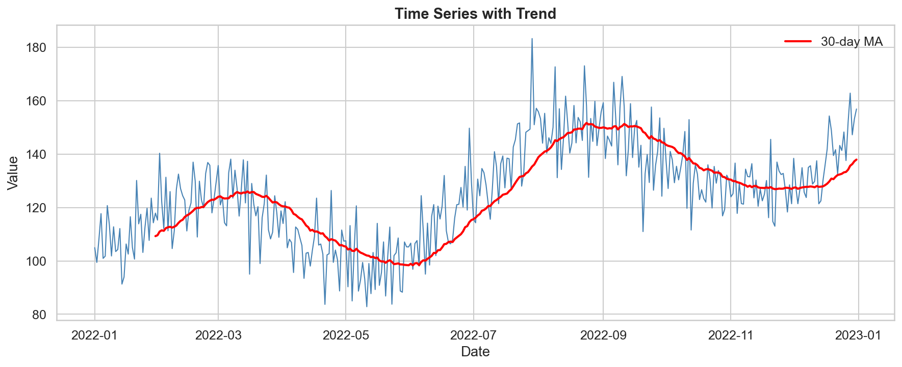
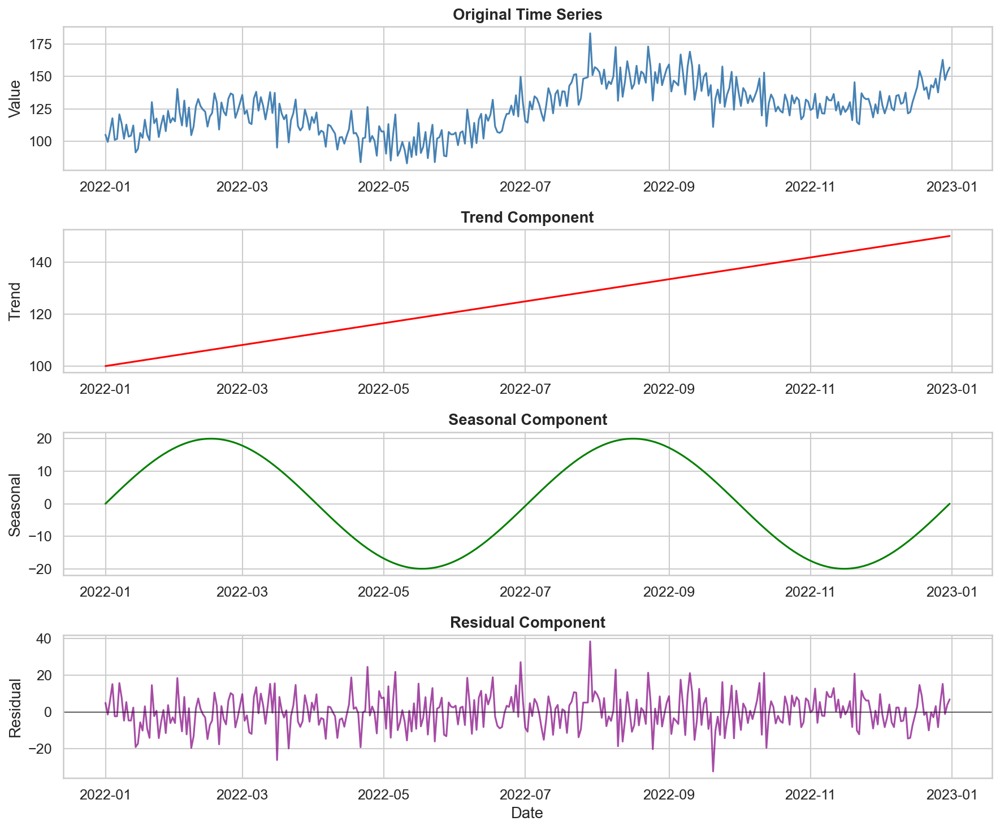
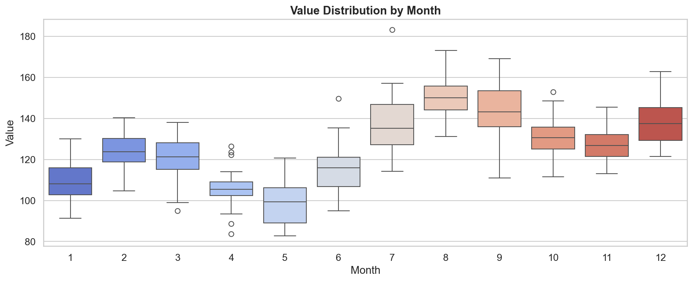
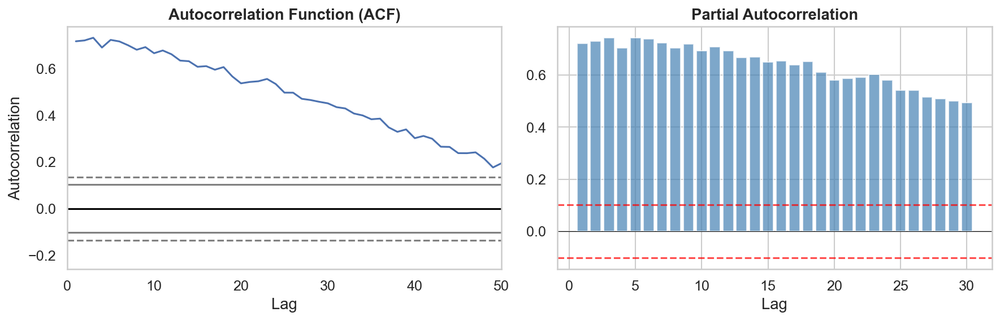

# Time Series Analysis: Understanding Temporal Patterns

**After this lesson:** You can parse datetime indexes, decompose a series into **trend**, **seasonal**, and **residual** parts at a conceptual level, and spot obvious anomalies or non-stationarity before modeling.

## Helpful video

Summarizing distributions with percentiles, common in exploratory analysis.

## Overview

**Prerequisites:** [Distributions](distributions.md) and [Pandas datetime](../../1-data-fundamentals/1.5-data-analysis-pandas/) basics.

> **Time needed:** About 60-90 minutes.

## Why this matters

Ignoring order, trends, seasonality, gaps, and irregular sampling, makes standard assumptions fail quietly. A short structured pass (visualize, check frequency, decompose or diff) saves you from treating sequential data as independent points.

Time series analysis is important for:

* Forecasting future trends
* Understanding seasonal patterns
* Detecting anomalies
* Making data-driven decisions
* Optimizing business operations

## Why Analyze Time Series?

Time series analysis helps you:

1. Predict future values
2. Understand cyclical patterns
3. Identify unusual events
4. Plan resource allocation
5. Monitor performance trends

## Time Series Analysis Workflow: A Systematic Approach

Follow this workflow to uncover temporal patterns in your data:

## Mathematical Foundations

### 1. Time Series Components: Understanding the Building Blocks

Each component tells a different part of the story:

* **Trend** ($T\_t$): Long-term direction
  * Overall movement direction
  * Growth or decline patterns
  * Long-term cycles
* **Seasonality** ($S\_t$): Regular patterns
  * Repeating cycles
  * Calendar effects
  * Periodic fluctuations
* **Residuals** ($R\_t$): Random variations
  * Unexplained fluctuations
  * Noise in the data
  * Potential anomalies

### 2. Decomposition Models: Breaking Down the Signal

Choose the right model based on your data characteristics:

* **Additive Model**: $Y\_t = T\_t + S\_t + R\_t$
  * For constant amplitude variations
  * When seasonality doesn't depend on trend
  * Most common for stable series
* **Multiplicative Model**: $Y\_t = T\_t \times S\_t \times R\_t$
  * For varying amplitude over time
  * When seasonality scales with trend
  * Better for growing time series

### 3. Moving Averages: Smoothing and Trend Detection

Different smoothing techniques serve different purposes:

* **Simple Moving Average**: $MA\_t = \frac{1}{n}\sum\_{i=0}^{n-1} Y\_{t-i}$
  * Equal weight to all points
  * Good for basic trend detection
  * Window size affects smoothing
  * Lags behind actual changes
* **Exponential Moving Average**: $EMA\_t = \alpha Y\_t + (1-\alpha)EMA\_{t-1}$
  * More weight to recent points
  * Faster response to changes
  * controls smoothing strength
  * Better for real-time analysis

## Comprehensive Time Series Framework: A Practical Guide

This framework helps you systematically analyze temporal patterns:

Imports and TimeSeriesAnalyzer constructor

Eight imports including statsmodels for decomposition and stationarity tests. The constructor parses the date column with `pd.to_datetime` and sets it as the DataFrame index.

analyze\_components, period detection and decomposition

Auto-detects periodicity (7 for daily data, 12 for monthly), then calls `seasonal_decompose` with `extrapolate_trend='freq'` to handle edge points.

Decomposition plot

Creates a 4-row subplot stack: original series, trend, seasonal component, and residuals, each with a descriptive title to identify patterns visually.

analyze\_patterns, temporal groupings and plots

Groups the value column by hour-of-day, day-of-week, month, and year to build four average-pattern series, then displays them in a 2×2 subplot grid.

analyze\_stationarity, rolling stats and ADF test

Plots the original series with a 7-day rolling mean and std to visually check stationarity, then runs the Augmented Dickey-Fuller test and flags the result with a p < 0.05 threshold.

detect\_anomalies, rolling z-score bounds

Computes rolling mean ± threshold×std over `window` days. Values outside those bounds are kept; in-range values are set to NaN, so `dropna()` returns only the anomaly timestamps.

## Real-World Case Study: Sales Forecasting

Analyze sales data to understand temporal patterns:

1. **Sales Trends**
   * Long-term growth patterns
   * Seasonal variations
   * Weekly/monthly cycles
   * Year-over-year changes
2. **Customer Behavior**
   * Peak shopping hours
   * Seasonal preferences
   * Holiday effects
   * Special event impacts
3. **Inventory Planning**
   * Demand forecasting
   * Stock level optimization
   * Lead time analysis
   * Safety stock calculation

Load data and run all four analyses

Loads the CSV, creates the analyser, then calls decomposition, pattern analysis, stationarity check, and anomaly detection in sequence.

Dashboard function signature and trend chart

Defines `create_sales_dashboard` and builds the first interactive chart: sales over time with the decomposed trend overlaid as a second trace.

Monthly seasonality box plot

Groups data by calendar month using a Plotly box plot so seasonal spread and medians are visible across all twelve months at once.

Anomaly overlay chart

Plots the full sales line and overlays detected anomaly points as large red markers, making outlier timestamps immediately visible in the interactive chart.

Execute dashboard

Calls `create_sales_dashboard` with the loaded data and the decomposition object to display all three interactive figures.

## Performance Optimization Tips: Handling Large Time Series

Optimize your analysis for large temporal datasets:

1. **Data Storage**
   * Use efficient date formats
   * Implement data aggregation
   * Consider data partitioning
   * Optimize memory usage
2. **Computation Strategies**
   * Use vectorized operations
   * Implement parallel processing
   * Leverage window functions
   * Cache intermediate results
3. **Visualization Techniques**
   * Implement data sampling
   * Use aggregated views
   * Create interactive plots
   * Focus on relevant time ranges

### 1. Efficient Data Storage

Datetime index and downsampling

Ensures the index is a proper DatetimeIndex, then resamples to daily means if the series has more than 10 000 rows, reducing memory without losing shape.

Float32 downcast

Casts all numeric columns to float32, halving memory compared to float64 with negligible precision loss for most analytical use cases.

### 2. Chunked Processing

Chunked CSV read and processing loop

Uses `pd.read_csv(chunksize=…)` to stream the file in fixed-size blocks, keeping memory usage constant regardless of total file size. Each chunk is processed and appended to a list.

Concatenate results

`pd.concat` assembles the final result only once all chunks are done, combining them back into a single DataFrame.

## Common Pitfalls and Solutions: Learning from Experience

Avoid these common mistakes in time series analysis:

1. **Ignoring Data Quality**
   * Check for missing timestamps
   * Handle timezone issues
   * Validate data frequency
   * Address outliers properly
2. **Overlooking Context**
   * Consider business cycles
   * Account for holidays
   * Understand external factors
   * Document special events
3. **Poor Model Selection**
   * Validate assumptions
   * Test multiple approaches
   * Consider complexity
   * Monitor performance
4.  **Irregular Time Intervals**

    Resample to regular daily grid

    Forces the time series onto a uniform daily frequency. Without this, downstream models may receive inconsistent time gaps and produce incorrect lags or windows.

    Fill gaps progressively

    Short gaps (≤3 days) are forward-filled to carry the last known value. Remaining gaps use time-aware interpolation, which respects the actual temporal distance between known points.
5.  **Seasonality Detection**

    Compute ACF and find peaks

    Computes the autocorrelation function up to `max_lag` lags, then uses `find_peaks` to locate local maxima in the ACF curve, each peak is a candidate seasonal period.

    Return dominant period

    Selects the lag at the highest ACF peak as the dominant seasonal period. Returns `None` if no peaks are found, indicating no clear periodicity.
6.  **Trend-Seasonality Confusion**

    Extract trend via smoothing

    A 30-day rolling mean smooths out short-term fluctuations and seasonal noise, leaving the long-term trend signal.

    Isolate seasonal component

    Subtracts the trend from the original series to get the detrended data, then groups by calendar month to compute the average seasonal pattern.

Remember: "Time series analysis requires careful consideration of temporal dependencies and patterns!"

## Next steps

* [Statistical analysis (Module 4)](../../4-stat-analysis/), formal forecasting and inference (when added to your path)
* [EDA project](project.md)
* [Data engineering (Module 2.4)](../2.4-data-engineering/), scheduling pipelines for time-based data
* [Module README](./)
